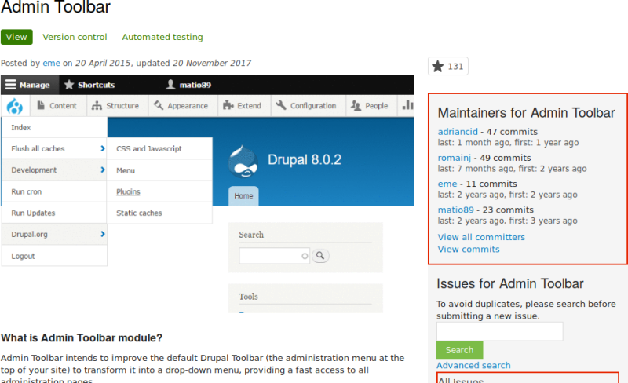

# 11.1. Finding Modules

## Content

### Goal

Find and evaluate modules on *Drupal.org*.

### Prerequisite knowledge

- [Section 1.1, “Concept: Drupal as a Content Management System”](https://drupalize.me/tutorial/user-guide/understanding-drupal "1.1. Concept: Drupal as a Content Management System")
- [Section 1.2, “Concept: Modules”](https://drupalize.me/tutorial/user-guide/understanding-modules "1.2. Concept: Modules")

### Steps

Sprout Video

1. Go to [*Drupal.org*](https://www.drupal.org), and navigate to *Download & Extend* > *Modules* (<https://www.drupal.org/project/project_module>).
2. Filter your search using the categories on the module search page. Fill in the fields as shown below.

   | Field name | Explanation | Example value |
   | --- | --- | --- |
   | Maintenance status | How actively should the module be maintained? | Actively maintained |
   | Development status | What kind of development should the module undergo? | Any |
   | Module categories | The module’s topic area. | Administration |
   | Core compatibility | The version of the core software the module is compatible with. | 9.x |
   | Status | Project status: *Sandbox projects* are experimental projects. *Full projects* have already gone through an approval process, but they can still be in development. | Full projects |
   | Stability | Whether or not the project maintainer has created a production-ready version. | Has a supported stable release |
   | Security advisory coverage | Whether or not the project maintainer has agreed to follow Drupal Security Team procedures. | Has security advisory coverage |
   | Search modules | Search for *Admin Toolbar*, a module that will be covered in detail later. Alternatively, you can also leave the field blank if you are not sure which module to search for. | Admin Toolbar |
   | Sort by | Order your search results by criteria like *Most installed* (popular modules that many sites use) or *Last release* (date of latest version released). | Most installed |

   Image

   
3. Click *Search*. Search results will appear.

   Image

   
4. To further evaluate a module, click its title in the list of search results to visit its project page.

Some aspects to pay attention to when evaluating modules:

- Project description: The description of the module on its project page should be clear and useful. You should get an idea of its features and requirements.
- Project information: There may be warnings in this area of the page, such as if a module is no longer being developed, or is not covered by the security advisory policy.
- Project information > Reported installs, downloads: You can see how many people have downloaded and how many sites use the module. If it’s only used by a few sites, it might be a unique solution that not many people need, or it might be a warning sign that you shouldn’t use it either.
- Maintainers: When was the last commit (the last time someone updated something on the module) or last release (new version)? If the project has few open issues, a long time since commits/releases might be appropriate, but if it has a lot of open issues and there are no commits/releases, that would be a clue that it might be abandoned.
- Issues: See if there are any open issues, potential problems with the module. Check the Statistics to see how regularly issues are responded to.
- Documentation, Resources: Check if the module has documentation or a README file, that can help you install, configure, explore, and test it.

  Image

  

### Expand your understanding

[Section 11.3, “Downloading and Installing a Module from *Drupal.org*”](https://drupalize.me/tutorial/user-guide/extend-module-install "11.3. Downloading and Installing a Module from Drupal.org")

Was this helpful?

Yes

No

Any additional feedback?

Next
[11.2. Enabling and Disabling Maintenance Mode](/tutorial/user-guide/extend-maintenance?p=2357)

This Drupal training resource is licensed under a [Creative Commons Attribution-ShareAlike 4.0 International License](http://creativecommons.org/licenses/by-sa/4.0/). Based on a work at <https://www.drupal.org/docs/user_guide/en/index.html>.

Clear History

Ask Drupalize.Me AI

close