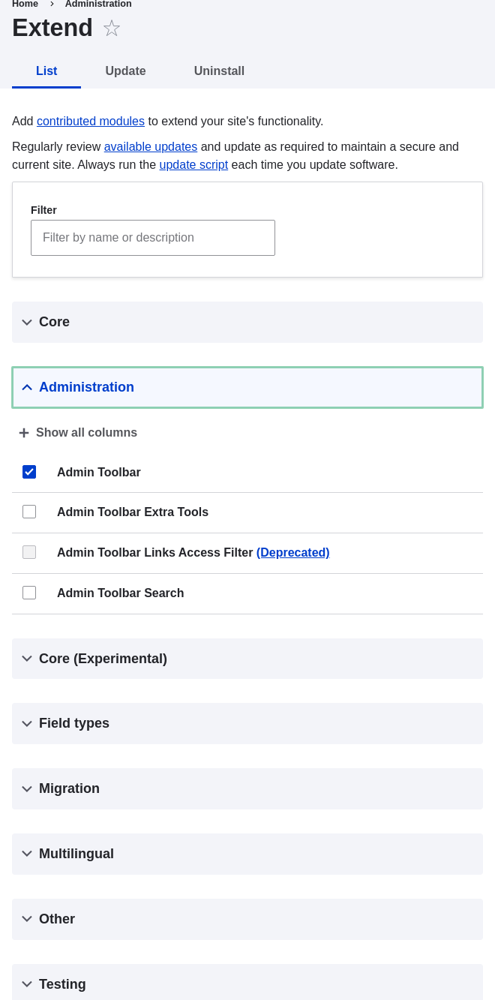

# 11.3. Downloading and Installing a Module from Drupal.org

## Content

### Goal

Download and install the [contributed Admin Toolbar module](https://www.drupal.org/project/admin_toolbar), which allows you to easily browse through the administration section of the website.

### Prerequisite knowledge

- [Section 1.2, “Concept: Modules”](https://drupalize.me/tutorial/user-guide/understanding-modules "1.2. Concept: Modules")
- [Section 11.1, “Finding Modules”](https://drupalize.me/tutorial/user-guide/extend-module-find "11.1. Finding Modules")
- [Section 3.3, “Concept: Additional Tools”](https://drupalize.me/tutorial/user-guide/install-tools "3.3. Concept: Additional Tools")

### Site prerequisites

Composer must be installed to download modules. If you want to use Drush, Drush must be installed. See [Section 3.3, “Concept: Additional Tools”](https://drupalize.me/tutorial/user-guide/install-tools "3.3. Concept: Additional Tools").

### Steps

Sprout Video

To install a contributed module, first download the module with Composer. Then install it using either the administrative interface or Drush. If you are installing a custom module rather than a contributed module that is not available via Composer, skip the steps for downloading the module, and refer to [Section 11.6, “Manually Installing Module or Theme Files”](https://drupalize.me/tutorial/user-guide/extend-manual-install "11.6. Manually Installing Module or Theme Files"). Then return here and follow the steps for installing the module using either the administrative interface or Drush.

#### Download the contributed module with Composer

1. On the *Admin toolbar* project page on drupal.org (*<https://www.drupal.org/project/admin_toolbar>*), scroll to the *Releases* section at the bottom of the page.
2. Copy the provided Composer command for the version of the module you want to install.

   Image

   
3. Alternatively, type the following command (substituting the short name of the module and desired version for `admin_toolbar:^3.5`):

   ```screen
   composer require 'drupal/admin_toolbar:^3.5'
   ```
4. At the command line, change to the root directory of your project. Paste the Composer command and execute it.
5. You should see a message about the module being successfully downloaded.

#### Install the module using the administrative interface

1. In the *Manage* administrative menu, navigate to *Extend* (*admin/modules*). The *Extend* page appears.
2. Locate the *Admin toolbar* module and check it.

   Image

   
3. Click *Install* to turn on the new module.

#### Install the module using Drush

1. Run the following Drush command, giving the project name (for example, `admin_toolbar`) as a parameter:

   ```screen
   drush pm:enable admin_toolbar
   ```
2. Follow the instructions on the screen.

### Expand your understanding

- Verify that the [contributed Admin Toolbar module](https://www.drupal.org/project/admin_toolbar) is working by browsing through the menu in the administration section.
- Install and configure the [contributed Pathauto module](https://www.drupal.org/project/pathauto) so that content pages in your site get nice URLs by default. See [Section 5.1, “Concept: Paths, Aliases, and URLs”](https://drupalize.me/tutorial/user-guide/content-paths "5.1. Concept: Paths, Aliases, and URLs") for more on URLs.
- If you do not see the effect of these changes in your site, you might need to clear the cache. See [Section 12.2, “Clearing the Cache”](https://drupalize.me/tutorial/user-guide/prevent-cache-clear "12.2. Clearing the Cache").

### Additional resources

- [*Drupal.org* community documentation page "Installing Drupal modules"](https://www.drupal.org/docs/extending-drupal/installing-drupal-modules)
- ["Download and Extend" page on *Drupal.org*](https://www.drupal.org/download)
- [Admin Toolbar module on *Drupal.org*](https://www.drupal.org/project/admin_toolbar)

**Attributions**

Written and edited by [Boris Doesborg](https://www.drupal.org/u/batigolix), [Joe Shindelar](https://www.drupal.org/u/eojthebrave) at [Drupalize.Me](https://drupalize.me), and [Jennifer Hodgdon](https://www.drupal.org/u/jhodgdon).

Was this helpful?

Yes

No

Any additional feedback?

Previous
[11.2. Enabling and Disabling Maintenance Mode](/tutorial/user-guide/extend-maintenance?p=2357)

Next
[11.4. Finding Themes](/tutorial/user-guide/extend-theme-find?p=2357)

[](http://creativecommons.org/licenses/by-sa/4.0/)

This Drupal training resource is licensed under a [Creative Commons Attribution-ShareAlike 4.0 International License](http://creativecommons.org/licenses/by-sa/4.0/). Based on a work at <https://www.drupal.org/docs/user_guide/en/index.html>.

Clear History

Ask Drupalize.Me AI

close