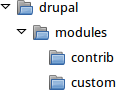

# 11.6. Manually Installing Module or Theme Files

## Content

### Goal

Custom modules and themes may not be available via Composer and their files will need to be manually installed.

### Prerequisite knowledge

- [Section 1.2, “Concept: Modules”](https://drupalize.me/tutorial/user-guide/understanding-modules "1.2. Concept: Modules")
- [Section 11.1, “Finding Modules”](https://drupalize.me/tutorial/user-guide/extend-module-find "11.1. Finding Modules")
- [Section 1.3, “Concept: Themes”](https://drupalize.me/tutorial/user-guide/understanding-themes "1.3. Concept: Themes")
- [Section 11.4, “Finding Themes”](https://drupalize.me/tutorial/user-guide/extend-theme-find "11.4. Finding Themes")

### Site prerequisites

Use this approach if you created a custom module/theme or received its files from someone.

When installing or updating the core software, contributed modules, and contributed themes you should use Composer. See [Section 3.6, “Using Composer to Download and Update Files”](https://drupalize.me/tutorial/user-guide/install-composer "3.6. Using Composer to Download and Update Files"), [Section 11.3, “Downloading and Installing a Module from *Drupal.org*”](https://drupalize.me/tutorial/user-guide/extend-module-install "11.3. Downloading and Installing a Module from Drupal.org"), and [Section 11.5, “Downloading and Installing a Theme from *Drupal.org*”](https://drupalize.me/tutorial/user-guide/extend-theme-install "11.5. Downloading and Installing a Theme from Drupal.org") instead of this topic.

### Steps

Sprout Video

If you are installing a module or theme from *Drupal.org*, follow the downloading instructions, and then the uploading/unpacking instructions. If you created the module or theme, skip the downloading step. Instead, create an archive file (that you know how to extract on the server) and proceed with the steps in uploading/unpacking, using whatever method is appropriate for the way you initially created the archive file.

#### Uploading the files to your site and unpacking them

1. If you are adding a new module or theme, create subdirectories in your top-level *modules* and *themes* directories (if they don’t already exist). Typically, people make a *contrib* subdirectory for contributed modules and themes that are downloaded from *Drupal.org*, and a *custom* subdirectory for modules and themes that they created. Your *modules* directory might look like this:

   Image

   
2. If you are replacing an existing module or theme with an updated version, put the site into maintenance mode. See [Section 11.2, “Enabling and Disabling Maintenance Mode”](https://drupalize.me/tutorial/user-guide/extend-maintenance "11.2. Enabling and Disabling Maintenance Mode").
3. If you are replacing an existing module or theme with an updated version, find and delete all the existing files and directories for the existing module or theme. Modules are normally located in directories under the top-level *modules* directory, and themes are normally located in directories under the top-level *themes* directory.
4. Upload the *.tar.gz* file (or whatever archive you created) to your site. Place it in either the same location from which you deleted the directory (if replacing an existing module or theme) or the appropriate subdirectory of *modules* or *themes* (if adding a new module or theme).
5. Extract the files from the *.tar.gz* archive (or whatever archive you created), making a subdirectory in the same location as the archive file. If you do not have terminal access, or your hosting server is not running Linux, your hosting control panel’s file manager should provide a way to extract the files. If you have terminal access to your hosting server (running Linux) and you are using a tar.gz file, you can use a command like:

   ```screen
   tar -xzf custom_toolbar-2.4.0.tar.gz
   ```
6. Delete the compressed file from the server, unless your unpacking method already deleted it.
7. Refer to [Section 11.3, “Downloading and Installing a Module from *Drupal.org*”](https://drupalize.me/tutorial/user-guide/extend-module-install "11.3. Downloading and Installing a Module from Drupal.org"), [Section 11.5, “Downloading and Installing a Theme from *Drupal.org*”](https://drupalize.me/tutorial/user-guide/extend-theme-install "11.5. Downloading and Installing a Theme from Drupal.org"), [Section 13.6, “Updating a Module”](https://drupalize.me/tutorial/user-guide/security-update-module "13.6. Updating a Module"), or [Section 13.7, “Updating a Theme”](https://drupalize.me/tutorial/user-guide/security-update-theme "13.7. Updating a Theme") to complete the installation or update of the module or theme. Start at the step after the automatic download has been completed.

### Expand your understanding

- If you work with multiple environments (for example, a local development site and a production site) you will have to repeat the steps on each environment, or re-clone the environment. See [Section 11.8, “Making a Development Site”](https://drupalize.me/tutorial/user-guide/install-dev-making "11.8. Making a Development Site").
- If you added a new theme, navigate in the *Manage* administrative menu to *Appearance* (*admin/appearance*) and uninstall the old theme.

### Additional resources

- [*Drupal.org* community documentation page "Updating modules"](https://www.drupal.org/docs/extending-drupal/updating-modules)
- [*Drupal.org* community documentation page "Installing Drupal modules"](https://www.drupal.org/docs/extending-drupal/installing-drupal-modules)
- [*Drupal.org* community documentation page "Installing themes"](https://www.drupal.org/docs/extending-drupal/installing-themes)

**Attributions**

Written and edited by [Boris Doesborg](https://www.drupal.org/u/batigolix), [Jennifer Hodgdon](https://www.drupal.org/u/jhodgdon), and [Marc Isaacson](https://www.drupal.org/u/vegantriathlete), and [Joe Shindelar](https://www.drupal.org/u/eojthebrave) at [Drupalize.Me](https://drupalize.me).

Was this helpful?

Yes

No

Any additional feedback?

Previous
[11.5. Downloading and Installing a Theme from Drupal.org](/tutorial/user-guide/extend-theme-install?p=2357)

Next
[11.7. Concept: Development Sites](/tutorial/user-guide/install-dev-sites?p=2357)

[](http://creativecommons.org/licenses/by-sa/4.0/)

This Drupal training resource is licensed under a [Creative Commons Attribution-ShareAlike 4.0 International License](http://creativecommons.org/licenses/by-sa/4.0/). Based on a work at <https://www.drupal.org/docs/user_guide/en/index.html>.

Clear History

Ask Drupalize.Me AI

close