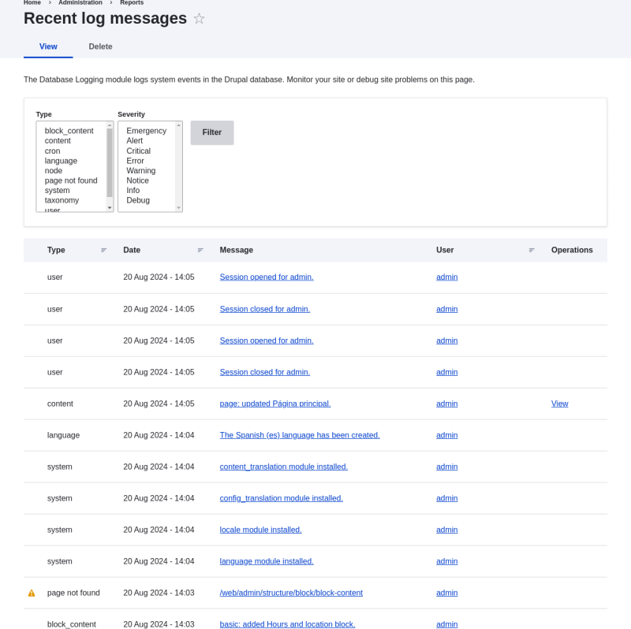

# 12.4. Concept: Log

## Content

### What is a Log?

Your site captures system events in a log to be reviewed by an authorized individual at a later time. The log is a list of recorded events containing usage data, performance data, errors, warnings, and operational information. It is vital to check the log on a regular basis as it is often the only way to tell what is going on.

You can find your site’s recent log messages in the *Manage* administrative menu by navigating to *Reports* > *Recent log messages* (*admin/reports/dblog*). These logs may be cleared by administrators and automated cron tasks, so they should not be used for [forensic logging](https://en.wikipedia.org/wiki/Audit_trail). For forensic purposes, use the Syslog module.

Image

**Attributions**

Adapted by [Diána Lakatos](https://www.drupal.org/u/dianalakatos) from ["Reports"](https://www.drupal.org/docs/7/monitoring-a-site/reports) copyright 2000-2026 by the individual contributors to the [Drupal Community Documentation](https://www.drupal.org/documentation)

Was this helpful?

Yes

No

Any additional feedback?

Previous
[12.3. Concept: Data Backups](/tutorial/user-guide/prevent-backups?p=2398)

Next
[12.5. Concept: Status Report](/tutorial/user-guide/prevent-status?p=2398)

This Drupal training resource is licensed under a [Creative Commons Attribution-ShareAlike 4.0 International License](http://creativecommons.org/licenses/by-sa/4.0/). Based on a work at <https://www.drupal.org/docs/user_guide/en/index.html>.

Clear History

Ask Drupalize.Me AI

close