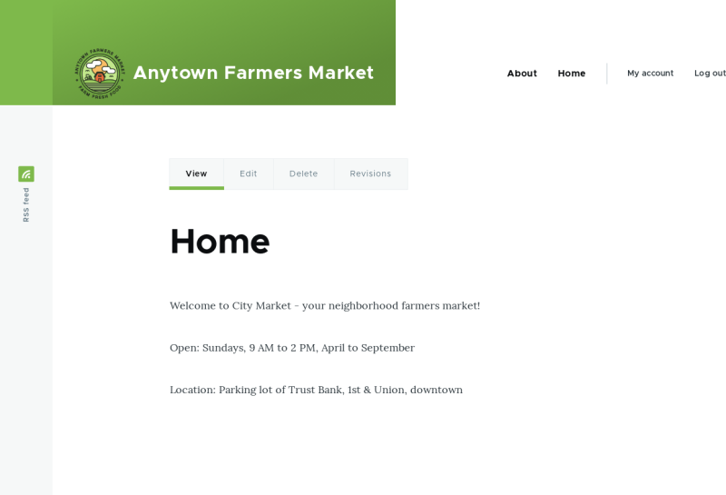

# 5.6. Adding a Page to the Navigation

## Content

### Goal

Add a page to the navigation. For example, the About page.

### Prerequisite knowledge

- [Section 5.5, “Concept: Menu”](https://drupalize.me/tutorial/user-guide/menu-concept "5.5. Concept: Menu")
- [Section 5.3, “Editing a Content Item”](https://drupalize.me/tutorial/user-guide/content-edit "5.3. Editing a Content Item")

### Site prerequisites

The About page content item must exist. See [Section 5.2, “Creating a Content Item”](https://drupalize.me/tutorial/user-guide/content-create "5.2. Creating a Content Item").

### Steps

Sprout Video

1. In the *Manage* administrative menu, navigate to *Content* (*admin/content*).
2. Find the About page, and click *Edit* in that row. The content editing form appears.

   Image

   
3. Click *Menu settings* on the right to expand it.
4. Check *Provide a menu link* for the menu options to appear.
5. Enter values from the table below:

   | Field name | Explanation | Example value |
   | --- | --- | --- |
   | Menu link title | Title that will be displayed in the menu | About |
   | Description | Text that will be displayed when a visitor hovers over the link | History of the market |
   | Parent link | Location of the page in the menu hierarchy. For example, if you choose *<Main navigation>*, the page will appear in the highest level of the navigation. By choosing another menu link as parent, you can create a menu hierarchy of multiple levels. | <Main navigation> |
   | Weight | The order in which the page should appear in the menu (lower-weighted menu links will be shown before higher-weighted menu links) | -2 |

   Image

   
6. Click *Save* to save the changes. Click *Home* or *Return to site* in the navigation bar to see the result, which could look like the picture below.

   Image

   

### Expand your understanding

[Section 5.7, “Changing the Order of Navigation”](https://drupalize.me/tutorial/user-guide/menu-reorder "5.7. Changing the Order of Navigation")

### Additional resources

[*Drupal.org* community documentation page "Adding a link to a menu"](https://www.drupal.org/docs/core-modules-and-themes/core-modules/menu-ui-module/adding-a-link-to-a-menu)

**Attributions**

Adapted by [Boris Doesborg](https://www.drupal.org/u/batigolix) from ["Adding a link to a menu"](https://www.drupal.org/docs/core-modules-and-themes/core-modules/menu-ui-module/adding-a-link-to-a-menu), copyright 2000-2026 by the individual contributors to the [Drupal Community Documentation](https://www.drupal.org/documentation); edited by [Jack Haas](https://www.drupal.org/u/jerseycheese).

Was this helpful?

Yes

No

Any additional feedback?

Previous
[5.5. Concept: Menu](/tutorial/user-guide/menu-concept?p=2350)

Next
[5.7. Changing the Order of Navigation](/tutorial/user-guide/menu-reorder?p=2350)

This Drupal training resource is licensed under a [Creative Commons Attribution-ShareAlike 4.0 International License](http://creativecommons.org/licenses/by-sa/4.0/). Based on a work at <https://www.drupal.org/docs/user_guide/en/index.html>.

Clear History

Ask Drupalize.Me AI

close