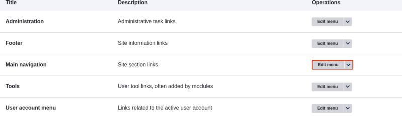
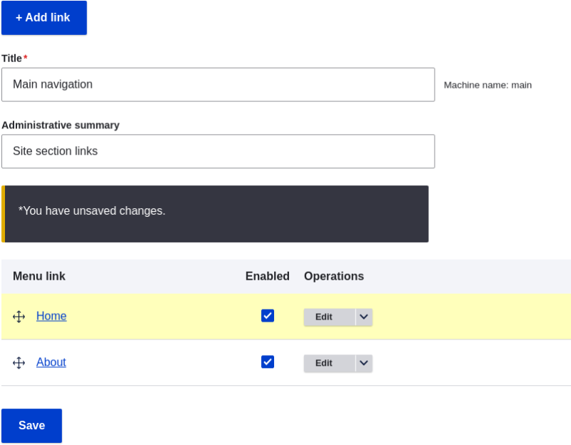

# 5.7. Changing the Order of Navigation

## Content

### Goal

Reorder the links in a menu.

### Prerequisite knowledge

- [Section 5.5, “Concept: Menu”](https://drupalize.me/tutorial/user-guide/menu-concept "5.5. Concept: Menu")
- [Section 5.6, “Adding a Page to the Navigation”](https://drupalize.me/tutorial/user-guide/menu-link-from-content "5.6. Adding a Page to the Navigation")

### Site prerequisites

Home and About pages must exist in the main navigation menu. See [Section 5.6, “Adding a Page to the Navigation”](https://drupalize.me/tutorial/user-guide/menu-link-from-content "5.6. Adding a Page to the Navigation").

### Steps

Sprout Video

1. In the *Manage* administrative menu, navigate to *Structure* > *Menus* (*admin/structure/menu*) where all menus on your site are listed. Click *Edit Menu* from the *Operations* dropdown for *Main navigation*. You can also reach this page using contextual links (refer to [Section 4.1, “Concept: Administrative Overview”](https://drupalize.me/tutorial/user-guide/config-overview "4.1. Concept: Administrative Overview")) for the menu. Note that the names and descriptions of the menus that were provided by your installation profile are shown in English on this page; see [Section 2.7, “Concept: User Interface, Configuration, and Content translation”](https://drupalize.me/tutorial/user-guide/language-concept "2.7. Concept: User Interface, Configuration, and Content translation") for an explanation.

   Image

   
2. The *Edit menu* page will display a list of each link in the menu you chose (*Main navigation*).

   Image

   
3. Drag the cross bar handles of menu links to change their order: Home, then About. As an alternative to dragging, you can click the *Show row weights* link at the top of the table and select numerical weights (menu links with lower or more negative weights will be shown first).

   Image

   
4. Click *Save*.
5. The home page now displays the main navigation with the Home menu link displayed first.

   Image

   

### Expand your understanding

Add a menu link called *Contact*, leading to the */contact* page, to your Main navigation menu. The contact page is provided by the core Contact module; you may want to edit its layout and fields (see [Section 6.9, “Changing Content Entry Forms”](https://drupalize.me/tutorial/user-guide/structure-form-editing "6.9. Changing Content Entry Forms")).

### Related concepts

[Section 5.5, “Concept: Menu”](https://drupalize.me/tutorial/user-guide/menu-concept "5.5. Concept: Menu")

Was this helpful?

Yes

No

Any additional feedback?

Previous
[5.6. Adding a Page to the Navigation](/tutorial/user-guide/menu-link-from-content?p=2350)

This Drupal training resource is licensed under a [Creative Commons Attribution-ShareAlike 4.0 International License](http://creativecommons.org/licenses/by-sa/4.0/). Based on a work at <https://www.drupal.org/docs/user_guide/en/index.html>.

Clear History

Ask Drupalize.Me AI

close