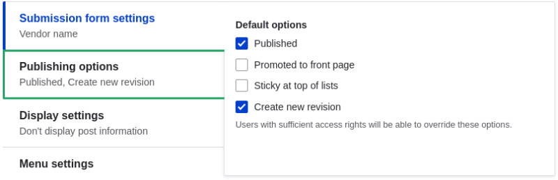
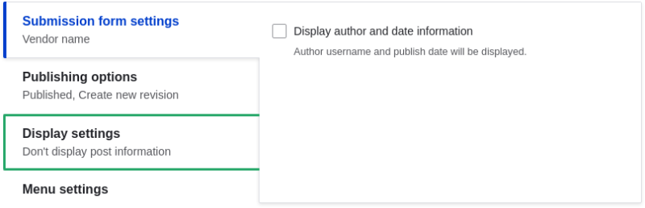

# 6.1. Adding a Content Type

## Content

### Goal

Add and configure a new content type Vendor.

### Prerequisite knowledge

[Section 2.3, “Concept: Content Entities and Fields”](https://drupalize.me/tutorial/user-guide/planning-data-types "2.3. Concept: Content Entities and Fields")

### Site prerequisites

You need to have a plan in place for your content structure. See [Section 2.5, “Planning your Content Structure”](https://drupalize.me/tutorial/user-guide/planning-structure "2.5. Planning your Content Structure").

### Steps

Sprout Video

1. In the *Manage* administrative menu, navigate to *Structure* > *Content types* (*admin/structure/types*). The *Content types* page appears showing all the available types of content. Note that the names and descriptions of the content types that were provided by your installation profile are shown in English on this page; see [Section 2.7, “Concept: User Interface, Configuration, and Content translation”](https://drupalize.me/tutorial/user-guide/language-concept "2.7. Concept: User Interface, Configuration, and Content translation") for an explanation.
2. Click *Add content type*. The *Add content type* page appears. Fill in the fields as shown below.

   | Field name | Explanation | Example value |
   | --- | --- | --- |
   | Name | Name of the content type | Vendor |
   | Description | Explain the use of the content type | Information about a vendor |

   Image

   
3. Under *Submission form settings*, configure the form that is used for creating and editing content of this type. Fill in the fields as shown below.

   | Field name | Explanation | Example value |
   | --- | --- | --- |
   | Title field label | Label of the Title field that is shown when editing or creating content of this type. | Vendor name |
   | Preview before submitting | Option to choose whether you should preview the content before submitting. | Optional |
   | Explanation or submission guidelines | Instructions for creating or editing content. | (Leave blank) |

   Image

   
4. Under *Publishing options*, decide on default options for new content of this type. Fill in the fields as shown below.

   | Field name | Explanation | Example value |
   | --- | --- | --- |
   | Published | Make the content item published by default. | Checked |
   | Promoted to front page | In a default website, this setting can be used to show content on the homepage. | Unchecked |
   | Sticky at top of lists | In a default website, this setting can be used to keep content on top of a list. | Unchecked |
   | Create new revision | Create a new revision each time the vendor is being edited. | Checked |

   Changing these settings does not affect the content items that have already been created.

   Image

   
5. Under *Display settings*, decide if the author and publication date will be visible in the content item. Fill in the fields as shown below.

   | Field name | Explanation | Example value |
   | --- | --- | --- |
   | Display author and date information | Display the author username and publication date on each vendor page. | Unchecked |

   Image

   
6. Under *Menu settings*, fill in the fields as shown below.

   | Field name | Explanation | Example value |
   | --- | --- | --- |
   | Available menus | Menus that this type of content can be added to. Vendors do not need to appear in menus, so uncheck all menu options. | Unchecked |

   Image

   
7. Click *Save and manage fields* to save the content type. The *Manage fields* page appears that allows you to add fields to the content type. See [Section 6.3, “Adding Basic Fields to a Content Type”](https://drupalize.me/tutorial/user-guide/structure-fields "6.3. Adding Basic Fields to a Content Type")

   Image

   
8. Follow the same steps to create a content type for recipes. Example values for the fields in the forms, where they are different from the steps above:

   | Field name | Example value |
   | --- | --- |
   | Name | Recipe |
   | Description | A recipe submitted by a vendor |
   | Submission form settings - Title | Recipe name |

### Expand your understanding

- [Section 6.3, “Adding Basic Fields to a Content Type”](https://drupalize.me/tutorial/user-guide/structure-fields "6.3. Adding Basic Fields to a Content Type")
- Install and configure the [contributed Pathauto module](https://www.drupal.org/project/pathauto) so that content items get automatically generated URLs/path aliases. See [Section 5.1, “Concept: Paths, Aliases, and URLs”](https://drupalize.me/tutorial/user-guide/content-paths "5.1. Concept: Paths, Aliases, and URLs") for more on URLs within your site, [Section 11.1, “Finding Modules”](https://drupalize.me/tutorial/user-guide/extend-module-find "11.1. Finding Modules") for instructions on finding contributed modules, and [Section 11.3, “Downloading and Installing a Module from *Drupal.org*”](https://drupalize.me/tutorial/user-guide/extend-module-install "11.3. Downloading and Installing a Module from Drupal.org") for instructions on downloading and installing contributed modules.

Was this helpful?

Yes

No

Any additional feedback?

Next
[6.2. Deleting a Content Type](/tutorial/user-guide/structure-content-type-delete?p=2412)

This Drupal training resource is licensed under a [Creative Commons Attribution-ShareAlike 4.0 International License](http://creativecommons.org/licenses/by-sa/4.0/). Based on a work at <https://www.drupal.org/docs/user_guide/en/index.html>.

Clear History

Ask Drupalize.Me AI

close