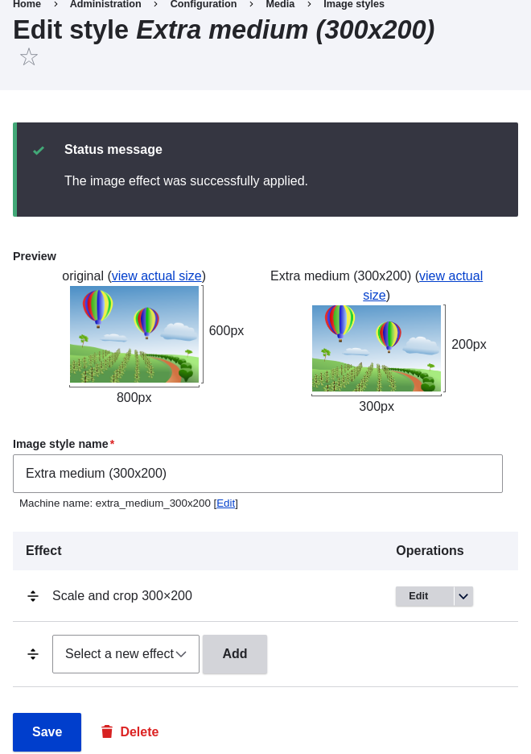

# 6.13. Setting Up an Image Style

## Content

### Goal

Add an image style and use it to display images on Vendor pages.

### Prerequisite knowledge

- [Section 6.3, “Adding Basic Fields to a Content Type”](https://drupalize.me/tutorial/user-guide/structure-fields "6.3. Adding Basic Fields to a Content Type")
- [Section 6.11, “Changing Content Display”](https://drupalize.me/tutorial/user-guide/structure-content-display "6.11. Changing Content Display")
- [Section 6.12, “Concept: Image Styles”](https://drupalize.me/tutorial/user-guide/structure-image-styles "6.12. Concept: Image Styles")

### Site prerequisites

- Vendor and Recipe content types must exist. See [Section 6.1, “Adding a Content Type”](https://drupalize.me/tutorial/user-guide/structure-content-type "6.1. Adding a Content Type").
- Main image fields must exist for both content types. See [Section 6.3, “Adding Basic Fields to a Content Type”](https://drupalize.me/tutorial/user-guide/structure-fields "6.3. Adding Basic Fields to a Content Type").
- Content items must exist for both content types. See [Section 6.1, “Adding a Content Type”](https://drupalize.me/tutorial/user-guide/structure-content-type "6.1. Adding a Content Type"), [Section 6.3, “Adding Basic Fields to a Content Type”](https://drupalize.me/tutorial/user-guide/structure-fields "6.3. Adding Basic Fields to a Content Type"), and [Section 5.2, “Creating a Content Item”](https://drupalize.me/tutorial/user-guide/content-create "5.2. Creating a Content Item").

### Steps

Sprout Video

1. In the *Manage* administrative menu, navigate to *Configuration* > *Media* > *Image styles* (*admin/config/media/image-styles*).
2. Click *Add image style*.
3. Enter the name *Extra medium (300x200)*
4. Click *Create new style*. The page *Edit style Extra medium (300x200)* appears.
5. In the *Effect* table, select *Scale and crop*. Click *Add*.
6. Fill in the fields as shown below.

   | Field name | Value |
   | --- | --- |
   | Width | 300 |
   | Height | 200 |
7. Click *Add effect*. The image style is saved with the chosen effects.

   Image

   
8. In the *Manage* administrative menu, navigate to *Structure* > *Content types* (*admin/structure/types*).
9. Click *Manage display* in the *Operations* dropdown for the Vendor content type. The *Manage display* page (*admin/structure/types/manage/vendor/display*) appears.
10. Ensure that the secondary tab *Default* is selected.
11. Click the gear wheel for the *Main image* field, to open the configuration options.
12. Fill in the fields as shown below.

    | Field name | Explanation | Example value |
    | --- | --- | --- |
    | Image style | Which image style to use | Extra medium (300x200) |
    | Link image to | Page to visit if image is clicked | Nothing |

    Image

    
13. Click *Update*.
14. Click *Save*. The new image style will be used while displaying Vendor content.
15. Open a Vendor content item and verify that it now shows up with the scaled-down image. See [Section 5.3, “Editing a Content Item”](https://drupalize.me/tutorial/user-guide/content-edit "5.3. Editing a Content Item") for information on how to locate an existing content item.
16. Repeat steps 8-15 for the Recipe content type.

### Related concepts

- [Section 6.3, “Adding Basic Fields to a Content Type”](https://drupalize.me/tutorial/user-guide/structure-fields "6.3. Adding Basic Fields to a Content Type")
- [Section 6.12, “Concept: Image Styles”](https://drupalize.me/tutorial/user-guide/structure-image-styles "6.12. Concept: Image Styles")
- [Section 6.14, “Concept: Responsive Image Styles”](https://drupalize.me/tutorial/user-guide/structure-image-responsive "6.14. Concept: Responsive Image Styles")

### Additional resources

[*Drupal.org* community documentation page "Working with images"](https://www.drupal.org/docs/core-modules-and-themes/core-modules/image-module/working-with-images)

**Attributions**

Adapted and edited by [Boris Doesborg](https://www.drupal.org/u/batigolix), and [Jojy Alphonso](https://www.drupal.org/u/jojyja) at [Red Crackle](http://redcrackle.com) from ["Working with images"](https://www.drupal.org/docs/core-modules-and-themes/core-modules/image-module/working-with-images), copyright 2000-2026 by the individual contributors to the [Drupal Community Documentation](https://www.drupal.org/documentation).

Was this helpful?

Yes

No

Any additional feedback?

Previous
[6.12. Concept: Image Styles](/tutorial/user-guide/structure-image-styles?p=2412)

Next
[6.14. Concept: Responsive Image Styles](/tutorial/user-guide/structure-image-responsive?p=2412)

This Drupal training resource is licensed under a [Creative Commons Attribution-ShareAlike 4.0 International License](http://creativecommons.org/licenses/by-sa/4.0/). Based on a work at <https://www.drupal.org/docs/user_guide/en/index.html>.

Clear History

Ask Drupalize.Me AI

close