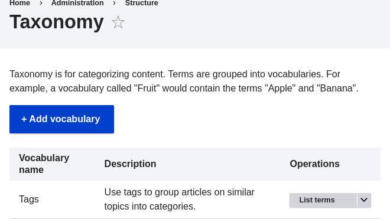
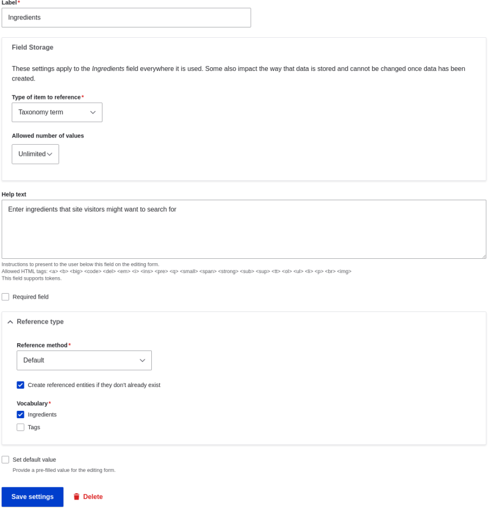

# 6.6. Setting Up a Taxonomy

## Content

### Goal

Create an Ingredients vocabulary and add it to the Recipe content type as a field that can contain an unlimited number of values and that allows adding new terms to the vocabulary.

### Prerequisite knowledge

- [Section 2.3, “Concept: Content Entities and Fields”](https://drupalize.me/tutorial/user-guide/planning-data-types "2.3. Concept: Content Entities and Fields")
- [Section 6.5, “Concept: Taxonomy”](https://drupalize.me/tutorial/user-guide/structure-taxonomy "6.5. Concept: Taxonomy")
- [Section 6.3, “Adding Basic Fields to a Content Type”](https://drupalize.me/tutorial/user-guide/structure-fields "6.3. Adding Basic Fields to a Content Type")

### Site prerequisites

The Recipe content type must exist. See [Section 6.1, “Adding a Content Type”](https://drupalize.me/tutorial/user-guide/structure-content-type "6.1. Adding a Content Type").

### Steps

Sprout Video

1. In the *Manage* administrative menu, navigate to *Structure* > *Taxonomy* (*admin/structure/taxonomy*). You will see the *Tags* vocabulary that was created with the core Standard installation profile. (Note that the name and description of this vocabulary are shown in English on this page; see [Section 2.7, “Concept: User Interface, Configuration, and Content translation”](https://drupalize.me/tutorial/user-guide/language-concept "2.7. Concept: User Interface, Configuration, and Content translation") for an explanation.)

   Image

   
2. Click *Add vocabulary*, and fill in the values below.

   | Field name | Explanation | Example value |
   | --- | --- | --- |
   | Name | The name of the vocabulary | Ingredients |
   | Description | A brief note about the vocabulary | (Leave blank) |

   Image

   
3. Click *Save*. You will be taken to the Ingredients page, which shows a list of all the terms in this vocabulary.

   Image

   
4. Click *Add term*. Enter "Butter" in the *Name* field. Click *Save*.

   Image

   
5. You will receive a confirmation about the term you created. Add more terms. For example, "Eggs" and "Milk".
6. In the *Manage* administrative menu, navigate to *Structure* > *Content Types* (*admin/structure/types*). Click *Manage fields* for your Recipe content type.
7. Click *Create a new field*. The *Add field* page appears. Choose the *Reference* field type from the *Choose a field type* options. Click *Continue*. The *Add field* page appears with a form to configure the field.

   Image

   
8. Enter values from the table below. Click *Continue*.

   | Field name | Explanation | Value |
   | --- | --- | --- |
   | Label | The title to give the field | Ingredients |
   | Choose an option below: | Type of content to reference | Taxonomy term |

   Image

   
9. On the following configuration screen, enter the values from the table below. Click *Save settings*.

   | Field name | Explanation | Value |
   | --- | --- | --- |
   | Help text | Help shown to users creating content | Enter ingredients that site visitors might want to search for |
   | Type of item to reference | The type of entity that is referenced by the field | Taxonomy term |
   | Allowed number of values | The number of values a user can enter | Unlimited |
   | Reference type > Reference method | Select the method used to choose allowed values | Default |
   | Reference type > Vocabulary | Select the vocabulary to choose allowed values from | Ingredients |
   | Reference type > Create referenced entities if they don’t already exist | Whether new ingredient terms can be created from the content editing form | Checked |

   Image

   
10. Click *Save settings*. You will be taken back to the *Manage Fields* page. A message will be displayed saying that the configuration for Ingredients is complete.

    Image

    

Was this helpful?

Yes

No

Any additional feedback?

Previous
[6.5. Concept: Taxonomy](/tutorial/user-guide/structure-taxonomy?p=2412)

Next
[6.7. Adding a Reference Field](/tutorial/user-guide/structure-adding-reference?p=2412)

This Drupal training resource is licensed under a [Creative Commons Attribution-ShareAlike 4.0 International License](http://creativecommons.org/licenses/by-sa/4.0/). Based on a work at <https://www.drupal.org/docs/user_guide/en/index.html>.

Clear History

Ask Drupalize.Me AI

close