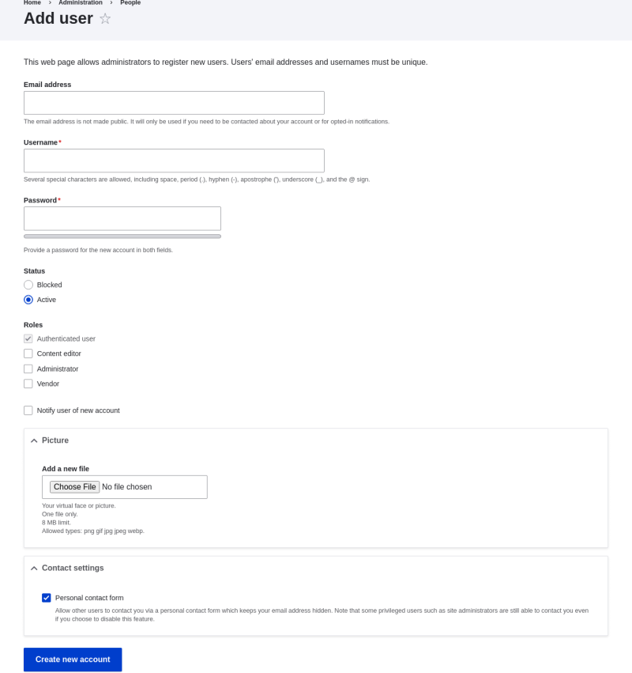
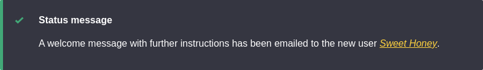

# 7.4. Creating a User Account

## Content

### Goal

Create Vendor user accounts for Sweet Honey and Happy Farm vendors.

### Prerequisite knowledge

- [Section 7.1, “Concept: Users, Roles, and Permissions”](https://drupalize.me/tutorial/user-guide/user-concept "7.1. Concept: Users, Roles, and Permissions")
- [Section 7.2, “Concept: The User 1 Account”](https://drupalize.me/tutorial/user-guide/user-admin-account "7.2. Concept: The User 1 Account")
- [Section 7.3, “Creating a Role”](https://drupalize.me/tutorial/user-guide/user-new-role "7.3. Creating a Role")

### Site prerequisites

The Vendor role must exist on your site. See [Section 7.3, “Creating a Role”](https://drupalize.me/tutorial/user-guide/user-new-role "7.3. Creating a Role").

### Steps

Sprout Video

1. In the *Manage* administrative menu, navigate to *People* (*admin/people*).
2. Click *Add user*.

   Image

   
3. Fill in the form fields. See the table below.

   | Field name | Explanation | Example value |
   | --- | --- | --- |
   | Email address | A valid email address for the vendor. All emails from the system will be sent to this address. The email address is not made public. | [[email protected]](/cdn-cgi/l/email-protection#89e1e6e7ecf0c9ecf1e8e4f9e5eca7eae6e4) |
   | Username | A username for the vendor that they will use to sign in or author content items. Spaces are allowed; punctuation is not allowed except for periods, hyphens, apostrophes, and underscores. | Sweet Honey |
   | Password | A password the vendor will use to sign in to the site. You can see how safe the password is on the *Password strength* gauge. You also get tips on how to make it safer. | (Make a secure password) |
   | Confirm password | Type the same password to avoid any typing mistakes. | (Repeat password) |
   | Status | Set the status of the user account. *Blocked* users will not be able to sign in. | Active |
   | Roles | Set the role of the user account. | Vendor |
   | Notify user of new account | Whether or not to send a notification to the vendor’s email address. | Checked |
   | Picture | Click *Browse* and select a picture to upload. Pay attention to size restrictions. | Photo of the vendor |
   | Contact settings | Enable or disable the display of a contact form for the account. | Checked |
4. Click *Create new account*. You will get a notification about the user account creation.

   Image

   
5. Create a second Vendor account for Happy Farm by following the steps above.

### Expand your understanding

Create a user account for yourself.

Was this helpful?

Yes

No

Any additional feedback?

Previous
[7.3. Creating a Role](/tutorial/user-guide/user-new-role?p=2441)

Next
[7.5. Assigning Permissions to a Role](/tutorial/user-guide/user-permissions?p=2441)

This Drupal training resource is licensed under a [Creative Commons Attribution-ShareAlike 4.0 International License](http://creativecommons.org/licenses/by-sa/4.0/). Based on a work at <https://www.drupal.org/docs/user_guide/en/index.html>.

Clear History

Ask Drupalize.Me AI

close