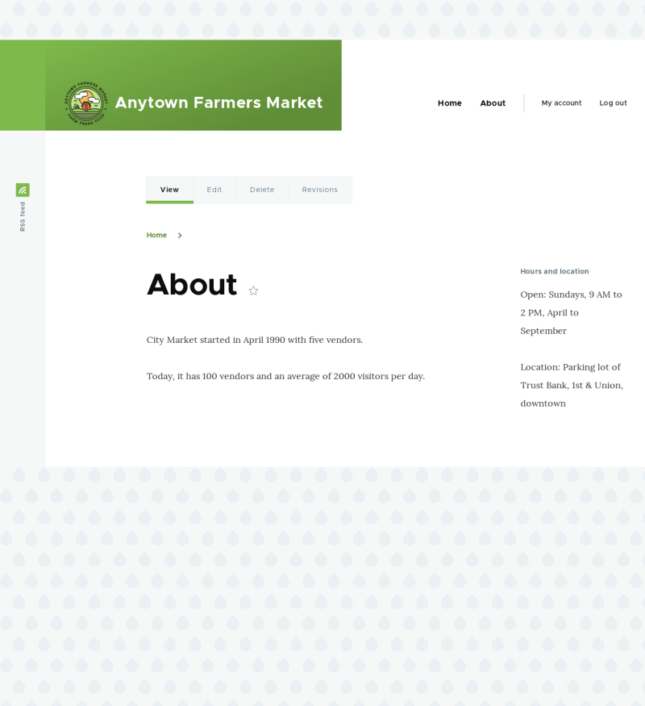

# 8.3. Placing a Block in a Region

## Content

### Goal

Place the Opening hours and location block in the website’s sidebar.

### Prerequisite knowledge

[Section 8.1, “Concept: Blocks”](https://drupalize.me/tutorial/user-guide/block-concept "8.1. Concept: Blocks")

### Site prerequisites

- The core Olivero theme must be installed and set as default. See [Section 4.6, “Configuring the Theme”](https://drupalize.me/tutorial/user-guide/config-theme "4.6. Configuring the Theme").
- The Opening hours and location block must exist. See [Section 8.2, “Creating A Custom Block”](https://drupalize.me/tutorial/user-guide/block-create-custom "8.2. Creating A Custom Block").

### Steps

Sprout Video

1. In the *Manage* administrative menu, navigate to *Structure* > *Block layout* (*admin/structure/block*). The *Block layout* page appears, listing the theme’s regions.
2. Ensure that in the secondary tab the core Olivero theme is selected. Block placement is defined per theme.
3. Locate the region *Sidebar* in the list and click *Place block* next to it. The *Place block* window appears, listing all the blocks.
4. Locate the Hours and location block and click *Place block* next to it. The *Configure block* window appears. Fill in the fields as shown below.

   | Field name | Explanation | Example value |
   | --- | --- | --- |
   | Title | Title to be displayed for the block | Hours and location |
   | Display title | Whether or not to display the title with the block | Checked |
   | Region | Which theme region to display it in | Sidebar |

   You can also hide or display the block on specific pages. In the case of the Farmer’s market website you do not set any of these configuration options because you want to show the block everywhere.

   Image

   
5. Click *Save block*. The *Block layout* page appears. You can drag the cross bar handles of blocks to change their order within each region. As an alternative to dragging, you can click the *Show row weights* link at the top of the table and select numerical weights (blocks with lower or more negative weights will be shown first).
6. Verify that the Hours and location block is listed in the *Sidebar* region, and click *Save blocks*.

   The block has been placed on the sidebar of all pages that use the core Bartik theme.

   Image

   

### Expand your understanding

- Remove the *Powered by Drupal* block from the *Footer Bottom* region by clicking *Disable* or *Remove* in the *Operations* dropdown button. Clicking *Disable* will let you enable the block easily later with the same configuration; if you click *Remove* and you want the block back, you would need to go through the steps in this topic to place it in a region again. Note that the names of the blocks that are provided by the core software, such as *Powered by Drupal* and *User login*, are shown in English on this page; see [Section 2.7, “Concept: User Interface, Configuration, and Content translation”](https://drupalize.me/tutorial/user-guide/language-concept "2.7. Concept: User Interface, Configuration, and Content translation") for an explanation.
- Place the *User login* block in a region.
- If you do not see the effect of these changes in your site, you might need to clear the cache. See [Section 12.2, “Clearing the Cache”](https://drupalize.me/tutorial/user-guide/prevent-cache-clear "12.2. Clearing the Cache").

Was this helpful?

Yes

No

Any additional feedback?

Previous
[8.2. Creating A Custom Block](/tutorial/user-guide/block-create-custom?p=2337)

This Drupal training resource is licensed under a [Creative Commons Attribution-ShareAlike 4.0 International License](http://creativecommons.org/licenses/by-sa/4.0/). Based on a work at <https://www.drupal.org/docs/user_guide/en/index.html>.

Clear History

Ask Drupalize.Me AI

close