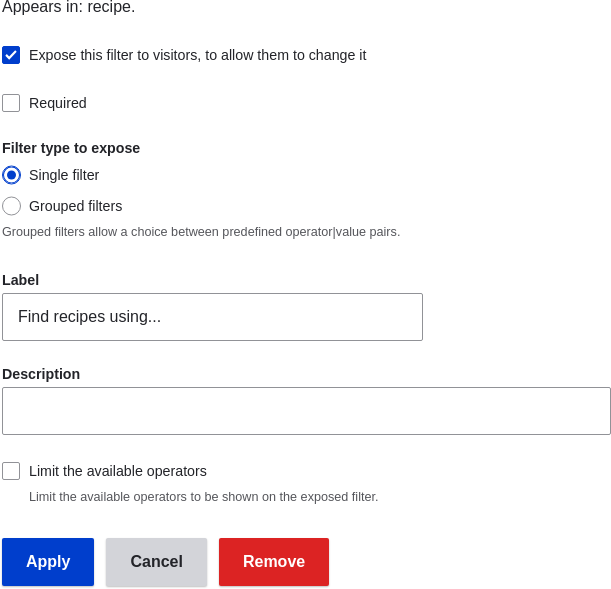

# 9.4. Duplicating a View

## Content

### Goal

Create a page listing recipes by duplicating the existing Vendors view. Modify the page so that the recipes are displayed in a grid and can be filtered by ingredients.

### Prerequisite knowledge

- [Section 9.1, “Concept: Uses of Views”](https://drupalize.me/tutorial/user-guide/views-concept "9.1. Concept: Uses of Views")
- [Section 9.2, “Concept: The Parts of a View”](https://drupalize.me/tutorial/user-guide/views-parts "9.2. Concept: The Parts of a View")
- [Section 9.3, “Creating a Content List View”](https://drupalize.me/tutorial/user-guide/views-create "9.3. Creating a Content List View")

### Site prerequisites

- The Vendor and Recipe content types must exist; both must have Main image fields, and the Recipe content type must have an Ingredients field. Your site must also have a couple of Recipe content items. See [Section 6.1, “Adding a Content Type”](https://drupalize.me/tutorial/user-guide/structure-content-type "6.1. Adding a Content Type"), [Section 6.3, “Adding Basic Fields to a Content Type”](https://drupalize.me/tutorial/user-guide/structure-fields "6.3. Adding Basic Fields to a Content Type"), [Section 6.6, “Setting Up a Taxonomy”](https://drupalize.me/tutorial/user-guide/structure-taxonomy-setup "6.6. Setting Up a Taxonomy"), [Section 6.9, “Changing Content Entry Forms”](https://drupalize.me/tutorial/user-guide/structure-form-editing "6.9. Changing Content Entry Forms"), and [Section 5.2, “Creating a Content Item”](https://drupalize.me/tutorial/user-guide/content-create "5.2. Creating a Content Item").
- The Vendors view must exist. See [Section 9.3, “Creating a Content List View”](https://drupalize.me/tutorial/user-guide/views-create "9.3. Creating a Content List View").

### Steps

Sprout Video

1. In the *Manage* administrative menu, navigate to *Structure* > *Views* (*admin/structure/views*). Find the view "Vendors" and click *Duplicate* in its dropdown button. (Note that the names of views that came with your installation profile are shown in English on this page; see [Section 2.7, “Concept: User Interface, Configuration, and Content translation”](https://drupalize.me/tutorial/user-guide/language-concept "2.7. Concept: User Interface, Configuration, and Content translation") for an explanation.)

   Image

   
2. Name the duplicate "Recipes" and click *Duplicate*. The view configuration page appears.
3. To change the title of the view page to "Recipes", click Vendors in the *Title* field under *Title*. The *Page: The title of this view* pop-up appears. Enter "Recipes". Click *Apply*.

   Image

   
4. To change from a table to a grid format, click *Table* in the *Format* field under *Format*. The *Page: How should this view be styled* pop-up appears. Check *Grid* and click *Apply*. The *Page: Style options* pop-up appears. Retain the default values and click *Apply*.
5. To retain only the title and image fields for the Recipes view, click *Content: Body* under *Fields*. Click *Remove* in the pop-up that appears.
6. To change the content type filter to use the Recipe content type, click *Content: Type (=Vendor)* under *Filter criteria*. In the *Configure filter criterion: Content: Type* pop-up, check Recipe and uncheck Vendor. Click *Apply*.
7. To add a further filter that is exposed to visitors, click *Add* in the dropdown button under *Filter criteria*. Search for "ingredients" and check "Ingredients (field\_ingredients)". Click *Add and configure filter criteria*.
8. The appearing pop-up offers extra settings on vocabulary and selection type. Click *Apply and continue*. The next pop-up allows you to expose this filter to visitors. Fill in the fields as shown below, and click *Apply*.

   | Field name | Explanation | Example value |
   | --- | --- | --- |
   | Expose this filter to visitors, to allow them to change it | Allow visitors to filter and search | Checked |
   | Required | Whether a value has to be provided or not | Unchecked |
   | Label | Label shown for this filter on the view page | Find recipes using… |

   Image

   
9. To change the *Path* label field to "Recipes", click "/vendors" in the *Path* field under *Page settings*. In the pop-up that appears, enter the path "recipes" and click *Apply*.

   Note that when editing a view, you enter paths without the leading "/", unlike on other administrative pages (such as when providing a path to a content item page).
10. To change the menu link title, click "Normal: Vendors" in the *Menu* field under *Page settings*. In the pop-up that appears, change the title to "Recipes" and click *Apply*.
11. In order to use Ajax (see [Ajax entry in the Glossary](https://drupalize.me/glossary.html#glossary-ajax)) to make filtering and paging faster for users, under *Advanced* > *Other*, click *No* in the *Use AJAX* field. Check *Use AJAX* in the pop-up that appears, and click *Apply*.
12. Click *Save* to save the view.
13. Go back to the home page and click Recipes in the navigation to view the new Recipes page.

    Image

    

### Expand your understanding

The link to the view in the main navigation will probably not be in the right place. Change the order of the menu links in the main navigation. See [Section 5.7, “Changing the Order of Navigation”](https://drupalize.me/tutorial/user-guide/menu-reorder "5.7. Changing the Order of Navigation").

### Related concepts

- [Section 2.5, “Planning your Content Structure”](https://drupalize.me/tutorial/user-guide/planning-structure "2.5. Planning your Content Structure")
- [Ajax entry in the Glossary](https://drupalize.me/glossary.html#glossary-ajax)

Was this helpful?

Yes

No

Any additional feedback?

Previous
[9.3. Creating a Content List View](/tutorial/user-guide/views-create?p=2449)

Next
[9.5. Adding a Block Display to a View](/tutorial/user-guide/views-block?p=2449)

This Drupal training resource is licensed under a [Creative Commons Attribution-ShareAlike 4.0 International License](http://creativecommons.org/licenses/by-sa/4.0/). Based on a work at <https://www.drupal.org/docs/user_guide/en/index.html>.

Clear History

Ask Drupalize.Me AI

close