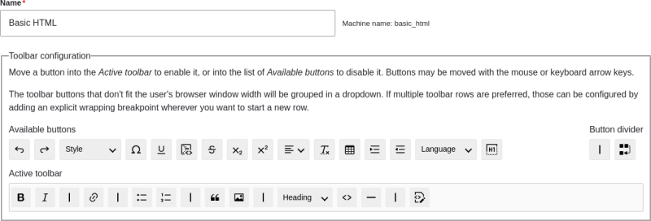

# 6.16. Configuring Text Formats and Editors

## Content

### Goal

Add a horizontal rule tag to the *Basic HTML* text format, and a corresponding button to its editor configuration.

### Prerequisite knowledge

[Section 6.15, “Concept: Text Formats and Editors”](https://drupalize.me/tutorial/user-guide/structure-text-formats "6.15. Concept: Text Formats and Editors")

### Site prerequisites

- The core Filter, Editor, and CKEditor modules must be installed. They are installed on your site when you install with the core Standard installation profile.
- The *Basic HTML* text format must exist. This is created on your site when you install with the core Standard installation profile.

### Steps

Sprout Video

1. In the *Manage* administrative menu, navigate to *Configuration* > *Content authoring* > *Text formats and editors* (*admin/config/content/formats*). The *Text formats and editors* page appears. Note that the names of the text formats that came with your installation profile are shown in English on this page; see [Section 2.7, “Concept: User Interface, Configuration, and Content translation”](https://drupalize.me/tutorial/user-guide/language-concept "2.7. Concept: User Interface, Configuration, and Content translation") for an explanation.
2. Click *Configure* for the *Basic HTML* text format. The *Basic HTML* page appears.
3. Note that *CKEditor* is selected in the *Text editor* field. This allows you to configure the editor’s toolbar.
4. Drag the *horizontal line* button from *Available buttons* to the *Active toolbar*. Toolbar items can be visually grouped together using a vertical divider. As an alternative to dragging, you can tab to select buttons and then move them using keyboard arrow keys.

   Image

   
5. Note that you can change the *Filter processing order*.
6. Under *Filter settings* > *Limit allowed HTML tags and correct faulty HTML*, in the field *Allowed HTML tags*, verify that `
` is present (adding its editor button will automatically update the allowed tags).

   Image

   
7. Click *Save configuration*. You will be taken back to the *Text formats and editors* page. A message will be displayed saying that the text format has been updated.

   Image

   

### Expand your understanding

If you do not see the effect of these changes in your site, you might need to clear the cache. See [Section 12.2, “Clearing the Cache”](https://drupalize.me/tutorial/user-guide/prevent-cache-clear "12.2. Clearing the Cache").

Was this helpful?

Yes

No

Any additional feedback?

Previous
[6.15. Concept: Text Formats and Editors](/tutorial/user-guide/structure-text-formats?p=2412)

This Drupal training resource is licensed under a [Creative Commons Attribution-ShareAlike 4.0 International License](http://creativecommons.org/licenses/by-sa/4.0/). Based on a work at <https://www.drupal.org/docs/user_guide/en/index.html>.

Clear History

Ask Drupalize.Me AI

close