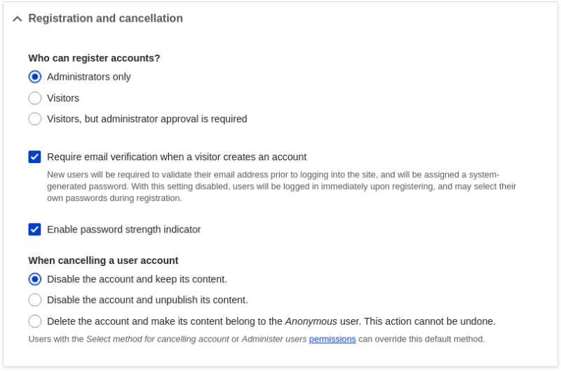
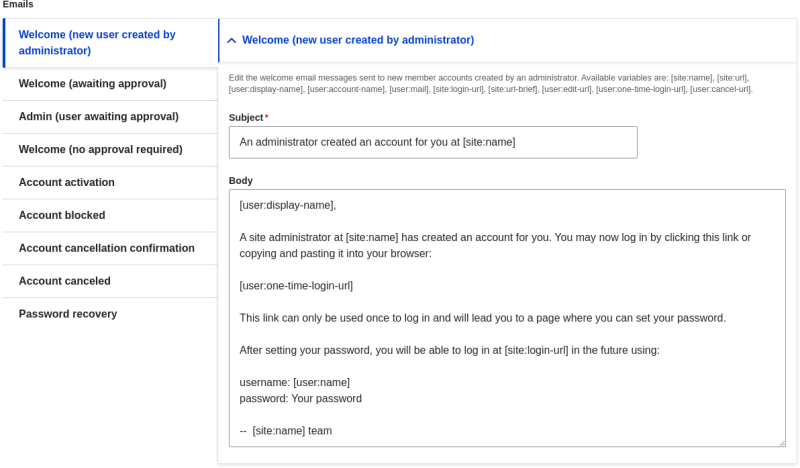

# 4.5. Configuring User Account Settings

## Content

### Goal

Turn off the ability for people to register user accounts on the site. Also, review and/or edit the email messages generated by the site for events related to user accounts.

### Prerequisite knowledge

[Section 4.1, “Concept: Administrative Overview”](https://drupalize.me/tutorial/user-guide/config-overview "4.1. Concept: Administrative Overview")

### Steps

Sprout Video

1. In the *Manage* administrative menu, navigate to *Configuration* > *People* > *Account settings* (*admin/config/people/accounts*).
2. Under *Registration and cancellation*, select *Administrators only* as the people with permissions to register user accounts. You can check *Require email verification when a visitor creates an account* in case you want to change the settings for account registration later on.

   Image

   
3. Optionally, change the default email address from which user account notifications from the farmers market website will be sent. This will help you maintain a separate email address from the one used for the website in general. For example, this email address for user account notifications will be useful for a staff member(s) communicating with vendors.

   Image

   
4. Optionally, edit the email templates under *Emails* to customize automated emails. There are several email templates provided by the core software. They are meant for different user-specific occasions. All of them can be personalized and three can be disabled via checkboxes: activation, blocking, and cancellation.

   You can send out your own text (for example, welcoming the new vendors for whom accounts were just created) by editing the *Welcome (new user created by administrator)* template.

   Image

   
5. Click *Save configuration* to save the changes.

### Expand your understanding

- [Section 12.2, “Clearing the Cache”](https://drupalize.me/tutorial/user-guide/prevent-cache-clear "12.2. Clearing the Cache")
- [Section 7.4, “Creating a User Account”](https://drupalize.me/tutorial/user-guide/user-new-user "7.4. Creating a User Account")

### Related concepts

See [Chapter 7, *Managing User Accounts*](https://drupalize.me/course/user-guide/user-chapter "Chapter 7. Managing User Accounts") for more information about user accounts and permissions.

### Additional resources

[Securing your site](https://www.drupal.org/security/secure-configuration) can help you with a more safety-focused approach to configuration.

**Attributions**

Written and edited by [Laura Vass](https://www.drupal.org/u/lolk) at [Pronovix](https://pronovix.com/), and [Jojy Alphonso](https://www.drupal.org/u/jojyja) at [Red Crackle](http://redcrackle.com).

Was this helpful?

Yes

No

Any additional feedback?

Previous
[4.4. Uninstalling Unused Modules](/tutorial/user-guide/config-uninstall?p=2343)

Next
[4.6. Configuring the Theme](/tutorial/user-guide/config-theme?p=2343)

This Drupal training resource is licensed under a [Creative Commons Attribution-ShareAlike 4.0 International License](http://creativecommons.org/licenses/by-sa/4.0/). Based on a work at <https://www.drupal.org/docs/user_guide/en/index.html>.

Clear History

Ask Drupalize.Me AI

close