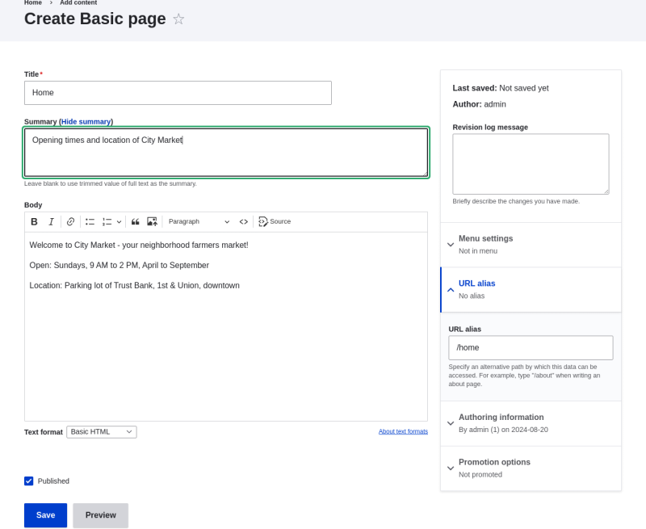

# 5.2. Creating a Content Item

## Content

### Goal

Create and publish a content item that will be used as the home page of the site.

### Prerequisite knowledge

- [Section 5.1, “Concept: Paths, Aliases, and URLs”](https://drupalize.me/tutorial/user-guide/content-paths "5.1. Concept: Paths, Aliases, and URLs")
- [Section 2.3, “Concept: Content Entities and Fields”](https://drupalize.me/tutorial/user-guide/planning-data-types "2.3. Concept: Content Entities and Fields")

### Site prerequisites

The *Basic page* content type must exist. This is created on your site when you install with the core Standard installation profile.

### Steps

Sprout Video

1. In the *Manage* administrative menu, navigate to *Content* > *Add content* > *Basic page* (*node/add/page*). The *Create Basic page* form appears.
2. Click *Edit summary*.
3. Fill in the fields as shown below.

   | Field name | Explanation | Value |
   | --- | --- | --- |
   | Title | Title of the page. Will also be used as a meta tag in the source code, URL alias, and as label of the content item in administration screens | Home |
   | Summary | Summary of the value of the body field. Can be used as teaser in overview pages | Opening times and location of City Market. |
   | Body | Full content of the page | Welcome to City Market - your neighborhood farmers market!  Open: Sundays, 9 AM to 2 PM, April to September  Location: Parking lot of Trust Bank, 1st & Union, downtown |
   | Published | Whether the content is published for public view or not | Checked |
   | URL alias > URL alias | Alternate relative path for the content | /home |

   By clicking the *Source* button in the rich text editor toolbar, you can see the HTML source code of the text that you are editing.

   Image

   
4. Click *Preview* to ensure everything looks like expected.
5. Click *Back to content editing*.
6. Click *Save*. The content is saved and can be found on the *Content* page.
7. Follow the same steps to create an About page, with title "About", and a body telling about the history of the farmer’s market.

### Expand your understanding

- [Section 5.4, “Designating a Front Page for your Site”](https://drupalize.me/tutorial/user-guide/menu-home "5.4. Designating a Front Page for your Site")
- [Section 5.6, “Adding a Page to the Navigation”](https://drupalize.me/tutorial/user-guide/menu-link-from-content "5.6. Adding a Page to the Navigation")
- [Section 10.3, “Translating Content”](https://drupalize.me/tutorial/user-guide/language-content-translate "10.3. Translating Content")

### Related concepts

- [Section 2.7, “Concept: User Interface, Configuration, and Content translation”](https://drupalize.me/tutorial/user-guide/language-concept "2.7. Concept: User Interface, Configuration, and Content translation")
- [Section 5.1, “Concept: Paths, Aliases, and URLs”](https://drupalize.me/tutorial/user-guide/content-paths "5.1. Concept: Paths, Aliases, and URLs")
- [Section 5.3, “Editing a Content Item”](https://drupalize.me/tutorial/user-guide/content-edit "5.3. Editing a Content Item")

### Additional resources

[*Drupal.org* community documentation page "About nodes"](https://www.drupal.org/docs/core-modules-and-themes/core-modules/node-module/about-nodes)

**Attributions**

Written by [Agnes Kiss](https://www.drupal.org/u/pixiekiss) and [Boris Doesborg](https://www.drupal.org/u/batigolix).

Was this helpful?

Yes

No

Any additional feedback?

Previous
[5.1. Concept: Paths, Aliases, and URLs](/tutorial/user-guide/content-paths?p=2350)

Next
[5.3. Editing a Content Item](/tutorial/user-guide/content-edit?p=2350)

This Drupal training resource is licensed under a [Creative Commons Attribution-ShareAlike 4.0 International License](http://creativecommons.org/licenses/by-sa/4.0/). Based on a work at <https://www.drupal.org/docs/user_guide/en/index.html>.

Clear History

Ask Drupalize.Me AI

close