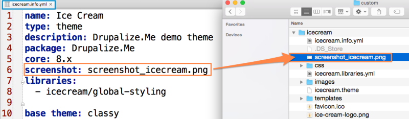
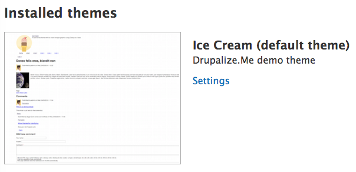

# Add a Screenshot to Your Theme

## Content

Contributed and custom themes can ship with a thumbnail screenshot that will be used to represent the theme when listing themes in the administration UI.

In this tutorial you'll learn how to:

- Prepare your site for the screenshot
- Create a screenshot of your theme
- Define a screenshot file for your theme in the *THEMENAME.info.yml* file

## Goal

Add a screenshot to display with your theme on the *Appearance* administrative page.

## Prerequisites

- [Describe Your Theme with an Info File](https://drupalize.me/tutorial/describe-your-theme-info-file)
- [Installing a Module](https://drupalize.me/tutorial/user-guide/config-install?p=3069) (Drupal User Guide)
- [Theme Settings Overview](https://drupalize.me/tutorial/theme-settings-overview)
- [Change Theme Settings](https://drupalize.me/tutorial/change-theme-settings)

## Best practice: add a screenshot for your theme

On the *Appearance* administrative page, all downloaded themes for the site are listed, along with a thumbnail image. This thumbnail should be a screenshot of a page with that theme activated. In this lesson, you'll learn how to prepare your demo page for the screenshot, create and save the screenshot with appropriate settings and in an appropriate location, and finally make sure Drupal can find the screenshot image, even if it's in a location outside of the theme's root directory.

## Prepare a demo page and take a screenshot

Before you take a screenshot, it's best practice to set up a demo page with important features displayed so that you and others can see a preview of how the theme will look when it's set as the default theme.

The following steps and guidelines are used by themes in core to set up a demo site for a theme screenshot.

### Log in as an administrator

This does not have to be user 1, but user 1 is guaranteed to work.

Image


### Ensure the following modules are enabled

Install the following modules from the *Extend* (*admin/modules*) page. These modules are enabled by default when you install Drupal, so you might not need to do anything here:

- Block (block)
- Comment (comment)
- Image (image)
- Menu UI (menu\_ui)
- Search (search)
- Taxonomy (taxonomy)

Image


### Configure your theme's settings to display the features it supports

Theme-specific settings are located at *Appearance > Settings > THEMENAME* (*admin/appearance*). To learn more about theme settings, go to [Theme Settings Overview](https://drupalize.me/tutorial/theme-settings-overview), for specifics on how to change each setting, go to the [Change Theme Settings tutorial](https://drupalize.me/tutorial/change-theme-settings).

### Upload a default user profile picture

If you are displaying user pictures in posts or comments, upload a picture for the user account who will author the example article and comment (see steps 6 and 7).

Image


If you have a theme-specific default user picture, upload that as well and configure it in *Administration > Configuration > Account settings > Manage fields > Picture > Edit > Default user picture* (*admin/config/people/accounts/fields/user.user.user\_picture*). This will display with the anonymous comment.

### Set the title and slogan to apply to your theme

Set the site name to the name of the theme and set the slogan to a brief tagline or description of your theme. Site name and slogan configuration are located at Configuration > Site information.

Image


### Create an example article

Create an article with the following values:

- **Title:** Donec felis eros, blandit non
- For the **Body** field value, click on the **Source** button in the WYSIWYG toolbar and then copy and paste the following text:

```
Morbi id lacus. Etiam malesuada diam ut libero. Sed blandit, justo nec euismod laoreet, nunc nulla iaculis elit, vitae. Donec dolor. Class aptent taciti sociosqu ad litora torquent per conubia nostra, per inceptos hymenaeos. Vivamus vestibulum felis <a href="http://example.com/">nec libero. Duis lobortis</a>. Cum sociis natoque penatibus et magnis dis parturient montes, nascetur ridiculus mus. Nunc venenatis pretium magna. Donec dictum ultrices massa. Donec vestibulum porttitor purus. Mauris nibh ligula, porta non, porttitor sed, fermentum id, dolor. Donec eu lectus et elit porttitor rutrum. Aenean justo. Phasellus augue tortor, mattis nonummy, aliquam euismod, cursus eget, ipsum. Sed ultricies bibendum ante. Maecenas rhoncus tincidunt eros.
```

- **Image:** http://commons.wikimedia.org/wiki/File:Earth\_and\_Moon.jpg
- **Tags:** Earth, Moon, Latin
- **Menu settings:** *Check:* Provide a menu link; *Menu link title:* Link 1

Image


### Add comments

Add a comment from an unauthenticated user and a reply from an authenticated user.

### Add more menu links to the main menu

Add at least 5 more menu link items to the main menu labeled "Link 2, Link 3, Link 4, Link 5, and Link 6" in order to demonstrate how your theme displays items in the main menu. If your theme handles secondary menu items or nested menu items in a special way, add a few of those, too.

Image


### Place the search block

Ensure that that the Search block is enabled and placed in a region supported by your theme. Go to Structure > Block layout to verify this configuration.

### Place the login block

Place it in the region where it is best supported by your theme.

### Log out and view the example article node

View the example article node as an anonymous user.

### Create a screenshot graphic

Use the screenshot-capture tool of your preference to capture the screen displaying the example article and save it to a convenient location on your computer.

### Resize the height to 438 pixels

Edit the screenshot and resize the height to **438px**, scaled proportionately, so that the width adjusts as well, but stays greater than **588px**.

Image


### Crop the screenshot

Crop the screenshot so that it is exactly **588px (w) x 438px (h)**. You may need to experiment with different resolutions or zoom levels so that your screenshot nicely displays your example page.

Image


### Export screenshot as a PNG file

Save the resized and cropped image to your computer.

### Optimize the image

If you haven't already in the export process, optimize the image to reduce the file size. A tool like [ImageOptim](https://imageoptim.com) will help with this, without reducing quality, due to its "lossless" compression. You want a tool that will compress the file and reduce its file size without sacrificing quality. ImageOptum is cross-platform compatible and free.

Image


### Save the screenshot in your theme directory

To save the screenshot in the default location, save the file with the name *screenshot.png* and make sure it's copied to the root of your theme. The path should be *DRUPALROOT/themes/custom/THEMENAME/screenshot.png*.

Image


(Optional) If you want to save the screenshot in a sub-directory of your theme, you will need to update your theme's [info file](https://drupalize.me/tutorial/describe-your-theme-info-file). See the next step, "Specify an alternative file location".

### (Optional) Specify an alternative file location

If you use a file name other than *screenshot.png* or save it in a location outside of your theme's root directory, such in an *images* directory, you will need to use the screenshot key in *THEMENAME.info.yml*.

#### Scenario 1: Different file name; saved in your theme's root directory

If your screenshot image is saved in the theme root directory but called something other than *screenshot.png*, for example, *screenshot\_icecream.png*, you would add the following line to your theme's info file (*THEMENAME.info.yml*):

Image



#### Scenario 2: Saved in images directory of your theme

If your screenshot image is saved in the images directory of your theme, update the screenshot key in your theme's info file, for example:

Image


If you already have your site [configured for theme development](https://drupalize.me/tutorial/configure-your-environment-theme-development), you won't need to clear the cache; just refresh the *Appearance* page to see your changes. If you don't have theme development caches disabled, you may need to clear the Drupal cache to see your screenshot image appear on the *Appearance* page.

### Visit the Appearance page to view the theme screenshot

Visit the *Appearance* page and admire your handy work! Your screenshot should now appear next to your theme. If it doesn't, reload the page, or [clear Drupal's cache](https://drupalize.me/tutorial/clear-drupals-cache). If you were using a base theme, your theme's screenshot should be displaying and not the base theme's.

Image



## Recap

On the *Appearance* administrative page, all downloaded themes for the site are listed, along with a thumbnail image. This thumbnail should be a screenshot of a page with that theme activated. In this lesson, you learned how to prepare your demo page for the screenshot, create and save the screenshot with appropriate settings and in an appropriate location, and finally make sure Drupal can find the screenshot image, even if it's in a location outside of the theme's root directory.

## Further your understanding

- Did your screenshot appear as expected? If not, what steps should you take to troubleshoot?

## Additional resources

- [Creating a screenshot for the appearance page](https://www.drupal.org/node/647754) (Drupal.org)

Was this helpful?

Yes

No

Any additional feedback?

Previous
[Change Theme Settings](/tutorial/change-theme-settings?p=3266)

Clear History

Ask Drupalize.Me AI

close