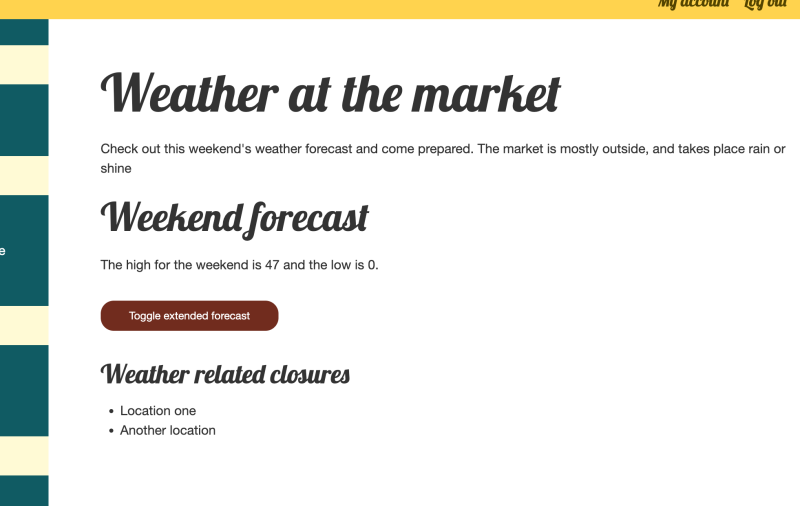

# Add CSS and JavaScript to a Module's Output

## Content

Modules can define new asset libraries that include CSS and JavaScript files, and then attach them to the content they output. This process involves defining a new asset library, authoring the related CSS and JavaScript, and using the `#attached` render array property to associate the library with the applicable content.

In this tutorial, we'll:

- Define a new asset library in the *anytown* module.
- Include CSS and JavaScript in the library.
- Attach the new library to the */weather* page.

By the end of this tutorial, you should be able to define an asset library and add CSS and JavaScript to a page from a Drupal module.

## Goal

Use asset libraries to apply CSS and JavaScript to the weather forecast page.

## Prerequisites

- [Concept: Asset Libraries](https://drupalize.me/tutorial/concept-asset-libraries)

## Video tutorial

Sprout Video

Let's enhance the */weather* page by adding CSS and JavaScript. Currently, the page displays both a short summary and an extended forecast. We'll add JavaScript to allow users to toggle between these 2 views.

This tutorial focuses on creating an asset library and including CSS and JavaScript in a page. We'll use example CSS and JavaScript, and won't dive into explaining the details of that part of the code.

### Create the CSS file

In the *anytown* module, create the file *css/forecast.css* and add the following code:

```
.weather_page--forecast button {
  font-size: 0.82rem;
  margin: 1rem 0;
}

.weather_page--forecast button:hover {
  cursor: pointer;
}
```

This CSS styles the `<button>` element our JavaScript will add to the weather forecast page.

### Create the JavaScript file

In the *anytown* module, create the file *js/forecast.js* with the following code:

```
(function (Drupal, once) {
  Drupal.behaviors.forecastToggle = {
    attach: function (context, settings) {
      // Use 'once' to ensure this runs only once per context
      once('forecast-toggle', 'div.weather_page--forecast', context).forEach(function (el) {
        // Initialize: hide 'div.long' and show 'div.short'.
        const long = el.querySelector('.long');
        const short = el.querySelector('.short');
        long.classList.add('visually-hidden');

        // Create and configure a button to toggle between thet wo.
        const toggleButton = document.createElement('button');
        toggleButton.textContent = 'Toggle extended forecast';
        toggleButton.addEventListener('click', function () {
          long.classList.toggle('visually-hidden');
          short.classList.toggle('visually-hidden');
        });

        // Append the button to the page.
        document.querySelector('.weather_page--forecast').appendChild(toggleButton);
      });
    }
  };
})(Drupal, once);
```

This JavaScript toggles the visibility of the `.long` and `.short` forecast elements upon `<button>` click.

### Define an asset library

Asset libraries are defined in a *MODULE\_NAME.libraries.yml* file. If it doesn't exist, create *anytown.libraries.yml* with:

```
forecast:
  css:
    component:
      css/forecast.css: {}
  js:
    js/forecast.js: {}
  dependencies:
    - core/drupal.once
```

This code creates a new asset library named `forecast` that includes:

- A CSS file placed into the `component` SMACSS grouping. Nested under the `component` key are any number of CSS files. The **key** is the path to the file relative to the *anytown.libraries.yml* file, and the **value** is any additional configuration for Drupal when including the asset. For example, `{media: 'print'}`.
- A JavaScript file. JavaScript files have no additional grouping. This is a YAML list of files to include where they **key** is the path to the file relative to the *anytown.libraries.yml* file and the **value** is any additional configuration for Drupal to use when including the file. For example, `{minified: 'true'}`.
- The library specifies that it depends on the `core/drupal.once` library. In this case, that's because *js/forecast.js* uses the `once()` function, which is part of the `core/drupal.once` library.

### Attach the library

Attach the new asset library to the weather page by altering the render array in the `WeatherPage` controller's `build()` method and using the `#attached` render array property:

In *src/Controller/WeatherPage.php*, update the code to match the following:

```
<?php

declare(strict_types=1);

namespace Drupal\anytown\Controller;

use Drupal\anytown\ForecastClientInterface;
use Drupal\Core\Controller\ControllerBase;
use Symfony\Component\DependencyInjection\ContainerInterface;

/**
 * Controller for anytown.weather_page route.
 */
class WeatherPage extends ControllerBase {

  /**
   * Forecast API client.
   *
   * @var \Drupal\anytown\ForecastClientInterface
   */
  private $forecastClient;

  /**
   * WeatherPage controller constructor.
   *
   * @param \Drupal\anytown\ForecastClientInterface $forecast_client
   *   Forecast API client service.
   */
  public function __construct(ForecastClientInterface $forecast_client) {
    $this->forecastClient = $forecast_client;
  }

  /**
   * {@inheritDoc}
   */
  public static function create(ContainerInterface $container) {
    return new static(
      $container->get('anytown.forecast_client')
    );
  }

  /**
   * Builds the response.
   */
  public function build(string $style): array {
    // Style should be one of 'short', or 'extended'. And default to 'short'.
    $style = (in_array($style, ['short', 'extended'])) ? $style : 'short';

    $url = 'https://module-developer-guide-demo-site.ddev.site/modules/custom/anytown/data/weather_forecast.json';
    $forecast_data = $this->forecastClient->getForecastData($url);

    $table_rows = [];
    $highest = 0;
    $lowest = 1000;
    if ($forecast_data) {
      // Create a table of the weather forecast as a render array. First loop
      // over the forecast data and create rows for the table.
      foreach ($forecast_data as $item) {
        [
          'weekday' => $weekday,
          'description' => $description,
          'high' => $high,
          'low' => $low,
          'icon' => $icon,
        ] = $item;

        // Create one table row for each day in the forecast.
        $table_rows[] = [
          // Simple text for a cell can be added directly to the array.
          $weekday,
          // Complex data for a cell, like HTML, can be represented as a nested
          // render array.
          [
            'data' => [
              '#markup' => '',
            ],
          ],
          [
            'data' => [
              '#markup' => "<em>{$description}</em> with a high of {$high} and a low of {$low}",
            ],
          ],
        ];

        $highest = max($highest, $high);
        $lowest = min($lowest, $low);
      }

      // Extended forecast as a table.
      $weather_forecast = [
        '#type' => 'table',
        '#header' => [
          'Day',
          '',
          'Forecast',
        ],
        '#rows' => $table_rows,
        '#attributes' => [
          'class' => ['weather_page--forecast-table'],
        ],
      ];

      // Summary forecast.
      $short_forecast = [
        '#type' => 'markup',
        '#markup' => "The high for the weekend is {$highest} and the low is {$lowest}.",
      ];

    }
    else {
      // Or, display a message if we can't get the current forecast.
      $weather_forecast = ['#markup' => '<p>Could not get the weather forecast. Dress for anything.</p>'];
      $short_forecast = NULL;
    }

    $build = [
      // Which theme hook to use for this content. See anytown_theme().
      '#theme' => 'weather_page',
      // Attach the CSS and JavaScript for the page.
      '#attached' => [
        'library' => ['anytown/forecast'],
      ],
      // When passing a render array to Twig template file any top level array
      // element that starts with a '#' will be a variable in the template file.
      // Example: {{ weather_intro }}.
      '#weather_intro' => [
        '#markup' => "<p>Check out this weekend's weather forecast and come prepared. The market is mostly outside, and takes place rain or shine.</p>",
      ],
      '#weather_forecast' => $weather_forecast,
      '#short_forecast' => $short_forecast,
      '#weather_closures' => [
        '#theme' => 'item_list',
        '#title' => 'Weather related closures',
        '#items' => [
          'Ice rink closed until winter - please stay off while we prepare it.',
          'Parking behind Apple Lane is still closed from all the rain last weekend.',
        ],
      ],
    ];

    return $build;
  }

}
```

This update attaches the `forecast` library from the `anytown` module to the `weather_page` using the `#attached` render array property.

### Verify it works

Image



[Clear the cache](https://drupalize.me/tutorial/clear-drupals-cache) so that Drupal finds our new asset library definition and includes it with the weather page.

Open the */weather* page in your browser. The JavaScript from our library should execute and hide the extended forecast by default. A button to toggle between the short and the extended versions of the forecast should appear under the short forecast.

## Recap

In this tutorial, we defined a new asset library `forecast` in the *anytown.libraries.yml* file, including CSS and JavaScript files from the module. Then we updated the `WeatherPage` controller to attach this library to the */weather* page, ensuring these assets are loaded with the page.

## Further your understanding

- How would you add another CSS file to the `forecast` library, and why might this be preferable to editing the existing file?
- Can you attach the `forecast` library via the *weather-page.html.twig* template file instead of via the `WeatherPage::build()` method?

## Additional resources

- [Define an Asset Library](https://drupalize.me/tutorial/define-asset-library) (Drupalize.Me)
- [Attach an Asset Library](https://drupalize.me/tutorial/attach-asset-library) (Drupalize.Me)
- [CSS File Organization](https://www.drupal.org/docs/develop/standards/css/css-file-organization) (Drupal.org)
- [Adding assets (CSS, JS) to a Drupal module via \*.libraries.yml](https://www.drupal.org/docs/develop/creating-modules/adding-assets-css-js-to-a-drupal-module-via-librariesyml) (Drupal.org)

Was this helpful?

Yes

No

Any additional feedback?

Previous
[Concept: Asset Libraries](/tutorial/concept-asset-libraries?p=3239)

Next
[Concept: Internationalization (i18n)](/tutorial/concept-internationalization-i18n?p=3239)

Clear History

Ask Drupalize.Me AI

close