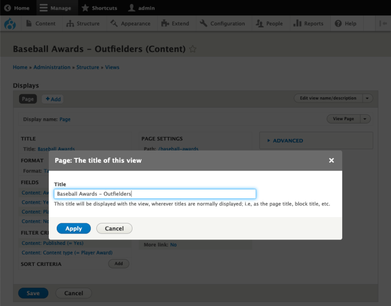
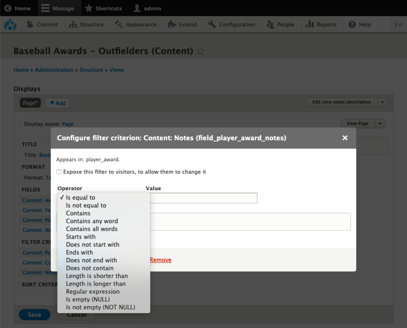

# Add Filter Criteria to a View

## Content

In this tutorial, we'll walk through the process of adding and configuring filters and adding a filter group.

## Goal

Create a new list of player awards limited to awards given to outfielders.

## Prerequisites

- [Set up Demo Site with Views and Content](https://drupalize.me/tutorial/set-demo-site-views-and-content)
- [Overview: Filter Criteria in Views](https://drupalize.me/tutorial/overview-filter-criteria-views)

If you are new to Views, check out these Drupal User Guide tutorials:

- [Concept: Uses of Views](https://drupalize.me/tutorial/user-guide/views-concept)
- [Concept: The Parts of a View](https://drupalize.me/tutorial/user-guide/views-parts)

## Watch: Add Filter Criteria to a View

Sprout Video

## Duplicate the *Baseball Awards* view

The *Baseball Awards* view provides a good starting point for this exercise. In the following steps we'll duplicate and rename it.

### Duplicate the view

From our site administration page, visit Structure > Views (*admin/structure/views*).

Next, locate the view named *Baseball Awards* and select the dropdown arrow next to the *Edit* button in the *Operations* column, then select *Duplicate*.

Image

Name the new view **`Baseball Awards - Outfielders`** and select *Duplicate*.

Image

### Update the title

In the first column, select the view title link to open a modal window where we can change the view's title. Change the title to **`Baseball Awards - Outfielders`**, then select the *Apply* button.

Image

### Update the path

In the second column, select the view's path link under **Page Settings** to open the modal window where we can change the URL where this view appears. Change the path to **`baseball-awards-outfielders`**, then select the *Apply* button.

Image

### Save the view

Save the view by selecting the *Save* button.

## Add filter criteria to limit list to outfielder awards

Now that we have a new view to work with, let's limit the list of *Player Awards* to outfielder award recipients.

In the game of baseball an "outfielder" is one of three defensive positions furthest from the batter. In our dataset the value for position of the player receiving the award is an abbreviation in the *Notes* field of *Player Awards*. The 3 abbreviations for the outfield positions are:

- `LF` for Left Fielder
- `RF` for Right Fielder
- `CF` for Center Fielder

Next, let's create a group of filters that limit our list of awards to those where the *Notes* field is either `LF`, `RF`, or `CF`. We'll do this by first creating the new filters, then arranging the new filters within a *filter group*.

### Add a filter criterion

In the first column next to the section title **Filter Criteria**, select the *Add* button to open a modal window that contains a list of fields that we can use to limit our content list.

Image

### Add *Notes* as a filter criterion

Within the list of fields presented in the modal window, find the field named *Notes (field\_player\_award\_notes)* and choose it by selecting the checkbox beside it. Then select the *Add and configure filter criteria* button.

Note: When dealing with a large number of fields, it may be easier to find a specific field by typing part of the name of the field name in the search box at the top of the modal window:

Image

### Add filter criterion for "Left Fielder" (LF)

After selecting filters to add, we need to configure them. In our filter configuration modal we need to consider 2 options:

- **Value**: The *value* is what the filter is looking for when searching the database.
- **Operator**: The *operator* represents how the filter will compare the specified *value* to what is in the database.

Image

In this example, we want our new filter to find Player Awards where the Notes field **`is equal to`** the value **`LF`** for the position "Left Fielder".

Configure the filter criterion as follows:

| Field | Value |
| --- | --- |
| Value | **`LF`** |
| Operator | **`Is equal to`** |

Then select the *Apply* button.

Image

### Add filter criterion for "Center Fielder" (CF)

Repeat the process for adding a filter criterion, but this time we'll filter on the value `CF` for the position "Center Fielder".

First, add a new filter criterion once again using *Notes (field\_player\_award\_notes)*

Then, configure the filter criterion as follows:

| Field | Value |
| --- | --- |
| Value | **`CF`** |
| Operator | **`Is equal to`** |

Now, select the *Apply* button.

Image

### Add filter criterion for "Right Fielder" (RF)

Repeat the process for adding a filter criterion, but this time we'll filter on the value `RF` for the position "Right Fielder".

Add a new filter criterion once again using *Notes (field\_player\_award\_notes)*

Then, configure the filter criterion as follows:

| Field | Value |
| --- | --- |
| Value | **`RF`** |
| Operator | **`Is equal to`** |

Select the *Apply* button.

Image

## Results that are *too* refined

At this point we should have 5 total filters. One that limits the list to content that is "Published". Another that limits the list to content of the *Player Award* content type, and three filters that limit the list to content where the *Notes* field is equal to `LF`, `CF`, and `RF`.

Image

By default all filter criteria connect with a logical `AND` keyword. This means that every item in our list must pass through every added filter criterion. If we were to write our current filters criteria as a sentence, that sentence would be:

> Show me a list of content where the content is published AND the content is of the content type *Player Award* AND the content has a *Notes* field with the value `LF` AND the content has a *Notes* field with the value `CF` AND the content has a *Notes* field with the value `RF`.

If we consider this for a moment, it should become clear that with the given instructions this view cannot possibly return any results. It's impossible for a single *Notes* field to be equal to the value of `LF`, `CF`, and `RF` at the same time.

## Replace `AND` with `OR` on some filters

To correct this impossibility, we need to use another concept for relating filters to each other, `OR`. Using `OR`, a filter's success in finding content in the database is optional. Written as a sentence, that sentence would be:

> Show me a list of content where the content is published AND the content is of the content type *Player Award* AND the content has a *Notes* field with the value `LF` OR `CF` OR `RF`.

## Rearrange filters and add a filter group

In Views we can relate filters to each other with the concept of `OR` when rearranging filters and using *filter groups*.

### Select `And/Or Rearrange` filter criteria action

Next to the **Filter Criteria** section, select the dropdown arrow next to the *Add* button. Doing so will reveal another item labeled *And/Or Rearrange*. Select *And/Or Rearrange* from the dropdown menu.

Image

### Create a new filter group

Unlike the modal that appears when rearranging fields and sort criteria, the modal for rearranging filter criteria has unique options for grouping filters by how they should relate to each other.

Note how at this moment, a single group with an `And` operator contains all filter criteria.

Image

Near the top of the modal, select the link labeled *Create new filter group*. This will add a new group to the modal that has its own operator. We can now move filters from one group to another, and change the operator for each group individually.

### Move 3 *Notes* filter criterion to new filter group

1. Move the 3 *Notes* filters to the new group.
2. Change the *Operator* for the new group to **`Or`**.
3. Select the *Apply* button at the bottom of the modal.

Image

### Preview the results limited to outfielders

We have now modified our list of content so that the value of the *Notes* field can be one of 3 possible values. Preview it, and note that the list is now limited to awards given to outfield players.

Image

### Save the view

Save the view by selecting the *Save* button.

## Recap

In this exercise, we practiced adding and configuring filter criteria. Filter criteria allow us to limit the items shown in a list. Filter groups allow us to organize our filter criteria into complex relationships, further narrowing the content list to precisely the content we want displayed.

## Further your understanding

- In another view, experiment with filter criteria operators. Use it to find content that `does not equal` or `does not contain` some value.

## Additional resources

- [Drupal User Guide: Chapter 9. Creating Listings with Views](https://drupalize.me/series/user-guide/views-chapter) (Drupalize.Me)

Was this helpful?

Yes

No

Any additional feedback?

Previous
[Overview: Filter Criteria in Views](/tutorial/overview-filter-criteria-views?p=2670)

Next
[Overview: Exposed Filter Criteria in Views](/tutorial/overview-exposed-filter-criteria-views?p=2670)

Clear History

Ask Drupalize.Me AI

close