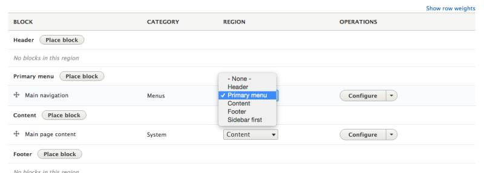

# Add Regions to a Theme

## Content

Customizing the available regions in your theme is one of the first things you'll do when creating your own themes. Doing so gives you complete control over where content is displayed on the page, and the markup involved. Adding regions to a theme is a two-step process that involves editing your theme's *THEMENAME.info.yml* file and updating your *page.html.twig* file.

In this tutorial we'll:

- Declare one or more new regions in our themes *THEMENAME.info.yml* file.
- Output the content of those regions in our theme via the *page.html.twig* file.

By the end of this tutorial you should be able to add or edit the regions a theme provides. Also, you'll ensure that blocks placed into regions are displayed by outputting the regions in the page template.

## Goal

Add new regions to your theme and display their contents.

## Prerequisites

- [Describe Your Theme with an Info File](https://drupalize.me/tutorial/describe-your-theme-info-file)
- [Regions](https://drupalize.me/tutorial/regions)

## Watch: Add Regions to a Theme

Sprout Video

## How to add regions to a theme

### Edit your theme's *.info.yml* file

Edit your *THEMENAME.info.yml*, located in the root directory of your theme, e.g. *themes/custom/icecream/icecream.info.yml*. Each region is declared as a sub-key of the `regions` element.

Example:

```
# Region metadata.
regions:
  header: 'Header'
  content: 'Content'
  content_bottom: 'Content (bottom)'
  primary_menu: 'Primary menu'
  banner_top: 'Banner (top)'
  banner_bottom: 'Banner (bottom)'
  footer: 'Footer'
  page_top: 'Page top'
  page_bottom: 'Page bottom'
```

**Tip:** As soon as you declare any regions in your theme, you override all the defaults provided by Drupal core. In most cases you will want to have *content*, *page\_bottom*, and *page\_top* regions at a minimum. Many modules expect them to be there.

### Clear the cache

[Clear the cache](https://drupalize.me/tutorial/clear-drupals-cache) so your new regions are detected. Drupal reads the contents of the info file once, and then caches it for better performance. Anytime you change it you'll need to clear the cache again for those changes to get detected.

### Confirm that it's working

Navigate to *Structure* > *Block layout* (*admin/structure/block*) to confirm that Drupal is now using your regions.

Image



Region names are shown in the *Block layout* UI. They should include all the regions you declared above.

### Edit your *page.html.twig* file

For the regions to display they need to be rendered in your theme's page template file. If you're using anything other than the default set of regions you'll need to override the page template file. We'll go into [overriding template files](https://drupalize.me/tutorial/override-template-file) in much greater detail later. But to make this a one-stop reference for adding regions to a theme here are the relevant bits.

Adding the metadata to your *THEMENAME.info.yml* file above introduced new variables that you can access in your *page.html.twig* template. These contain the content of whatever blocks have been placed into each region. The names correspond with the array keys you used in your *THEMENAME.info.yml* file.

- `content: 'Content'` corresponds with `{{ page.content }}`
- `sidebar_first: 'Sidebar first'` corresponds with `{{ page.sidebar_first }}`
- etc.

Adjust the markup in your *page.html.twig* template to accommodate your new regions.

Example:

```
<div class="layout-content">{{ page.content }}</div>
```

**Note:** Using an `if` statement, like the example below, to check if a region is empty might not always work. Regions can end up rendering out *empty* HTML tags in different scenarios. There's an open issue for Drupal core where you can read more about this problem: [Issue #953034](https://www.drupal.org/node/953034). Some solutions that might work around this limitation are outlined in [this Drupal Stack Exchange post](https://drupal.stackexchange.com/questions/175389/how-do-i-properly-detect-if-region-is-empty).

In this example, the `<aside>` tag may render but with nothing inside it because the `page.sidebar_first` render array may contain invisible content:

```

  <aside class="layout-sidebar-first" role="complementary">
    {{ page.sidebar_first }}
  </aside>

```

## Recap

In this tutorial, we walked-through added a region to a theme by adding a list of regions to our theme's info file, then printing out the contents of those regions in our theme's page template file using HTML and Twig.

## Further your understanding

- What 2 files need to be edited to declare a new region?
- Why are themes responsible for declaring regions?
- Split the existing footer region into two regions, "Footer first", and "Footer second". (Be sure to add the regions to your info file first.) Then, update the HTML markup in the page template file to make it so that at narrow viewport sizes the second footer drops underneath the first and they both expand to the full width of the viewport. We walk through one solution to this challenge in this [Hands-On Theming](https://drupalize.me/guide/hands-on-theming) tutorial: [Exercise: Override the Main Page Template](https://drupalize.me/tutorial/exercise-override-main-page-template).

## Additional resources

- Get an overview of [what regions are](https://drupalize.me/tutorial/regions) (Drupalize.Me)
- Read about [defining your theme with an info file](https://drupalize.me/tutorial/describe-your-theme-info-file) (Drupalize.Me)
- Learn to use [YAML](https://drupalize.me/videos/introduction-yaml) (Drupalize.Me)
- [Adding Regions to a Theme](https://www.drupal.org/node/2469113) (Drupal.org)

Was this helpful?

Yes

No

Any additional feedback?

Previous
[Regions](/tutorial/regions?p=3267)

Next
[Fast by Default](/tutorial/fast-default?p=3267)

Clear History

Ask Drupalize.Me AI

close