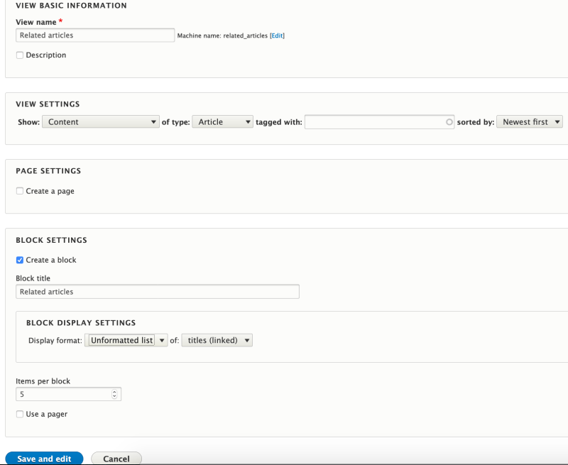
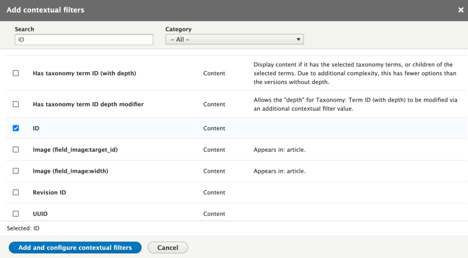
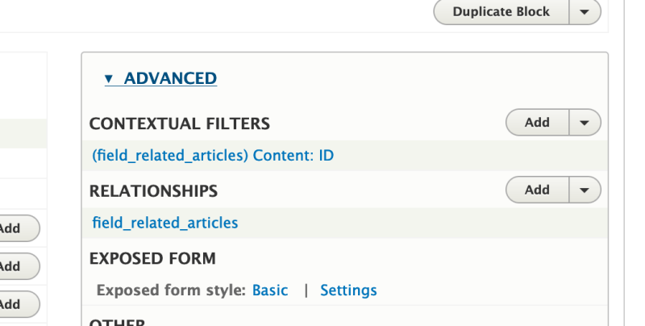
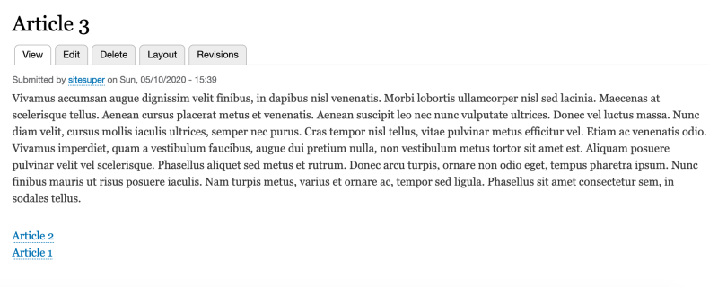

# Add Views to a Layout

## Content

Views is one of the most utilized modules in Drupal. When combined with Layout Builder, it provides a powerful tool for adding related content to a layout. Combining Views with Layout Builder can solve several common problems, including:

- Placing blocks of related content within Layout Builder sections
- Constructing search pages with custom layouts
- Placing call-to-action cards or buttons within a custom layout
- Allowing editors to use Views blocks in the layout without the need to export and import configuration and alter code

In this tutorial we'll:

- Learn how to place views blocks into a layout
- Explore the Views related settings available from within the Layout Builder UI
- Explain how to allow a View's exposed filters to be displayed and used in a layout
- Use contextual filters to control what is displayed in the View

By the end of this tutorial you should know how to place lists created with Views into a Layout Builder layout.

## Goal

Place a block listing related articles in the layout used for the *Article* content type.

## Prerequisites

- [Introduction to Layout Builder](https://drupalize.me/tutorial/introduction-layout-builder)
- [Change the Layout on a Per-Page Basis](https://drupalize.me/tutorial/change-layout-page-basis)
- [Overview: Filter Criteria in Views](https://drupalize.me/tutorial/overview-filter-criteria-views)
- [Patching Drupal core and modules](https://www.drupal.org/docs/develop/using-composer/using-composer-to-install-drupal-and-manage-dependencies?page=1#s-patching-drupal-core-and-modules) (Drupal.org)

## Create views with a block display and embed them

In [Introduction to Layout Builder](https://drupalize.me/tutorial/introduction-layout-builder) we learned that you can place any standard block into a layout. This is true for any block created by the Views module. In most cases all you'll need to do is create the view, make sure it [has a block display](https://drupalize.me/tutorial/user-guide/views-block), and then place it into the layout.

This process will work for most views.

## Advanced use cases

There are a couple of more advanced, but common, use-cases, for example:

- Providing end-user-access to exposed filters.
- Giving editors the ability to set the value of a contextual filter in the layout builder configuration (versus deriving the value from context like the URL of the page or other computed data).

Solving either of these use cases requires installing the Chaos Tools Views module, which is part of the contributed [Chaos Tools project](https://www.drupal.org/project/ctools). By default, Layout Builder bubbles up the Views configuration option for number of items to display. This allows an editor to modify that value when placing the block in a layout.

The Chaos Tools Views module exposes additional configuration options from the view that can be bubbled up to the Layout Builder UI, including enabling/disabling exposed filters and pagers, and manually setting the value of a contextual argument.

The rest of this tutorial walks through a complex integration between Views and Layout Builder. In our use-case, we want to allow content editors to place a Views block into a layout and then to manually configure the value that's passed as a contextual filter to the view.

As a real world example of this, imagine that you've got a *Landing page* content type that uses Layout Builder to allow editors to modify the layout of individual pages. You also have an event content type, with a *tags* field. You also have a View that provides a block that lists *related events*. A content editor creating a landing page should be able to place this "related events block" into the layout, and then configure the block to display only events with a specific tag. Thus ensuring that the events displayed are contextually related to the content of the landing page.

This can also be done using the Chaos Tools Views module, but for now requires patching the module. (Details in the following steps.)

## Getting started

This tutorial assumes that you have an *Article* content type set up with Layout Builder for per-node layout editing, and that the *Article* content type has a multivalue entity reference field called *Related articles* that references other articles.

Your setup should look something like the following:

Image


We're also assuming that you're familiar with [the Views module](https://drupalize.me/topic/display-content-views).

**Note:** This example uses an entity reference field as the source for determining a relationship. And, you could accomplish essentially the same thing by adding the *field\_related\_articles* field to the layout. However, this example does still demonstrate how you can expose the configuration of a contextual filter to the user who is building the layout.

## Add a View to a layout

### Create some content

Start by creating 3 new articles. For the third, fill in the *Related articles* field and connect the first 2 articles.

Image


### Create a related articles view

Make sure that you have the *Views UI* module enabled. Then navigate to *Structure* > *Views* (*admin/structure/views*) and press the *+ Add view* button.

Name the new View *Related articles*. In the *View settings* section choose *content of type Article*. Select the checkbox *Create block*. Keep the other settings as set by default and press *Save and edit*.

Image



### Add advanced view settings

Expand *Advanced* section of the view.

In the *Relationships* section press *Add* link. Search for *field\_related\_articles* and select \_Content using *field\_related\_articles*.

Image


Press *Add and configure relationships* button. On the next screen select *Require this relationship* and select *Apply*.

Image


In the *Contextual Filters* section press *Add* link and search for *ID*. Then press *Add and configure contextual filters* button.

Image



On the next screen select the relationship we just defined from the dropdown. Also choose the *Hide view* option in the *When the filter value is not available section*.

Image


Press *Apply*. Your *Advanced* view section may look something like below.

Image



### Update the layout for the Article content type

Navigate to the *Layout* tab of the third article created earlier. Open the Layout Builder UI, and remove sections that you may have there in order to start fresh.

Add a new section and place *Body* field there.

Press the *+ Add Block* button and scroll to the *Lists (views)* section. Select the *Related articles* view. You will see the same settings you would see while placing blocks through the *Block layout* page. Update the settings to not show the block title and press *Add block*.

Image


Once completed you should see the placeholder instead of the rendered view block. To see the output of the block click *Save layout*.

The block still isn't rendered. This is because contextual filters do not work in the context of Layout Builder without some additional configuration.

### Resolving the contextual filter problem

To pass contextual filter values to the Views block you need to install the *Chaos Tools* module and its submodules *Chaos Tools Views*, and *Chaos Tools Blocks*.

Use Composer to install ctools:

```
composer require drupal/ctools
```

Enable the modules *Chaos Tools*, *Chaos Tools Views*, and *Chaos Tools Blocks*. For more info see [11.3. Downloading and Installing a Module from Drupal.org](https://drupalize.me/tutorial/user-guide/extend-module-install?p=3072).

**Note:** For this solution to work you also need to apply the latest patch for *Chaos Tools* from this issue <https://www.drupal.org/node/2759445>. Without this patch the *Contextual filters* option will not appear in the list of *Block settings* in the Views UI (see the screenshot below).

If you haven't already, require the `cweagans/composer-patches:~1.0` project with:

```
composer require cweagans/composer-patches:~1.0 --update-with-dependencies
```

Then update your project's *composer.json* file's `extras` section with the patch information. Assuming you're using the *drupal/recommended-project* Composer template, your project's *composer.json* `"extras"` section should include something like this:

```
"composer-exit-on-patch-failure": true,
"patchLevel": {
    "drupal/core": "-p2",
    "drupal/ctools": "-p1"
},
"patches": {
    "drupal/ctools": {
        "#2759445: How to manually pass an argument to a views block through interface": "https://www.drupal.org/files/issues/2023-01-18/2759445-100.patch"
    }
}
```

The above is just an example, and you'll want to verify that you're using the latest version of the *.patch* file.

After editing your *composer.json* file, run `composer install`. You should see output like this:

```
composer install

Package operations: 1 install, 0 updates, 0 removals
Gathering patches for root package.
Gathering patches for dependencies. This might take a minute.
  - Installing drupal/ctools (4.1.0): Extracting archive
  - Applying patches for drupal/ctools
    https://www.drupal.org/files/issues/2023-01-18/2759445-100.patch (#2759445: How to manually pass an argument to a views block through interface)

Generating autoload files
93 packages you are using are looking for funding.
Use the `composer fund` command to find out more!
phpstan/extension-installer: Extensions installed
  * Homepage: https://www.drupal.org/project/drupal
  * Support:
    * docs: https://www.drupal.org/docs/user_guide/en/index.html
    * chat: https://www.drupal.org/node/314178
```

Once the patch is applied and modules are enabled, **clear the cache**. Edit the *Related articles* view (*admin/structure/views/view/related\_articles*). Under *Allow settings:* in the *Block settings* section of the UI, select the *Contextual filters* option and press *Apply*.

Image


Save the view and navigate back to the *Layout* tab of the article node. Select the *Configure* option for the Views block. Now you should be able to see the contextual filter field exposed in the block's configuration. In case of the *Related articles* view it is **Content: ID**.

Image


Save the layout and you should see the articles rendered at the bottom of the page.

Image



## Recap

In this tutorial we learned how to use Views blocks inside the Layout Builder. We installed the Chaos Tools contributed module, and a required patch, and explored how to pass settings from Layout Builder to the contextual filter of the View.

## Further your understanding

- Can you add a View that doesn't require the use of contextual filters to a layout? How does this differ from the above?
- What other settings that can be enabled in the views *Allow settings* UI section? What would you use them for?
- Learn how to add a patch to your project's *composer.json* so that when you (or anyone on your team) installs the module with Composer, the patch is applied. See the section "Patching core and contributed packages" in this tutorial: [Composer Configuration for Drupal](https://drupalize.me/tutorial/composer-configuration-drupal).

## Additional resources

- [How to manually pass an argument to a views block through interface](https://www.drupal.org/node/2759445) (Drupal.org)
- [Chaos Tool Suite (ctools)](https://www.drupal.org/project/ctools) (Drupal.org)

Was this helpful?

Yes

No

Any additional feedback?

Previous
[Tips for Theming with Layout Builder](/tutorial/tips-theming-layout-builder?p=2653)

Next
[How to Add Custom Styles in Drupal's Layout Builder](/tutorial/how-add-custom-styles-drupals-layout-builder?p=2653)

Clear History

Ask Drupalize.Me AI

close