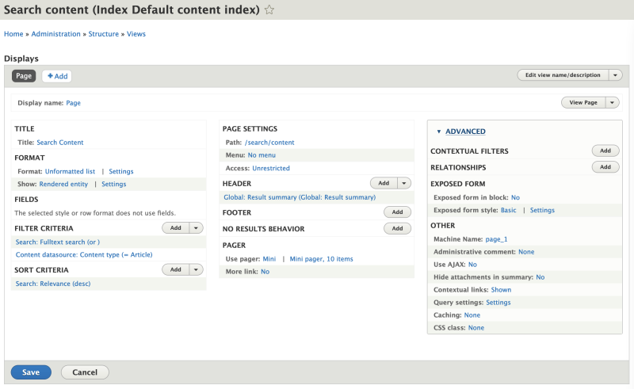

# Alter the Query Used for a View

## Content

At its core, Views is a query generator. It provides a way for site builders and developers to construct queries for Drupal content using an intuitive user interface. The UI allows you to configure the fields, filters, sorting, and relationships in the generated query using common conditions. In most cases, this is sufficient. However, there are situations where you need to dynamically alter the constructed query using `hook_views_query_alter()` prior to its execution.

One example use case is adding sort parameters to a search view if no search terms have been entered. You can use `hook_views_query_alter()` to check if a search term was entered. If so, sort the result by relevance; and if there are no search terms, sort the results by date. Or maybe you need to dynamically set the value of a filter condition based on a calculation performed by your custom code.

Using `hook_views_query_alter()` in a custom module, you can alter the query that is generated by a view before the query is performed. In most cases this alters the SQL query used. This same technique will work regardless of the storage system Views is querying.

In this tutorial we'll:

- Learn how to alter a view's query using the `hook_views_query_alter()` hook in Drupal
- Use `hook_views_query_alter()` to dynamically add a new sort condition that could not be achieved using the UI

By the end of this tutorial you should know how to alter the database query used to retrieve the results for a view.

## Goal

Use `hook_views_query_alter()` to add custom sort options to a view that displays search results.

## Prerequisites

- [Overview: Sort Criteria in Views](https://drupalize.me/tutorial/overview-sort-criteria-views)
- [Overview: Build and Render Cycles in Views](https://drupalize.me/tutorial/overview-build-and-render-cycles-views)

## Setup

For this tutorial we'll be altering a view that displays search results. But the technique is applicable to any view. As a shortcut for demonstration, we will use the view provided by the [Search API module](https://www.drupal.org/project/search_api). If you're using this as a reference for your specific use case, you can skip these setup steps.

Download and enable the Search API module:

```
composer require drupal/search_api
drush en search_api search_api_db search_api_db_defaults -y
```

Image


[Clear the cache](https://drupalize.me/tutorial/clear-drupals-cache), and then run the site indexing command:

```
drush search-api-index
```

The *Search API Defaults* module provides configuration for a view which we'll be using as a base for this tutorial. This view can be found by navigating to *Structure* > *Views* > *Search content* > *Edit* (button) (*admin/structure/views/view/search\_content*).

We'll need to make a few modifications to the view configuration for our example:

- Under the filters area, add filter by content type and limit content to the *Article* content type.
- Update the *Fulltext search* filter to make it not required, update the operator to contain *any* of these words, and make a note of its identifier (in our case its *keys*, which we'll need later).

  Image

  
- In the **Advanced** column, update the exposed form style to be *Basic* instead of *Input required*.
- Add a sort by *Relevance (descending)* in the sort criteria of the view.

Your configuration should look like the following:

Image



Press *Save* to save your changes. The view that can be found at the */search/content* path.

Image


## Implement `hook_views_query_alter()`

### Create and enable a custom module

Implementations of `hook_views_query_alter()` need to live in a *MODULENAME.module* file.

In a past tutorial, we created and enabled a custom module called *news*, with a *news.info.yml* file and a *news.module* file. You can either use that, or use an existing custom module -- as long as it's enabled, these steps will work.

### Add a `hook_views_query_alter()` implementation

Define `hook_views_query_alter()` in your *MODULENAME.module* file. This hook takes two parameters: a `ViewExecutable` object that represents the configuration for the view being altered, and a `QueryPluginBase` object that represents the query that will be used to retrieve results for this view.

Query plugins generate, and execute, a query object against a particular storage backend, converting the Views query object into an actual query. In most cases, this generates an SQL query against a database backend. Some handler plugins that affect the query (fields, filters, etc.) implicitly assume that the query is using SQL, even though that's not always the case. In most cases what you'll get is an instance of `\Drupal\views\Plugin\views\query\Sql`.

In this example, the Search API module provides the `\Drupal\search_api\Plugin\views\query\SearchApiQuery` query plugin.

In order to determine exactly how to alter the query, you'll first need to figure out what query plugin is used. Then you'll look at the class definition for that plugin to see what methods are available to you for altering the query object. Again, in most cases this will be `\Drupal\views\Plugin\views\query\Sql`. It functions similarly to the [standard Drupal database API](https://www.drupal.org/docs/8/api/database-api/dynamic-queries).

The content of your hook should look something like the following:

```
/**
 * Implements hook_views_query_alter().
 */
function slider_views_query_alter(Drupal\views\ViewExecutable $view, Drupal\views\Plugin\views\query\QueryPluginBase $query) {
  if ($view->id() === 'search_content') {
    // Look for an ?keys={VALUE} query string in the URL.
    $keys = \Drupal::request()->query->get('keys');

    if (!isset($keys) || empty($keys)) {
      /** @var \Drupal\search_api\Plugin\views\query\SearchApiQuery $query */
      $query->sort('sticky', 'DESC');
      $query->sort('created', 'DESC');
    }
  }

  // Not sure if this is an instance of \Drupal\views\Plugin\views\query\Sql or
  // something else? Use get_class() to find out.
  # echo get_class($query);
}
```

In this function we are checking for the correct view id. In our case it's *search\_content*. The view's id is the machine name of your view. The machine name can be found on the Views administration page: *Structure* > *Views* (*/admin/structure/views*). Make sure that you have Views UI module enabled; otherwise this page will not be available.

We are checking if the user entered any search terms. If the URL query parameter `?keys=` isn't set for the current request, it means that the search box was empty. The parameter name `keys` matches the filter identifier for the full text filter that we noted on the previous step.

**Note:** the name of the `keys` parameter can be altered through the Views admin UI for this filter. Check the correct machine name for this exposed filter in the Views UI and make sure it's not overridden in the *Filter identifier* field of the view. Please refer to the screenshot below for an example.

Image


We use the `sort()` method of the query object to set the new sorting criteria. The names of the properties should match the machine names of the fields in the search index that can be found under the Search API index configuration at *Configuration* > *Search API* > *Default content index* > *fields* (*admin/config/search/search-api/index/default\_index/fields*). The second argument of the function is the sorting order: *ASC* for ascending, and *DESC* for descending.

[Clear the cache](https://drupalize.me/tutorial/clear-drupals-cache), and reload the page to see it in action.

You should see something like the following screenshot:

Image


In the screenshot above we have *Article 3* at the top. This article has its *sticky* property set and is also the newest article on the website.

Let's search for a term:

Image


Now we still see 3 articles but the order is different. They are now sorted *only* by relevance and not by the time of creation or the *sticky* property.

**Note:** The triggering of `hook_views_query_alter()` implementations depends on caching. By default, Views queries are cached. So this hook will trigger once when the query is first built, but not every time it's used. If your task requires more dynamic alterations of the query, you may want to also alter cache tags/context for the view, or add a cache dependency based on a condition that fits your needs.

## Recap

In this tutorial, we learned how to use Views `hook_views_query_alter()` hook to dynamically modify the query used to retrieve results for a view. Specifically we added creation time sort order to the *search\_content* view when there were no search terms entered in the search box. This same technique can be used on any types of Views. The operations available will depend on the specific query plugin being used for the view you want to alter.

## Further your understanding

- What other scenarios may require the use of `hook_views_query_alter()`?
- What needs to be done to dynamically alter a filter?
- Where can you look to see all available methods to use on the query object?
- How can you rewrite the code to make it more versatile and allow it to retrieve the filter identifier from the Views object instead of hardcoding it?

## Additional resources

- [`hook_views_query_alter()` documentation](https://api.drupal.org/api/drupal/core!modules!views!views.api.php/function/hook_views_query_alter/) (api.drupal.org)
- [List of views hooks](https://api.drupal.org/api/drupal/core%21modules%21views%21views.api.php/11.x) (api.drupal.org)

Was this helpful?

Yes

No

Any additional feedback?

Previous
[Alter a View after the Render Process](/tutorial/alter-view-after-render-process?p=2939)

Next
[Expose a Custom Database Table to Views](/tutorial/expose-custom-database-table-views?p=2939)

Clear History

Ask Drupalize.Me AI

close