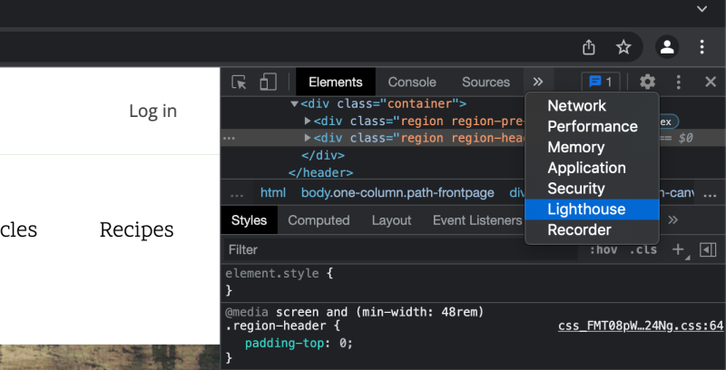
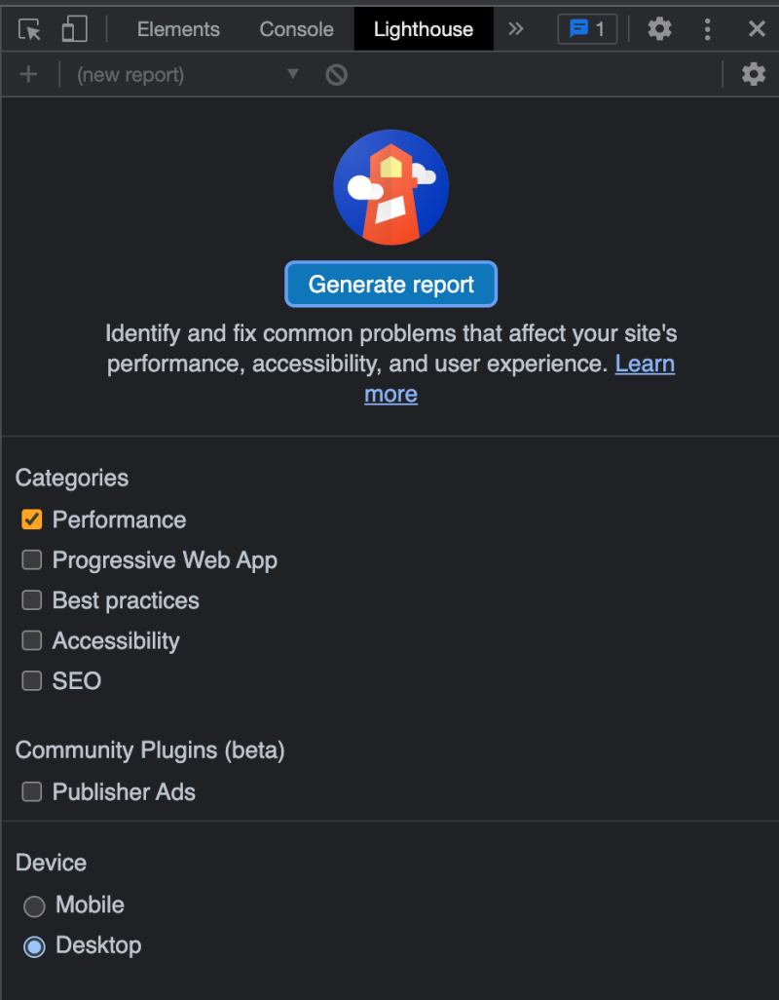
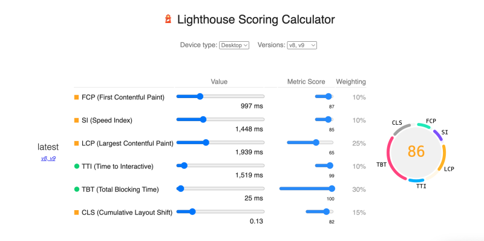

# Analyze Drupal Site Performance with Lighthouse

## Content

[Lighthouse](https://developer.chrome.com/docs/lighthouse/overview/) is an open source, automated tool for analyzing your site's performance. Lighthouse is built-in to the Google Chrome browser. When auditing a page, Lighthouse runs various tests against the page and then reports how well the page did across a broad spectrum of metrics. While Lighthouse doesn't improve the performance of a Drupal site itself, it helps to establish a performance profile and point towards areas that could be improved.

Lighthouse requires the use of Google Chrome. Other browsers include their own performance auditing tools. While the exact usage of each tool varies, the end result is the same: a report that can be interpreted to suggest where to focus your performance-tuning efforts.

In this tutorial, we'll:

- Learn how to run Lighthouse tests against a Drupal site
- Interpret the results of the report generated by Lighthouse
- Provide guidance on next steps to take to address the performance issues Lighthouse finds in our Drupal site

By the end of this tutorial you should be able to use Lighthouse to profile a Drupal site, interpret the results, and know where to start on making improvements.

## Goal

Test a Drupal site with Lighthouse, analyze the results of the test, and make recommendations on next steps.

## Prerequisites

- [Overview: Lighthouse](https://developer.chrome.com/docs/lighthouse/overview/) (developer.chrome.com)
- A Drupal site to test (use Drupal's Umami demo profile to follow along)

## Test a Drupal site with Lighthouse

You can perform the following steps on any site, but in this tutorial, we'll test Drupal's Umami demo installation profile with Lighthouse.

**Note:** The following steps must be performed in the Google Chrome browser.

### Run a Lighthouse test on the front page of your site

Lighthouse is part of the Google Chrome Developer Tools. You can either open Lighthouse through the *View* > *Developer* menu item or through the web inspector.

Navigate to the home page of your site in the Google Chrome browser. Open the Google Chrome Developer Tools menu. In the inspector panel, press *>>* to open the additional menu item and select the *Lighthouse* tab.

Image



Under *Categories*, select *Performance*. Under *Device*, select *Desktop*, and press the *Generate report* button.

Image



Lighthouse will run its tests and generate a report.

Image


Optionally, run the same tests for mobile devices after the desktop test completes. Under *Device*, select *Mobile*. The results of desktop and mobile performance may vary as mobile performance tests consider optimization for mobile devices and bandwidth.

### Review the test results

A Lighthouse report consists of the following sections:

- Performance score
- Metrics overview
- Opportunities
- Diagnostics

The performance score consists of a combination of weighted metrics. Only metrics contribute to your Lighthouse Performance score, not the results of opportunities or diagnostics. However, addressing opportunities and fixing problems found in the diagnostics section will influence other metrics, thus indirectly connecting to the overall performance score. Refer to the official [Lighthouse documentation](https://web.dev/performance-scoring) for more details about metric weights.

You can also explore metrics and their relationships using the [Performance calculator](https://googlechrome.github.io/lighthouse/scorecalc/). A calculator helps you understand what improvements will get you to the desired score and the percentage each metric needs to improve.

Image



### Understanding the Lighthouse metrics

Lighthouse measures 6 different metrics:

- **First Contentful Paint (FCP)**: The time at which the browser paints (displays) the first text or image
- **Speed Index**: How quickly the contents of a page are visibly populated
- **Largest Contentful Paint (LCP)**: The time at which the browser paints the largest chunk of text or image
- **Time to Interactive (TTI)**: the amount of time it takes for the page to become fully interactive
- **Total Blocking Time**: The sum of all periods between FCP and TTI when task length exceeded 50ms, expressed in milliseconds.
- **Cumulative Layout Shift**: The movement of visible elements within the viewport

These metrics and examples of each are well-documented at <https://web.dev/metrics/>.

Various factors can influence the metrics, including but not limited to how optimized your assets (images, JS, CSS, etc.) are, DOM structure, external scripts, libraries, and integrations on the page. Some factors are more obvious than others.

Factors like image optimization and server response time are pretty straightforward, while web fonts and font load time can be a critical and less obvious factor influencing the FCP metric. It’s also important to keep text visible at all times, even while any special fonts are still loading.

Another often-overlooked factor is JavaScript execution time. It’s important to minimize it whenever possible, since it may influence the speed index metric. To achieve the best performance results your JavaScript shouldn’t block rendering.

The cumulative layout shift metric influences the speed of the site, and the overall user experience. Abrupt, unexpected page jumps and changes in content positions often lead to users being disoriented and losing their flow. To avoid unexpected layout shifts, never insert content above rendered content except in response to user interactions; use transform animations instead of changes to margin, padding, width, and height; and reserve space for lazy-loaded images and videos using placeholders.

4 out of 6 metrics fell into the yellow zone for our example site and can benefit from improvements:

Image


Unless you need to improve a particular metric, we recommend focusing on improving the overall performance score. The report's opportunities and diagnostics sections help identify potential immediate next steps in this process.

### Understanding Lighthouse recommended opportunities

The opportunities section of the report contains suggested steps to take for speed savings alongside an estimated time savings in seconds.

Image


Expand the accordion for each option to access more in-depth instructions and implementation details.

The opportunities section is handy since, aside from general recommendations, it also outlines Drupal-specific optimization pathways when available.

In our case, the Umami demo site isn’t using the Responsive Images module for images in every block rendered on the front page. (The [Responsive Images module](https://drupalize.me/tutorial/responsive-image-module-overview) helps to deliver optimized images on desktop and mobile.) The theme also appears to have render-blocking assets. The opportunities section highlights resources and solutions that we can explore to mitigate these issues.

Image


Please note that even if you are using the Responsive Images module, the Lighthouse results still may show the need for optimization. The typical cause for it is that the original image wasn't optimized for the web, and rendered scaled versions of it are still on the edge of the acceptable size for the optimized web assets.

### Example: Set up responsive image styles

As an example of working through a Lighthouse *opportunities* recommendation we can configure our Drupal site to display responsive images.

After evaluating the *Recipes* blocks placed on the home page, we can see that the only image that doesn't use the responsive image style is a hero banner. To see if the image uses the responsive image style, check the “Manage display” configuration for the block or content entity to which this image belongs.

Let’s reconfigure the header banner to use a responsive image style. Currently, the header block uses a 7:3 image style that is not responsive. We’ll add a responsive equivalent and then use it.

Navigate to *Configuration* > *Media* > *Image Styles* and press *+ Add image style* button. We already have *7:3 Large* image style. Let’s add a *7:3 Medium* image style. Choose *Scale and crop* in the style dropdown and enter 720px for the width and 308px for the height. Save the style.

Image


.

Navigate to *Configuration* > *Media* > *Responsive Image Styles* and add a new style. Your settings might be something like in the screenshot.

Image


Save the image style and choose non-responsive image styles within the responsive image style.

Navigate to *Structure* > *Media* > *Image* and choose the 7:3 view mode. Change the image style for this view mode to be *Responsive 7:3* image style. Clear the cache. Now all images on the front page are rendered using a responsive image style.

Learn more about implementing responsive image styles in Drupal in [Create a Responsive Image Style for Viewport-Sizing](https://drupalize.me/tutorial/create-responsive-image-style-viewport-sizing).

### Use next-gen image formats

The Lighthouse recommendation is to convert all images to the WebP format. This may not be practical for all images. But it can be done in a few different ways. For example, images included in a theme can be saved as WebP format, while images uploaded by a user might be JPEG format and need to be converted.

The next-gen WebP image format is an image format introduced by Google with the aim of improving the size and performance of images on the web. WebP is a method of lossy and lossless compression that can be used on a large variety of images. The degree of lossy compression is adjustable so a user can choose a balance between file size and image quality.

WebP is natively supported by all modern browsers and can be safely used for projects that don't require Internet Explorer support. You'll want to serve WebP images only to clients that can display them properly, and fall back to legacy formats for clients that can't. WebP support can be detected by both the client and the server.

Drupal has contributed modules that support the WebP format. [WebP](https://www.drupal.org/project/webp) is one of the most popular ones and it integrates with the core Responsive Images module. WebP also integrates with the popular [Image API Optimize](https://www.drupal.org/project/imageapi_optimize) module which can help with optimizing other images formats as well. Prior to using the WebP module, you need to confirm that your hosting provider supports the WebP format.

### Eliminate render-blocking resources

In our case, one render-blocking resource is the OpenSans font that is loaded from Google. There are several ways to solve this problem. You can download the font from Google and use it locally, or preload the font resource.

Google doesn't recommend preloading the fonts since links to the font CSS can change. If the link changes while you are trying to preload it then the font will be broken. You can only preload an actual font file and not a stylesheet.

Since Umami is using a stylesheet approach from Google we will not preload the fonts. We can preconnect to the Google fonts server to facilitate the load of the font stylesheets.

For the purpose of this tutorial, we can do it inside the Umami theme located in *core/profiles/demo\_umami/theme/umami*. In the *templates/classy/layout/html.html.twig* add the following line: `<link rel='preconnect' href='https://fonts.gstatic.com' crossorigin>` above the CSS placeholder line: `<css-placeholder token="{{ placeholder_token }}">`.

Font optimization consists of the following factors: preloading, text rendering delay optimization, and caching. Specifics of font loading and implementation for your site might be different from the default Umami installation. For more ideas on web font optimization refer to [Optimize WebFont loading and rendering](https://web.dev/optimize-webfont-loading/) as a starting point.

### Understand Lighthouse diagnostics

The Diagnostics section contains the results of the audits. It has informative items and warnings that indirectly influence the final score. Resolving diagnostics warnings may help to improve the final score.

Image


Similar to the opportunities section, you can find additional details about the particular diagnostics entry inside each accordion. Each item may contain general or Drupal-specific recommendations.

In our case, the Umami demo didn’t have `width` and `height` attributes set on some images which contributes to the layout shift metric.

We can also improve the font rendering within the theme by ensuring that text stays visible during font loading by adding `&display=swap` to the end of external font URLs. In the root of the Umami theme locate the *umami.libraries.yml* file and update the OpenSans URL and the ScopeOne font URL. They may look something like below:

```
webfonts-open-sans:
  remote: https://fonts.google.com
  license:
    name: Apache License, Version 2.0
    url: http://www.apache.org/licenses/LICENSE-2.0
    gpl-compatible: false
  css:
    theme:
      'https://fonts.googleapis.com/css?family=Open+Sans:400,400i,700,700i&display=swap': { type: external, minified: true, attributes: { rel: preload, as: style } }

webfonts-scope-one:
  remote: https://fonts.google.com
  license:
    name: SIL Open Font License, Version 1.1
    url: http://scripts.sil.org/OFL_web
    gpl-compatible: false
  css:
    theme:
      'https://fonts.googleapis.com/css?family=Scope+One&display=swap': { type: external, minified: true }
```

### Retest and review results

After you make changes, it's a good idea to run the Lighthouse tests again and compare the results with the original test.

Image


As you can see, our score has improved. We also removed one of the warnings by adding the `swap` option to fonts.

Image


The image loading time also got slightly reduced compared to our original test.

Additional optimizations could be done by continuous optimization of the original images and refinement of image styles and sizes for the theme's specific breakpoints.

If this was a production project, replacing the fonts with locally hosted versions could also be an advantage.

## Recap

The Lighthouse tool built into Google Chrome allows you to run a series of diagnostic tests to evaluate a site's performance. The audit results include a performance score –- a weighted combination of 6 metrics -– and additional opportunities and diagnostics results.

Opportunities and diagnostics don’t directly influence the score but connect to the metrics and, in turn, indirectly improve the score. Resolving items in the opportunities section and diagnostics warnings might be a good start.

Unless your goal is to improve a specific metric, you should focus on the overall performance score.

## Further your understanding

- What ideas for optimizations can you think of when trying to improve each of the metrics?
- Check out [Advanced CSS/JS Aggregation module](https://www.drupal.org/project/advagg). Add it to your dev site, play with settings and run Lighthouse tests. See if it helps improve the score.

## Additional resources

- [Lighthouse documentation](https://developers.google.com/web/tools/lighthouse) (developers.google.com)
- [Optimize WebFont loading and rendering](https://web.dev/optimize-webfont-loading/) (web.dev)
- [FCP](https://web.dev/fcp/) (web.dev)
- [Time to Interactive](https://web.dev/interactive) (web.dev)
- [Speed Index](https://web.dev/speed-index) (web.dev)
- [Total Blocking Time](https://web.dev/lighthouse-total-blocking-time) (web.dev)
- [Cumulative Layout Shift](https://web.dev/cls) (web.dev)
- [Largest Contentful Paint](https://web.dev/lighthouse-largest-contentful-paint) (web.dev)

Was this helpful?

Yes

No

Any additional feedback?

Previous
[What Are Core Web Vitals?](/tutorial/what-are-core-web-vitals?p=3091)

Next
[Analyze Drupal Site Performance with WebPageTest](/tutorial/analyze-drupal-site-performance-webpagetest?p=3091)

Clear History

Ask Drupalize.Me AI

close