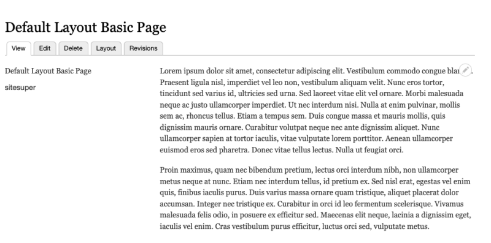

# Change the Layout on a Per-Page Basis

## Content

The Layout Builder module allows editors to create flexible layouts per content type, and per node. When configured to allow per-node layout customization, each node inherits the base layout for the content type. But editors can choose to further customize the layout on a node by node basis. This allows them to tailor the layout to better suit the specific node, and to have presentation flexibility that can be managed through Drupal's UI instead of in code. This also makes it harder to enforce design consistency, and future updates to the content type specific layout won't be applied to pages using a node specific layout.

In this tutorial we'll:

- Learn how to enable node-specific layouts
- Create a custom layout that is used on only one page

By the end of this tutorial you'll understand how to configure per-node-specific layouts.

## Goal

Create a new page that uses a different layout than the one configured for its content type.

## Prerequisites

- [Introduction to Layout Builder](https://drupalize.me/tutorial/introduction-layout-builder)
- [Create a Flexible Layout for a Content Type](https://drupalize.me/tutorial/create-flexible-layout-content-type)

## Drupal video tutorial: Layout Builder override layout per-page demo

Sprout Video

## Follow these steps

### Create a base layout for the content type

Start by following the steps in [Create a Flexible Layout for a Content Type](https://drupalize.me/tutorial/create-flexible-layout-content-type). This will result in the creation of a base, or default, layout for the content type.

### Modify the configuration to enable per-page overrides

Navigate to the *Manage display* tab of *Basic page* content type (*admin/structure/types/manage/page/display*).

Select the *Allow each content item to have its layout customized* checkbox and save the configuration. This allows editors to choose to override the default layout for the content type on a per-node basis.

Image

### Test the new layout

Let's test it out on our *Basic page* content type.

In the *Manage* administration menu navigate to *Content* > *Add content* > *Basic page* (*node/add/page*), then fill in the form with some content and select *Save*.

You should see a new Basic page using the default layout you created in step 1.

Image

### Modify the layout for a specific node

Our layout looks good. But let's imagine that some authors don't like to display their username. In this case they would like to hide the *Authored by* field from the display.

Because we enabled per-node layout customization earlier, we can achieve this by modifying the layout for a specific node.

Let's create a second node to test. After the node is saved note the *Layout* tab in the tabs menu for the node:

Image

Navigate to the *Layout* tab. You should see the Layout Builder interface, and a warning explaining that this is a *local* layout change versus a *global* one.

Image

### Remove *Authored by* from the node-specific layout

Remove the *Authored by* field from the layout of this particular node. Hover over the *Authored by* field block. From the contextual menu select *Remove block*, then in the new configuration pane select *Remove*. Once the block is removed, press *Save layout* at the top of the page.

The page should now render with the node specific layout, and no longer show the author's information.

Example:

Image

### Confirm that layout changes are local

To confirm that this change is local, and didn't affect our global layout, go back to the first node we created. You should see that the author is still present there.

## Recap

In this tutorial we created a 2-column layout for the Basic page content type to serve as the default for all new pages. Then we learned how to allow editors to modify layouts on a per-node basis.

## Further your understanding

- What do you expect to happen if you update the default layout used for the *Basic page* content type?
- What impact will this have on existing content?

## Additional resources

- [Layout Builder documentation](https://www.drupal.org/docs/8/core/modules/layout-builder) (Drupal.org)
- [Layout API](https://www.drupal.org/docs/drupal-apis/layout-api) (Drupal.org)

Was this helpful?

Yes

No

Any additional feedback?

Previous
[Create a Flexible Layout for a Content Type](/tutorial/create-flexible-layout-content-type?p=2653)

Next
[Limit Blocks Available in Layout Builder with Block List Override](/tutorial/limit-blocks-available-layout-builder-block-list-override?p=2653)

Clear History

Ask Drupalize.Me AI

close