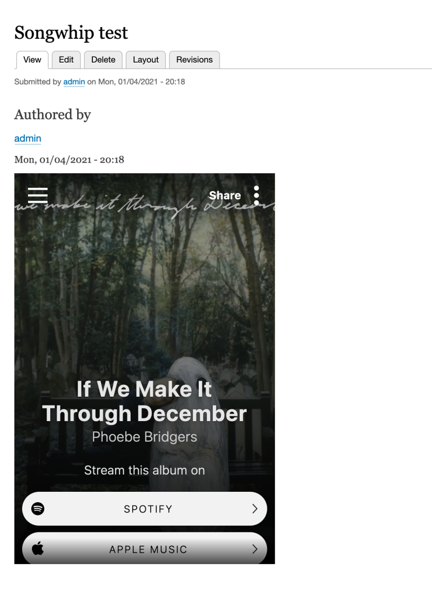

# Create a Custom Media Source Plugin

## Content

The Drupal Media Library and Media ecosystem can be integrated with any third-party media provider by defining new media source plugins. Media types (Media entity bundles) have an important distinction compared to other content entity types like nodes. Every media type inherits from a **specific media source plugin**. The source plugin provides domain-specific knowledge about the kind of resource being represented. For example, media types dealing with images know how to validate file extensions and render `` tags. Media types dealing with remotely hosted videos might know how to retrieve thumbnails from a remote API, and display an HTML video player and transcript.

In this tutorial we'll learn how to:

- Define a new source plugin
- Integrate a third-party API via its existing PHP library

By the end of this tutorial you should be able to create a new source plugin that exposes any third-party media resources you want to integrate with Drupal.

## Goal

Create a new media source plugin that integrates with Songwhip.com and allows for Songwhip assets to be added as Media entities in Drupal.

## Prerequisites

- [What Are Media Sources?](https://drupalize.me/tutorial/what-are-media-sources-drupal)
- [Implement a Plugin of Any Type](https://drupalize.me/tutorial/implement-plugin-any-type)

Writing a Media source plugin combines many of Drupal's module development fundamentals. There are many things you might need to handle including:

- Understand the [Plugin API](https://drupalize.me/tutorial/what-are-plugins), [PSR-4 class loading](https://drupalize.me/tutorial/plugin-discovery), and the [Entity](https://drupalize.me/tutorial/entity-api-overview) and [Field](https://drupalize.me/tutorial/field-api-overview) APIs
- [Define a new service](https://drupalize.me/videos/create-service) that provides the core logic for fetching a remote resource
- [Create a custom field formatter plugin](https://drupalize.me/tutorial/field-formatters) and use the [Render API](https://drupalize.me/tutorial/render-api-overview) to output embedded content
- [Use existing services](https://drupalize.me/tutorial/discover-and-use-existing-services) like the FileSystem API to download and resize images from a remote host
- [Use the Form API](https://drupalize.me/tutorial/form-api-overview) to provide a configuration form that allows an admin to enter an API key for a third party provider, or change the width/height of the embedded video player
- Create a form that will allow a content creator to add new media assets via the [Media Library UI](https://drupalize.me/tutorial/use-drupal-media-library-browse-media-entities)

## Does the source support oEmbed?

Before you start writing a custom source plugin, check to see if the source you want to use supports oEmbed. There's a list of providers that Drupal core supports here: <https://oembed.com/providers.json>. Only YouTube and Vimeo (see the core Remote Video source) are enabled by default. You can enable additional providers in a couple of different ways. Check out [Use Any oEmbed Provider as a Media Source](https://drupalize.me/tutorial/use-any-oembed-provider-media-source) to learn more.

## Is there an existing PHP SDK you can use?

If oEmbed isn't going to work for your use case, see if there's an existing PHP SDK for working with data from the source in question. If there is, we recommend pulling that library into your code, preferably via Composer, and then defining a new service that wraps around the existing library and exposes it to Drupal. This can often save you some work.

If there's not an existing PHP SDK, we can still implement a source plugin, but you might want to write a service that handles the heavy lifting of interacting with the third party API to help keep your code cleaner. Think of plugins (of any type, not just Media source plugins) as a layer of code that glues together your business logic (a service) and Drupal.

## Embed Songwhip pages to represent albums

For this example, we're going to create a new Media Source plugin that integrates with [Songwhip.com](http://songwhip.com). It's a service that can take the URL of an album copied from a streaming music service like Spotify or Apple Music and generate a page which will display the album's details and links to all the streaming services where that album is available. In a hypothetical music review site, this would allow content creators to add new albums (media entities) by copy/pasting the URL from whatever app they use, and readers can listen to them on their streaming provider of choice.

We'll display albums by rendering an `<iframe>` and embedding the relevant Songwhip content. We'll also make additional data from the Songwhip API available to use for [metadata mapping](https://drupalize.me/tutorial/how-add-fields-media-type-drupal).

Example of a Songwhip media entity attached to an Article node:

Image



The Songwhip.com API takes a URL for an album copied from a service like Spotify or Apple Music and returns details about the album, and links to that same album from other streaming music services. Here's an example API request:

```
curl --request POST --data '{"url":"https://open.spotify.com/album/4Lu520UvMf7lJccCnKw3hJ?si=lDMPv1M6S3-3Fq_iXAn73A"}' https://songwhip.com/
```

Example output:

```
{
  "type": "track",
  "id": 552131,
  "path": "polica/forget-me-now2020",
  "name": "Forget Me Now",
  "url": "https://songwhip.com/polica/forget-me-now2020",
  "sourceUrl": "https://open.spotify.com/track/46iRmAvLILt9VerrAgD0t7",
  "sourceCountry": "US",
  "releaseDate": "2020-01-31T00:00:00.000Z",
  "createdAt": "2020-12-30T04:04:30.913Z",
  "updatedAt": "2021-01-04T17:28:03.841Z",
  "refreshedAt": "2021-01-04T17:28:03.841Z",
  "image": "https://is4-ssl.mzstatic.com/image/thumb/Music113/v4/0c/f1/41/0cf141b6-373d-28b8-170f-958176561a8a/5056340100257.jpg/1000x1000bb.jpeg",
  "config": null,
  "links": {
    "tidal": true,
    "amazon": true,
    snip ...
  },
  "linksCountries": [
    "US"
  ],
  "artists": [
    {
      "type": "artist",
      "id": 139457,
      "path": "polica",
      "name": "POLIÇA",
      "sourceUrl": "http://soundcloud.com/polica?id=7101962",
      "sourceCountry": "BY",
      "url": "/polica",
      "image": "https://i.scdn.co/image/0df64ee66657f8944fe0d4e28bc833d155d576c8",
      "createdAt": "2017-11-09T09:39:37.465Z",
      "updatedAt": "2021-01-04T17:28:03.808Z",
      "refreshedAt": "2020-06-25T08:18:01.998Z",
      "linksCountries": [
        "BY",
        "US"
      ],
      "links": {
        "tidal": [
          {
            "link": "https://listen.tidal.com/artist/4321766",
            "countries": [
              "US"
            ]
          }
        ],
        "amazon": [
          {
            "link": "https://amazon.com/dp/B006G4M5T8?tag=songwhip0eb-20",
            "countries": [
              "US"
            ]
          }
        ],
        snip ...
      },
      "description": "WHEN WE STAY ALIVE:  https://smarturl.it/whenwestayalive\nTOUR: https://www.thisispolica.com/live",
      "serviceIds": {
        "tidal": "4321766",
        "amazon": "B006G4M5T8",
        snip ...
      },
      "config": null,
      "overrides": null
    }
  ],
  "overrides": null
}
```

### Put code in a module

The code that you write needs to live in a module. Either create a new one, or add to an existing one. For this example we're adding to a module named `media_source_examples`.

[Complete source code can be found in this example GitHub repo](https://github.com/DrupalizeMe/demo-media-8x).

### Define a service that interacts with Songwhip

To integrate with Songwhip we'll use the `eojthebrave/songwhip-php` Composer package that was created as a demonstration for this tutorial. This demonstrates a common scenario where your third party media provider has an existing PHP SDK you want to use as the basis for integration.

It can be installed using Composer:

```
composer require eojthebrave/songwhip-php
```

To make this work better with Drupal, we'll define a new service that serves as a wrapper around the songwhip-php code, exposing its feature set to Drupal, and allowing us to also integrate with Drupal's cache API to improve performance.

Create a *media\_source\_examples.services.yml* file with the following content:

```
services:
  media_source_examples.songwhip_fetcher:
    class: \Drupal\media_source_examples\SongwhipFetcher
    arguments:
      - '@cache.songwhip'
      - '@media_source_examples.songwhip_api_client'

  media_source_examples.songwhip_api_client:
    class: \Songwhip\Client
    arguments: ['@http_client']

  cache.songwhip:
    class: Drupal\Core\Cache\CacheBackendInterface
    tags:
      - { name: cache.bin }
    factory: cache_factory:get
    arguments:
      - songwhip
```

This defines 3 new services for the dependency injection container -- the custom one we'll use in our plugin to interact with Songwhip, and 2 additional ones that are passed as arguments to our custom service:

- `media_source_examples.songwhip_fetcher` is our new custom service, and we'll need to write the code to define the `\Drupal\media_source_examples\SongwhipFetcher` class. When we do so it'll have 2 additional services injected into the constructor, both of which we define in this file.
- `media_source_examples.songwhip_api_client` exposes the `\Songwhip\Client` class from the songwhip-php library to Drupal's service container and ensures it gets a copy of the Guzzle service passed to its constructor. This is a nice way to keep our custom service's code testable since we can inject the third party library (instead of doing something like `$client = new \Songwhip\Client()` in our code) and works because Drupal already has a service defined for Guzzle.
- `cache.songwhip` uses the Cache API factory to create a service that implements the `CacheBackendInterface` for a custom cache bin, keeping our cached data separate from that of other code.

**Pro-tip:** If there isn't an existing SDK for the service you want to integrate, we still recommend defining a new service and keeping the business logic out of the plugin implementation. This will make your code easier to maintain, test, and re-use. Even better, make a PHP library that'll work independently of Drupal and include it like in this example.

### Define the `SongwhipFetcher` service

Next, write the code for the `SongwhipFetcher` service. Add the file *media\_source\_examples/src/SongwhipFetcher.php* with the following content:

```
<?php

namespace Drupal\media_source_examples;

use Drupal\Component\Serialization\Json;
use Drupal\Core\Cache\CacheBackendInterface;
use Songwhip\Client;

/**
 * Fetch, and cache, data from the Songwhip API.
 */
class SongwhipFetcher {

  /**
   * Cache backend.
   *
   * @var \Drupal\Core\Cache\CacheBackendInterface
   */
  protected $cache;

  /**
   * Songwhip API client.
   *
   * @var \Songwhip\Client
   */
  protected $songwhipClient;

  /**
   * Constructs a SongwhipClient object.
   *
   * @param \Drupal\Core\Cache\CacheBackendInterface $cache
   *   A cache bin for storing fetched API responses.
   */
  public function __construct(CacheBackendInterface $cache, Client $songwhip_client) {
    $this->cache = $cache;
    $this->songwhipClient = $songwhip_client;
  }

  /**
   * Retrieve songwhip response for a streaming service URL.
   *
   * @param string $url
   *   Streaming service URL to look up via Songwhip.
   *
   * @return false|object
   *   A generic object containing the decoded JSON response, or false.
   *
   * @throws \Exception
   */
  public function fetch($url) {
    if ($this->cache && $cached_response = $this->cache->get($url)) {
      return $cached_response->data;
    }

    // Query Songwhip's API.
    $response = $this->songwhipClient->getFromServiceUrl($url);

    if (empty($response)) {
      throw new \Exception("Could not retrieve response for $url.");
    }

    // Cache the response for future use.
    if ($this->cache) {
      // Data doesn't change often, but it could, so the response should expire
      // from the cache on its own in 7 days.
      $this->cache->set($url, $response, time() + (86400 * 7));
    }

    return $response;
  }

}
```

The constructor for this class receives both the Cache API and Songwhip Client services we defined as arguments. These are already configured and ready to use thanks to the service container. The `fetch()` method is a wrapper around the `\Songwhip\Client::getFromServiceUrl()` method that also handles caching responses. Other code in our Drupal project can make use of this service to retrieve a response (like the example above) from the Songwhip API.

Example:

```
$response = \Drupal::service('media_source_examples.songwhip_fetcher')->fetch($url);
```

### Define a new Songwhip media source plugin

Next, we define a custom media source plugin. Add the file *media\_source\_examples/src/Plugin/media/Source/Songwhip.php* with the following content:

```
<?php

namespace Drupal\media_source_examples\Plugin\media\Source;

use Drupal\Component\Utility\Crypt;
use Drupal\Core\Config\ConfigFactoryInterface;
use Drupal\Core\Form\FormStateInterface;
use Drupal\Core\Entity\Display\EntityViewDisplayInterface;
use Drupal\Core\Entity\EntityFieldManagerInterface;
use Drupal\Core\Entity\EntityTypeManagerInterface;
use Drupal\Core\Field\FieldTypePluginManagerInterface;
use Drupal\Core\File\Exception\FileException;
use Drupal\Core\File\FileSystemInterface;
use Drupal\media\Attribute\MediaSource;
use Drupal\media\MediaInterface;
use Drupal\media\MediaSourceBase;
use Drupal\media\MediaTypeInterface;
use Drupal\media_source_examples\SongwhipFetcher;
use Drupal\media_source_examples\Form\SongwhipMediaLibraryAddForm
use Drupal\Core\StringTranslation\TranslatableMarkup;
use GuzzleHttp\ClientInterface;
use GuzzleHttp\Exception\RequestException;
use Psr\Log\LoggerInterface;
use Symfony\Component\DependencyInjection\ContainerInterface;

/**
 * You can find possible values to use in the providers object in the list
 * here https://oembed.com/providers.json.
 */
#[MediaSource(
  id: "songwhip",
  label: new TranslatableMarkup("Songwhip"),
  description: new TranslatableMarkup("Embed Songwhip content."),
  allowed_field_types: ["string"],
  default_thumbnail_filename: "no-thumbnail.png",
  forms: [
    "media_library_add" => SongwhipMediaLibraryAddForm::class
  ]
)]
class Songwhip extends MediaSourceBase {

  /**
   * Key for "Name" metadata attribute.
   *
   * @var string
   */
  const METADATA_ATTRIBUTE_NAME = 'name';

  /**
   * Key for "URL" metadata attribute.
   *
   * @var string
   */
  const METADATA_ATTRIBUTE_URL = 'url';

  /**
   * Key for "Image" metadata attribute.
   *
   * @var string
   */
  const METADATA_ATTRIBUTE_IMAGE = 'image';

  /**
   * Key for "releaseDate" metadata attribute.
   *
   * @var string
   */
  const METADATA_ATTRIBUTE_RELEASE_DATE = 'releaseDate';

  /**
   * Key for "type" metadata attribute.
   *
   * Example values, 'artist', 'album', etc.
   *
   * @var string
   */
  const METADATA_ATTRIBUTE_TYPE = 'type';

  /**
   * API client for Songwhip service.
   *
   * @var \Drupal\media_source_examples\SongwhipFetcher
   */
  protected $songwhipFetcher;

  /**
   * The file system.
   *
   * @var \Drupal\Core\File\FileSystemInterface
   */
  protected $fileSystem;

  /**
   * The HTTP client.
   *
   * @var \GuzzleHttp\Client
   */
  protected $httpClient;

  /**
   * The logger channel for media.
   *
   * @var \Psr\Log\LoggerInterface
   */
  protected $logger;

  public function __construct(array $configuration, $plugin_id, $plugin_definition, EntityTypeManagerInterface $entity_type_manager, EntityFieldManagerInterface $entity_field_manager, FieldTypePluginManagerInterface $field_type_manager, ConfigFactoryInterface $config_factory, SongwhipFetcher $songwhip_fetcher, ClientInterface $http_client, FileSystemInterface $file_system, LoggerInterface $logger) {
    parent::__construct($configuration, $plugin_id, $plugin_definition, $entity_type_manager, $entity_field_manager, $field_type_manager, $config_factory);

    $this->songwhipFetcher = $songwhip_fetcher;
    $this->fileSystem = $file_system;
    $this->httpClient = $http_client;
    $this->logger = $logger;
  }

  /**
   * {@inheritdoc}
   */
  public static function create(ContainerInterface $container, array $configuration, $plugin_id, $plugin_definition) {
    return new static(
      $configuration,
      $plugin_id,
      $plugin_definition,
      $container->get('entity_type.manager'),
      $container->get('entity_field.manager'),
      $container->get('plugin.manager.field.field_type'),
      $container->get('config.factory'),
      $container->get('media_source_examples.songwhip_fetcher'),
      $container->get('http_client'),
      $container->get('file_system'),
      $container->get('logger.factory')->get('media')
    );
  }

  /**
   * {@inheritdoc}
   */
  public function defaultConfiguration() {
    return [
        'thumbnails_directory' => 'public://songwhip_thumbnails',
        'height' => '',
        'width' => '',
        'generate_thumbnails' => TRUE,
      ] + parent::defaultConfiguration();
  }

  /**
   * {@inheritdoc}
   */
  public function getMetadataAttributes() {
    return [
      static::METADATA_ATTRIBUTE_NAME => $this->t('Name'),
      static::METADATA_ATTRIBUTE_RELEASE_DATE => $this->t('Release date'),
      static::METADATA_ATTRIBUTE_TYPE => $this->t('Media type'),
      static::METADATA_ATTRIBUTE_IMAGE => $this->t('Image'),
    ];
  }

  /**
   * {@inheritdoc}
   */
  public function getMetadata(MediaInterface $media, $attribute_name) {
    $media_url = $this->getSourceFieldValue($media);
    // The URL may be NULL if the source field is empty, in which case just
    // return NULL.
    if (empty($media_url)) {
      return NULL;
    }

    $data = $this->songwhipFetcher->fetch($media_url);
    if (!$data) {
      return NULL;
    }

    switch ($attribute_name) {
      case 'default_name':
      case static::METADATA_ATTRIBUTE_NAME:
        return $data->{static::METADATA_ATTRIBUTE_NAME};

      case static::METADATA_ATTRIBUTE_URL:
        return $data->{static::METADATA_ATTRIBUTE_URL};

      case 'thumbnail_uri':
        return $this->getLocalThumbnailUri($data);

      case static::METADATA_ATTRIBUTE_IMAGE:
        return $data->{static::METADATA_ATTRIBUTE_IMAGE};

      case static::METADATA_ATTRIBUTE_RELEASE_DATE:
        return $data->{static::METADATA_ATTRIBUTE_RELEASE_DATE};

      case static::METADATA_ATTRIBUTE_TYPE:
        return $data->{static::METADATA_ATTRIBUTE_TYPE};

      default:
        return parent::getMetadata($media, $attribute_name);
    }
  }

  /**
   * {@inheritdoc}
   */
  public function buildConfigurationForm(array $form, FormStateInterface $form_state) {
    $form = parent::buildConfigurationForm($form, $form_state);
    $form['generate_thumbnails'] = [
      '#type' => 'checkbox',
      '#title' => $this->t('Generate thumbnails'),
      '#default_value' => $this->configuration['generate_thumbnails'],
      '#description' => $this->t('If checked, Drupal will automatically generate thumbnails from Songwhip provided images.'),
    ];
    return $form;
  }

  /**
   * {@inheritdoc}
   */
  public function validateConfigurationForm(array &$form, FormStateInterface $form_state) {
    // @todo: Include custom validation logic for the form fields added above.
  }

  /**
   * {@inheritdoc}
   */
  public function prepareViewDisplay(MediaTypeInterface $type, EntityViewDisplayInterface $display) {
    $display->setComponent($this->getSourceFieldDefinition($type)->getName(), [
      'type' => 'media_source_examples_songwhip_embed',
      'label' => 'visually_hidden',
    ]);
  }

  /**
   * Retrieve a thumbnail for a Songwhip resource.
   *
   * Uses the 'image' referenced in the Songwhip response and copies it to the
   * local filesystem if possible. This is a fairly basic implementation for
   * demonstration purposes and could be expanded to include resizing etc.
   *
   * @param object $data
   *   Data returned from Songwhip API.
   *
   * @return string|null
   *   Either the URL of a local thumbnail, or NULL.
   */
  protected function getLocalThumbnailUri($data) {
    // If there is no remote thumbnail, there's nothing for us to fetch here.
    $remote_thumbnail_url = $data->{self::METADATA_ATTRIBUTE_IMAGE};
    if (!$remote_thumbnail_url) {
      return NULL;
    }

    // Compute the local thumbnail URI, regardless of whether it exists.
    $directory = $this->configuration['thumbnails_directory'];
    $local_thumbnail_uri = "$directory/" . Crypt::hashBase64($remote_thumbnail_url) . '.' . pathinfo($remote_thumbnail_url, PATHINFO_EXTENSION);
    // This assumes they are all JPEG. Is that safe?
    $local_thumbnail_uri .= '.jpg';

    // If the local thumbnail already exists, return its URI.
    if (file_exists($local_thumbnail_uri)) {
      return $local_thumbnail_uri;
    }

    // The local thumbnail doesn't exist yet, so try to download it. First,
    // ensure that the destination directory is writable, and if it's not,
    // log an error and bail out.
    if (!$this->fileSystem->prepareDirectory($directory, FileSystemInterface::CREATE_DIRECTORY | FileSystemInterface::MODIFY_PERMISSIONS)) {
      $this->logger->warning('Could not prepare thumbnail destination directory @dir for oEmbed media.', [
        '@dir' => $directory,
      ]);
      return NULL;
    }

    try {
      $response = $this->httpClient->get($remote_thumbnail_url);
      if ($response->getStatusCode() === 200) {
        $this->fileSystem->saveData((string) $response->getBody(), $local_thumbnail_uri, FileSystemInterface::EXISTS_REPLACE);
        return $local_thumbnail_uri;
      }
    }
    catch (RequestException $e) {
      $this->logger->warning($e->getMessage());
    }
    catch (FileException $e) {
      $this->logger->warning('Could not download remote thumbnail from {url}.', [
        'url' => $remote_thumbnail_url,
      ]);
    }
    return NULL;
  }
}
```

Here are the important parts -- not all of this is required for every media source plugin, but we've tried to illustrate common use cases:

- MediaSource plugins live in the `Drupal\{module}\Plugin\media\Source` namespace, and use `\Drupal\media\Attribute\MediaSource` attributes. They implement the `\Drupal\media\MediaSourceInterface` interface, and in our case we're extending the `\Drupal\media\MediaSourceBase` base class.
- We defined constants like `const METADATA_ATTRIBUTE_URL = 'url';` which contain the names of the fields in the Songwhip API response that we're going to use. This isn't required, but it does make our code easier to maintain in the future if any of these field names change in the response data.
- We use dependency injection via the `create()` method so that when our custom plugin gets instantiated the services we need are injected into the constructor. These include the `SongwhipFetcher` defined earlier, the HTTP service, and the FileSystem service, which we'll use to cache images locally. Also, a logger we can use to log any error messages.
- The `getMetadataAttributes()` method returns an associative array with keys that are the names of the fields we'll expose for data mapping to and Media Entity types associated with this source plugin. The keys are the machine-readable names, the values of the human-readable names used in the UI. The machine name can be anything, but we keep them the same as the field names in the response. See the example above for an idea of what these contain.
- The `getMetadata()` method is called whenever something needs to retrieve the value of one of the fields we defined above. Here we use the `SongwhipFetcher` service to retrieve data from the Songwhip API, and return the data that was requested. In some cases with a bit of additional processing. Note that this method is only called when a media entity is created or updated. The data it returns is generally used to populate a field on the Media entity. There are two additional attributes here `thumbnail_url` and `default_name` that we did not define in `getMetadataAttributes()`. These are used internally by the Media API, and it's assumed they'll be present for any media source. The thumbnail is used by things like the Media Library browser, and the `default_name` is used to autofill the Media entity's label field in some cases.
- The `buildConfigurationForm()`, `validateConfigurationForm()`, and `defaultConfiguration()` methods are how we make the plugin configurable. Whenever a new media type is created that uses the Songwhip source plugin the `generate_thumbnail` form field will be shown on the bundle configuration form allowing an administrator to set them. If no values are set the provided defaults will be used. All of these values will be available as `$this->configuration` from within the plugin. Use this for configuration related to accessing the source media like API credentials. Display related configuration should be part of the field formatter which we'll add later.
- In the `prepareViewDisplay()` method we define what we want someone to see when a Songwhip media asset is displayed. Remember, all media types are required to have a *source field* which contains the unique value used to correlate a media entity to some remote resource -- a streaming service URL in this case. The source field is created automatically when the media type is created. In our PHP attribute we said it should be a "string", but we are otherwise letting the `MediaSourceBase::createSourceField()` code handle it for us. Here, we're saying that we want this *source field* to use the `media_source_examples_songwhip_embed` field formatter (which we need to define). It's the programmatic equivalent of going to the *Manage display* tab and changing the field display formatter settings.
- Finally, the `getLocalThumbnailUri()` method copies images found in the Songwhip response to the local filesystem. Currently, the Media API only works with local thumbnail files.
- Also, note the `"media_library_add" = "\Drupal\media_source_examples\Form\SongwhipMediaLibraryAddForm",` line in the attribute. This points to a class which will be responsible for creating the form that a content author will see when attempting to add a new Songwhip media asset via the UI in the Media Library browser. Without it there will be no option to add new media directly from the Media Library.

### Define `SongwhipMediaLibraryAddForm`

Remember this line `"media_library_add" => SongwhipMediaLibraryAddForm::class` in our plugin attribute? We need to define that class. Create the file *media\_source\_examples/src/Form/SongwhipMediaLibraryAddForm.php* with the following content:

```
<?php

namespace Drupal\media_source_examples\Form;

use Drupal\Core\Form\FormBuilderInterface;
use Drupal\Core\Form\FormStateInterface;
use Drupal\Core\Url;
use Drupal\media\MediaTypeInterface;
use Drupal\media_library\Form\AddFormBase;

/**
 * Creates a form to create Twitter media entities from within Media Library.
 */
class SongwhipMediaLibraryAddForm extends AddFormBase {

  /**
   * {@inheritdoc}
   */
  public function getFormId() {
    return 'media_source_examples_songwhip_media_library_add';
  }

  /**
   * {@inheritdoc}
   */
  protected function buildInputElement(array $form, FormStateInterface $form_state) {
    $media_type = $this->getMediaType($form_state);

    $form['container'] = [
      '#type' => 'container',
      '#title' => $this->t('Add @type', [
        '@type' => $media_type->label(),
      ]),
    ];

    $form['container']['url'] = [
      '#type' => 'url',
      '#title' => $this->getSourceFieldDefinition($media_type)->getLabel(),
      '#description' => $this->getSourceFieldDefinition($media_type)->getDescription(),
      '#required' => TRUE,
      '#attributes' => [
        'placeholder' => 'https://example.com ...',
      ],
    ];

    $form['container']['submit'] = [
      '#type' => 'submit',
      '#value' => $this->t('Add'),
      '#button_type' => 'primary',
      '#submit' => ['::addButtonSubmit'],
      '#ajax' => [
        'callback' => '::updateFormCallback',
        'wrapper' => 'media-library-wrapper',
        // Add a fixed URL to post the form since AJAX forms are automatically
        // posted to <current> instead of $form['#action'].
        // @todo Remove when https://www.drupal.org/project/drupal/issues/2504115
        // is fixed.
        // Follow along with changes in \Drupal\media_library\Form\OEmbedForm.
        'url' => Url::fromRoute('media_library.ui'),
        'options' => [
          'query' => $this->getMediaLibraryState($form_state)->all() + [
              FormBuilderInterface::AJAX_FORM_REQUEST => TRUE,
            ],
        ],
      ],
    ];

    return $form;
  }

  /**
   * Submit handler for the add button.
   *
   * @param array $form
   *   The form render array.
   * @param \Drupal\Core\Form\FormStateInterface $form_state
   *   The form state.
   */
  public function addButtonSubmit(array $form, FormStateInterface $form_state) {
    $this->processInputValues([$form_state->getValue('url')], $form, $form_state);
  }

  /**
   * Returns the definition of the source field for a media type.
   *
   * @param \Drupal\media\MediaTypeInterface $media_type
   *   The media type to get the source definition for.
   *
   * @return \Drupal\Core\Field\FieldDefinitionInterface|null
   *   The field definition.
   */
  protected function getSourceFieldDefinition(MediaTypeInterface $media_type) {
    return $media_type->getSource()->getSourceFieldDefinition($media_type);
  }

}
```

This code is mostly boilerplate; it displays the form for adding a new Songwhip media entity from within the Media Library's browser. The key is that it extends `Drupal\media_library\Form\AddFormBase` which does the heavy lifting. Then it adds a field that someone can paste a URL into. Calling `$this->processInputValues` does the work of creating a new media entity from the source field value.

Example:

<drupal-media data-entity-type="media" data-entity-uuid="1bbf4587-4c78-4074-a25f-272c78aca31b" alt="Screenshot highlighting a form with a single textfield labeled "Songwhip" inside the Media Library's modal browser window.">

### Create a FieldFormatter plugin

When a Songwhip media entity is displayed, like in the example above where it's attached to an Article node, we want to render an `<iframe>` that embeds the relevant Songwhip page. In `\Drupal\media_source_examples\Plugin\media\Source\Songwhip::prepareViewDisplay` we set the field formatter for the Songwhip source plugin's *source field* to `"media_source_examples_songwhip_embed"`. But that field formatter doesn't exist, so we need to create it and output the `<iframe>`. Create the file *media\_source\_examples/src/Plugin/FieldFormatter/SongwhipEmbedFormatter.php* with the following content:

```
<?php

namespace Drupal\media_source_examples\Plugin\Field\FieldFormatter;

use Drupal\Core\Field\Attribute\FieldFormatter;
use Drupal\Core\Field\FieldDefinitionInterface;
use Drupal\Core\Field\FieldItemListInterface;
use Drupal\Core\Field\FormatterBase;
use Drupal\Core\StringTranslation\TranslatableMarkup;
use Drupal\media\Entity\MediaType;
use Drupal\media_source_examples\Plugin\media\Source\Songwhip;

/**
 * Plugin implementation of the 'Songwhip embed' formatter.
 */
#[FieldFormatter(
  id: 'media_source_examples_songwhip_embed',
  label: new TranslatableMarkup('Songwhip embed'),
  field_types: [
    'string',
  ],
)]
class SongwhipEmbedFormatter extends FormatterBase {

  /**
   * {@inheritdoc}
   */
  public function viewElements(FieldItemListInterface $items, $langcode) {
    $element = [];

    $media = $items->getEntity();
    $songwhip = $media->getSource();
    foreach ($items as $delta => $item) {
      $url = $songwhip->getMetadata($media, Songwhip::METADATA_ATTRIBUTE_URL);
      if ($url) {
        $element[$delta] = [
          '#type' => 'html_tag',
          '#tag' => 'iframe',
          '#attributes' => [
            'src' => $url,
            'frameborder' => 0,
            'allowtransparency' => TRUE,
            // @todo width and height should be configurable.
            'height' => '600px',
            'width' => '400px',
            'class' => ['media-oembed-content'],
          ],
        ];
      }
      else {
        $element[$delta] = [
          '#markup' => $item->value,
        ];
      }
    }

    return $element;
  }

  /**
   * {@inheritdoc}
   */
  public static function isApplicable(FieldDefinitionInterface $field_definition) {
    if ($field_definition->getTargetEntityTypeId() !== 'media') {
      return FALSE;
    }

    if (parent::isApplicable($field_definition)) {
      $media_type = $field_definition->getTargetBundle();

      if ($media_type) {
        $media_type = MediaType::load($media_type);
        return $media_type && $media_type->getSource() instanceof Songwhip;
      }
    }
    return FALSE;
  }
}
```

This is a standard [FieldFormatter plugin](https://drupalize.me/tutorial/field-formatters) with a couple of tweaks:

- Make sure the `field_types` in the attribute match, or at least include, the `allowed_field_types` in the attribute for the Songwhip source plugin.
- When the field is rendered we use the source plugin to figure out the URL to use in the `<iframe>` via `$url = $songwhip->getMetadata($media, Songwhip::METADATA_ATTRIBUTE_URL);`. And then output an `<iframe>` tag.
- The `isApplicable()` method limits this field formatter to being used only on "text" fields that are attached to Media Entities that are of a Media Type using the Songwhip source plugin. Effectively, this formatter won't be available to use on any fields other than the *source field* of our Songwhip based media entities.

There are some additional things we could do, like making the width/height of the `<iframe>` configurable. Or we could add more of the data from the Songwhip API response to the list in `\Drupal\media_source_examples\Plugin\media\Source\Songwhip::getMetadataAttributes`. But this should serve as a fairly comprehensive example of creating a custom media source plugin. It will allow the Media system to integrate with any third party provider.

To test it all out, create a new media type that uses the new Songwhip media source plugin as its source.

## Recap

In this tutorial, we walked through the process of creating a custom media source plugin in order to integrate a third party media provider with the Drupal Media ecosystem. There is a fair amount of code involved since we need to communicate with a third party API via a service, define a new media source plugin, provide a way for content authors to create new media entities via the Media Library, and create a field formatter for displaying the provided media assets. However, by doing it this way we can take full advantage of the Media Library, Views, Layout Builder, and all the other Drupal systems that know how to work with Media entities.

## Further your understanding

- Can you think of an instance when you would need to write a custom media source plugin? List all the parts that would be required to make this specific integration work.
- Modify the code above so that more of the data attained from the Songwhip API response is exposed.
- How does this custom source plugin compare to the oEmbed plugin in core?

## Additional resources

- [Songwhip.com](https://songwhip.com)
- [Media Entity Twitter](https://www.drupal.org/project/media_entity_twitter) module contains some good example code (Drupal.org)

Was this helpful?

Yes

No

Any additional feedback?

Previous
[Use Any oEmbed Provider as a Media Source](/tutorial/use-any-oembed-provider-media-source?p=3274)

Clear History

Ask Drupalize.Me AI

close