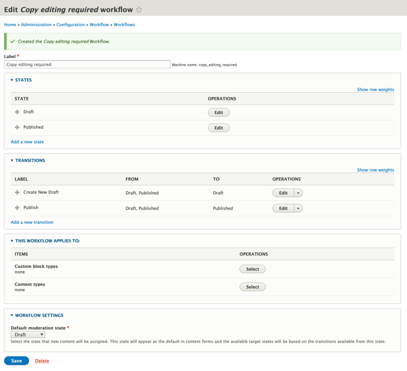
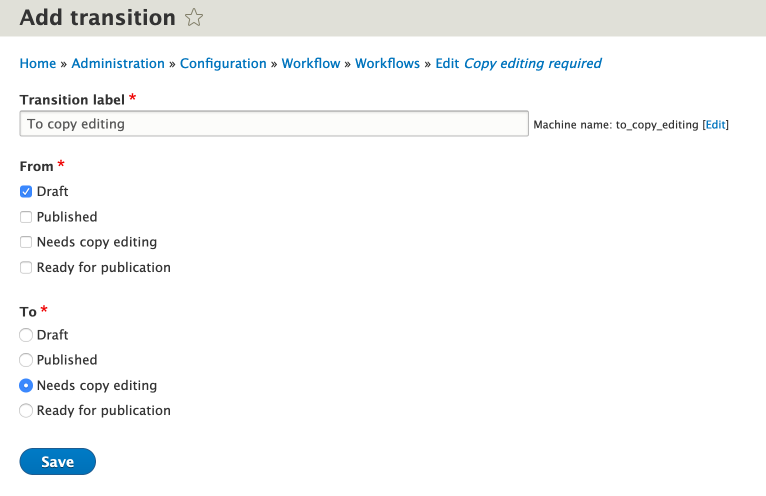

# Create a Custom Workflow

## Content

The real power of the Workflows module is the fact that you can define your own custom workflows. Creating a new custom workflow requires adding a new workflow, and configuring the states and transitions that workflow will use.

In this tutorial we'll:

- Create and configure a new workflow
- Define and configure a set of states and transitions for the workflow
- Understand some best practices to keep in mind when defining workflows

By the end of this tutorial you'll be able to define your own custom workflows for any use-case.

## Goal

Define a new workflow named "Copy editing required" that defines multiple states and transitions that implement an editorial flow where all changes to content are required to go through a copy editing phase before they can be published.

## Prerequisites

- [Overview of Workflows and Content Moderation](https://drupalize.me/tutorial/overview-workflows-and-content-moderation)
- [Plan An Editorial Workflow](https://drupalize.me/tutorial/plan-editorial-workflow)

## Video walk-through

Sprout Video

## Start with a plan

In [Plan An Editorial Workflow](https://drupalize.me/tutorial/plan-editorial-workflow) we sketched out a plan for an editorial workflow that requires changes to content to go through a couple of different review states before it can be published. You can refer to that tutorial for the complete set of states and transitions we'll use in this workflow.

## Add a new workflow

Start by enabling the *Workflows* and *Content Moderation* modules if they are not already enabled.

[Learn more about enabling modules](https://drupalize.me/tutorial/user-guide/config-install?p=3069).

### Add a workflow

To add a new workflow, in the Manage administration menu navigate to *Configuration* > *Workflows* (*admin/config/workflow/workflows*) and then click the button labeled *Add workflow*.

#### Fill in the form

Fill in the form on the resulting page. In the *Label* field add a descriptive name for your workflow.

Choose a *Workflow type* from the select list. Workflow types are provided by modules like Content Moderation and dictate how the particular workflow will be used. Different workflow types will have additional settings added to the workflow configuration form for their specific use case.

Click the *Save* button.

### Review the defaults

Image

After the workflow is created you should see a success message, and a page with options for editing the new workflow.

When you create a new workflow it also adds two states automatically: *Draft*, and *Published*. And two new transitions: *Create New Draft*, and *Publish*.

The settings in the section, **This workflow applies to:**, are present because we chose a Workflow type of Content Moderation.

## Editing and deleting states

We're going to make use of both the *Draft* and *Published* states, but if your use case doesn't need them you can delete them by first deleting any transitions that make use of them, and then using the *Delete* button in the *Operations* column of the table.

You can also rename them, or edit any existing state, by clicking the *Edit* button in the *Operations* column for the state you want to make changes to.

## Add a new state

### Choose add a new state

To add a new state click the *Add a new state* link under the list of existing states.

### Fill out the form

Image

Fill in the *State label* field with the name you would like to give your state. This is what content administrators will see in the options list when choosing a state. For example, fill in the field with the value "Needs copy editing".

There are two optional checkboxes: *Published* and *Default revision*, that affect whether a content item in this state is visible to the public.

A state with the *Published* option selected updates the core publishing status of the content item to published whenever it is in this state. Otherwise, it is updated to unpublished.

A state with the *Default revision* option selected updates the entity revision in question to be the default entity loaded whenever it is in this state. This is how the system knows which revision to display at the canonical route for the entity, or when listing entities in a View, etc.

### Save the new state

Click the button labeled *Save* to save the new state. Once the new state is saved you'll be redirected to the workflow configuration form. You should see a message indicating the operation was successful, and the new state should be listed at the bottom of the table listing all the states for the workflow.

Image

Repeat the process above to add the remaining states from your plan.

## Adding transitions

Choose a name that clearly defines what the transition does. Use verbs, and indicate which state you're starting at and which you're going to. For example, "Restore to Draft" is a better transition name than "Restore" as it clearly indicates what's going to happen.

### Choose add a new transition

On the configuration page for the workflow you want to add a transition to, click the *Add a new transition* link below the list of existing transitions.

### Configure the new transition

Image

### Success

When the transition is added you'll be redirected back to the workflow configuration page. You should see a success message at the top of the page, and the new transition should be added to the list of transitions.

## Reorder the transitions

The order that transitions are listed on the workflow configuration form is important, as it reflects the order that content editors will see state options listed when working with content. It's a good idea to place the transitions into an order that represents the path a piece of content would normally take.

Transitions can be reordered using the drag handle to the left of the transition's name. Once you've got them into the desired order, click the button labeled *Save* at the bottom of the form to save the updated workflow.

Image

## Considerations when defining workflows

You should make sure that you have at least one transition that starts from the published state -- even if that is from published to published. Otherwise, you could end up in a scenario where it's impossible to edit content after it has been published.

Don't forget that you might want to move backwards in a workflow. In our example, a copy editor might want to move something back to the Draft state and ask for revisions, review those revisions, and then only move it forward once they're completed.

Edit the existing "Create New Draft" transition, and update it so that you can also create a new draft from the "Needs copy editing" and "Ready for publication" states we added earlier.

This article by Jody Hamilton, [Drupal 8 Content Moderation Tips & Tricks](https://www.zivtech.com/blog/drupal-8-content-moderation-tips-tricks), is worth reading for additional tips & tricks.

## Recap

In this tutorial we looked at how to add a new workflow, add states and transitions to the workflow, and configure the workflow for our custom use case. Next, you'll want to [Apply an Editorial Workflow to a Content Type](https://drupalize.me/tutorial/apply-editorial-workflow-content-type).

## Further your understanding

- Why might you want to create two different transitions that both have the same *to* state rather than a single transition with multiple *from* states?

## Additional resources

- [Drupal 8 Content Moderation Tips and Tricks](https://www.zivtech.com/blog/drupal-8-content-moderation-tips-tricks) (zivtech.com)
- [Workflows: A new tool in the toolbox](https://www.previousnext.com.au/blog/workflows-new-tool-toolbox) (previousnext.com)

Was this helpful?

Yes

No

Any additional feedback?

Previous
[Plan an Editorial Workflow](/tutorial/plan-editorial-workflow?p=2501)

Next
[Apply an Editorial Workflow to a Content Type](/tutorial/apply-editorial-workflow-content-type?p=2501)

Clear History

Ask Drupalize.Me AI

close