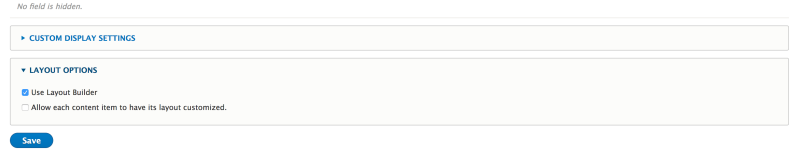
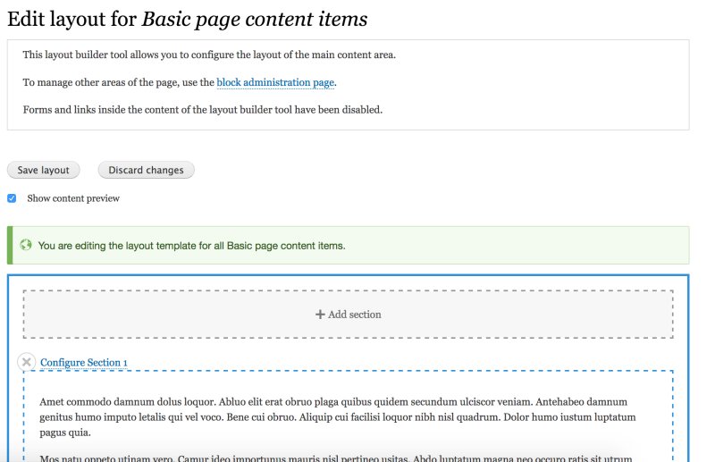
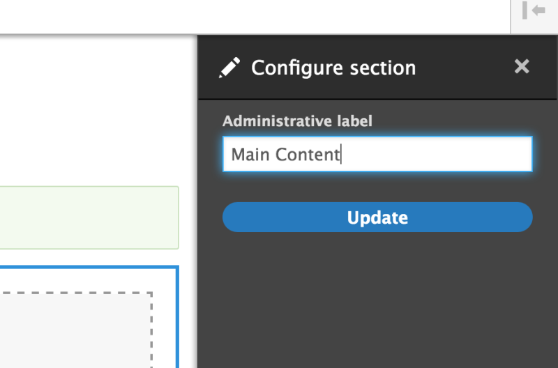
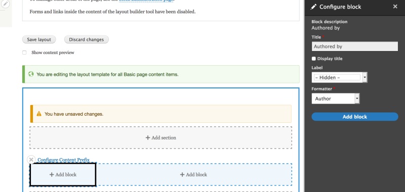
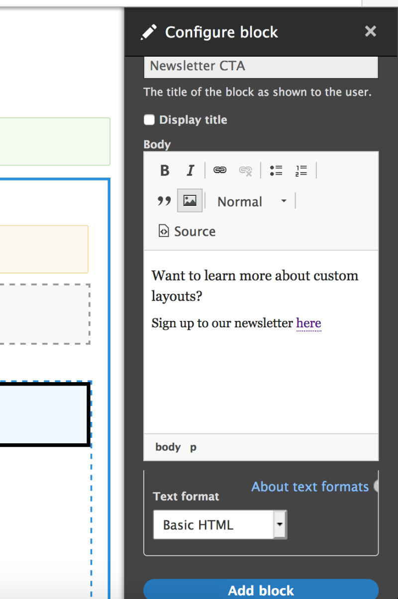

# Create a Flexible Layout for a Content Typefree

## Content

A new favorite page-building and design module in Drupal's core software, Layout Builder makes it possible to create content-type-specific layouts. All nodes of the associated content type will display their content using the defined layout. This allows site builders to display a page's content in two columns, or three, or two columns with a full-width banner image, etc. Then you can place the content type's fields and Drupal blocks into the sections of the defined layout, all via the Drupal UI.

In this tutorial we'll:

- Enable the Drupal *Layout Builder* and *Layout Discover* modules
- Create a new two-column *flexible* layout via the user interface
- Update the Basic page content type so that all nodes use the new two-column layout

By the end of this tutorial you should know how to create a new *flexible* layout, and apply it to one or more content types.

## Goal

Create a two-column layout for the Basic page content type using Layout Builder.

## Prerequisites

- [Introduction to Layout Builder](https://drupalize.me/tutorial/introduction-layout-builder)
- [Chapter 6. Setting Up Content Structure](https://drupalize.me/series/user-guide/content-structure-chapter)
- [6.10. Concept: View Modes and Formatters](https://drupalize.me/tutorial/user-guide/structure-view-modes?p=3071)

## Drupal video tutorial: Layout Builder module demo

Sprout Video

## Enable the modules and create a two-column layout

We're going to define a new layout for the Basic page content type that has two columns at the top, and a single column below. We'll place the page-specific author and publication date in the top left column, a generic call-to-action block in the right column, and the main content of the page in the single bottom column.

### Enable Layout Builder and Layout Discovery modules

In the *Manage* administration menu, navigate to *Extend* (*admin/extend*), then select the *Layout Builder* and *Layout Discovery* modules from the list, and select *Save* to enable them.

Image

### Enable Layout Builder for a content type

We will enable Layout Builder for the Basic page content type.

In the *Manage* administration menu, navigate to *Structure* > *Content Types* (*admin/structure/types*), then select *Manage Display* from the options in the Basic page row.

Image

While there's no explicit restriction about what view mode to use with Layout Builder, the intended purpose for the Layout Builder module is to set up and manage layouts for pages. We recommend using either the *Full content* or *Default* view modes when setting up a layout.

On the *Manage Display* tab under the *Custom Displays* section you should see a new details block named *Layout Options*. In this block select *Use Layout Builder*. Leave *Allow each content item to have its layout customized* checkbox unchecked and select *Save*.

Image

**Note**: We cover the configuration option *Allow each content item to have its layout customized* in the tutorial, [Change the Layout on a Per-Page Basis](https://drupalize.me/tutorial/change-layout-page-basis).

### Switch to Layout Builder UI for the Basic page content type

Once you've saved the configuration, you should see that all fields disappear and a *Manage layout* button appears.

Image

When a view mode is set up to use Layout Builder, the appearance and placement of all fields is managed through the layout interface instead of the default *Manage display* interface. Select the *Manage layout* button to open the Layout Builder interface for the Basic page content type (*admin/structure/types/manage/page/display/default/layout*).

Image

You should see the Layout Builder UI, and some help messages explaining the purpose and limitations of the UI.

By default, Layout Builder replicates the default Drupal behavior for this content type. It creates a one-column layout section and places fields that were displayed for the particular view mode inside it, matching the order that was in place prior to setting up Layout management for the view mode.

### Turn off content preview

Since we are editing the layout for the entire content type, and not for a particular node, Drupal also creates some placeholder content for editors to see and envision how the layout will be applied.

If you find the preview content makes it harder to manipulate the layout, it is possible to turn it off and see block and field labels instead. Let's hide the demo content by deselecting the *Show content preview* checkbox.

Image

Now we can see field labels and gain a better understanding of what was placed and where. You should see something like shown below:

Image

### Change base configuration

Layout Builder module created a one-column layout with a single section named *Section 1*. It's a good idea to name sections something more meaningful so it's easier to understand their purpose later. To change the section's name and configuration select the *Configure Section 1* link. When the configuration pane is open, give the section administrative label of "Main Content" and select *Update*.

Image

You should see that the section changed the label to the *Main Content* inside the UI.

Based on the layout settings the configuration options for sections may differ. For example, the width of columns is a configuration option. We will explore additional configuration options in the next step.

### Add a two-column section to the layout

Layout Builder comes with some predefined layouts that can be used within the interface. We have already seen the *One column* layout. To explore other options available out of the box, select the top *+ Add Section* button.

This opens a configuration pane that lists all available layouts and icons that demonstrate their structure.

Image

Selecting an icon will create a new section within the page above the already existing "Main Content" section and open configuration options for it.

Select the *Two column* icon. You should see that this section's configuration now has column width settings. Select the *25%/75%* option, name the section "Content Prefix" and select *Add Section*. We can always come back and change these settings later if they end up not working for our content and presentation goals.

Image

Now we have a new section above the *Main Content* one.

As you have seen during the creation of the "Two column" section, by default the Layout Builder module defines four different layouts from one column to four columns. The sections can mix and match within the main page container, but once placed they cannot be moved around. If you'd like to move the section somewhere else, for example move the *Content Prefix* section below the *Main Content*, we would need to delete the section and create a new one instead of dragging it under the one column section.

[There's ongoing work to resolve this limitation](https://www.drupal.org/project/drupal/issues/3080606).

### Add field blocks to the left 25% wide section

To render content for the end user we need to place blocks inside the defined sections. In the Layout Builder interface, every field associated with a content type has a block wrapper and is treated as a block (even though it may not be a Drupal block per se).

When working with content fields and placing them inside the Layout Builder, you give them a block content wrapper.

Let's use our newly created section and place some fields in there. First, select the *+ Add block* button in the left 25% wide section. In the section *Content fields* select *Authored by* field and configure it to not show labels and set the formatter to be Author. Then select *Add block*.

Image

Repeat these steps one more time but now select *Authored on* field. Now you should have *Authored on* and *Authored by* field blocks placed one under another in the left narrow column of our layout.

Image

Drag *Authored on* block to appear above *Authored by* block. Notice that you can drag-and-drop blocks not only within one section but also across all sections in the layout.

Settings for each block can be updated by hovering over the block and selecting the pencil icon to open the contextual menu for the specific block.

Image

It's important to note that since the blocks within the Layout Builder are not standard Block plugins, the typical block configuration options are not available here. Instead you have an interface that contains the settings for the field widget or any other entity wrapped in the block.

### Add custom blocks to the right 75% wide section

We have created an authoring information section. Now let's imagine that every basic page has to have a CTA to the newsletter. Since this CTA is common across all basic pages it makes sense to use a custom block for its content storage instead of reentering this information in every node edit form.

Select *+ Add block* in the right column and select *+ Create content block* button at the top of the configuration pane. This opens a new interface that consists of the same options as the interface we see when creating custom basic blocks in the custom block administration UI. Populate the content and title of your new CTA block and select *Add block*.

Image

### Save the layout

We have finished all required changes for this exercise. But the changes are not saved yet. Select the *Save layout* button near the top of the page to save this layout and apply it to every Basic page node rendered using the *Default* view mode.

Once the save is successful you'll be taken back to the *Manage display* tab, and you should see a message saying, "The layout has been saved."

### Test the new layout

Let's give it a try. Navigate to the *Content* (admin/content) menu, select *Add content* and choose *Basic page*. Populate the content for the node and save the node. Once it's saved you should see something like the result below.

Image

As you can see we populated the Body and Title of the node. The CTA was pulled from the main layout for Basic Page content type.

Note: Even though the CTA block is a custom Drupal block, it's considered content not configuration. If you navigate to *Structure* > *Block layout* > *Custom block library* (*admin/structure/block/block-content*) you will not see it in the list of available blocks. You also won't be able to place it as a typical block in a theme region through the Block layout interface.

If you'd like the blocks created within the Layout Builder interface to be reusable you may want to look at this [issue](https://www.drupal.org/project/drupal/issues/2999491).

## Recap

In this tutorial we used the Layout Builder module to define a two-column layout for the Basic page content type. We learned how to place fields, and custom blocks, within the Layout Builder UI. And we learned the difference between reusable content (applicable for all layouts within the content type) and content specific to the page (stored in fields for this node).

## Further your understanding

- We explored the Layout Builder option for the entire content type. Select "Allow each content item to have its layout customized" checkbox and explore new options available for the *Basic page* content type. See [Change the Layout on a Per-Page Basis](https://drupalize.me/tutorial/change-layout-page-basis) for more information.
- Create a new custom block type with different fields. Place it in the layout for the Basic page.

## Additional resources

- [Layout Builder documentation](https://www.drupal.org/docs/8/core/modules/layout-builder). (Drupal.org)
- [Layout API](https://www.drupal.org/docs/drupal-apis/layout-api) (Drupal.org)

Was this helpful?

Yes

No

Any additional feedback?

Previous
[Introduction to Layout Builder](/tutorial/introduction-layout-builder?p=2653)

Next
[Change the Layout on a Per-Page Basis](/tutorial/change-layout-page-basis?p=2653)

Clear History

Ask Drupalize.Me AI

close