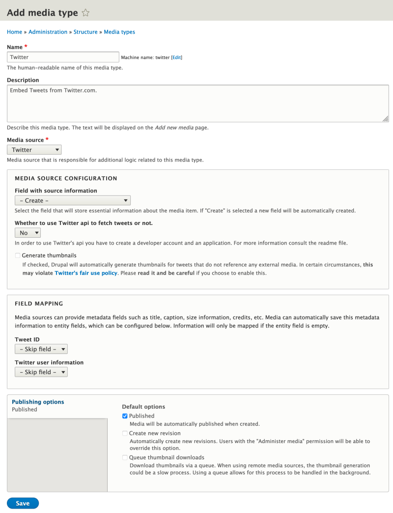

# Create a New Media Type in Drupal

## Content

Drupal site administrators can create new *media entity types*, with their own unique configurations and sets of associated fields. Different media types can be configured with different field names, permissions, moderation workflows, and display settings, making it possible to create truly custom content administration experiences. The process is similar to creating a node content type like *articles* or *events* with one major distinction: every media type inherits from a **specific media source plugin**. The source plugin provides domain-specific knowledge about the kind of resource being represented. For example, the *Remote video* source plugin used with the default *Remote video* media type knows how to consume and display videos from YouTube and Vimeo given only their URL.

Drupal core comes with a couple of common media source plugins, and contributed modules and custom code can add to this list, increasing the different media providers with which Drupal can integrate.

In this tutorial we'll learn how to:

- Install a contributed module that provides a new media source plugin.
- Create a new media type.

By the end of this tutorial you should be able to explain how source plugins relate to media types, and create a new media type.

## Goal

Create a new *tweet* media type that allows creating media entities based on tweets.

## Prerequisites

- [Overview: Media Management in Drupal](https://drupalize.me/tutorial/overview-media-management-drupal)
- [What Are Media Sources?](https://drupalize.me/tutorial/what-are-media-sources-drupal)

## Watch: Create a New Media Type in Drupal

Sprout Video

## Media source plugins

Every media type inherits from a **specific media source plugin**. There are 5 in Drupal core:

- File: A generic source for locally hosted files, best for things like PDFs and MS Word document files.
- Image: Extends the generic file source with support for images and image styles.
- AudioFile: Extends the generic file source with support for displaying/playing audio files via HTML5.
- VideoFile: Extends the generic file source with support for displaying/playing video files via HTML5.
- OEmbed: Provides support for remotely hosted videos (YouTube and Vimeo), and a generic OEmbed base that [can be extended to support additional OEmbed providers](https://drupalize.me/tutorial/use-any-oembed-provider-media-source).

If the source media you want to incorporate isn't included, you can either find a contributed module that provides the desired source plugin, or [write your own](https://drupalize.me/tutorial/create-custom-media-source-plugin).

For this example we'll install and use the the contributed [Media Entity Twitter module](https://www.drupal.org/project/media_entity_twitter) which provides a media source plugin that integrates with the Twitter API and allows tweets to be added to Drupal as reusable media assets. The process for creating a new media type is the same regardless of the source plugin being used.

### Install the Media Entity Twitter module

Download the [Media Entity Twitter](https://www.drupal.org/project/media_entity_twitter) module:

```
composer require drupal/media_entity_twitter
```

Enable it:

```
drush en media_entity_twitter
```

### Create a media type

In the *Manage* administration menu, navigate to *Structure* > *Media types* (*admin/structure/media*), then press the *Add media type* button.

On the resulting page fill out the form to add a new media type.

Image



The *Media source* dropdown will list all the available source plugins. Depending on which one you choose additional configuration options will be shown under the *Media source configuration* and *Field mapping* sections. Choose the *Twitter* source.

The *Field with source information* dropdown allows you to choose a field that will be used as the *source field*. This field stores a value that uniquely identifies the resource to display. For an *image* media type this is likely a pointer to the image file. For a tweet this would be the canonical URL of the tweet to embed. You can either reuse an existing field, or allow the Media module to create a new one for you. In most cases you'll want to create a new one.

The remaining settings here are going to be specific to the source plugin and you'll need to configure them for your specific use case.

In the *Field mapping* section, you'll be presented with a list of all the different data attributes that the source plugin exposes. This will be things like an image's width and height, or a tweet's author. You can choose to map this to fields associated with the media type. When you first create a new media type there are no fields to map to other than *Name*. You can add new fields later and come back and edit this configuration. The *Name* field is like the label, or title, of the media entity and you can choose to automatically populate it based on data attributes. Or you can allow users to enter one manually.

Once you've configured the source plugin and field mapping, press the *Save* button to create the media type.

### Add additional fields

Once a media type has been created you can add any additional fields you want. See [How to Add Fields to a Media Type in Drupal](https://drupalize.me/tutorial/how-add-fields-media-type-drupal) to learn more.

### Configure view modes

To change how media entities of the new media type are displayed you can configure the entity type's view modes. See [Use View Modes with Media Entities](https://drupalize.me/tutorial/use-view-modes-media-entities-drupal) to learn more.

## Recap

In this tutorial we learned that media entity types (bundles) function like any other content entity type. You can create them via the UI, and add any required fields. However, media types are always associated with a specific media source plugin. You can choose which one when configuring the new media type. Once a media type has been created you can use it to pull in data from the local file system or remote sources and display it in Drupal.

## Further your understanding

- Search through the contributed modules on Drupal.org and find other modules that add new media source plugins.
- Why do media entity types require a *source field* and an association with a specific source plugin?

## Additional resources

- [Creating and configuring Media Types](https://www.drupal.org/docs/8/core/modules/media/creating-and-configuring-media-types) (Drupal.org)

Was this helpful?

Yes

No

Any additional feedback?

Previous
[What Are Media Sources in Drupal?](/tutorial/what-are-media-sources-drupal?p=3274)

Next
[Use Any oEmbed Provider as a Media Source](/tutorial/use-any-oembed-provider-media-source?p=3274)

Clear History

Ask Drupalize.Me AI

close