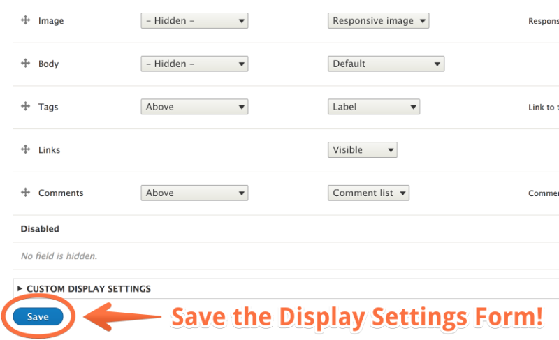

# Create a Responsive Image Style for Viewport-Sizing

## Content

In this tutorial, we're going to add a responsive image style to an image field on the Article content type. This will add the `srcset` and `sizes` attributes to the output `` element, providing media conditions, width descriptors, and a set of image sources for the browser to choose from, depending on the user device's viewport size.

This solution, especially when used in conjunction with CSS, will provide flexible, fluid, and faster-loading images for your site, and will work for probably 80% of use cases. It does not provide "art direction", that is, making cropping, aspect ratio, or orientation changes to an image. This solution also provides for different display-densities, like 1.5x and 2x image sources without the need for display-density descriptors.

Another benefit of this solution is that it uses the Responsive Image module's breakpoint configuration file, so there is no need for you to [create a breakpoint file](https://drupalize.me/tutorial/what-breakpoint-yaml-file) in your theme to implement this flavor of responsive image style.

## Goal

Create a responsive image style in Drupal that will provide different image sources based on the size of the viewport without altering the content, aspect ratio, or orientation.

## Prerequisites

- [Responsive Image Module Overview](https://drupalize.me/tutorial/responsive-image-module-overview)
- [Responsive Image Style Use Cases](https://drupalize.me/tutorial/responsive-image-style-use-cases)

Sprout Video

## Create and apply responsive image styles for viewport-sized images

### Pick an image field to target.

This could be the hero image, a sidebar image, or the featured image field on an article. The end result of this process is a field formatter that you can apply to an image field via its Display Settings. So you want to target an image *field*.

For this exercise, we'll use the image field on the Article content type, using the Bartik theme.

Image


We're going to change the image field formatter from the "Medium" image style (as displayed in the above screenshot) to a responsive image style. We're also going to make the image a little bit larger in proportion to the surrounding content.

### Make a list of image sizes

- For each breakpoint, figure out what you want the minimum and maximum image width to be.
- You may need to look at one or more container or wrapper divs to get the min and max image sizes.
- Choose sensible in-between sizes
- For each width, also calculate the 1.5x and 2x widths
- Remove duplicates and sizes that are pretty close to each other.
- Remember your goal: faster-loading, optimized images at any viewport, but without being too overzealous. Meaning, you probably want 4-8 sizes, but not 16-20. (But of course, this is up to you.)
- Note: the minimum and maximum image sizes are the sizes of the image sources we'll provide. We'll also use CSS to scale the images within their containers, especially in the case of 100vw images for the mobile breakpoint.

Here's how we worked out the image sizes for this example, using Bartik's *bartik.breakpoints.yml* as a guide for the media queries/breakpoint information. We did a lot of element inspection in the browser to find the min/max image sizes at each breakpoint.

#### Mobile

- Breakpoint: max-width: 559px
- Image size: 100vw (100% of the viewport width)
- Image size (min): 320px
- Image size (max): 559px

#### Narrow (no sidebar)

- Breakpoint: min-width: 560px and max-width: 850px
- Image size (fixed): 320px;

#### Wide (1 sidebar)

- Breakpoint: min-width: 851px (at this breakpoint, the sidebar appears)
- Layout-container (min): 851px
- Layout-container (max): max-width: 1290px
- Content div: 75% of wrapper
- Image size (min-width: 851px and max-width: 1290px): 50% of content div
- Image size (min-width: 1291px): 480px (fixed)

#### Here are the image widths for each breakpoint.

It's great that there are so many duplicates because that means we don't have to create as many image styles.

| Breakpoint | 1x | 1.5x | 2x |
| --- | --- | --- | --- |
| Mobile (min) | 320 | 480 | 640 |
| Mobile (max) | 559 | 839 | 1118 |
| Narrow (fixed) | 320 | 480 | 640 |
| Wide @ 851px | 320 | 480 | 640 |
| Wide @ 1290px | 480 | 720 | 960 |
| Wide > 1290px | 480 | 720 | 960 |

#### Final list, with duplicates removed.

We also removed 559px in favor of 640px, because they are close enough to each other.

- 320px
- 480px
- 640px
- 720px
- 839px
- 960px
- 1118px

Remember, your image size lists will be unique to the design and layout of your theme and your target image.

### Create image styles for each of your image sizes using the "Scale" effect.

Go to Configuration > Media > Image Sizes to add a new image style.

Create image styles for each width and add the Scale effect. Suggestion: use the naming convention "Max 320w", "Max 480w", etc. to label your image styles.

Image


Fill in the width (only) and click the *Add effect* button.

Image


### Enable the Responsive Images module

Go to Extend and ensure that the Responsive Images module (in Core) is installed/enabled.

### Navigate to responsive image styles

Go to Configuration > Media > Responsive image styles and click the *Add responsive image style* button.

### Enter a label for your responsive image style

For example, *Featured Article Image Viewport Sizing*

### Select the Responsive Image breakpoint group

The Responsive Image module provides a breakpoint configuration file with an empty media query. We can use it for this viewport-sizing use case.

### Select a fallback image style

Select the smallest image size, represented as an image style, that will fill this space. This should be your smallest, mobile image style, i.e. 320w.

### Save

Image


(But we're not done yet.)

### Expand the 1x Viewport Sizing[] breakpoint fieldset

Image


Click on the right arrow icon to expand it and reveal the settings form.

### Select "Type: Select multiple image styles and use the sizes attribute"

Image


### Enter the value for the sizes attribute

The sizes attribute can be a little hard to understand. "Sizes" tells the browser the size of the `img` element in relation to the **viewport**, and how that relationship changes under certain media conditions.

The value should be: a comma-separated list of media conditions (in parentheses) followed by a length value of the image element.

Image


Length value can be any absolute or relative unit or the CSS calc() function. Media conditions should be listed from the largest viewport size to the smallest. The last value is the default length, when no media query applies.

If your image will always be 100% of the width of the viewport, keep the default: *100vw*. (The unit *vw* represents viewport width. 1vw is equal to 1% of the width of the viewport.)

Media conditions should be listed from the smallest viewport size to the largest.

We'll use Bartik as an example. For the featured image on an article, we want to achieve the following:

- At a min-width of 1291px (the "wide" breakpoint), the article image should be about 480px. (We say "about" because there is some CSS in the theme that creates fluid, relatively-sized images.)
- At a min-width of 851px (the "narrow" breakpoint), we want the image to take up about half of the article's content area. At this breakpoint, a sidebar appears, and the article's content area is reduced to 75% of the wrapper container. At this breakpoint and up to the wide breakpoint the container is going to match the viewport size pretty closely. So we'll cheat a little and calculate an image size of half of 75vw, using the CSS calc() function.
- At a min-width of 560px and up to 850px (the "narrow" breakpoint), I'll set a fixed image size of 320px. At this media condition, the sidebar disappears, but it's still a bit too large for a 100vw image (subjectively speaking).
- Finally, under 560px, the image size should fill up the viewport width.

These conditions yield the following sizes attribute value:

```
(max-width: 559px) 100vw, (max-width: 850px) 320px, (max-width: 1290px) calc(75vw/2), (min-width: 1291px) 480px, 320px
```

### Select image styles

Next, select the image styles that will serve as options for the browser to choose, depending on the user device's viewport width. These sizes should correspond to what you entered in the sizes attribute's value, with the addition of 1.5x and 2x sizes.

Image


### Review configuration and save

Image


Review the configuration and click the save button to save your new responsive image style.

### Apply field formatter to image field

You can apply field formatters in the display settings for fields or in views, as well as other contexts.

To apply to the image field on the Article content type:

- Navigate to Structure > Content types
- Next to Article, select Manage display from the dropdown menu.
- Under Format, change the selection from *Image* to *Responsive Image*
- Click the gear icon on the Image field
- Select your Responsive Image Style that you just created.

Image


- Click Update to save your selection.
- Click Save (to save the Display Settings form)

Image



Now the images for this field will use an appropriately-sized source, depending on the viewport size!

### Apply CSS to achieve both flexible and optimized responsive images

In your theme's CSS, apply the following styles to the image element. This will size the image flexibly in its container. This technique complements a viewport-sizing responsive images approach.

```
img {
  width: 100%;
  max-width: 100%;
  height: auto;
}
```

### Test it out

To test, create an article node and upload an image that is at least as wide as the length of your largest image style that you used in your responsive image style configuration. Save and view the page at different browser widths to see how the image responds to the viewport size changes. At various browser window widths, right-click and "Open Image in New Tab" and look at the path in the address bar to see which image style is being utilized at various widths (the machine name of the image style will be in the URL).

Image


In certain browsers, you may need to clear the browser's image cache to see the results, or try a hard-refresh.

## Recap

In this tutorial, we added a new responsive image style that solves for a [viewport-sizing use case](https://drupalize.me/tutorial/responsive-image-style-use-cases). When applied to the image field on the article content type, when viewing an article node with an image, the browser now can choose from a list of image sources, supplied by the image styles we created, to display as the image source. Combined with CSS, we now have flexible, responsive images, great at any viewport size.

## Further your understanding

- What image fields on your Drupal site would benefit from a responsive image style?
- Inspect the styles of the containing elements and determine the minimum and maximum sizes. When would a viewport-sized responsive image style be appropriate? When would it not?
- When might an "art directed" image be more appropriate (at different breakpoints)? Is it enough to scale the image or do you need to provide completely different images at certain breakpoints?

## Additional resources

- [Sensible jumps in responsive image file sizes](https://cloudfour.com/thinks/sensible-jumps-in-responsive-image-file-sizes/) (Jason Grigsby, CloudFour)

Was this helpful?

Yes

No

Any additional feedback?

Previous
[Responsive Image Style Use Cases](/tutorial/responsive-image-style-use-cases?p=2864)

Clear History

Ask Drupalize.Me AI

close