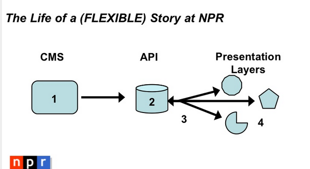

# Decoupling Explainedfree

## Content

If you're interested in decoupling Drupal, there's a good chance you've heard at least some of the buzz in the Drupalverse about "headless" or decoupled Drupal. Or perhaps you watched [Dries' keynote from DrupalCon Barcelona](https://www.youtube.com/watch?v=7v_rv346qmM) or read Dries' blog post about [the future of decoupled Drupal](http://buytaert.net/the-future-of-decoupled-drupal). Whatever the case may be, this tutorial and the ones that follow will walk you through building a simple decoupled blog. In Dries' terminology the demo site we'll be building is "fully decoupled." While it would be trivial to adopt similar techniques to build a progressively decoupled site, let's dig a bit deeper into what it means to build a decoupled Drupal site.

## Goal

Understand the concept of "Decoupling Drupal" at a high-level.

## Prerequisites

- None.

## Decoupling Drupal

Traditionally, Drupal sites are monolithic in the sense that Drupal is responsible for content management as well as rendering the front-end pages for the entire site. A site takes its first steps towards being decoupled when some component of the front end is being rendered by a system other than Drupal. That's really all there is to it. You're adding a layer of abstraction, a content API, between the back-end content management system and the front-end rendering system.

## Early adopters

One of the early adopter success stories to this approach is NPR, with their Create Once Publish Everywhere (COPE) approach.

Image

*Photo credit: [NPR: Create Once Publish Everywhere (Slide #21)](http://www.slideshare.net/zachbrand/npr-api-create-once-publish-everywhere)*

[Netflix](https://www.lullabot.com/podcasts/insert-content-here/daniel-jacobson-on-nprs-cope-and-content-apis) and [other](http://www.bbc.co.uk/blogs/bbcinternet/2012/04/sports_dynamic_semantic.html) [large](http://derivadow.com/2012/01/22/scientific-publishing-on-the-web/) media organizations had seen benefits to decoupling their sites, especially when it comes to content reuse across platforms. Even in the Drupal world there are several [examples](https://www.lullabot.com/) of [success](http://www.nbc.com/the-tonight-show) [stories](http://www.nbc.com/saturday-night-live/explore/season-40) building decoupled Drupal sites to make multichannel publishing easier.

## The decoupled approach

Let's say, for starters, you'd like to build a mobile app, either for iOS or Android, and you need to pull data from your Drupal site. You'd probably begin by researching ways to export data from your Drupal site. You might use [Views Datasource](https://www.drupal.org/project/views_datasource), or [Services](https://www.drupal.org/project/services), or [RESTful](https://www.drupal.org/project/restful), or maybe even just custom code (we have lessons in this series to cover each approach). With your Drupal site exposing JSON (or XML) endpoints, you'd now have the data your app needs. Congratulations, you've now decoupled your website. That's really all it takes to get started.

## Implications and "gotchas"

Of course, the story doesn't quite end there. With the additional flexibility to build out multiple front-ends comes great responsibility. In order to improve performance you need to worry about caching your API, minimizing HTTP requests from the front-end, a generally more complex architecture with more moving pieces—not to mention SEO considerations.

Image

*Photo credit: [NPR: Create Once Publish Everywhere (Slide #30)](http://www.slideshare.net/zachbrand/npr-api-create-once-publish-everywhere)*

In addition to the back-end implications, the way you build content types likely changes as well. Content reuse introduces another set of challenges. In an ideal world, an article would have the same title regardless of where it's displayed. In reality, limitations introduced by screen size, design restrictions, or editorial concerns often means that's just not possible. We must seriously address device proliferation and the [growing number of screen sizes](https://www.mydevice.io/#compare-devices).

## Plan and leverage

What if we could build into our CMS the idea of adaptive content, that is, content with enough metadata that our API consumer can best decide what to render? It turns out that Drupal's Field API provides us with [a good foundation](https://portland2013.drupal.org/session/building-post-mobile-world.html) to do just that. Once you've done [your](http://www.printmag.com/web-design/karen-mcgrane-on-creating-reusable-content/) [homework](https://karenmcgrane.wordpress.com/2012/09/04/adapting-ourselves-to-adaptive-content-video-slides-and-transcript-oh-my/) and planned a content strategy that maximizes content reuse you're well suited to take advantage of a decoupled architecture.

As NPR's experienced developers warned us, "Building an API is Not Enough" when it comes to true content portability. The extra layer of abstraction between content producers and content consumers doesn't by itself improve our data model or make our site responsive. If we're interested in the idea of COPE, it's worth the extra work developing a content strategy that supports this reuse. In fact, NPR argued "COPE is the key difference between content management systems and web publishing tools, although these terms are often used interchangeably in our industry." With that in mind, and a basic understanding of what it means to build a decoupled Drupal site, is that the right approach for our project?

## Recap

In this tutorial, we explained where the idea of decoupling Drupal came from and discussed resources and inspiration for the decoupled approach including the related concept of "create once, publish everywhere (COPE)".

## Further your understanding

- Explore the related articles and videos in this tutorial. What are the most relevant or inspiring resources that most relate to the problem you're trying to solve? How might decoupling be a worthwhile approach to explore?

## Additional resources

- [Understanding Create Once Publish Everywhere (COPE)](https://www.lullabot.com/articles/understanding-create-once-publish-everywhere-cope) (lullabot.com)
- [Drupalize.Me Podcast: Decoupled Drupal](https://www.lullabot.com/podcasts/drupalizeme-podcast/decoupling-drupal) (lullabot.com)
- [Headless Websites: What's the Big Deal?](https://pantheon.io/blog/headless-websites-whats-big-deal) (pantheon.io)
- [Headless Drupal, One Form at a Time](http://www.gizra.com/content/restful-angular-forms/) (gizra.com)
- [Future of the CMS](https://www.youtube.com/watch?v=SnROzqxXDmI) (YouTube.com)
- [Insert Content Here Podcast: Daniel Jacobson on NPR's COPE and Content APIs](https://www.lullabot.com/podcasts/insert-content-here/daniel-jacobson-on-nprs-cope-and-content-apis) (lullabot.com)
- [Decoupled Architecture with WordPress and Drupal](https://pantheon.io/blog/decoupled-architecture-wordpress-and-drupal) (pantheon.io)
- [Decoupled Drupal, When, Why and How](https://events.drupal.org/losangeles2015/sessions/decoupled-drupal-when-why-and-how) (events.drupal.org)
- [Headless Drupal Group](https://groups.drupal.org/headless-drupal) (groups.drupal.org)

Was this helpful?

Yes

No

Any additional feedback?

Next
[Is Decoupling the Right Choice?](/tutorial/decoupling-right-choice?p=2960)

Clear History

Ask Drupalize.Me AI

close