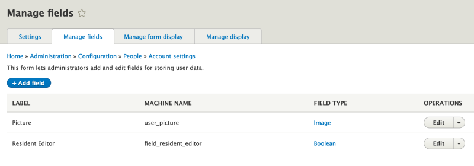

# Define a Custom Views Access Plugin

## Content

When a user creates a view, they can set access rules, and restrict who can see the view. The core Views module allows you to limit access by a user's permissions, or roles. If your project requires custom access rules you can define a custom Views access plugin. This will allow you to determine a user's access based on any custom logic you might have.

In this tutorial we'll:

- Define a custom Views access plugin that determines access based on data stored in a field on the user entity type.
- Learn the difference between access checks for routes and access checks for Views displays, and how to use each of them.
- Use our new custom access handler when defining a view.

By the end of this tutorial you should know how to define a custom Views access plugin and use it to grant access to a view.

## Goal

Create a custom Views access plugin that restricts access to only users in the *editor* role who also have the *Resident editor* checkbox (a custom field) on their profile selected.

## Prerequisites

- [Overview: Views Plugins](https://drupalize.me/tutorial/overview-views-plugins)
- [Implement a Plugin Using PHP Attributes](https://drupalize.me/tutorial/implement-plugin-using-php-attributes)

## Set up

This tutorial assumes that you've added a checkbox field named *field\_resident\_editor* to the User entity type. Your site should have a role configured with the name *editor*. We'll use these data points as part of our custom access-checking logic.

This also assumes you've already defined a module named *news*, or that you're adding this code to another existing module, and that the module is enabled.

## Follow these steps

### Define an access plugin

Access plugins live in the `\Plugin\views\access` PSR-4 sub-namespace, and use `#[ViewsAccess]` attributes. Note that the case of the directory names matters. Your final directory structure may look like the following:

```
news
├── news.info.yml
└── src
    └── Plugin
            └── views
                    └── access
                        └── ResidentEditorAccess.php
```

### Define the plugin attribute and class

In your module, create the file *src/Plugin/views/access/ResidentEditorAccess.php* and add the following to it:

```
namespace Drupal\news\Plugin\views\access;

use Drupal\views\Attribute\ViewsAccess;
use Drupal\views\Plugin\views\access\AccessPluginBase;
use Drupal\Core\Session\AccountInterface;
use Drupal\Core\StringTranslation\TranslatableMarkup;
use Symfony\Component\Routing\Route;

/**
 * Resident editor access plugin.
 *
 * @ingroup views_access_plugins
 */
#[ViewsAccess(
  id: "ResidentEditorAccess",
  title: new TranslatableMarkup("Custom access to views for resident editors"),
  help: new TranslatableMarkup("Check if user is an editor and also is marked as a resident in their account."),
)]
class ResidentEditorAccess extends AccessPluginBase {}
```

The `#[ViewsAccess]` attribute defines your access plugin for Views. It should contain the *id* of your custom plugin, the *title* of the plugin, and *help* text. The last 2 properties will be displayed in the Views UI when a user chooses this access plugin.

Custom access plugins should extend the `AccessPluginBase` core class. `AccessPluginBase` is an abstract class that has 2 abstract methods: `access()` and `alterRouteDefinition()`, meaning that we have to define and implement their logic in our custom access plugin class.

### Add `access` and `alterRouteDefinition` logic

Update your plugin class to look like the following:

```
use Drupal\views\Attribute\ViewsAccess;
use Drupal\views\Plugin\views\access\AccessPluginBase;
use Drupal\Core\Session\AccountInterface;
use Drupal\Core\StringTranslation\TranslatableMarkup;
use Symfony\Component\Routing\Route;

/**
 * Resident editor access plugin.
 * 
 * @ingroup views_access_plugins
 */
#[ViewsAccess(
  id: "ResidentEditorAccess",
  title: new TranslatableMarkup("Custom access to views for resident editors"),
  help: new TranslatableMarkup("Check if user is an editor and also is marked as a resident in their account."),
)]
class ResidentEditorAccess extends AccessPluginBase {

  /**
   * {@inheritdoc}
   */
  public function summaryTitle() {
    return $this->t('Custom Access Settings');
  }

  /**
   * {@inheritdoc}
   */
  public function access(AccountInterface $account) {
    // Skip access check for User 1.
    if ($account->id() == 1) {
      return TRUE;
    }
    // Load user entity.
    $user = \Drupal::entityTypeManager()->getStorage('user')->load($account->id());
    if (isset($user->field_resident_editor) && $user->field_resident_editor->value) {
      return TRUE;
    }
    else {
      return FALSE;
    }
  }

  /**
   * {@inheritdoc}
   */
  public function alterRouteDefinition(Route $route){
    $route->setRequirement('_role', 'editor');
  }
  
}
```

The `alterRouteDefinition()` method is used to check access at the route level. It is only used for displays that have a route. For example, when a view is configured to show on a page. It's called earlier than an `access()` method and is better for performance since it happens earlier in the request and the result is cached.

It is also essential if you add the view's generated page to a menu, since without the route access check it's possible for users to see the menu item in the navigation, but then when they navigate to the page it'll display an "access denied" message.

This method is only invoked for page displays -- not for block displays, because block displays don't have routes attached to them. For all displays with no route (e.g. block, attachments, etc.) the `access()` method is used to determine if there's anything to display.

It's typically a good idea for both of these methods --`alterRouteDefinition()` and `access()`-- to have the same access logic. In our example code above, we illustrated that you can use the methods on the `$route` object to add new permissions or role-based requirements to the route as an initial gateway and then rely on the `access()` method for the custom access logic.

If you'd like to read more about route parameters in Drupal, refer to the drupal.org [documentation](https://www.drupal.org/node/2092643#section-requirements).

*access()* method is where custom access logic lives. The *access()* method has to return the `TRUE` / `FALSE` result. For this tutorial we assume that *User* entity on your website has a boolean single value field called *Resident Editor* with machine name `field_resident_editor` as shown in the screenshot below.

Image



In the code we are loading the `User` object out of the `AccountInterface`, and checking the value that's stored in the field.

The last method that we implemented is `summaryTitle()`. This is not a requirement, but nice to have for a better Views UI experience.

With this code if a user has the *editor* role they'll have access to the route, and thus the page. (Though not necessarily have permission to view the page's content.) When the page (or any other display) loads, the `access()` method will be invoked, and it'll check to see if the user has the resident editor checkbox selected. If they do it'll show the content, but if they don't it will display "access denied".

### Define an access service

In the majority of cases `alterRouteDefinition()` and `access()` methods should have the same access logic. To facilitate this, the logic is often abstracted into a [service class](https://drupalize.me/topic/services).

Let's modify the code to do just that. In the root of your module create a *news.services.yml* file. The content of the file may look something like the below:

```
services:
  news.views_access:
    class: Drupal\news\Access\CustomViewsAccessCheck
    arguments: ['@current_user']
    tags:
      - { name: access_check, applies_to: _custom_views_access_check }
```

The `class` property in the code above defines the full namespace of the access service class. Create the file *src/Access/CustomViewsAccessCheck.php* in the *news* module with the following content:

```
namespace Drupal\news\Access;

use Drupal\Core\Routing\Access\AccessInterface;
use Drupal\Core\Session\AccountInterface;
use Drupal\Core\Access\AccessResult;

/**
 * Checks access for display news page for residential editors
 */
class CustomViewsAccessCheck implements AccessInterface {

  /**
   * A custom access check.
   *
   * @param \Drupal\Core\Session\AccountInterface $account
   *   Run access checks for this account.
   *
   * @return \Drupal\Core\Access\AccessResultInterface
   *   The access result.
   */
  public function access(AccountInterface $account) {
    // Skip access check for User 1.
    if ($account->id() == 1) {
      return AccessResult::allowed();
    }
    // Load user entity.
    $user = \Drupal::entityTypeManager()->getStorage('user')->load($account->id());
    // The field_resident_editor is a custom field on the user entity type. Our
    // access logic will not work without it.
    if (isset($user->field_resident_editor) && $user->field_resident_editor->value) {
      return AccessResult::allowed();
    }
    else {
      return AccessResult::forbidden();
    }
  }

}
```

In the code above we moved the logic from the `access()` method of our Views plugin into the `access()` method of the new service. Access services need to return an instance of `AccessResultInterface` instead of the `TRUE/FALSE` that Views `access()` method has to return.

Next, update your Views plugin class code to use the new access service. The updated code in *src/Plugin/views/access/ResidentEditorAccess.php* may look something like the following:

```
namespace Drupal\news\Plugin\views\access;

use Drupal\views\Attribute\ViewsAccess;
use Drupal\views\Plugin\views\access\AccessPluginBase;
use Drupal\Core\Session\AccountInterface;
use Drupal\Core\StringTranslation\TranslatableMarkup;
use Symfony\Component\Routing\Route;

/**
 * Resident editor access plugin.
 *
 * @ingroup views_access_plugins
 */
#[ViewsAccess(
  id: "ResidentEditorAccess",
  title: new TranslatableMarkup("Custom access to views for resident editors"),
  help: new TranslatableMarkup("Check if user is an editor and also is marked as a resident in their account."),
)]
class ResidentEditorAccess extends AccessPluginBase {

  /**
   * {@inheritdoc}
   */
  public function summaryTitle() {
    return $this->t('Custom Access Settings');
  }

  /**
   * {@inheritdoc}
   */
  public function access(AccountInterface $account) {
    $access = \Drupal::service('news.views_access')->access($account);
    if (isset($access) && $access->isAllowed()) {
      return TRUE;
    }
    else {
      return FALSE;
    }
  }

  /**
   * {@inheritdoc}
   */
  public function alterRouteDefinition(Route $route){
    $route->setRequirement('_custom_access', 'news.views_access::access');
  }
  
}
```

Here we're calling the service and checking its result in the `access()` method. If service returns "access allowed" then we return `TRUE`.

In the `alterRouteDefinition()` method we set a `_custom_access` route requirement and point it to the `access()` method of the service we defined.

[Clear the cache](https://drupalize.me/tutorial/clear-drupals-cache). Now, both methods are relying on the same access-checking logic. That logic is reusable in other places in our code if needed.

## Create a view to test access control

Using the Views UI, build a view of *Articles* with a block display limited to 5 items. Add a filter to only display unpublished content. Alter other configurations as desired. Place the block in a region on your site.

Your view may look something like the screenshot below:

Image


In the *Access* section of the view, press on the word *permission*, and you should see the *Custom access for resident editors* option. Choose it and hit *Apply*.

Image


Login as a user with the *editor* role. Make sure that the account has the custom *Resident Editor* field checked, and that editors on your site can view unpublished content. Navigate to the node where you placed the view, and you should see your new block appearing there.

Edit the user account and remove the *Resident Editor* setting. Navigate back to the page with the placed view, and you should see that you cannot access the block anymore.

## Recap

In this tutorial we learned how to define and use custom access plugins for Views. Custom access plugins define granular access rules for users based on any custom logic your application requires. We learned that Views access plugins implement both `access()` and `alterRouteDefinition()` methods. We explored different scenarios where they are used to check access and how that impacts the user experience. Then we demonstrated abstracting your access control logic into a service class to make it easier to re-use.

## Further your understanding

- We used the `_role` parameter as a requirement for the route. How would you check a specific permission instead?
- What would happen if we set a requirement to `_access` to `TRUE` in the `alterRouteDefinition()` method? Will it affect the access restrictions?

## Additional resources

- [List of Views hooks](https://api.drupal.org/api/drupal/core%21modules%21views%21views.api.php/11.x) (api.drupal.org)
- [Hook\_views\_data documentation](https://api.drupal.org/api/drupal/core%21modules%21views%21views.api.php/function/hook_views_data/) (api.drupal.org)
- [Views access plugins documentation](https://api.drupal.org/api/drupal/core!modules!views!src!Plugin!views!access!AccessPluginBase.php/group/views_access_plugins/) (api.drupal.org)
- [Services in Drupal 8+ documentation](https://www.drupal.org/docs/drupal-apis/services-and-dependency-injection/structure-of-a-service-file) (Drupal.org)
- [Route parameters documentation](https://www.drupal.org/node/2092643#section-requirements) (Drupal.org)

Was this helpful?

Yes

No

Any additional feedback?

Previous
[Define a Custom Views Area Handler Plugin](/tutorial/define-custom-views-area-handler-plugin?p=2939)

Next
[Define a Custom Views Style Plugin](/tutorial/define-custom-views-style-plugin?p=2939)

Clear History

Ask Drupalize.Me AI

close