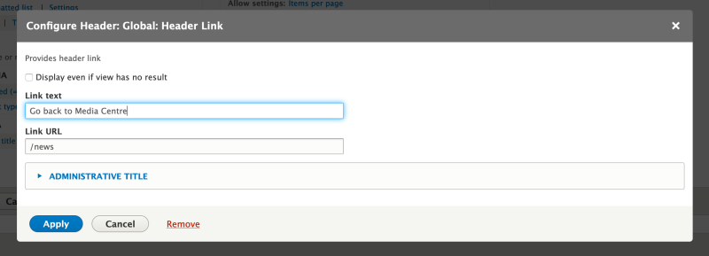

# Define a Custom Views Area Handler Plugin

## Content

Area handler plugins are used to determine what is displayed in *areas* such as the header, footer, and empty text sections of a view. The handlers provided by core cover displaying result summaries, and allowing users to enter in HTML to display. They are already pretty versatile. However, they may require code knowledge to accomplish some specific tasks. If you'd like to have a more specialized area handler that can be reused across multiple views, you may want to look into defining a custom area handler plugin.

In this tutorial we'll:

- Create a custom area handler plugin with settings that can be updated through the Views UI.
- Use the new area handler plugin in a view.

By the end of this tutorial you should know how to define a custom area handler with settings and use it in Views.

## Goal

Create a custom area handler plugin that allows users to create a link to another page without requiring them to write an `<a>` tag. Users should be able to customize the link text and URL through the Views UI.

## Prerequisites

- [Overview: Views Plugins](https://drupalize.me/tutorial/overview-views-plugins)
- [Implement a Plugin Using PHP Attributes](https://drupalize.me/tutorial/implement-plugin-using-php-attributes)

## Create a custom module

Views area handlers need to be defined in a module. For our example we'll create a new module named *header\_link* with the following *header\_link.info.yml* file. You can also add to any existing module.

Example *header\_link/header\_link.info.yml*:

```
name: Views Header Link
type: module
description: 'Custom area header link handler for Views.'
core: 8.x
core_version_requirement: ^8 || ^9 || ^10
package: 'Custom'
dependencies:
  - drupal:views
```

Then enable the module either through the UI or using Drush.

### Define an area handler plugin

Area handler plugins live in the `\Plugin\views\area` PSR-4 sub-namespace, and use `#[ViewsArea]` attributes. Note that the case of the directory names matters. Your final directory structure may look like the following:

```
header_link
├── header_link.info.yml
└── src
    └── Plugin
            └── views
                    └── area
                        └── HeaderLink.php
```

Add the following to the *HeaderLink.php* file:

### Define the configuration and display logic

The final plugin implementation looks like the following:

```
namespace Drupal\header_link\Plugin\views\area;

use Drupal\Core\Form\FormStateInterface;
use Drupal\Core\Url;
use Drupal\views\Attribute\ViewsArea;
use Drupal\views\Plugin\views\area\AreaPluginBase;

/**
 * Views area link handler.
 *
 * @ingroup views_area_handlers
 */
#[ViewsArea("header_link")]
class HeaderLink extends AreaPluginBase {

  /**
   * {@inheritdoc}
   */
  protected function defineOptions() {
    $options = parent::defineOptions();
    $options['link_text']['default'] = 'Back >';
    $options['link_url']['default'] = '';
    return $options;
  }

  /**
   * {@inheritdoc}
   */
  public function buildOptionsForm(&$form, FormStateInterface $form_state) {
    parent::buildOptionsForm($form, $form_state);
    $form['link_text'] = [
      '#type' => 'textfield',
      '#title' => $this->t('Link text'),
      '#size' => 60,
      '#default_value' => $this->options['link_text'],
      '#maxlength' => 128,
    ];
    $form['link_url'] = [
      '#type' => 'textfield',
      '#title' => $this->t('Link URL'),
      '#default_value' => $this->options['link_url'],
      '#size' => 60,
      '#maxlength' => 128,
    ];
  }

 /**
  * {@inheritdoc}
  */
  public function render($empty = FALSE) {
    if ((!$empty || !empty($this->options['empty'])) && !empty($this->options['link_url'])) {
      if (!empty($this->options['link_text'])) {
        $text = $this->t($this->options['link_text']);
      }
      else {
        $text = $this->t('Back >');
      }
      if (strpos($this->options['link_url'], 'http') !== FALSE) {
        $url = Url::fromUri($this->options['link_url']);
      }
      elseif (isset($url_opt) && strpos($url_opt, '/') === 0) {
        $url = Url::fromUserInput($this->options['link_url']);
      }
      else {
        $url = Url::fromUserInput('/' . $this->options['link_url']);
      }
      $item = [
        '#type' => 'link',
        '#title' => $text,
        '#url' => $url,
      ];
      return $item;
    }
  }

}
```

In the code above we define 3 methods that are overridden from the base class.

`defineOptions()`: Defines the options that will be used inside the configuration form for the handler. We declare 2: *Link text* and *Link URL*. We set default values for both. This could have been done with the Drupal link field instead, or with an autocomplete field to reference pages on the site, but for the simplicity of this tutorial we'll keep them as plain text fields and handle user input in the `render()` function.

`buildOptionsForm()`: For our new options to appear, we need to tell Views about their corresponding form render elements. We defined both of the options as plain text input form fields and pass values from the `$options` array as default values for those fields. This uses standard Form API array syntax. Saving the values for later use is handled automatically. You can optionally add additional validation or submit handling by implementing the `validateOptionsForm()` and `submitOptionsForm()` methods.

`render()`: This method builds the handler output that gets shown when the View is rendered. It needs to return a valid Drupal render array. Here we check for the empty option that's inherited from the parent class and determines if the handler output needs to be rendered when the view has no results. Then we process the values from *Link text* and *Link URL* configuration and construct a link render element.

### Tell Views about the new area handler

Since this is a brand new area handler plugin rather than an extension of any already-defined plugins, we'll use `hook_views_data()` to expose it to Views. If we wanted to extend and replace an already-defined plugin then we would need to use `hook_views_data_alter()`.

In the root of our custom module, create a *header\_link.module* file and implement `hook_views_data()`.

Example from *header\_link.module*:

```
/**
 * Implements hook_views_data().
 */
function header_link_views_data() {
  $data['views']['header_link'] = [
    'title' => t('Header Link'),
    'help' => t('Provides header link'),
    'area' => [
      'id' => 'header_link',
    ],
  ];
  return $data;
}
```

In the hook above we add our new area handler under the key of `header_link`. We specify its title and help description for us in the UI. We set the `area` key to notify Views that it's an area handler, and the `id` matches the id of our plugin.

After doing this you'll need to [clear the cache](https://drupalize.me/tutorial/clear-drupals-cache).

### Use it in a view

Using the Views UI, build a view of *Article* nodes using a block display limited to 5 items. Alter other configurations as desired and place the block on one of the nodes of your website. If you'd like to learn more about how to work with Views through UI, refer to the [Display Content with Views tutorial](https://drupalize.me/topic/display-content-views).

Your configuration may look something like the following:

Image


In the *Header* section of the UI, press *Add* and search for *Header link*. Once found, add it to the view, configure the *Link text* and *Link URL* options, and save.

Image


The configuration may look similar to what's shown below:

Image



Scroll down to the preview area, and you should see a new header area handler rendered above the results area:

Image


## Recap

In this tutorial we learned how to define a custom area handler for Views. Our example defined a new area handler plugin that renders a link based on title and URL configuration collected from a user. Then we demonstrated how to use it in a view.

## Further your understanding

- Can you add validation to the configuration form fields that verify the URL?
- Can you make the configuration form use an autocomplete form element that references existing internal URLs?
- How would you access, and make use of, results returned by the View in an area handler? For example, showing a count of total results?

## Additional resources

- [List of Views hooks](https://api.drupal.org/api/drupal/core%21modules%21views%21views.api.php/11.x) (api.drupal.org)
- [Hook\_views\_data documentation](https://api.drupal.org/api/drupal/core%21modules%21views%21views.api.php/function/hook_views_data/) (api.drupal.org)
- [Views area handlers documentation](https://api.drupal.org/api/drupal/core!modules!views!src!Plugin!views!area!AreaPluginBase.php/group/views_area_handlers/) (api.drupal.org)

Was this helpful?

Yes

No

Any additional feedback?

Previous
[Define a Custom Views Sort Plugin](/tutorial/define-custom-views-sort-plugin?p=2939)

Next
[Define a Custom Views Access Plugin](/tutorial/define-custom-views-access-plugin?p=2939)

Clear History

Ask Drupalize.Me AI

close