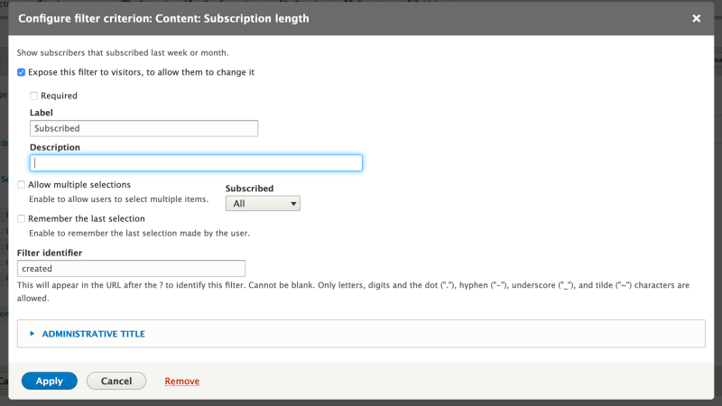

# Define a Custom Views Filter Plugin

## Content

Filter plugins provide the logic for determining what items to include in a view. They are the equivalent of a `WHERE` clause in an SQL statement. Filters can be exposed to the end user, allowing the viewer to enter a value, or select from a list of options, that are used to filter a list. For example, the options at the top of the *Content* list at */admin/content* allow you to limit the list by content type.

Drupal's Views module provides filter plugins that can handle filtering for all core defined field types, as well as generic data types like numbers and strings. In situations where these filters don't meet your functional requirements, or you need a filter for a custom field, you may want to define a custom Views filter plugin. A common real-world scenario is defining a new filter plugin that extends an existing one and adds new possible values or options. For example, providing a relative date filter that allows a user to choose options like *Last week* or *Last month*.

In this tutorial we'll:

- Learn how to create a Views filter plugin.
- Associate our new custom filter with data exposed to Views, so it can be used.
- Learn how to use it in a view as an exposed filter.

By the end of this tutorial you should know how to create a custom filter plugin and use it in Views.

## Goal

Define a custom Views filter plugin to handle relative date options for the *created* field of the news subscribers table allowing a view to list only subscribers from the *Last week* or *Last month*.

## Prerequisites

- [Overview: Views Plugins](https://drupalize.me/tutorial/overview-views-plugins)
- [Implement a Plugin Using PHP Attributes](https://drupalize.me/tutorial/implement-plugin-using-php-attributes)
- [Expose a Custom Database Table to Views](https://drupalize.me/tutorial/expose-custom-database-table-views)

## Initial setup

This tutorial assumes that you've followed the steps in the [Expose a Custom Database Table to Views](https://drupalize.me/tutorial/expose-custom-database-table-views) tutorial. And you will be adding to the *news* module, which exposes a custom *news\_subscribers* database table via `hook_views_data()`. The process of creating a filter plugin is the same for any situation. They can be associated with data fields using either `hook_views_data()` or `hook_views_data_alter()` depending on your use case.

## Define a filter plugin

### Define a new plugin

Filter handler plugins extend the `\Drupal\views\Plugin\views\filter\FilterPluginBase` base class, use `\Drupal\views\Attribute\ViewsFilter` attributes, and reside in PSR-4 namespace directory `Plugin\views\filter`.

In the *news* module create the file *src/Plugin/views/filter/RelativeDateViewsFilter.php*. Your folder structure should look something like the following:

```
news
├── news.info.yml
├── news.install
├── news.module
└── src
    └── Plugin
            └── views
                  └── filter
                        └── RelativeDateViewsFilter.php
```

Add the following code to *src/Plugin/views/filter/RelativeDateViewsFilter.php*:

```
<?php
namespace Drupal\news\Plugin\views\filter;

use Drupal\Core\Form\FormStateInterface;
use Drupal\views\Attribute\ViewsFilter;
use Drupal\views\Plugin\views\filter\FilterPluginBase;

/**
 * Relative date filter.
 *
 * @ingroup views_filter_handlers
 */
#[ViewsFilter("relative_date_filter")]
class RelativeDateViewsFilter extends FilterPluginBase {

   /**
   * Form with all possible filter values.
   */
  protected function valueForm(&$form, FormStateInterface $form_state) {
    $form['value'] = [
      '#tree' => TRUE,
      'relative_date' => [
        '#type' => 'select',
        '#title' => $this->t('Subscribed'),
        '#options' => [
          'all' => $this->t('All'),
          'last_week' => $this->t('Last Week'),
          'last_month' => $this->t('Last Month'),
        ],
        '#default_value' => !empty($this->value['relative_date']) ? $this->value['relative_date'] : 'all',
      ]
    ];
  }

  /**
   * Adds conditions to the query based on the selected filter option.
   */
  public function query() {
    $this->ensureMyTable();
    $date = "$this->tableAlias.$this->realField";
    switch ($this->value['relative_date']) {
      case 'last_week':
        $last_week_time = strtotime("first day of previous week");
        $this_week_time = strtotime("first day of this week");
        $last_week = "FROM_UNIXTIME(" . $last_week_time . ")";
        $this_week = "FROM_UNIXTIME(" . $this_week_time . ")";
        $this->query->addWhereExpression($this->options['group'], "$date >= $last_week AND $date < $this_week");
        break;
      case 'last_month':
        $last_month = strtotime("first day of previous month");
        $this_month = strtotime("first day of this month");
        $this->query->addWhereExpression($this->options['group'], "$date >= $last_month AND $date < $this_month");
        break;
    }
  }

  public function adminSummary() {
    if ($this->isAGroup()) {
      return $this->t('grouped');
    }
    if (!empty($this->options['exposed'])) {
      return $this->t('exposed') . ', ' . $this->t('default state') . ': ' . $this->value['relative_date'];
    }
    else {
      return $this->t('relative_date') . ': ' . $this->value['relative_date'];
    }
  }

}
```

For the purpose of this tutorial we extend the `Drupal\views\Plugin\views\filter\FilterPluginBase` class. Depending on your needs it may be more efficient to extend one of the existing filter plugins.

Then we define three methods: `valueForm()`, `query()`, and `adminSummary()`.

The `valueForm()` method provides form elements that a user will use to configure the value to use for the filter. Generally this is configuration that will be used at run time to determine the value to filter on. This form stays the same regardless of whether the filter is exposed or not.

The `query()` method defines the query additions to the main Views query object. If the filter isn't selected then this method isn't being called and the code inside it isn't executed. In this method you construct query fragments or, in other words, MySQL `WHERE` statements that enforce your filtering logic. Usually this is done by evaluating the user-entered value from `valueForm()` and creating an expression based on that input.

The call to `$this->ensureMyTable()` is made to ensure the main table for this handler is in the query, so we can query against it. Next, we get the correct field name from the Views query object with `$date = "$this->tableAlias.$this->realField";`. This will ensure we have the SQL segment that corresponds to the table alias and value column of the field. For example, if we attach our filter to the *created* field of the *news\_subs* custom table, it'll return `news_subs.created`.

In the rest of the method we use MySQL functions and the `addWhereExpression()` method of the Views query object to construct `WHERE` conditions for the query.

The `adminSummary()` method is used to define properties such as default value and description/label of the filter when it's *exposed* versus not exposed filter in the Views UI. It helps editors to work with this filter through the Views interface.

### Update `hook_views_data()`

Since we already have an instance of `hook_views_data()` defined in our custom *news* module we'll update the function to use our new filter. In the `news.module` file find `news_views_data()` hook definition and update the code segment for the `created` field to look something like shown below.

```
$data['news_subs']['created'] = [
    'title' => t('Created'),
    'help' => t('When subscriber record has been created'),
    'field' => [
      'id' => 'subscribed_views_field',
    ],
    'sort' => [
      'id' => 'date',
    ],
    'filter' => [
      'title' => t('Subscription length'),
      'group' => t('Content'),
      'help' => t('Show subscribers that subscribed last week or month.'),
      'field' => 'created',
      // Use our custom relative_date_filter plugin. The ID here is derived from
      // the annotation on the filter plugin class.
      'id' => 'relative_date_filter',
    ],
    'argument' => [
      'id' => 'date',
    ],
  ];
```

In the code above we update the `filter` segment of the array to use our custom `relative_date_filter`. It defines the title of the filter and its group (for what it will be used). In our case it will be used to filter content. We added help text that will be displayed in the Views UI for editors. We attached the filter to the field `created` and its `id` key matches the machine name of the filter plugin we defined in our custom filter class.

### Define configuration storage schema

Every Views filter plugin, once added to the view, stores configuration values specific to that instance of the filter. Since we are defining a custom filter we need to tell Drupal what types of values will be used and stored for the filter. To do this we need to create a configuration schema file: *config/schema/news.views.schema.yml*. **Note:** both of the new folders *config* and *schema* should be lowercase. The name convention for your file is `MODULE_NAME.views.schema.yml`.

Your folder structure may look something like the following:

```
news
├── config
   └── schema
       └── news.views.schema.yml
```

In the YAML file that we just created we need to describe the schema for the filter:

```
# 'relative_date_filter' should match your plugin name.
views.filter_value.relative_date_filter:
  type: mapping
  label: 'Relative Date Filter'
  mapping:
    relative_date: #matches machine name of the form element
      type: string
      label: 'Relative Date Filter'
```

The convention is for the top YAML key to follow the pattern of `views.filter_value.YOUR_FILTER_PLUGIN_ID`. We are adding to the existing `views.filter_value.*` schema. In our case, the filter has only one configuration field (see the `valueForm()` definition) -- `relative_date` and it's storing a string value.

The schema label property maps between the machine name of the form element in the `valueForm()` method in the filter plugin class, and type of the data we'll be storing there. In our case we'll be storing string values.

Learn more about configuration schema definitions in [Configuration Data Types](https://drupalize.me/tutorial/configuration-data-types).

### Use it in a view

If you followed the prerequisite tutorial, you should already have *News Subscriptions* view. [Clear the cache](https://drupalize.me/tutorial/clear-drupals-cache) and then navigate to the edit form for the view. In the *Filter Criteria* section press *Add* and locate the new *Subscription length* filter. Add it to the view, and expose it to the users as shown in the screenshot below:

Image



Save the view and test it out.

## Recap

In this tutorial we learned how to define a custom Views filter plugin for relative date options using a 3-step recipe. First, define the Views filter plugin class and the necessary methods. Then, create a schema file to define any custom configuration values. And finally, use `hook_views_data()` (or `hook_views_data_alter()`) to associate the custom filter with one or more fields that it can be used on.

## Further your understanding

- In this tutorial we attached the custom filter to a table that was defined by the same module. How would you attach the custom filter to the node base table field -- or any other field exposed by another module?
- How would you write a custom filter and use it with a generic numeric field added to a content type? For example: a field named "weight in ounces" and a related filter that could translate ounces to pounds.
- How would you create a filter plugin that filters on data not in the database? For example, analyzing image files and listing only those that contain cars?

## Additional resources

- [List of views hooks](https://api.drupal.org/api/drupal/core%21modules%21views%21views.api.php/11.x) (api.drupal.org)
- [Hook\_views\_data documentation](https://api.drupal.org/api/drupal/core!modules!views!views.api.php/function/hook_views_data/) (api.drupal.org)
- [Views filter plugins documentation](https://api.drupal.org/api/drupal/core!modules!views!src!Plugin!views!filter!FilterPluginBase.php/group/views_filter_handlers/) (api.drupal.org)

Was this helpful?

Yes

No

Any additional feedback?

Previous
[Define a Custom Views Pseudo Field Plugin](/tutorial/define-custom-views-pseudo-field-plugin?p=2939)

Next
[Define a Custom Views Sort Plugin](/tutorial/define-custom-views-sort-plugin?p=2939)

Clear History

Ask Drupalize.Me AI

close