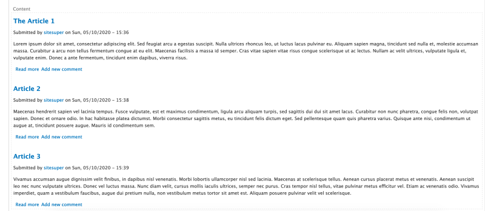

# Define a Custom Views Sort Plugin

## Content

Sort plugins are responsible for determining how the data in a list created with Views is sorted. Sort plugins are applied to fields. For example, a field might contain numbers and the sort plugin can handle putting the values into ascending or descending order. Typically, sort plugins work by adding to the `ORDER BY` clause of an SQL query.

The Views module provides sort plugins for all core field types. This includes handling for most primitive data types like strings and numbers. A typical use case for creating a custom sort plugin is extending an existing sort plugin with new conditions or custom sorting logic. For example, you might need to create an alphabetical title sort that excludes articles like *a*, *an*, and *the*. Or a sort based on combining the values in multiple fields.

In this tutorial we'll:

- Learn how to create a custom Views sort plugin
- Associate our custom sort plugin with a field exposed to Views
- Use the sort plugin in a view to sort a list of *Article* nodes

By the end of this tutorial you should know how to create a custom sort plugin for the title field.

## Goal

Create a custom Views sort plugin that sorts strings alphabetically while ignoring articles like “the”, “a”, and “an”. Then apply it to the title field on the *Article* content type.

## Prerequisites

- [Overview: Views Plugins](https://drupalize.me/tutorial/overview-views-plugins)
- [Implement a Plugin Using PHP Attributes](https://drupalize.me/tutorial/implement-plugin-using-php-attributes)

## Create custom module

Views sort plugins need to be defined in a module. For our example we'll create a new module named *title\_sort* with the following *title\_sort.info.yml* file. You can also add to an existing module.

Example *title\_sort/title\_sort.info.yml*:

```
name: Custom title sort
type: module
description: 'Custom title sort plugin.'
core_version_requirement: ^8 || ^9 || ^10
package: 'Custom'
dependencies:
  - drupal:views
```

Then enable the module either through the UI or using Drush.

## Follow these steps

### Define a sort plugin

Sort plugins live in the `Plugin\views\sort` PSR-4 sub-namespace, and use `\Drupal\views\Attribute\ViewsSort` attributes. In the *title\_sort* module, create the file *src/Plugin/views/sort/TitleSort.php*. Note that directory names are case-sensitive. Your final folder structure may look like the following:

```
title_sort
├── src
│      └── Plugin
│         └── views
│               └── sort
│                    └── TitleSort.php
└── title_sort.info.yml
```

Add the following to the *TitleSort.php* file:

```
namespace Drupal\title_sort\Plugin\views\sort;

use Drupal\views\Attribute\ViewsSort;
use Drupal\views\Plugin\views\sort\SortPluginBase;

/**
 * Basic sort handler for Titles without articles.
 */
#[ViewsSort("natural_title_sort")]
class TitleSort extends SortPluginBase {}
```

The `#[ViewsSort]` attributes contains the id of your custom plugin. We named ours `natural_title_sort`. We'll need to know this later to assign the plugin to a field.

Our class extends the `SortPluginBase` class. Another option is to extend an existing sort plugin and enhance its functionality.

### Define the sorting logic

Your full class may look something like shown below:

```
namespace Drupal\title_sort\Plugin\views\sort;

use Drupal\views\Attribute\ViewsSort;
use Drupal\views\Plugin\views\sort\SortPluginBase;

/**
 * Basic sort handler for Titles without articles.
 */
#[ViewsSort("natural_title_sort")]
class TitleSort extends SortPluginBase {

  /**
   * Called to add the sort to a query.
   */
  public function query() {
    $this->ensureMyTable();

    $this->query->addField(
      NULL,
      "TRIM(LEADING 'a ' FROM TRIM(LEADING 'an ' FROM TRIM( LEADING 'the ' FROM LOWER($this->realField))))",
      'natural_sort'
    );
    
    $this->query->addOrderBy(NULL, NULL, $this->options['order'], 'natural_sort');
  }
}
```

In the code above we implement the `query()` method. This allows us to make changes to the SQL query that Views executes. We call `$this->ensureMyTable()` to make sure that the table we want to query against is included in the query.

MySQL/MariaDB databases don't have built-in natural sort function implementations. And Drupal doesn't have a field that would store the title without an article. So we'll use the [generated columns](https://dev.mysql.com/doc/refman/5.7/en/create-table-generated-columns.html) feature of the database engine to create a new temporary field at run time and populate it with the value of another field after stripping the articles we want removed, and then use that field for sorting purposes. In a nutshell, we're adding an SQL expression to the existing query.

Our call to `$this->query->addField()` creates a computed SQL field that is actually not a field, but rather a MySQL expression that recursively trims leading *the*, *a*, and *an* articles from the title strings passed to the query field and stores it under the alias `natural_sort`. Since this is not a real field, instead of passing the table name as a first argument for the `addField()` method we pass `NULL`.

The last part of the code handles adding the sorting clause to the query. Here we pass `NULL` for the table and field since we aren't using a real field to sort by. If you'd like to sort by an existing field you would pass the database table name instead of the first `NULL`. For example, `node_field_data`. And declare a field or formula to sort on for the second `NULL`.

Example:

```
$this->query->addOrderBy([TABLE], 'EXAMPLE SQL SNIPPET', $this->options['order'], $this->realField)
```

`$this->options['order']` is handled by the parent plugin. It allows users to choose whether the sort should be `ASC` or `DESC`. And `$this->realField` is the name of the field the sort plugin is currently applied to.

### Tell Views about the custom sort plugin

Since we are going to attach a sort plugin to a field that is already exposed to Views we'll use `hook_views_data_alter()`.

Create a *title\_sort.module* file if it doesn't already exist and add a `title_sort_views_data_alter()` function. The code may look something like below:

```
/**
 * Implements hook_views_data_alter().
 */
function title_sort_views_data_alter(array &$data) {
  $data['node_field_data']['natural_title_sort'] = [
    'title' => t('Natural title sort'),
    'group' => t('Content'),
    'help' => t('Sort titles naturally'),
    'sort' => [
      'field' => 'title',
      'id' => 'natural_title_sort',
    ],
  ];
}
```

Here, we are extending the existing `node_field_data` table definition and defining a new field. We add a new key, `natural_title_sort`, that matches the id of our newly defined sort plugin. This definition follows the same format covered in [Expose a Custom Database Table to Views](https://drupalize.me/tutorial/expose-custom-database-table-views).

After making these changes you'll need to [clear the cache](https://drupalize.me/tutorial/clear-drupals-cache).

### Create a view to test it out

Using the Views UI, build a view of *Article* nodes with a block display limited to 5 items. Your configuration may look something like the following:

Image


In the sort section of the view, press *Add sort* and search for the *Natural title sort* option.

Image


Remove all other sort options and save the view. Scroll to the preview area of the view and see the new sort in action.

Image



In the example screenshot above *The Article 1* is listed first -- and the article *the* is ignored when sorting. If we used the default sort provided for the *title* field *The Article 1* would be at the bottom of the list.

## Recap

In this tutorial we learned how to create a custom sort plugin for Views that can sort *Articles* in alphabetical order by title while ignoring words like "a", "the", and "an". Then we applied the new sort plugin to an existing field using an implementation of `hook_views_data_alter()`.

## Further your understanding

- Look inside the Views module's sort plugin implementations. What other methods besides `query()` are there? What are they used for? Why didn't we need to implement them in our example?
- What do you need to change in order to add a sort plugin to the custom table exposed to the Views inside your custom module?
- Can you make the sort plugin configurable so that a user could provide a comma-separated list of words to ignore instead of hard coding it into the plugin?

## Additional resources

- [List of views hooks](https://api.drupal.org/api/drupal/core%21modules%21views%21views.api.php/11.x) (api.drupal.org)
- [Hook\_views\_data documentation](https://api.drupal.org/api/drupal/core%21modules%21views%21views.api.php/function/hook_views_data/) (api.drupal.org)
- [Views sort plugins documentation](https://api.drupal.org/api/drupal/core!modules!views!src!Plugin!views!sort!SortPluginBase.php/group/views_sort_handlers/) (api.drupal.org)

Was this helpful?

Yes

No

Any additional feedback?

Previous
[Define a Custom Views Filter Plugin](/tutorial/define-custom-views-filter-plugin?p=2939)

Next
[Define a Custom Views Area Handler Plugin](/tutorial/define-custom-views-area-handler-plugin?p=2939)

Clear History

Ask Drupalize.Me AI

close