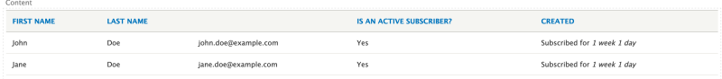

# Define a Views Field Handler Plugin

## Content

Views field handler plugins handle retrieving and displaying data within a view. The Drupal core Views module provides field plugins for all the core field types, and these work well for many situations where you need to describe custom data sets to Views. For situations where an existing plugin doesn't match your requirements, you can define a custom field handler plugin and alter both the query that gets executed and the rendered output of the data.

This is common for contributed modules that define new field types, or any module using `hook_views_data()` to define a dataset to Views where the data contained in a database column may need special handling in order to be displayed as part of a view.

In this tutorial we'll:

- Implement a custom Views field handler plugin
- Extend the default *date* field plugin and modify the way that it displays a timestamp so that instead of a specific date we get a relative value

By the end of this tutorial you should know how to define a custom field handler plugin and use it in a view.

## Goal

Define a field handler plugin for the created date field of a custom table tracking newsletter subscriptions that displays a relative value such as "Subscribed for 1 week".

## Prerequisites

- [Expose a Custom Database Table to Views](https://drupalize.me/tutorial/expose-custom-database-table-views)
- [Overview: Views Plugins](https://drupalize.me/tutorial/overview-views-plugins)

## Initial setup

In [Expose a Custom Database Table to Views](https://drupalize.me/tutorial/expose-custom-database-table-views) we created a custom module named *news* with a database table that contains newsletter subscriptions. We then used `hook_views_data()` to expose the custom table to Views. When doing so, we used field handler plugins provided by the Views module.

In this tutorial we're going to create a custom field handler plugin that we can use in place of the `date` filter currently being used with the `created` column in the custom database table. Our new filter will allow us to choose relative values for filtering like "Last week" or "Last month".

The process of creating a custom field handler is the same whether you're following this specific example or creating one for your use case. It consists of 2 steps:

- Create a custom field handler plugin class, usually by extending an existing one, and implement the display and query logic required for your data.
- Update the field definition in `hook_views_data()` (or `hook_views_data_alter()` if you want to use your custom field handler for data provided by another module) so that it uses your new plugin.

## Define a custom field handler plugin

### Define the plugin class

Views plugin classes are placed in the `Plugin\views\field` PSR-4 namespace. Note that directory names are case-sensitive. They use `\Drupal\views\Attribute\ViewsField` attributes.

In case of field handler plugins you'll often see an `@ingroup` property in the comments in addition to the required `ViewsField` attribute. This is purely for documentation purposes and makes it easier to find all field handlers.

Our attribute may look something like the following:

```
use Drupal\views\Attribute\ViewsField;

/**
 * A handler to provide custom displays for subscription dates.
 *
 * @ingroup views_field_handlers
 */
#[ViewsField("subscribed_views_field")]
```

Create the file *news/src/Plugin/views/field/SubscribedViewsField.php* with the following content:

```
<?php

namespace Drupal\news\Plugin\views\field;

use Drupal\views\Attribute\ViewsField;
use Drupal\views\Plugin\views\field\Date;
use Drupal\Core\Form\FormStateInterface;
use Drupal\views\ResultRow;

/**
 * A handler to provide custom displays for subscription dates.
 *
 * @ingroup views_field_handlers
 */
#[ViewsField("subscribed_views_field")]
class SubscribedViewsField extends Date {

  /**
   * {@inheritdoc}
   */
  public function buildOptionsForm(&$form, FormStateInterface $form_state) {
    parent::buildOptionsForm($form, $form_state);
    $form['date_format']['#options']['subscribed for'] = $this->t('Time span (with "Subscribed for" prepended)');
    $form['custom_date_format']['#states']['visible'][] = [
        ':input[name="options[date_format]"]' => ['value' => 'subscribed for'],
      ];
  }

  /**
   * {@inheritdoc}
   */
  public function render(ResultRow $values) {
    $value = $this->getValue($values);
    $format = $this->options['date_format'];
    if ($format == 'subscribed for') {
      $custom_format = $this->options['custom_date_format'];
      if ($value) {
        $timezone = !empty($this->options['timezone']) ? $this->options['timezone'] : NULL;
        // Will be positive for a datetime in the past (ago), and negative for a
        // datetime in the future (hence).
        $request_time = \Drupal::time()->getRequestTime();
        $time_diff = $request_time - $value;
        $time = $this->dateFormatter->formatTimeDiffSince($value, ['strict' => FALSE, 'granularity' => is_numeric($custom_format) ? $custom_format : 2]);
        return $this->t('Subscribed for %time', ['%time' => $time]);
      }
    }
    return parent::render($values);
  }

}
```

In the code above we extend the existing *Date* field handler rather than starting from scratch.

We override the `buildOptionsForm()` method and add our custom *subscribed for* option to the list of ways a date field could be displayed. This method is responsible for determining what fields are displayed in the form used to configure instances of the field when it's added to a view. In this case the `Date` plugin already had options such as *date\_format*, *custom\_date\_format* and *time\_zone*. We extended the *date\_format* option and added our own.

If you are building a custom field plugin from scratch, and you want it to be configurable, you'll need to implement the `buildOptionsForm()` method that returns a `$form` array. You will also need its companion `defineOptions()` method, which defines all available configuration options and returns an array of them. In our example we relied on the parent classes definition of `defineOptions()`.

We also overrode the `render()` method and added logic for our *subscribed for* option. The `$this->options` array contains the configuration values that correspond with what got entered into the `buildOptionsForm()` form. So if the `date_format` is set to our new `subscribed for` formatter we need to calculate a relative date string and return it. Otherwise, we can pass it along to the parent class to handle the display.

We can access the value of the created date field from the `ResultRow` object using `$this->getValue()` method of the field plugin class; it returns the value that's supposed to be rendered. Then the value is used to format and construct the final rendered output of the field.

### Update the `hook_views_data()` implementation

To make the field use our handler instead of the core `date` plugin, we'll need to modify our `hook_views_data()` function implementation in the *news.module* file. Update the field definition for the *created* field in that function to look something like the following:

```
 $data['news_subs']['created'] = [
    'title' => t('Created'),
    'help' => t('When subscriber record has been created'),
    'field' => [
      // ID of field handler plugin to use.
      'id' => 'subscribed_views_field',
    ],
    'sort' => [
      'id' => 'date',
    ],
    'filter' => [
      'id' => 'date',
    ],
    'argument' => [
      'id' => 'date',
    ],
  ];
```

Notice that we switched the `id` of the `field` plugin from *date* to *subscribed\_views\_field*. This matches the machine name of our custom plugin that we set in our attribute: `#[ViewsField("subscribed_views_field")]`.

Save the file and [clear the cache](https://drupalize.me/tutorial/clear-drupals-cache) so that Drupal sees our new custom database table definition. You should now be able to display the *created* field using the new relative *subscribed for* option.

If you'd like to update the handler for a field that was exposed to Views by another module you can use `hook_views_data_alter()` and update the plugin `id` that way.

### Configure a view to use it

Navigate to your view. In the *Fields* section, start searching for the *Created* field. Add the field and explore the options. You should see *Time span (with “Subscribed for” prepended)* as an option in the dropdown now.

**Note:** If the *created* field was already added to a view you'll need to remove it, and re-add it, for Views to start using the new field plugin.

Image


Select this option and save. Reload the preview of the view, and now you should see the *created* date rendered using the new format.

Image



## Recap

In this tutorial, we learned how to declare a custom field handler plugin. Specifically, we wrote a new plugin to allow display of a field containing a date using a string relative to the current date. We learned that creating a new field plugin consists of two steps: creating a custom class, and then updating the field definition to use it in the `hook_views_data()` implementation.

## Further your understanding

- How would you define a field plugin for a text field?
- What are the benefits of extending from the specialized plugin like `Date` vs. default base plugin class?

## Additional resources

- [List of views hooks](https://api.drupal.org/api/drupal/core%21modules%21views%21views.api.php/11.x) (api.drupal.org)
- [Hook\_views\_data documentation](https://api.drupal.org/api/drupal/core%21modules%21views%21views.api.php/function/hook_views_data/) (api.drupal.org)
- [Views field handlers](https://api.drupal.org/api/drupal/core!modules!views!src!Plugin!views!field!FieldPluginBase.php/group/views_field_handlers/) (api.drupal.org)

Was this helpful?

Yes

No

Any additional feedback?

Previous
[Overview: Views Plugins](/tutorial/overview-views-plugins?p=2939)

Next
[Define a Custom Views Pseudo Field Plugin](/tutorial/define-custom-views-pseudo-field-plugin?p=2939)

Clear History

Ask Drupalize.Me AI

close