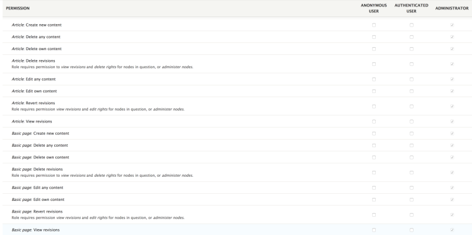

# Define Permissions for a Module

## Content

If you've ever built or administered a Drupal site, the permissions page (*/admin/people/permissions*) is probably quite familiar.

If you're new to module development, you may wonder where these permissions come from, and how you can specify your own permissions. In this tutorial we'll answer those questions.

First, we'll look at how to define permissions from within a custom module. We'll examine techniques that enable you to provide specific (static) permissions as well as dynamic permissions, which depend on another piece of data, such as the name of a content type. By the end of this tutorial you will understand how to add both static and dynamic permissions to a custom module.

## Goal

- Define and add static permissions to a custom module.
- Add support for dynamic permissions that depend on information that isn't available to our custom module.

## Prerequisites

- [Managing User Accounts](https://drupalize.me/series/user-guide/user-chapter) (Drupal User Guide) — This tutorial is written for developers who want to add a custom permission to their module; but, as a developer, you should understand the concepts of users, roles, and permissions and how they are configured in the UI. We recommend you review this chapter of the User Guide if you are unfamiliar with these concepts in Drupal.

## The Permissions page

To access the permissions page, from the Manage menu, navigate to People > Permissions (*/admin/people/permissions*).

Image


## Add existing permissions to a controller

A common use case is to create a custom page in a module through creating a route and a controller. You can set previously-defined permissions in the module's *MODULE.routing.yml* file. For example, to require that the user have `'access content'` permissions before viewing a page created via a controller, add a `requirements` key to the routing YAML file and below that, `_permission: 'access content'`.

Example:

```
dino_says:
  path: '/the/dino/says'
  defaults:
    _controller: Drupal\dino_roar\Controller\RoarController::roar
  requirements:
    _permission: 'access content'
```

Other examples may be found in *core/modules*. See *core/modules/block/block.routing.yml* for several examples of setting permission requirements for specific module-provided paths, produced with and without controllers.

A snippet of *core/modules/block/block.routing.yml*:

```
block.admin_demo:
  path: '/admin/structure/block/demo/{theme}'
  defaults:
    _controller: '\Drupal\block\Controller\BlockController::demo'
    _title_callback: 'theme_handler:getName'
  requirements:
    _access_theme: 'TRUE'
    _permission: 'administer blocks'
  options:
    _admin_route: FALSE

entity.block.delete_form:
  path: '/admin/structure/block/manage/{block}/delete'
  defaults:
    _entity_form: 'block.delete'
    _title: 'Delete block'
  requirements:
    _permission: 'administer blocks'
```

## Create custom static permissions

For our custom module demo, we're going to use code from the [Examples](https://www.drupal.org/project/examples) project, specifically the *content\_entity\_example*. If you'd like to follow along, see the [completed code here](https://git.drupalcode.org/project/examples/-/tree/3.x/modules/content_entity_example), or download the Examples module from the project page.

The simplest type of permissions a custom module can provide are called static permissions. These are defined by a module and their values are fixed. Like many other pieces of metadata in Drupal, static permissions are specified in a YAML file that accompanies your custom code. In order to define static permissions your module needs to include a *MODULENAME.permissions.yml* file. This file uses the permission name as a key, and then contains additional options for the value. Let's look at the *content\_entity\_example*. Here is the content of the *content\_entity\_example/content\_entity\_example.permissions.yml* file:

```
'delete contact entity':
  title: Delete entity content
'add contact entity':
  title: Add entity content
'view contact entity':
  title: View entity content
'edit contact entity':
  title: Edit entity content
'administer contact entity':
  title: Administer settings
```

The keys in this YAML file are the actual permission names. Later on, when you perform a check in your code for a particular permission, the keys are what you'll be looking for, for example, `'edit contact entity'`. Meanwhile the *title* value is what will be rendered on the permissions administration user interface.

There are additional values possible for permissions that aren't utilized in this example. Permissions can also provide *description* and *restrict access* keys. The *description* can be used to provide additional information to the site administrators on the configuration screen. The *restrict access* key is used to warn users that this particular permission has serious security implications and should be given out only to trusted users. A more complete permissions YAML file including these settings may look something like this:

```
'delete contact entity':
  title: Delete entity content
  description: Allows users to delete contacts.
'add contact entity':
  title: Add entity content
'view contact entity':
  title: View entity content
'edit contact entity':
  title: Edit entity content
  description: Allows users to edit contacts.
'administer contact entity':
  title: Administer settings
  description: Allows users to alter the settings related to contacts.
  restrict access: TRUE
```

## Dynamic permissions

Often the information required to define a permission is not static, or readily cacheable. In this case your module can define a permission callback in the *permissions.yml* file. When Drupal is gathering information about the available permissions this callback function will be executed in order to define additional permissions. Perhaps the most familiar example of dynamic permissions in Drupal core comes from the Node module.

An installation of Drupal using the standard installation profile will define two content types: Page and Article. For each content type, Drupal defines several permissions:

- create
- edit own
- edit any
- delete own
- delete any
- view revisions
- revert revisions
- delete revisions

Since each of these permissions exists for each content type, and site builders can add their own content types at any time, the Node module makes use of dynamic permissions to generate the familiar configuration screen seen below.

Image



Let's take a look at the permissions YAML file */modules/node/node.permissions.yml* to see how these dynamic permissions are defined.

```
bypass node access:
  title: 'Bypass content access control'
  description: 'View, edit and delete all content regardless of permission restrictions.'
  restrict access: true
administer content types:
  title: 'Administer content types'
  description: 'Maintain the types of content available and the fields that are associated with those types.'
  restrict access: true
administer nodes:
  title: 'Administer content'
  description: 'Promote, change ownership, edit revisions, and perform other tasks across all content types.'
  restrict access: true
access content overview:
  title: 'Access the Content overview page'
access content:
  title: 'View published content'
view own unpublished content:
  title: 'View own unpublished content'
view all revisions:
  title: 'View all revisions'
revert all revisions:
  title: 'Revert all revisions'
  description: 'Role requires permission <em>view revisions</em> and <em>edit rights</em> for nodes in question or <em>administer nodes</em>.'
delete all revisions:
  title: 'Delete all revisions'
  description: 'Role requires permission to <em>view revisions</em> and <em>delete rights</em> for nodes in question or <em>administer nodes</em>.'

permission_callbacks:
  - \Drupal\node\NodePermissions::nodeTypePermissions
```

Most of this YAML file should already look familiar, since it defines static permissions. The portion we're most interested in now can be found at the very bottom of the file, with the `permission_callbacks` key. This key defines the callback function that will be used to generate the dynamic permissions provided by the node module. In this case, it's pointing to the `nodeTypePermissions` method in the `NodePermissions` class within the `\Drupal\node` namespace. This class can be found in the */modules/node/src/NodePermissions.php* file. Here is the `nodeTypePermissions` method that we're using as a permissions callback:

```
  /**
   * Returns an array of node type permissions.
   *
   * @return array
   *   The node type permissions.
   *   @see \Drupal\user\PermissionHandlerInterface::getPermissions()
   */
  public function nodeTypePermissions() {
    $perms = array();
    // Generate node permissions for all node types.
    foreach (NodeType::loadMultiple() as $type) {
      $perms += $this->buildPermissions($type);
    }

    return $perms;
  }
```

This method returns a structured array that matches the key/value specifications used to define static permissions, but it does this within a `foreach` loop that is executed for each content type defined by our site. Each content type then has the `buildPermissions` method executed to build up the permissions array. This method is responsible for defining the actual dynamic permissions that are generated by the Node module.

```
 /**
   * Returns a list of node permissions for a given node type.
   *
   * @param \Drupal\node\Entity\NodeType $type
   *   The node type.
   *
   * @return array
   *   An associative array of permission names and descriptions.
   */
  protected function buildPermissions(NodeType $type) {
    $type_id = $type->id();
    $type_params = array('%type_name' => $type->label());

    return array(
      "create $type_id content" => array(
        'title' => $this->t('%type_name: Create new content', $type_params),
      ),
      "edit own $type_id content" => array(
        'title' => $this->t('%type_name: Edit own content', $type_params),
      ),
      "edit any $type_id content" => array(
        'title' => $this->t('%type_name: Edit any content', $type_params),
      ),
      "delete own $type_id content" => array(
        'title' => $this->t('%type_name: Delete own content', $type_params),
      ),
      "delete any $type_id content" => array(
        'title' => $this->t('%type_name: Delete any content', $type_params),
      ),
      "view $type_id revisions" => array(
        'title' => $this->t('%type_name: View revisions', $type_params),
      ),
      "revert $type_id revisions" => array(
        'title' => $this->t('%type_name: Revert revisions', $type_params),
        'description' => t('Role requires permission <em>view revisions</em> and <em>edit rights</em> for nodes in question, or <em>administer nodes</em>.'),
      ),
      "delete $type_id revisions" => array(
        'title' => $this->t('%type_name: Delete revisions', $type_params),
        'description' => $this->t('Role requires permission to <em>view revisions</em> and <em>delete rights</em> for nodes in question, or <em>administer nodes</em>.'),
      ),
    );
  }
```

The structured array being assembled here should be quite familiar. The format exactly matches the static permissions we've already seen in the *node.permissions.yml* file.

## Recap

In this tutorial we took a look at how to define permissions within a custom module. Permissions are defined in YAML syntax as key/value pairs. The machine name of the permission functions as the key. Each permission can have a title, description, and optionally a restrict access value. Dynamic permissions are similarly defined, but they are assembled within a callback function defined by the `permission_callbacks` key in the YAML file.

## Further your understanding

- Take a look at the permissions for some of the modules in core. Without looking at the *permissions.yml* files can you guess which modules will have only static permissions?
- For what other kinds of scenarios might you use dynamic permissions in a custom module?

## Additional resources

- [Change record for hook\_permission replacement](https://www.drupal.org/node/2311427) (Drupal.org)

Was this helpful?

Yes

No

Any additional feedback?

Previous
[Set a Dynamic Title for a Route](/tutorial/set-dynamic-title-route?p=3134)

Next
[Add Access Checking to a Route](/tutorial/add-access-checking-route?p=3134)

Clear History

Ask Drupalize.Me AI

close