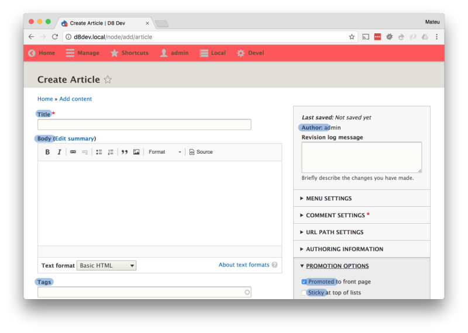

# Detect Presentation in Your Data Model

## Content

Identifing the fields in your data model that contain presentation data is an important part of documenting and planning your API. Examining your existing data model will help put you in the correct mindset when creating or changing it. It is important to reflect on the implications of each field for each hypothetical consumer (even consumers your API is not serving). This process will improve your content model and your API.

In this tutorial we will:

- Go through the article content type's data model
- Locate any fields that contain presentation data

The article model is created out of the box by Drupal when using the standard installation profile.

By the end of this tutorial you'll know how to do these checks, and identify presentation data in your content model, on any content type in your project.

## Goal

Create a table containing a list of fields in the article content type classified by whether they represent presentational information or not.

## Prerequisites

- [Install](https://www.drupal.org/docs/installing-drupal) the standard Drupal profile. You can also use a content type in your project instead.
- [Have drush installed in your local development environment](http://docs.drush.org/en/master/install). This is optional, but highly recommended.

## Detecting presentation logic

In this tutorial we will go over the article content type, one field at a time, to see if the field contains presentation logic.

### Extract the field list

There are two different ways to explore the fields in the content type. One is to navigate to <https://example.org/node/add/article> to access the article creation form. From there you can see the available fields by looking at the form elements.

Image



The other option is to use the *interactive shell* to explore the fields attached to the article content type. To start the interactive shell open a terminal, then navigate to your Drupal site installation folder, and type:

```
drush php:cli
```

Note: drush `php:cli` aliases: `php`, `core:cli`, `core-cli`. [Documentation for php:cli](https://drushcommands.com/drush-9x/php/php:cli/) (drushcommands.com).

That will open a Drupal terminal that will allow you to execute arbitrary code. The thing that I like about this is that we can get immediate feedback on that arbitrary code. Inside the terminal copy and paste the following code.

```
// Load the field definitions for the article content type.
$definitions = $container->get('entity_field.manager')->getFieldDefinitions(
    'node',
    'article'
);
// Extract the field ID, label and description. The terminal will print it.
array_map(
    function ($def) {
        return [
            'label' => (string) $def->getLabel(),
            'description' => (string) $def->getDescription(),
        ];
    },
    $definitions
);
```

That will produce a complete list of the fields we want to inspect. I have formatted the output of that command into a table. In addition to it I have added a column called *Presentation?* that we'll use to indicate whether the field contains presentation logic or not.

| Field | Name | Description | Presentation? |
| --- | --- | --- | --- |
| nid | ID |  | Yes/No |
| uuid | UUID |  | Yes/No |
| vid | Revision ID |  | Yes/No |
| langcode | Language |  | Yes/No |
| type | Content type |  | Yes/No |
| status | Publishing status | A boolean indicating the published state. | Yes/No |
| title | Title |  | Yes/No |
| uid | Authored by | The username of the content author. | Yes/No |
| created | Authored on | The time that the node was created. | Yes/No |
| changed | Changed | The time that the node was last edited. | Yes/No |
| promote | Promoted to front page |  | Yes/No |
| sticky | Sticky at top of lists |  | Yes/No |
| revision\_timestamp | Revision timestamp | The time that the current revision was created. | Yes/No |
| revision\_uid | Revision user ID | The user ID of the author of the current revision. | Yes/No |
| revision\_log | Revision log message | Briefly describe the changes you have made. | Yes/No |
| revision\_translation\_affected | Revision translation affected | Indicates if the last edit of a translation belongs to current revision. | Yes/No |
| default\_langcode | Default translation | A flag indicating whether this is the default translation. | Yes/No |
| path | URL alias |  | Yes/No |
| body | Body |  | Yes/No |
| comment | Comments |  | Yes/No |
| field\_image | Image |  | Yes/No |
| field\_tags | Tags | Enter a comma-separated list. For example: Amsterdam, Mexico City | Yes/No |

You can also use [Docson](https://drupalize.me/tutorial/automatic-documentation-schemata) to generate the field list, but bear in mind that the list of fields on the API and on the content model may vary slightly.

Next we are going to analyze each field to identify if any of the fields contain presentation logic. For brevity I will only do this for a selected group of fields.

### Status

One can argue that the status field does not contain semantic value for the article content type. While this may be true, it is important to note that often times we need to add fields to the content types that drive back-end business logic. While that may not have semantic value as content, it reflects the state of that particular node.

Status is **not a presentational** field.

### Promote

The promote field is in a gray area. It can be included in both groups. Some times there is not a straight answer for a field. In this case, in my opinion, it is not presentational because it can be used by any consumer to gather a manually curated selection of articles. To me this is a field that defines the article a little better; it enhances our understanding of that piece of content. This field indicates: *this is not a regular article, it's an important article*.

If I could define this field (it comes with the standard install profile) I would call it *important* instead of *promoted*. It is called *promoted* because of how it causes the article to be presented in the front page of the monolithic Drupal front-end. As you see there are underlying semantics to the field, but the name implies some presentational business logic.

Promote is **not a presentational** field, according to my criteria. You may rule it as presentational and create a field called *important* in its place.

### Sticky

*Sticky at the top of lists* strongly suggests how the article should be shown based on the content of the field. The back-end must not dictate how articles are going to be displayed. What if we want to have different logic that decides which articles should be highlighted to different consumers, beyond making them sticky? In that situation, a sticky checkbox will not be enough. Instead we want to give the consumers enough semantic information so each can make its own choice.

Sticky is **a presentational** field.

### Field image

The image field in the article can also give you pause. You can be thinking that this field only makes sense for consumers that can *display* information. What about Alexa, Google Voice, etc.? That is the exact mindset and mental triggers you need to have. Well done! My opinion is that an image helps understand the article a little better by providing extra information. Therefore the image has semantic value.

Field Image is **not a presentational** field.

## Recap

In this tutorial we learned to identify fields in our content types that have presentational meaning. As explained in the previous tutorial, we want to avoid these kinds of fields or contain them in a separate content type.

In particular we have:

- Listed all the fields in a content type using the interactive console.
- Reasoned about the semantic and presentational properties of each individual field.

An important takeaway of this tutorial is that in many occasions there will not be a correct answer; both options will work.

## Further your understanding

- Learn more about the [`drush core-cli` console](http://blog.damiankloip.net/2015/drush-php).
- Go through the rest of the fields in your content type and assess whether or not they contain presentational data. How many of them did you mark yes? Why did you mark them yes?
- What will you do with the presentational fields? Will you remove them, replace them to capture their underlying semantics, or move them to an associated presentation-only content type?

## Additional resources

- Learn more about the [`entity_field.manager` service](https://api.drupal.org/api/drupal/core%21lib%21Drupal%21Core%21Entity%21EntityFieldManager.php/class/EntityFieldManager).
- [Drush Commands](https://drushcommands.com/) (drushcommands.com)

Was this helpful?

Yes

No

Any additional feedback?

Previous
[Separation of Concerns: Content vs. Presentation](/tutorial/separation-concerns-content-vs-presentation?p=2960)

Next
[Modern Web Services with JSON:API and GraphQL](/tutorial/modern-web-services-jsonapi-and-graphql?p=2960)

Clear History

Ask Drupalize.Me AI

close