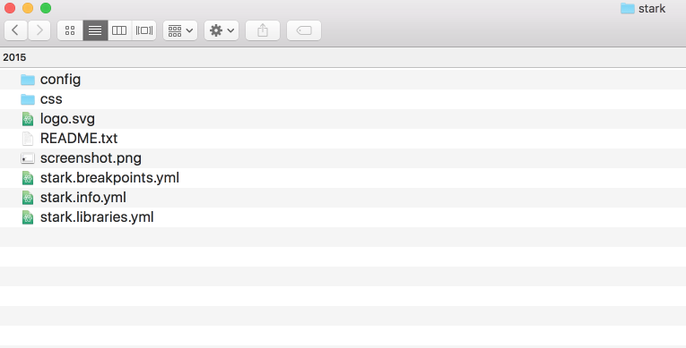

# Drupal Base Themes: Stable and Classy

## Content

## This page is archived

We're keeping this page up as a courtesy to folks who may need to refer to old instructions. We don't plan to update this page.

### Alternate resources

Stable and Classy have been removed from core. For new themes, see [Start a New Theme with Starterkit](https://drupalize.me/tutorial/start-new-theme-starterkit?p=3267). To update a theme's dependency on `stable` or `classy`, see the following change records on Drupal.org:

- [Stable theme has been removed from core](https://www.drupal.org/node/3309392)
- [Classy removed and replaced with Starterkit theme generator](https://www.drupal.org/node/3305674)

Drupal core comes with a few base themes: Stable, Stable 9, Classy, and Stark. Each one has a different intended use case. And all of them are useful as a reference for building your own themes.

In this tutorial we'll:

- Learn what each of the base themes included in Drupal core is intended to be used for
- Compare the output from the base themes with a focus on Stable and Classy

By the end of this tutorial you'll be able to explain the use case for each of the base themes included with Drupal core and make an informed decision about which, if any, to use when creating your own custom themes.

## Goal

Understand the use case for each of the base themes in Drupal core.

## Prerequisites

- [Theme Inheritance with Base Themes](https://drupalize.me/tutorial/theme-inheritance-base-themes)

## Drupal core base themes

There are several themes that ship with Drupal core (Bartik, Classy, Seven, Stable and Stark). Bartik is the default user-facing theme, or the theme you first see when you install Drupal using the standard profile. Seven is the default administration theme. When you visit the admin pages on a new Drupal installation you'll see the Seven theme in action. That leaves us with three remaining themes: Classy, Stable and Stark.

## Stark

It's probably unsurprising to learn that the Stark theme provides the absolute minimal amount of markup and CSS. It's primarily for demonstration purposes, or for sites that have very strict markup and semantic requirements. Unless you plan to implement a custom version of each of Drupal's default templates, Stark probably isn't a good choice for a base theme. But it can be incredibly helpful in tracking down module-related markup and CSS bugs.

## Stable

Stable is Drupal's "clean" base theme. It provides minimal markup and a small handful of CSS classes. The intent is that this Stable base theme will be used as a backwards compatibility layer protecting your theme against changes to core's markup and styling. If you're looking to build a custom theme with complete control over all of the markup and styling you should take a look at using Stable as your base theme.

Note: In older versions of Drupal 8 if you did not specify a `base theme` key Drupal would default to using stable as the base theme. As of Drupal 8.8.x this functionality has been deprecated, and the fallback to stable as a default will be removed for Drupal 9. [Change record](https://www.drupal.org/node/3066038).

## Stable 9

Drupal 9 includes both the Stable and Stable 9 base themes. Stable in this case is the same markup from the Stable theme in Drupal 8.9.x. Stable 9 includes all the markup changes that were added to Drupal core during the Drupal 9 development cycle. If you're starting a new theme, and you're building on Drupal 9, you should use Stable 9 instead of Stable. If you're upgrading from Drupal 8 to 9 using the Drupal 8 version of Stable will work fine but you should work to eventually migrate to Stable 9 as the Drupal 8 version of Stable will be removed in Drupal 10.

## Classy

The last core theme to take a look at is the Classy theme. Classy provides the rich markup familiar to users of previous versions of Drupal. Its markup provides many classes as well as an attempt at basic styling of core's markup. Classy is used as the base theme for both the Bartik and Seven themes. Its markup attempts to provide defaults that will be helpful to the majority of sites.

## Base theme comparison

The decision to use Stable or Classy as the base theme for you site comes down to a decision between pristine, clean, semantic markup (Stable), or a collection of reasonably verbose defaults (Classy), that minimize the amount of reimplementation needed. Let's take a look at what this actually looks like in practice. If we take a look at the Stark theme directory (*/core/themes/stark*) we can see that there are no template files at all.

Image



If we compare that to the Stable theme (*/core/themes/stable*) we see that it ships with several templates. (In fact Stable includes every template available to Drupal core.)

Image


The existence of these template files gives our theme some stability, and provides us with an example of what we need to override in our custom theme without being extremely opinionated about the markup and classes in our templates. To illustrate what this means, let's take a look at the main node template in both the Stable and Classy themes.

### Stable: *node.html.twig*

Here are the contents of */core/themes/stable/templates/content/node.html.twig*:

```
<article{{ attributes }}>

  {{ title_prefix }}
  
    <h2{{ title_attributes }}>
      <a href="{{ url }}" rel="bookmark">{{ label }}</a>
    </h2>
  
  {{ title_suffix }}

  
    <footer>
      {{ author_picture }}
      <div{{ author_attributes }}>
        Submitted by {{ author_name }} on {{ date }}
        {{ metadata }}
      </div>
    </footer>
  

  <div{{ content_attributes }}>
    {{ content }}
  </div>

</article>
```

You can see there are basic attributes being added to the main page elements, but the overall the markup is quite clean. We can compare this to the implementation provided by the Classy theme (in */core/theme/class/templates/content/node.html.twig*)

### Classy: *node.html.twig*

```

{{ attach_library('classy/node') }}
<article{{ attributes.addClass(classes) }}>

  {{ title_prefix }}
  
    <h2{{ title_attributes }}>
      <a href="{{ url }}" rel="bookmark">{{ label }}</a>
    </h2>
  
  {{ title_suffix }}

  
    <footer class="node__meta">
      {{ author_picture }}
      <div{{ author_attributes.addClass('node__submitted') }}>
        Submitted by {{ author_name }} on {{ date }}
        {{ metadata }}
      </div>
    </footer>
  

  <div{{ content_attributes.addClass('node__content') }}>
    {{ content }}
  </div>

</article>
```

Here you can see additional classes are added to provide additional semantics for nodes that are promoted, sticky, or unpublished. The markup generated by this template file probably looks quite familiar if you've developed themes in previous versions of Drupal. The classes added by the Classy theme are sane defaults, that help enable simple styling for the majority of theme developers.

## Recap

In this tutorial we learned about the use case for each of the three base themes (Stable, Classy, and Stark) included in Drupal core. We also compared the output from Stable and Classy to better demonstrate the contextual classes and additional markup that the Classy theme adds.

## Further your understanding

Take a look through some other templates provided by both the Stable and Classy themes. In general, the additional classes provided by the Classy theme are likely to come in handy, unless your theme requires the absolute minimum amount of markup. Thankfully, in Drupal we have this choice, and can easily opt for clean markup or sane defaults. If you'd like to read more about how the community arrived at the decision to support these two themes, you can read more about the ["Consensus Banana" in the issue queue](https://www.drupal.org/node/2289511).

Or, if you'd like to dive in and get started with your own theme you may also be interested in the tutorial [Use a Base Theme](https://drupalize.me/tutorial/use-base-theme).

## Additional resources

- [Using Classy as a base theme](https://www.drupal.org/docs/8/theming-drupal-8/using-classy-as-a-base-theme) (Drupal.org)
- [Classy Theming](http://drupalwatchdog.net/volume-5/issue-1/classy-theming). (Drupal Watchdog)
- [Theming Drupal](https://www.drupal.org/docs/theming-drupal) (Drupal.org)
- [[meta] Results of Drupalcon Austin's Consensus Banana](https://www.drupal.org/node/2289511) (Drupal.org)
- [Controlling CSS Classes with the Classy Theme in Drupal 8](https://drupalize.me/blog/201411/controlling-css-classes-classy-theme-drupal-8) (Drupalize.Me)
- [A Tale of Two Base Themes in Drupal 8 core](https://www.lullabot.com/articles/a-tale-of-two-base-themes-in-drupal-8-core) (Lullabot.com)

Was this helpful?

Yes

No

Any additional feedback?

Previous
[Theme Inheritance with Base Themes](/tutorial/theme-inheritance-base-themes?p=3267)

Next
[Use a Base Theme](/tutorial/use-base-theme?p=3267)

Clear History

Ask Drupalize.Me AI

close