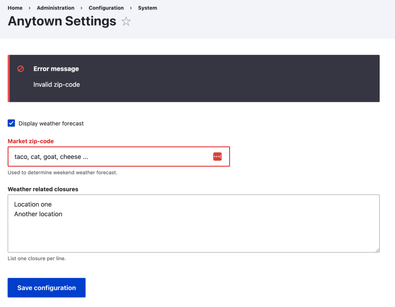

# Validate User Input for the Settings Form

## Content

We must validate user input entered in forms to ensure data integrity and security. In our Anytown module, we need to verify that the location input for the weather forecast API is a valid 5-digit ZIP code.

In this tutorial, we'll:

- Add a `validateForm()` method to the form controller.
- Ensure the `location` field contains a 5-digit ZIP code.
- Display an error if validation fails.

By the end of this tutorial, you'll know how to add custom validation logic to a form.

## Goal

Ensure the location input for the configuration form is a valid 5-digit ZIP code.

## Prerequisites

- [Create a Settings Form for the Anytown Module](https://drupalize.me/tutorial/create-settings-form-anytown-module)

## Video tutorial

Sprout Video

## Validating user input

While the Form API handles basic data validation according to the input type, ensuring data meets application-specific requirements is the responsibility of the form controller. The Anytown module's configuration form requires the location to be a 5-digit ZIP code. We can enhance our form controller to include this validation logic.

`FormInterface` requires a `validateForm()` method for form validation. Our `SettingsForm` extends `ConfigFormBase`, which provides a basic implementation. Let's override this method to include our ZIP code validation logic.

### Update the form controller

Modify *src/Form/SettingsForm.php* and add the following `validateForm()` method:

```
<?php 

declare(strict_types=1);

namespace Drupal\anytown\Form;

use Drupal\Core\Form\ConfigFormBase;
use Drupal\Core\Form\FormStateInterface;

/**
 * Configure Anytown settings for this site.
 */
final class SettingsForm extends ConfigFormBase {

  /**
   * Name for module's configuration object.
   */
  const SETTINGS = 'anytown.settings';

  /**
   * {@inheritdoc}
   */
  public function getFormId(): string {
    return self::SETTINGS;
  }

  /**
   * {@inheritdoc}
   */
  protected function getEditableConfigNames(): array {
    return [self::SETTINGS];
  }

  /**
   * {@inheritdoc}
   */
  public function buildForm(array $form, FormStateInterface $form_state): array {
    $form['display_forecast'] = [
      '#type' => 'checkbox',
      '#title' => $this->t('Display weather forecast'),
      '#default_value' => $this->config(self::SETTINGS)->get('display_forecast'),
    ];

    $form['location'] = [
      '#type' => 'textfield',
      '#title' => $this->t('Market zip-code'),
      '#description' => $this->t('Used to determine weekend weather forecast.'),
      '#default_value' => $this->config(self::SETTINGS)->get('location'),
      '#placeholder' => '90210',
    ];

    $form['weather_closures'] = [
      '#type' => 'textarea',
      '#title' => $this->t('Weather related closures'),
      '#description' => $this->t('List one closure per line.'),
      '#default_value' => $this->config(self::SETTINGS)->get('weather_closures'),
    ];
    return parent::buildForm($form, $form_state);
  }

  /**
   * {@inheritdoc}
   */
  public function validateForm(array &$form, FormStateInterface $form_state): void {
    parent::validateForm($form, $form_state);

    // Verify that the location field contains an integer and that it is 5
    // digits long.
    $location = $form_state->getValue('location');
    $value = filter_var($location, FILTER_VALIDATE_INT);
    if (!$value || strlen((string) $value) !== 5) {
      // Set an error on the specific field. This will halt form processing
      // and re-display the form with errors for the user to correct.
      $form_state->setErrorByName('location', $this->t('Invalid ZIP code'));
    }

  }

}
```

The `validateForm()` method takes 2 arguments:

- `$form`: Contains a definition of the form being validated.
- `$form_state`: Contains data about the current processing state of the form. Because the form has been submitted, **this includes user input**.

In this implementation we:

- Use `$form_state->getValue('location')` to get the user-entered `location` field value. Note that `'location'` here matches the key of the element in the `$form` array from the `build()` method.
- Call `$form_state->setErrorByName('location', $this->t('Invalid ZIP code'));` to register an error on the `'location'` element in the `$form` array if the value doesn't pass our validation logic. Errors should be associated with a specific field whenever possible so Drupal can provide helpful cues in the UI like highlighting the elements with errors.

### Verify it works

In the *Manage* administration menu navigate to *Configuration* > *System* > *Anytown Settings* (*admin/config/system/anytown*), and fill in the form. Try inputting something other than a 5-digit value and verify that form processing is halted and an error is displayed.

Example:

Image



With this update we can ensure that the data our form collects will be in the format we need it.

Learn about other validation methods.

- [Add a Validation Callback to an Existing Form](https://drupalize.me/tutorial/add-validation-callback-existing-form)
- [Validate a Single Form Element](https://drupalize.me/tutorial/validate-single-form-element)

## Recap

We've added custom validation logic to our Anytown module's configuration form, ensuring the location input is a valid 5-digit ZIP code.

## Further your understanding

- What would happen if `validateForm()` sets errors for multiple fields simultaneously?
- How would you handle a generic form error not associated with a specific field?

## Additional resources

- [Validate Form Input](https://drupalize.me/tutorial/validate-form-input) (Drupalize.Me)
- [Validate a Form via the Form Controller](https://drupalize.me/tutorial/validate-form-form-controller) (Drupalize.Me)
- [Add a Validation Callback to an Existing Form](https://drupalize.me/tutorial/add-validation-callback-existing-form) (Drupalize.Me)
- [Validate a Single Form Element](https://drupalize.me/tutorial/validate-single-form-element) (Drupalize.Me)

Was this helpful?

Yes

No

Any additional feedback?

Previous
[Create a Settings Form for the Anytown Module](/tutorial/create-settings-form-anytown-module?p=3242)

Next
[Save Form Data Submitted by a User](/tutorial/save-form-data-submitted-user?p=3242)

Clear History

Ask Drupalize.Me AI

close