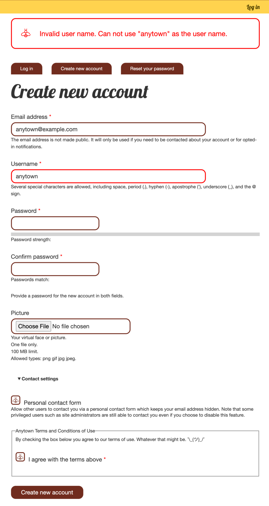

# Alter the User Registration Form

## Content

Let's combine our knowledge of implementing hooks and `hook_form_alter()` to customize a form built by another module, the user registration form. For the Anytown Farmer's Market site's user registration form, we want to introduce 2 new features: a mandatory "Accept terms of use" checkbox and custom validation to prevent registration with the username "anytown".

In this tutorial, we'll:

- Identify the form ID of the user registration form.
- Incorporate new elements into the user registration form.
- Implement additional validation logic.

By the end of this tutorial, you should be able to use `hook_form_alter()` to customize any existing Drupal form.

## Goal

Add a required "terms of use" checkbox form element and custom username validation to the existing user registration form.

## Prerequisites

- [Overview: Drupal's Form API](https://drupalize.me/tutorial/overview-drupals-form-api)
- [Concept: Altering Existing Forms](https://drupalize.me/tutorial/concept-altering-existing-forms)
- [Implement hook\_help()](https://drupalize.me/tutorial/implement-hookhelp)

## Video tutorial

Sprout Video

## Add a terms of service for new users

The Anytown Farmer's Market's user registration form now requires:

- A mandatory agreement to the terms of use before account creation.
- Preventing the use of "anytown" as a username.

To fulfill these requirements, we'll use `hook_form_alter()` to customize the registration form.

### Identify the form's ID

For a performance-efficient `hook_form_alter` implementation, we need to target the user registration form in the function name. To do this, we need to know the form's ID.

As an anonymous user, visit the *user/register* page. Update your site's configuration (*admin/config/people/accounts*) if anonymous user registration is disabled.

To find the form ID, inspect the page's source for the opening `<form>` tag:

```
<form class="user-register-form user-form" enctype="multipart/form-data" action="/user/register" method="post" id="user-register-form" ... >
```

Convert the `id` attribute value from the `<form>` tag to the form ID by replacing dashes (`-`) with underscores (`_`), resulting in `user_register_form`.

### Implement `hook_form_FORM_ID_alter()`

Knowing the form ID allows for the precise naming of our `hook_form_FORM_ID_alter()` implementation. This results in a hook short name for use in our `#[Hook]` attribute of `form_user_register_form_alter`.

Create a new file named *src/Hook/AnytownFormAlters.php* with the following code:

```
<?php

declare(strict_types=1);

namespace Drupal\anytown\Hook;

use Drupal\Core\Form\FormStateInterface;
use Drupal\Core\Hook\Attribute\Hook;

class AnytownFormAlters {

  /**
   * Implements hook_form_FORM_ID_alter() for the registration form.
   */
  #[Hook('form_user_register_form_alter')]
  public function formUserRegisterFormAlter(&$form, FormStateInterface $form_state) : void {
    // Add our custom validation handler.
    $form['#validate'][] = 'anytown_user_register_validate';

    $form['terms_of_use'] = [
      '#type' => 'fieldset',
      '#title' => t('Anytown Terms and Conditions of Use'),
      '#weight' => 10,
      // Admin users can skip the terms of use, this will let them create accounts
      // for other people without seeing these fields.
      '#access' => !\Drupal::currentUser()->hasPermission('administer users')
    ];

    $form['terms_of_use']['terms_of_use_data'] = [
      '#type' => 'markup',
      '#markup' => '<p>By checking the box below you agree to our terms of use. Whatever that might be. ¯\_(ツ)_/¯</p>',
    ];

    $form['terms_of_use']['terms_of_use_checkbox'] = [
      '#type' => 'checkbox',
      '#title' => t('I agree with the terms above'),
      '#required' => TRUE,
    ];
  }

}
```

Update, or add if it doesn't exist, the *anytown.module* file in the root directory of the module to include the following code:

```
<?php

use Drupal\Core\Form\FormStateInterface;

/**
 * Custom validation handler for the user registration form.
 */
function anytown_user_register_validate(&$form, FormStateInterface $form_state) {
  if ($form_state->getValue('name') === 'anytown') {
    $form_state->setErrorByName('name', t('The username "anytown" is invalid. Please choose a different name.'));
  }
}
```

This updated code:

- Adds a custom validation callback to the form via `$form['#validate'][] = 'anytown_user_register_validate';`. This tells the Form API that during the validation phase of the Form API workflow, it should also call the `anytown_user_registration_validate()` function. The callback checks to ensure the username is not set to "anytown". This demonstrates how an implementation of `hook_form_alter` can customize validation for an element on an existing form.
- Modifies the `$form` array and adds a "Terms and Conditions of Use" `<fieldset>` element to the form. We added a paragraph of text and a checkbox nested inside the fieldset. Here you can see that by implementing `hook_form_alter`, we can add new elements and behavior to a form built by another module.
- The `#required` property is set to `TRUE` for the checkbox which tells Drupal to mark the form as invalid if the field is empty. This is a common validation need, so Drupal provides this property as a shortcut.
- Adds `use Drupal\Core\Form\FormStateInterface;` to the `use` statements, so that the type hint for `FormStateInterface` in both functions will work properly.

Alternatively, implement the hook using a function for Drupal 10 and older.

For a functional implementation of this hook that is compatible with Drupal 10 and older start with the hook name `hook_form_user_register_form_alter()` and replace `hook` with your module's name and `FORM_ID` with the form's ID to get `anytown_form_user_register_form_alter()`.

Then add the following code to the *anytown.module* file:

```
<?php

use Drupal\Core\Form\FormStateInterface;

/**
 * Implements hook_form_FORM_ID_alter().
 */
function anytown_form_user_register_form_alter(&$form, FormStateInterface $form_state) {
  // Add our custom validation handler.
  $form['#validate'][] = 'anytown_user_register_validate';

  $form['terms_of_use'] = [
    '#type' => 'fieldset',
    '#title' => t('Anytown Terms and Conditions of Use'),
    '#weight' => 10,
    // Admin users can skip the terms of use, this will let them create accounts
    // for other people without seeing these fields.
    '#access' => !\Drupal::currentUser()->hasPermission('administer users')
  ];

  $form['terms_of_use']['terms_of_use_data'] = [
    '#type' => 'markup',
    '#markup' => '<p>By checking the box below you agree to our terms of use. Whatever that might be. ¯\_(ツ)_/¯</p>',
    '#allowed_tags' => ['iframe'],
  ];

  $form['terms_of_use']['terms_of_use_checkbox'] = [
    '#type' => 'checkbox',
    '#title' => t('I agree with the terms above'),
    '#required' => TRUE,
  ];
}

/**
 * Custom validation handler for the user registration form.
 */
function anytown_user_register_validate(&$form, FormStateInterface $form_state) {
  if ($form_state->getValue('name') === 'anytown') {
    $form_state->setErrorByName('name', t('The username "anytown" is invalid. Please choose a different name.'));
  }
}
```

### Verify it works

The list of which modules implement which hooks is cached, as is the user registration form definition. We'll need to [clear the cache](https://drupalize.me/tutorial/clear-drupals-cache) before Drupal will find your changes.

Navigate back to the *user/register* page and verify that the "Terms and Conditions of Use" fieldset and nested fields are displayed on the page. Try and submit the form with *anytown* entered into the *Username* field and verify the form shows an error. Use a different value for the *Username* field and verify it does not show an error.

Image



## Recap

In this tutorial, we demonstrated how to alter a form built by another module: the user registration form. First we learned how to find the user registration form ID, then we implemented `hook_form_FORM_ID_alter()`, and added a terms of use checkbox and custom username validation.

## Further your understanding

- How would you modify the username field's help text to indicate "anytown" is an invalid username?
- Can you apply `hook_form_alter()` to the node edit form for articles only?
- Explore Drupal core for `hook_form_alter()` examples and explain their functionality.

## Additional resources

- [Alter an Existing Form with hook\_form\_alter()](https://drupalize.me/tutorial/alter-existing-form-hookformalter) (Drupalize.Me)
- [Add a Validation Callback to an Existing Form](https://drupalize.me/tutorial/add-validation-callback-existing-form) (Drupalize.Me)

Was this helpful?

Yes

No

Any additional feedback?

Previous
[Concept: Altering Existing Forms](/tutorial/concept-altering-existing-forms?p=3242)

Clear History

Ask Drupalize.Me AI

close