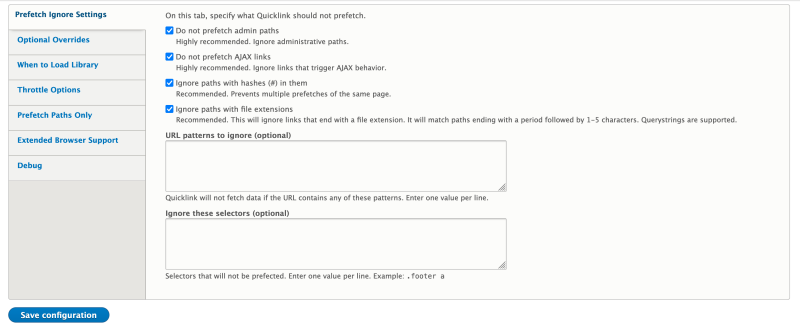

# Boost Drupal Performance with Contributed Modulesfree

## Content

Drupal core is built with performance and scalability in mind. It is [Fast by Default](https://drupalize.me/tutorial/fast-default). But performance is often a by-product of your specific application, and depending on how you're using Drupal, you can further optimize your site using contributed modules. These modules range from debugging utilities to cache-related modules.

It's worthwhile to have a general idea of what's available in the contributed module space. And, when you need to address your site's unique performance needs, it helps if you already know about existing solutions.

In this tutorial we'll:

- Look at a few popular contributed modules that improve Drupal's performance
- Learn about the benefits these modules may provide to your site
- Provide tips on how to configure these modules

By the end of this tutorial you should be able to list some popular performance related Drupal modules and describe their use case.

## Goal

Introduce popular contributed Drupal modules that help improve the performance of Drupal web applications.

## Prerequisites

- [4.3. Installing a Module](https://drupalize.me/tutorial/user-guide/config-install?p=3069)

## Advanced CSS/JS Aggregation

**Note**: This project is incompatible with 10.1 and above. Check the [project page](https://www.drupal.org/project/advagg) for the current status. The project's maintainers recommend that you uninstall the module if your site is running 10.1 or higher.

Out-of-the-box, Drupal aggregates CSS and JavaScript files so that the browser makes fewer HTTP requests for these types of files when rendering the page. CSS/JS Aggregation configuration consists of a single checkbox on the Performance page (*/admin/config/development/performance*) that enables you to turn on or off CSS/JS aggregation. No other settings are provided. But, you can fine-tune how Drupal handles CSS/JS aggregation through one or module modules provided by the contributed project, [Advanced CSS/JS Aggregation](https://www.drupal.org/project/advagg).

The [Advanced CSS/JS Aggregation project](https://www.drupal.org/project/advagg) includes a handful of modules that add advanced configuration options for CSS/JS aggregation, including specifying how groupings and bundles are handled, support for compressing the files, DNS prefetching, and more.

To get results, you'll need to test the site's performance with one of the online tools like [WebPageTest.org](https://www.webpagetest.org/) or Lighthouse and get a baseline performance measurement. Then update the configuration provided by one or more of the project's modules and retest until you find a beneficial combination of settings and modules that delivers the best results for your particular site.

If you need a refresher on how to test page speed on your site, see:

- [Analyze Drupal Site Performance with WebPageTest](https://drupalize.me/tutorial/analyze-drupal-site-performance-webpagetest)
- [Analyze Drupal Site Performance with Lighthouse](https://drupalize.me/tutorial/analyze-drupal-site-performance-lighthouse)

You can install the Advanced CSS/JS Aggregation project with Composer by running the command `composer require drupal/advagg` and installing one or more of its modules with Drush or through the administrative UI. The advanced configuration for CSS/JS aggregation the project provides can be found using the *Manage* administration menu and navigating to *Administration* > *Development* > *Performance* > *AdvAgg* (*/admin/config/development/performance/advagg*).

The configuration options that need to be enabled will depend on your site's server setup, installed modules, overall site configuration, and CDN or external cache usage. Install the module to see what options are available, and then read through the [documentation](https://www.drupal.org/docs/contributed-modules/advanced-cssjs-aggregation) for the module and its submodules. Based on your site setup, enable options and submodules that may fit your needs.

After enabling one of the modules or changing a setting, re-run the tests using Lighthouse or WebPageTest.org and compare the performance. Keep the settings that deliver the biggest boost and don't conflict with the setup of your application.

## Blazy

[Blazy](https://www.drupal.org/project/blazy) is a contributed module that provides integration with [bLazy](https://github.com/dinbror/blazy) JavaScript library, the [Intersection Observer API](https://developer.mozilla.org/en-US/docs/Web/API/Intersection_Observer_API), and browser native lazy-loading. "bLazy" is a lightweight script for lazy-loading and multi-serving images, iframes, videos, and anything else with a `src` attribute. This can save bandwidth and limit the number of required server requests. The bLazy library is written in vanilla JavaScript and doesn't depend on external third-party frameworks.

Lazy-loading multimedia assets will help make your site feel faster for end users.

The Blazy module can be installed with Composer by running the following command: `composer require drupal/blazy`, then enabling the Blazy module. (Media module is required.) The module provides global configuration settings, field formatters, Views formatters, and a CKEditor filter.

**Install the *Blazy UI* module** to access the configuration form via the *Manage* administration menu at *Administration* > *Configuration* > *Media* > *Blazy* (*/admin/config/media/blazy*). This form provides some global configuration options, such as the option to enable Blazy for responsive image styles.

To use Blazy with your content, you would want to use it in one of 3 possible applications:

- As a field formatter for media items (like image fields)
- As a CKEditor filter for one or more text formats on your site
- For formatting field output from the Views module

**To use Blazy as a field formatter** you'll need to enable it in the *Manage display* configuration tab of the media or content entity that has image fields.

**To use Blazy in CKEditor**, you'll need to enable the *Blazy filter* in one of your text formats.

**To use Blazy as a formatter for a view's output**, you need to choose the *Blazy grid* option under the *Format* link in one of your view's displays.

## Quicklink

The [Quicklink module](https://www.drupal.org/project/quicklink) provides an implementation of Google Chrome Lab's [Quicklink library](https://github.com/GoogleChromeLabs/quicklink) for Drupal. Quicklink is a lightweight JavaScript library that enables faster subsequent page loads by prefetching in-viewport links during idle time. In other words, the library detects links within the viewport that point to other pages on the same site, then while the page is idle, it prefetches the content of those links in the background. When someone clicks the link, the page data has already been loaded, enabling the page to load quickly.

The Quicklink module can be installed with Composer by running the following command: `composer require drupal/quicklink`. The module is a wrapper of the library and comes with sensible defaults. Most sites will not need to modify any configuration. After the module is enabled with Drush or through the UI, you can find its configuration form via the *Manage* administration menu at *Administration* > *Configuration* > *Development* > *Performance* (*/admin/config/development/performance/quicklink*).

Image

By default, the module is configured to work on all public-facing pages. Which means it works for non-administrative pages and pages for anonymous users only.

The module provides the ability to exclude certain content types and CSS selectors. Also, it loads a [polyfill](https://developer.mozilla.org/en-US/docs/Glossary/Polyfill) for older browsers.

## Image Optimize

Images on the web can contain far more data than is strictly required for display, or be encoded at a much higher quality than is necessary for the optimized user experience. If your site is behind a CDN that already handles image optimization, or image optimization is performed in other places of your infrastructure, you don't need to optimize images in Drupal.

Several command-line tools and web services exist and can help remove extraneous data. The [Image Optimize module](https://www.drupal.org/project/imageapi_optimize) integrates those tools with Drupal. For optimization to take effect you need to install the main Image Optimize module, and at least one of the processor modules linked to from the main project page. For a full list visit [the project page](https://www.drupal.org/project/imageapi_optimize), some commonly used processors include:

- **Image Optimize Binaries**: Provides plugins that integrate command-line image optimization tools like AdvPNG, JpegOptim, and PngCrush. Install this module to optimize images directly on the same server Drupal is running on.
- **Image Optimize reSmush.it**: Provides a plugin that uses the free [reSmush.it](https://resmush.it) web service to optimize images.
- **Image Optimize TinyPNG**: Provides a plugin that uses the [TinyPNG](https://tinypng.com) web service to optimize images.
- **Kraken**: provides a free web service to optimize the images and provides a plugin that uses the free [Kraken](https://kraken.io/web-interface) web service to optimize the images.

The module can be installed with Composer by running the following command `composer require drupal/imageapi_optimize`. Once installed, you also need to enable at least one processor module. Choose a module based on the processor you intend to use on the site.

The optimization is done through the pipelines. Pipelines need to be configured through the module's provided configuration interface. Each pipeline needs to have a processor associated with it. A pipeline without a processor won't produce any effect. Configured pipelines can then be used like effects in an image style. Follow the module's [documentation](https://www.drupal.org/docs/8/modules/image-optimize/site-builders-guide) to get step-by-step instructions about setting up a pipeline.

## CDN

The [CDN module](https://www.drupal.org/project/cdn) provides [Content Delivery Network](https://drupalize.me/tutorial/overview-content-delivery-networks-cdns-and-drupal) integration for Drupal sites; it doesn't put your site behind a CDN. It allows you to use a CDN to serve your asset files such as CSS, JavaScript, fonts, and other media assets. The module rewrites paths to these asset files, so that they are linked through the CDN instead of the webserver.

In contrast to using a CDN like CloudFlare or Fastly and configuring it as a reverse proxy cache for your site, the CDN module will allow you to do things like:

- Only cache *files* and **not** REST/HTML responses
- Set specific files to be immutable so the CDN can cache them *forever*
- Auto-balance between multiple different CDNs if needed

You do not need this module installed unless you can articulate the specific use case it's solving for you, as it won't provide any benefits on its own.

The CDN module can be installed with Composer by running the command: `composer require drupal/cdn`. Prior to enabling and using this module, you need to have a CDN instance configured and ready to be used.

The instructions for CDN instance configuration depends on the CDN you are planning to use. You'll need to configure the origin server in the *CDN instance settings*. The origin server points to the Drupal server of your site. Your CDN will provide you with the delivery address. This is the address that you'll use to download files from the CDN instead of the Drupal server.

To configure the CDN module on the Drupal side (once the CDN instance is working), you need to enable CDN and CDN UI modules either through Drush or through the UI. Configure the delivery address provided by the CDN instance. To access the configuration form in the *Manage* administration menu go to *Administration* > *Configuration* > *Services* > *CDN* (*/admin/config/services/cdn*).

## Cache Control Override

In Drupal core, Internal Page Cache's max-age setting is applied globally to all pages. You can't set a different max-age per page or leverage cache metadata max-age. If your site is behind a reverse proxy that honors Cache-Control headers, all pages are cached with equal TTL (Time To Live). The [Cache Control Override module](https://www.drupal.org/project/cache_control_override) allows you to override the Cache-Control max-age parameter for specific requests and ignore the global default.

The module can be installed with Composer `composer require drupal/cache_control_override`. Once enabled either through Drush or through UI, the module doesn't require any configuration and just works.

The module's functionality is resolving the following Drupal core issues:

- <https://www.drupal.org/node/2352009>
- <https://www.drupal.org/node/2499321>

Once this functionality is in core, the module will become obsolete.

## Recap

Drupal core has a robust Cache API, but a fairly generic caching implementation. The API allows developers to build and contribute additional modules for use-case- or application-specific performance improvements. This tutorial covers a few popular ones. But remember, these are use-case-specific, and we recommend you explore on your own to find the right solution for your particular setup. Performance optimization is an iterative process that includes incremental testing and adjustments to the settings and configuration provided by core and contributed modules. The performance modules you install and configure on your site become your site performance ecosystem. This setup is successful when the modules are tuned and tested to interact and operate in harmony.

## Further your understanding

- [Search through Drupal contributed modules related to performance and scalability](https://www.drupal.org/project/project_module?f%5B2%5D=im_vid_3%3A123), what other modules could be useful for performance of *your* site.
- Try installing and configuring the Advanced CSS/JS Aggregation module and comparing before and after Lighthouse scores.

## Additional resources

- [Advanced CSS/JS Aggregation module documentation](https://www.drupal.org/docs/contributed-modules/advanced-cssjs-aggregation) (Drupal.org)
- [Image Optimize documentation Sitebuilder guide](https://www.drupal.org/docs/8/modules/image-optimize/site-builders-guide) (Drupal.org)

Was this helpful?

Yes

No

Any additional feedback?

Previous
[Overview: Drupal Performance and Scalability](/tutorial/overview-drupal-performance-and-scalability?p=3091)

Next
[Drupal Performance Profiling: Tools and Methodologies](/tutorial/drupal-performance-profiling-tools-and-methodologies?p=3091)

Clear History

Ask Drupalize.Me AI

close