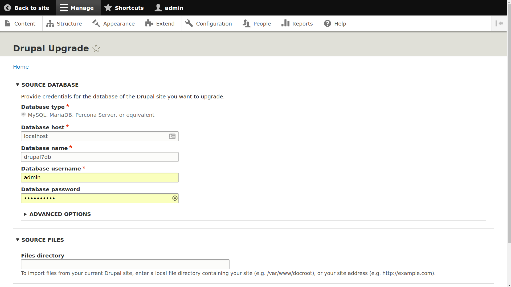

# Drupal-to-Drupal Migration with the UI

## Content

The Migrate Drupal UI module allows you to execute a migration from older versions of Drupal to the latest version of Drupal. In this tutorial we'll:

- Run a full Drupal 6 to latest-Drupal (Drupal 8 or 9) Migration from the UI
- Explore the user interface as it exists
- Understand how we can deal with the output from our migration

## Goal

Run a Drupal-to-Drupal migration using the user interface in Drupal core.

## Prerequisites

- [Prepare for a Drupal-to-Drupal Migration](https://drupalize.me/tutorial/prepare-drupal-drupal-migration)

Currently, running a full migration from the UI is supported, but creating or mapping migrations is not.

## Demo: Drupal-to-Drupal Migration with the UI

Sprout Video

## Running a migration with the Drupal UI

Drupal core supports Drupal-to-Drupal migrations. You can attempt a full migration from Drupal 6 or 7 to the latest version of Drupal using the new experimental modules in Drupal core. If you have not yet completed the [Prepare for a Drupal to Drupal Migration tutorial](https://drupalize.me/tutorial/prepare-drupal-drupal-migration) you might want to start there before attempting a migration to the latest version of Drupal.

## Enable the modules

Enable the following modules: Migrate, Migrate Drupal, and Migrate Drupal UI.

Image

**Note:** Make sure you test this on a *copy* of your site first as it can have irreversible consequences. As you can probably understand by the definition of these modules as "experimental", you'll also want to make sure you have backups of your source site and destination site before attempting a migration. These things rarely work flawlessly the first time.

After enabling the Migrate Drupal UI, you'll be provided with the URL to reach the upgrade UI, which is http(s)://example.com/upgrade. Currently, there is no other way to get back to this page, other than entering the URL in your address bar.

Image

## Begin your upgrade

From the *Upgrade* form, you're given the following list of things to do before beginning your migration.

In this set of instructions "this site" refers to the Drupal site that you will be migrating content to (also known as the *destination* site).

- Back up the database for this site. Upgrade will change the database for this site.
- Make sure that the host this site is on has access to the database for your previous site.
- If your previous site has private files to migrate, a copy of your *files* directory must be accessible on the host this site is on.
- In general, enable all modules on this site that are enabled on the previous site. For example, if you have used the Book module on the previous site then you must enable the Book module on this site for that data to be available on this site.
- Put this site into maintenance mode.

For more about preparing your site for a Drupal-to-Drupal migration have a look at [this tutorial](https://drupalize.me/tutorial/prepare-drupal-drupal-migration). After completing these steps, click **Continue**! On the next page, you'll be asked for the database credentials for **the site you wish to migrate data from**, as well as the path for the *files* directory for any files you wish to migrate. 

After filling out this form, click **Review Upgrade** to generate a pre-migration analysis.

## Upgrade analysis report

You will be presented with an Upgrade Analysis Report. This report details both the missing upgrade paths, and the available upgrade paths.

Image

You can also see a complete list of modules with, and without, upgrade paths. Note that modules missing an upgrade path mean that the data for those modules will not be transferred to your new site.

Image

You can learn more about how to deal with modules that are not ready yet in the "Assessing a module's readiness" section of the [Preparing for a Drupal-to-Drupal Migration](https://drupalize.me/tutorial/prepare-drupal-drupal-migration) tutorial.

After reviewing the report, click **Perform Upgrade** at the base of the form, and your migration will begin. You'll be presented with a status page that prints messages from the Migrate API describing the upgrade process as it occurs. Note that closing this page will actually stop your migration, and you'll need to start over with a fresh database backup for your destination Drupal site, so **don't close the page**!

Depending on the amount of content and complexity of your site this can take anywhere from a few minutes to a few hours.

Image

Once complete, you will be prompted to view the results of your migration. This is available at */admin/reports/dblog*, or by clicking the link displayed.

Image

To review the log messages for your migration, set the filter type to **migrate\_drupal\_ui**.

Image

## View migration messages

The Migrate module includes a report at */admin/reports/migration-messages* that lists migration messages gathered during any migration process. This UI provides a way to review migration warnings and errors. After running your migration(s) it's a good idea to review the messages to ensure that your migration completed successfully.

To access it:

1. Using the *Manage* administrative menu, go to *Reports* > *Migration messages* or visit */admin/reports/migration-messages*.
2. Use the summary page to get an overview of all migrations and their message counts.
3. Click through to a detailed view for each migration to filter and examine specific messages, including:

   - Source IDs (e.g., node ID or menu name)
   - Severity level (error, warning, info)
   - Message text from the migration system

This report helps troubleshoot complex migrations, especially when messages are too numerous or specific to sort through in the general log.

You can continue to use */admin/reports/dblog* and filter by `migrate_drupal_ui` if needed, but the migration messages page is purpose-built for this task.

## Incremental migrations

As of Drupal 8.5 the Migrate Drupal supports incremental migrations. This was previously only possible when running migrations via the command line.

Incremental migrations allow for the scenario where an upgrade migration has already been performed but the source site now has additional new content or configuration to be migrated that wasn't present during the initial migration. To perform an incremental migration click the *Import new configuration and content from old site* button in the Migrate Drupal UI. Note this button wil only appear if you've already performed an initial migration.

The benefit of incremental migrations is that it makes it easier to develop an upgrade and keep it up-to-date with an existing site.

However, we still recommend [running your migrations and upgrades with Drush](https://drupalize.me/tutorial/drupal-drupal-migration-drush) whenever possible.

## Roll back a migration

Rollbacks are not currently supported via the Migrate Drupal UI module. You can follow the status of this in the following issue: [Remove incremental and rollback options from the UI (and add them back when they are more stable)](https://www.drupal.org/node/2683421)

Right now, the best way to handle this is to import a backup of your destination Drupal site's database, which you should have created prior to attempting an upgrade.

## Find help with failures

Migrations are complex, and when running a migration, it is very likely you will run into failures of some kind, which should be logged in your Watchdog log.

One common complication is system resource issues, such as running out of memory. In some cases you may be able to just run the migration a second time. The migrate system is smart enough to keep track of where previous attempts left off and pick up from there.

Given the experimental nature of the modules in Drupal Core, it is also possible that you will run into bugs.

There are a number of ways to report failures and get help with problems with your migrations:

- Drupal Core Migration System Issues for reporting issues with core modules
- Module issue queue if you find a bug or exception with a contributed module
- The [#migration channel on the Drupal Slack](https://drupal.slack.com/archives/C226VLXBP)
- Hire a developer

## Recap

In this tutorial we looked at using the user interface provided with Drupal core to run a Drupal-to-Drupal migration; including:

- providing Drupal with information about your source site
- reading the pre-migration analysis, and
- finally executing the actual migration.

## Further your understanding

- How do you begin a Drupal-to-Drupal migration?
- On the "Recent log messages" report, which filter(s) should be used to find migration-related log messages?

## Additional resources

- Drupal Upgrade UI module has been renamed to Migrate Drupal UI. See [issue #2701541: Rename Drupal Upgrade UI to Migrate Drupal UI](https://www.drupal.org/node/2701541) (Drupal.org).

Was this helpful?

Yes

No

Any additional feedback?

Previous
[Common Issues with Migrations](/tutorial/common-issues-migrations?p=3116)

Next
[Drupal-to-Drupal Migration with Drush](/tutorial/drupal-drupal-migration-drush?p=3116)

Clear History

Ask Drupalize.Me AI

close