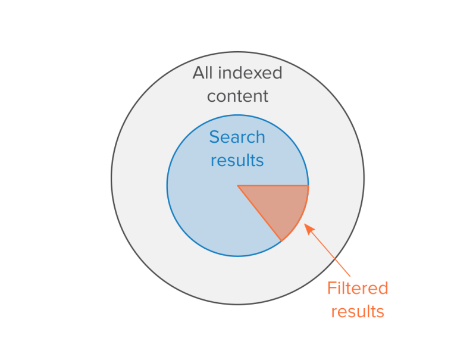
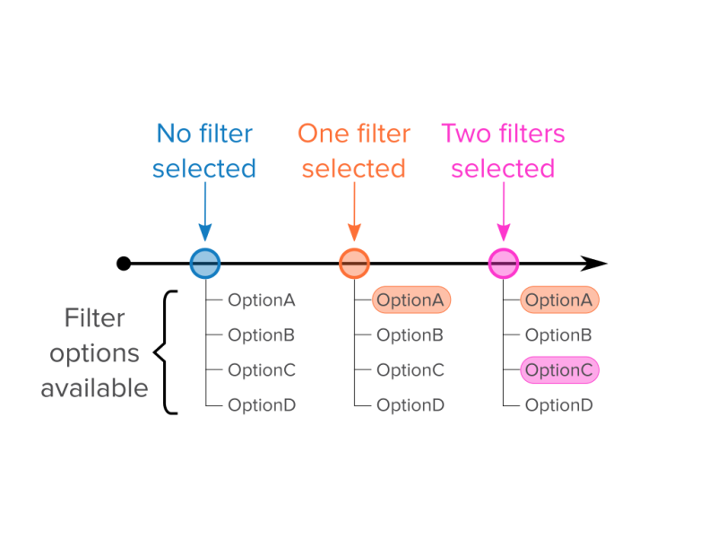

# Facets in Search

## Content

Filtering results allows us to divide up the result set along one or more dimensions. It’s built in to Search API, but often we need a slightly different approach. Drill-down search or *faceted searching* allows us to constrain (rather than divide) our result set to one or more dimensions. The contributed [Facets module](https://www.drupal.org/project/facets) provides this functionality.

In this tutorial, we'll:

- Describe how facets constrains results to preconfigured dimensions
- Demonstrate how use of a facet also constrains the possible selections for other facets
- List the steps for installing Facets module
- Describe the field types best used for creating facets

By the end of this tutorial you should be able to explain what facets are and how they work in the context of searching a Drupal site's content.

## Goal

Introduce Facets module which provides faceted searching, an alternative to filtering search results.

## Prerequisites

- [Populate Search API Indexes](https://drupalize.me/tutorial/populate-search-api-indexes)
- [Filter Search Results](https://drupalize.me/tutorial/filter-search-results)

## Dividing searches

Filtering provides the end user the ability to further refine their search results based on predefined criteria. One can think of a filter as dividing an existing result set. When a fulltext search is performed, the filters are applied afterward:

Image



In the above diagram, the largest circle represents all the content in the search index. Inside that circle is a subset corresponding to fulltext search results. When a filter is applied, Search API and views take the results of the fulltext search and display only elements that correspond to the selected filter(s).

## Constraining searches

The Facets module provides an alternative to filters with faceted searching. Instead of dividing an existing result set into that which is displayed, and that which is not, Facets creates a new, smaller search result set:

Image


At first glance, this may seem functionally similar to filters. After all, the results displayed to the end user are the same. Often, the UI can be the same -- such as a dropdown of filter/facet options. The key difference is when multiple facet selections are made:

Image


Here, two facet selections are made. The total search results become even smaller. Facets can be thought of as predefined search terms. They don't filter results, but rather result in a smaller set of results overall.

## Filtering vs. drill-down

Filtering and facets are so subtly different that they can be easily thought of as being two means to the same mechanism. They both provide end users a way to make a set of fulltext results smaller, so what is the difference?

The difference is in the **interaction**.

Imagine a search interface where you have checkboxes available to filter results. The options could be tag names, content types, author names... whatever makes sense for your content. After performing a fulltext search, you can select one or more checkboxes:

Image



In the above, we start on the left with no filters selected. We have four filter options available labeled OptionA through OptionD. The end user next selects one filter, OptionA. The search results return filtered results. OptionsB, C, and D are still available for selection. Next, the end users selects OptionC. When the results are displayed, Options A-D are still displayed and available.

A drill-down operation is very similar, but with an important consequence:

Image


The above looks very similar to the first. We start with no facets selected. OptionsA through D are available for use. The end user selects OptionA. When the search results are returned, however, OptionB is missing. It no longer appears in the UI. The end user then applies another facet -- OptionC. When the results are turned, now both OptionB and OptionD are missing!

What happened?

Facets (by default) are **narrowing**. Each facet selected constrains the options available. This way, you will not make a selection that results in no results being displayed. This is different from filters, where the options available depend on what content is in the **index**, and not in the search results.

## When to use Facets

When building a custom search solution, it can be difficult to be certain whether a filtering or drill-down UI is preferred. Indeed, many clients will also be confused as to the difference when describing it conceptually.

Instead, it is best to focus on communicating the user experience, or "tactile" difference between the two UIs.

For example, an animal adoption site may have a limited number of animals. It's possible that only longhair cats are available at some point in time. If the UI doesn't offer a choice between shorthair cats and longhair cats, an end user may assume the site is broken, rather than realize no shorthair cats are available. In this case, a filtering UI would be best as all options are preserved even if they are not present in the search results.

Compare this with an academic website which hosts scholarly journals. In this case, the end user may search for "cryptography", but then look to the facet options available for papers on a particular sub-topic. The end user doesn't want to see a list of all sub-topics available, only those pertaining to cryptography. This UX is better suited to facets, as the options available work as a drill-down, and we only want to see options matching our search results.

## Installing Facets

In Drupal, facets functionality is provided by the contributed Facets module, and can be downloaded using Composer:

```
composer require drupal/facets
```

Once downloaded, it can be installed like any other module, using the *Extend* administrative UI or using Drush:

```
drush en -y facets
```

## Facets relies on Views

Once enabled, it doesn't appear that Facets is capable of doing anything. This is due to the way Facets is implemented in the latest version of Drupal. Unlike the [Facet API module](https://www.drupal.org/project/facetapi) for Drupal 7, the latest Drupal Facets module requires you to create at least one search view. (See also [Create Search Pages and Blocks with Views](https://drupalize.me/tutorial/create-search-pages-and-blocks-views).)

## Recap

Facets are a subtly different alternative to filtering search results. Instead of dividing an existing set of results, Facets makes the search result smaller. Unlike filters, the facet options available depend on the search results, rather than all index content.

## Further your understanding

- Under what circumstance would you combine both filters and facets?

## Additional resources

- [Facets contributed module](https://www.drupal.org/project/facets) (Drupal.org)

Was this helpful?

Yes

No

Any additional feedback?

Previous
[Filter Search Results](/tutorial/filter-search-results?p=2815)

Next
[Create a Facet](/tutorial/create-facet?p=2815)

Clear History

Ask Drupalize.Me AI

close