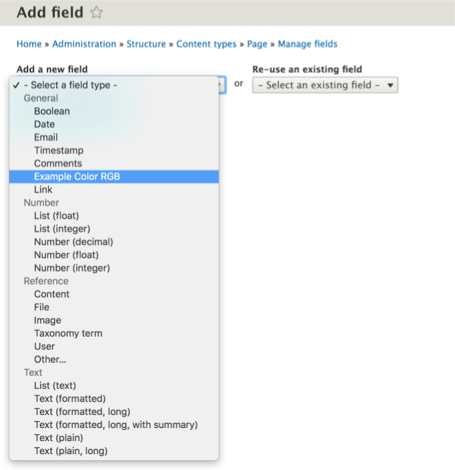

# Field Widgets

## Content

Once we've explored the various field types provided by Drupal core, the next component of the Field API to explore is field widgets. Field widgets define how the data structure of the field is displayed on an edit form. When content editors interact with your field type they will be doing so via the field widget you provide. In this tutorial, we'll take a look at the field widgets provided by Drupal core, the plugin type required to define our own custom widget and how we can define multiple widget options for a single field type.

By the end of this tutorial, you should be able to:

- Understand where field widgets fit into the overall Field API
- Implement a custom field widget to support a particular field type

## Goal

Create a custom field widget in code that supports a field type of your choice.

## Prerequisites

- [What Are Plugins?](https://drupalize.me/tutorial/what-are-plugins)
- [PHP Attributes](https://drupalize.me/tutorial/php-attributes)
- [Discover Existing Plugin Types](https://drupalize.me/tutorial/discover-existing-plugin-types)
- [Field API Overview](https://drupalize.me/tutorial/field-api-overview)
- [Form API Overview](https://drupalize.me/tutorial/form-api-overview)

## Field widgets available in a Drupal site

It would be rather tedious to try adding every possible field type to a development site in order to explore all the possible field widget options. In part this is because a particular field type can support multiple field widgets. We'll see how this mechanism works when we look at `FieldWidget` plugins. But how can we see what widgets are provided by a Drupal site? We can use Drush and other command line techniques to get information about field widget plugin types.

Drush provides the following command for getting info about field types:

```
drush field:types --format=list
```

Other valid formats include: `json`, `list`, `php`, `print-r`, `var_dump`, `var_export`, `yaml`

For example, here's the info you'll get about the `text_textarea` field widget using `drush field:widgets --format=var_dump`:

```
    "text_textarea" => array:4 [
      "id" => "text_textarea"
      "label" => "Text area (multiple rows)"
      "default_settings" => array:2 [
        "rows" => "5"
        "placeholder" => ""
      ]
      "field_types" => array:1 [
        0 => "text_long"
      ]
    ]
```

Since we know that field widgets are plugin types, you can use the techniques described in the tutorial, [Discover Existing Plugin Types](https://drupalize.me/tutorial/discover-existing-plugin-types) to find examples of field types in a Drupal site.

For example, when you run:

```
drush ev 'foreach (\Drupal::getContainer()->getServiceIds() as $id) { $a[$id] = is_object(\Drupal::service($id)) ? get_class(\Drupal::service($id)) : ""; } dump($a);' | grep plugin
```

You'll discover the name of the plugin manager service for field widgets: `plugin.manager.field.widget`.

Which you can then use to find all instances:

```
drush ev "dump(\Drupal::service('plugin.manager.field.widget')->getDefinitions())"
```

For example, here's the info you'll get about the `text_textarea` field widget with the above command:

```
  "text_textarea" => array:8 [
    "class" => "Drupal\text\Plugin\Field\FieldWidget\TextareaWidget"
    "provider" => "text"
    "id" => "text_textarea"
    "label" => Drupal\Core\StringTranslation\TranslatableMarkup^ {#3530
      #string: "Text area (multiple rows)"
      #arguments: []
      #translatedMarkup: null
      #options: []
      #stringTranslation: null
    }
    "description" => null
    "field_types" => array:1 [
      0 => "text_long"
    ]
    "multiple_values" => false
    "weight" => null
  ]
```

## Core field widgets plugin classes

Out-of-the-box, Drupal provides many field widgets, located both in core and module-specific namespaces.

This table gives us a list of the unique identifiers for each plugin and the class that implements the widget's functionality. Notice how for the text field there are three distinct widgets available: `text_textarea`, `text_textarea_with_summary` and `text_textfield`. These widgets provide support for simple small text fields, larger text fields for things like body copy, and an additional more complex text area field for instances where we want to identify a portion of the field as a summary.

| Plugin ID | Plugin class |
| --- | --- |
| boolean\_checkbox | Drupal\Core\Field\Plugin\Field\FieldWidget\BooleanCheckboxWidget |
| comment\_default | Drupal\comment\Plugin\Field\FieldWidget\CommentWidget |
| datetime\_datelist | Drupal\datetime\Plugin\Field\FieldWidget\DateTimeDatelistWidget |
| datetime\_default | Drupal\datetime\Plugin\Field\FieldWidget\DateTimeDefaultWidget |
| datetime\_timestamp | Drupal\Core\Datetime\Plugin\Field\FieldWidget\TimestampDatetimeWidget |
| email\_default | Drupal\Core\Field\Plugin\Field\FieldWidget\EmailDefaultWidget |
| entity\_reference\_autocomplete | Drupal\Core\Field\Plugin\Field\FieldWidget\EntityReferenceAutocompleteWidget |
| entity\_reference\_autocomplete\_tags | Drupal\Core\Field\Plugin\Field\FieldWidget\EntityReferenceAutocompleteTagsWidget |
| file\_generic | Drupal\file\Plugin\Field\FieldWidget\FileWidget |
| image\_image | Drupal\image\Plugin\Field\FieldWidget\ImageWidget |
| language\_select | Drupal\Core\Field\Plugin\Field\FieldWidget\LanguageSelectWidget |
| link\_default | Drupal\link\Plugin\Field\FieldWidget\LinkWidget |
| number | Drupal\Core\Field\Plugin\Field\FieldWidget\NumberWidget |
| options\_buttons | Drupal\Core\Field\Plugin\Field\FieldWidget\OptionsButtonsWidget |
| options\_select | Drupal\Core\Field\Plugin\Field\FieldWidget\OptionsSelectWidget |
| path | Drupal\path\Plugin\Field\FieldWidget\PathWidget |
| string\_textarea | Drupal\Core\Field\Plugin\Field\FieldWidget\StringTextareaWidget |
| string\_textfield | Drupal\Core\Field\Plugin\Field\FieldWidget\StringTextfieldWidget |
| text\_textarea | Drupal\text\Plugin\Field\FieldWidget\TextareaWidget |
| text\_textarea\_with\_summary | Drupal\text\Plugin\Field\FieldWidget\TextareaWithSummaryWidget |
| text\_textfield | Drupal\text\Plugin\Field\FieldWidget\TextfieldWidget |
| uri | Drupal\Core\Field\Plugin\Field\FieldWidget\UriWidget |

Let's take a look at how the `text_textarea` widget is defined. This widget is defined by the `TextareaWidget` class which can be found in */core/modules/text/src/Plugin/Field/FieldWidget/TextareaWidget.php*. That file begins with the `FieldWidget` attribute that allows Drupal to discover this field widget plugin.

```
/**
 * Plugin implementation of the 'text_textarea' widget.
 */
#[FieldWidget(
  id: 'text_textarea',
  label: new TranslatableMarkup('Text area (multiple rows)'),
  field_types: ['text_long'],
)]
```

A `FieldWidget` attributes needs to specify a unique id for the field widget, provide a human-readable label used in the user interface, and specify the field types it is capable of supporting.

Following this attribute is the class which needs to implement the `WidgetInterface` interface. This is typically done by extending an existing implementation like the `WidgetBase` class. In our example, the `TextareaWidget` class is extending `StringTextareaWidget` (which in turn extends `WidgetBase`). This class implements three methods: `settingsForm`, `formElement`, and `errorElement` which help define the behavior of our widget.

The `settingsForm` method allows us to define the elements that will appear on the settings form of our widget. In the case of the text area, this implementation (via `parent::settingsForm`) allows us to configure the number of rows displayed by the text area on the edit form as well as the placeholder text that will appear in this area by default. Additionally, this implementation adds some extra help text that warns us that CKEditor may override this particular widget setting.

```
/**
 * {@inheritdoc}
 */
public function settingsForm(array $form, FormStateInterface $form_state) {
  $element = parent::settingsForm($form, $form_state);
  $element['rows']['#description'] = $this->t('Text editors (like CKEditor) may override this setting.');
  return $element;
}
```

In general, if you want your field settings to be exportable via the configuration management system, or you'd like to support multiple languages, it's important to provide a configuration schema for your field so Drupal knows how to store (and export) the values collected by your widget settings. If you're not already familiar with Drupal's configuration management, consult the [Configuration Data Types](https://drupalize.me/tutorial/configuration-data-types) tutorial. You can see the configuration schema provided by the field widgets in Drupal core in the */core/config/schema/core.entity.schema.yml* file -- in particular, the values that start with `field.widget.settings`.

The next method our widget class implements is the `formElement` method. This method is responsible for setting up the actual Form API array that will determine how our field is displayed on an edit form.

```
/**
 * {@inheritdoc}
 */
public function formElement(FieldItemListInterface $items, $delta, array $element, array &$form, FormStateInterface $form_state) {
  $main_widget = parent::formElement($items, $delta, $element, $form, $form_state);

  $element = $main_widget['value'];
  $element['#type'] = 'text_format';
  $element['#format'] = $items[$delta]->format;
  $element['#base_type'] = $main_widget['value']['#type'];
  return $element;
}
```

Finally, our widget class implements the `errorElement` method. This method allows us to detect a field-level error message and target a particular portion of our widget form. This allows a tailored error message to be added to the appropriate sub-element of a complex form, helping editors diagnose form issues. In this particular case the method is being used to ignore a particular validation error if the actual text format cannot be changed because of permissions.

```
/**
 * {@inheritdoc}
 */
public function errorElement(array $element, ConstraintViolationInterface $violation, array $form, FormStateInterface $form_state) {
  if ($violation->arrayPropertyPath == ['format'] && isset($element['format']['#access']) && !$element['format']['#access']) {
    // Ignore validation errors for formats if formats may not be changed,
    // i.e. when existing formats become invalid. See filter_process_format().
    return FALSE;
  }
  return $element;
}
```

## Creating a custom field widget

Adding a custom field widget begins by creating a `FieldWidget` plugin. The code we'll be looking at for this example can be found in the [field example module](https://git.drupalcode.org/project/examples/-/tree/3.x/modules/field_example) that accompanies the [Examples project](https://www.drupal.org/project/examples). This module provides an RGB color field that we attach to a content type.

Image



The field example module provides three different widgets for this new field type: a text widget which requires the user to enter a CSS-compatible hex value for the color of their choice; a more complicated text field which accepts separate values for the red, green and blue hex values; and a third widget which uses the Farbtastic color picker library included in core to help users select their color value. Each of these widgets can be found in the *field\_example/src/Plugin/Field/FieldWidget* directory.
The first widget we'll take a look at is the basic text widget defined in *field\_example/src/Plugin/Field/FieldWidget/TextWidget.php*.

This file starts off with the `FieldWidget` plugin attribute. By now these types of attributes probably look familiar. Still, it's worth noting how the field widget attribute specifies the field types it supports. In this case that's the `field_example_rgb` field.

```
<?php

namespace Drupal\field_example\Plugin\Field\FieldWidget;

use Drupal\Component\Utility\Color;
use Drupal\Core\Field\Attribute\FieldWidget;
use Drupal\Core\Field\FieldItemListInterface;
use Drupal\Core\Field\WidgetBase;
use Drupal\Core\Form\FormStateInterface;
use Drupal\Core\StringTranslation\TranslatableMarkup;

/**
 * Plugin implementation of the 'field_example_text' widget.
 */
#[FieldWidget(
  id: "field_example_text",
  label: new TranslatableMarkup("RGB value as #ffffff"),
  field_types: ['field_example_rgb'],
)]
class TextWidget extends WidgetBase {

  /**
   * {@inheritdoc}
   */
  public function formElement(FieldItemListInterface $items, $delta, array $element, array &$form, FormStateInterface $form_state) {
    $value = $items[$delta]->value ?? '';
    $element += [
      '#type' => 'textfield',
      '#default_value' => $value,
      '#size' => 7,
      '#maxlength' => 7,
      '#element_validate' => [
        [$this, 'validate'],
      ],
    ];
    return ['value' => $element];
  }

  /**
   * Validate the color text field.
   */
  public function validate($element, FormStateInterface $form_state) {
    $value = $element['#value'];
    if (strlen($value) === 0) {
      $form_state->setValueForElement($element, '');
      return;
    }
    if (!Color::validateHex($value)) {
      $form_state->setError($element, $this->t('Color must be a 3- or 6-digit hexadecimal value, suitable for CSS.'));
    }
  }

}
```

The class providing functionality for this widget extends `WidgetBase` and implements two methods. The `formElement` method checks to see if the field already has a value. It then adds a textfield form element which will be used to store the RGB value provided by our editor. This class also provides a `validate` method which ensures that the value provided on the edit form is a valid hexadecimal value suitable for CSS.

Assuming the value passes validation it is then stored as a string as specified by the configuration schema in *field\_example/config/schema/field\_example.schema.yml*.

```
# @see Configuration schema/metadata at https://drupal.org/node/1905070
#
field.field_example_rgb.value:
  type: sequence
  label: 'Default value'
  sequence:
    - type: mapping
      label: 'Default'
      mapping:
        value:
          type: string
          label: 'Value'
```

This is what this field widget looks like on an edit form:

Image


The second widget provided by the field example module is slightly more complex in that it provides separate text fields for each of the red, green and blue color values. This widget is defined in the file *field\_example/src/Plugin/Field/FieldWidget/Text3Widget.php*. Notice that this widget defines an attribute for the `FieldWidget` plugin and also extends `WidgetBase`. The primary difference between this widget and the `TextWidget` we've already seen is in the `formElement` method it implements.

```
<?php

namespace Drupal\field_example\Plugin\Field\FieldWidget;

use Drupal\Core\Field\Attribute\FieldWidget;
use Drupal\Core\Field\FieldItemListInterface;
use Drupal\Core\Field\WidgetBase;
use Drupal\Core\Form\FormStateInterface;
use Drupal\Core\StringTranslation\TranslatableMarkup;

/**
 * Plugin implementation of the 'field_example_3text' widget.
 */
#[FieldWidget(
  id: "field_example_3text",
  label: new TranslatableMarkup("RGB text field"),
  field_types: ['field_example_rgb'],
)]
class Text3Widget extends WidgetBase {

  /**
   * {@inheritdoc}
   */
  public function formElement(FieldItemListInterface $items, $delta, array $element, array &$form, FormStateInterface $form_state) {
    $value = $items[$delta]->value ?? '';
    // Parse the single hex string into RBG values.
    if (!empty($value)) {
      preg_match_all('@..@', substr($value, 1), $match);
    }
    else {
      $match = [[]];
    }

    // Set up the form element for this widget.
    $element += [
      '#type' => 'details',
      '#element_validate' => [
        [$this, 'validate'],
      ],
    ];

    // Add in the RGB textfield elements.
    foreach ([
      'r' => $this->t('Red'),
      'g' => $this->t('Green'),
      'b' => $this->t('Blue'),
    ] as $key => $title) {
      $element[$key] = [
        '#type' => 'textfield',
        '#title' => $title,
        '#size' => 2,
        '#default_value' => array_shift($match[0]),
        '#attributes' => ['class' => ['rgb-entry']],
        '#description' => $this->t('The 2-digit hexadecimal representation of @color saturation, like "a1" or "ff"', ['@color' => $title]),
      ];
      // Since Form API doesn't allow a fieldset to be required, we
      // have to require each field element individually.
      if ($element['#required']) {
        $element[$key]['#required'] = TRUE;
      }
    }
    return ['value' => $element];
  }

  /**
   * Validate the fields and convert them into a single value as text.
   */
  public function validate($element, FormStateInterface $form_state) {
    // Validate each of the textfield entries.
    $values = [];
    foreach (['r', 'g', 'b'] as $colorfield) {
      $values[$colorfield] = $element[$colorfield]['#value'];
      // If they left any empty, we'll set the value empty and quit.
      if (strlen($values[$colorfield]) == 0) {
        $form_state->setValueForElement($element, '');
        return;
      }
      // If they gave us anything that's not hex, reject it.
      if ((strlen($values[$colorfield]) != 2) || !ctype_xdigit($values[$colorfield])) {
        $form_state->setError($element[$colorfield], $form_state, $this->t("Saturation value must be a 2-digit hexadecimal value between 00 and ff."));
      }
    }

    // Set the value of the entire form element.
    $value = strtolower(sprintf('#%02s%02s%02s', $values['r'], $values['g'], $values['b']));
    $form_state->setValueForElement($element, $value);
  }

}
```

Here we can see (in the `foreach()` loop in the `formElement()` method) that this widget adds three distinct textfields for a hexadecimal value to represent the red, green and blue components of our color individually.

It's also worth noting that this widget also implements a `validate` method. In addition to verifying that the values submitted are valid hexadecimal, this also converts our three distinct values into a single string for storage in the database.

Here is this widget in action on the edit form:

Image


By now you can probably guess that the third widget provided by the *field\_example* module, the `ColorPickerWidget`, includes a `FieldWidget` plugin and a class that extends `WidgetBase`. The details of this implementation assume you understand [Drupal's asset library](https://drupalize.me/tutorial/what-are-libraries) system. The JavaScript added to this field widget is responsible for transforming the value from the Farbtastic color picker into a hexadecimal string. On the edit form this widget doesn't require the user to know their hex value in advance.

Image


## Recap

In this tutorial, we learned that field widgets are responsible for determining how the edit form behaves for a particular field type. In addition, we saw that a single field type can be supported by several field widgets, which can dramatically change the editorial experience. We saw that field widgets are exposed to Drupal via `FieldWidget` plugins, and that the accompanying class must implement the `WidgetInterface` interface (usually by extending the `WidgetBase` class). We also explained how to construct several field widgets to radically change the way a user inputs a RGB color value.

## Further your understanding

- What are the main implementation differences between the field widgets that support textarea elements?
- Do the widgets provided to support datetime fields all use the same storage format?
- What method do you need to include in your widget class in order to provide default settings? (Hint: you may need to explore the parent class of `WidgetBase` to find the answer)
- [Learn more about how form validation works](https://drupalize.me/tutorial/validate-form-input)

## Additional resources

- [Configuration Data Storage](https://drupalize.me/tutorial/configuration-data-storage?p=2458) (Drupalize.Me)
- [Examples project field module](https://git.drupalcode.org/project/examples/-/tree/3.x/modules/field_example) (drupalcode.org)
- [Configuration schema and metadata](https://www.drupal.org/docs/drupal-apis/configuration-api/configuration-schemametadata#use) (Drupal.org)

Was this helpful?

Yes

No

Any additional feedback?

Previous
[Field Types](/tutorial/field-types?p=2628)

Next
[Field Formatters](/tutorial/field-formatters?p=2628)

Clear History

Ask Drupalize.Me AI

close