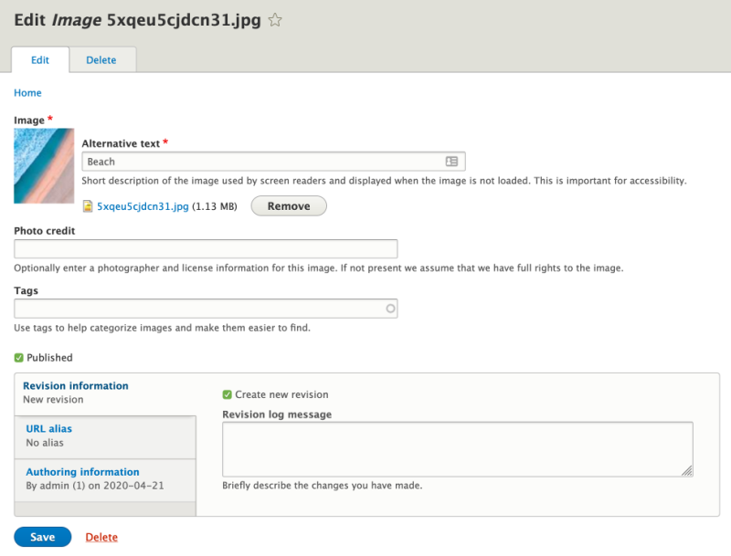

# Find, Add, Edit, and Delete Media Entities in Drupal

## Content

Media entities in Drupal are content entities, and can be administered like most other Drupal content entities. In most cases you'll likely add new Media entities via the Media Library widget when creating a new content entity like an Article. However, it's possible to add them to the library without having to attach them to a piece of content. You may also want to update an existing Media entity, or just search the library to see whether something already exists.

In this tutorial we'll:

- Learn what a Media entity is in Drupal
- Get an overview of the main Media management page
- Learn how to add, edit, and delete, Media entities
- Learn how to bulk edit Media entities in Drupal

By the end of this tutorial you'll know how to perform basic find, add, edit, and delete operations to manage the Media entities in your library.

## Goal

Find, add, edit, and delete Media entities.

## Prerequisites

- [5.2. Creating a Content Item](https://drupalize.me/tutorial/user-guide/content-create?p=3070)
- [5.3. Editing a Content Item](https://drupalize.me/tutorial/user-guide/content-edit?p=3070)

## Watch: Find, Add, Edit, and Delete Media Entities in Drupal

Sprout Video

## The main Media management page

The canonical list of Media entities can be found by navigating to *Content* in the manage administration menu, and then selecting the *Media* tab (admin/content/media).

Image

This page contains 2 Views, *Table* and *Grid*, that list all the existing Media entities for your site. Since the list is a View it can be customized as needed. The form at the top of the list can be used to filter it. The checkbox next to each item in the list can be used to apply actions to media entities in bulk.

## Add a new Media entity

To add a new Media entity to the library, start from the main Media administration page.

### Press the *Add media* button

Press the *Add media* button, and then choose a media type on the resulting page (media/add).

### Fill in the form

The exact fields on the form for adding a media entity will vary depending on the type of media you're adding, though a few are always present. You'll always see some type of required *source* field that allows you to choose the media resource(s). This might be an image upload field, or a link field that points to a remote video.

Image

Fill in the source field, and any other configured fields, and then press the *Save* button.

### Verify it was created

When the entity is successfully created, you'll be returned to the main Media management page. A success message will be displayed at the top of the page.

You should also see your newly created Media entity in the list on this page.

## Edit an item

### Locate the item to edit

Find the item you want to edit in the list on the main Media administration page. Then choose the *Edit* option from the *Operations* menu for the row.

### Make your changes

Image

Make the changes you want to make to any of the fields on this page.

### Verify it was edited

If editing the Media entity worked, you'll end up back on the main Media management page. A success message will be displayed confirming that it was edited.

## Delete an item

### Locate the item to delete

Find the item you want to delete in the list on the main Media administration page. Then choose the *Delete* option from the *Operations* menu for the row.

### Confirm you want to delete the item

Image

On the next page, you'll need to confirm you want to delete the item by clicking the *Delete* button.

### Verify it was deleted

If deleting the entity worked, you'll be taken back to the main Media management page and a success message will be displayed confirming the entity was deleted.

You can also bulk delete media entities by checking the checkbox in the row for each item you want to delete, and then choosing the *Delete media* option in the *Action* select list at the top of the page and clicking the *Apply to selected items* button.

## Recap

In this tutorial, we learned how to locate existing Media entities on the main Media management page. We also added new Media entities, and learned to edit or delete existing ones.

## Further your understanding

- Can you change the publication state of multiple Media entities at the same time?
- Can you customize the view used on the main Media management page to add an additional exposed filter that allows you to filter the list based on the user that added the Media entity?

## Additional resources

- [Chapter 5. Basic Page Management](https://drupalize.me/series/user-guide/content-chapter) (Drupalize.Me)
- [Views: Create Lists with Drupal](https://drupalize.me/series/views-create-lists-drupal) (Drupalize.Me)

Was this helpful?

Yes

No

Any additional feedback?

Previous
[Add a Media Field to a Content Type in Drupal](/tutorial/add-media-field-content-type-drupal?p=2672)

Next
[Use Drupal Media Library to Browse Media Entities](/tutorial/use-drupal-media-library-browse-media-entities?p=2672)

Clear History

Ask Drupalize.Me AI

close