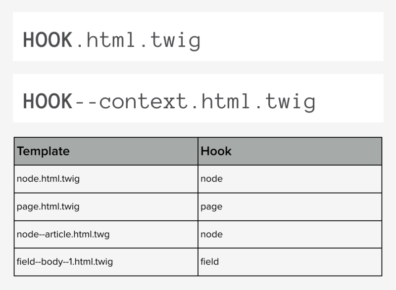

# Determine the Base Name of a Template

## Content

If you want to make changes to the HTML markup of any element on the page you need to first figure out the *theme hook* or *base name* of the template file used to generate it. This information is required to [override the template](https://drupalize.me/tutorial/override-template-file) in your custom theme.

There are other situations in which knowing the *theme hook* name of a template file is useful. Including determining which preprocess function affects a template, and which template *theme hook suggestions* can be used.

In this tutorial we'll learn:

- How to figure out the *theme hook* name for any template

By the end of this tutorial you should be able to use the output from Twig's debugging mode to determine the *theme hook* name of any template file.

## Goal

Determine the *theme hook* name of the template that outputs the HTML markup for a node.

## Prerequisites

- [What Are Template Files?](https://drupalize.me/tutorial/what-are-template-files)
- [Configure Your Environment for Theme Development](https://drupalize.me/tutorial/configure-your-environment-theme-development)

## Determine the hook name of a template

There are two ways to discover the hook name of a specific component. Once you know the hook name you can locate its base template file.

First, if you already know the filename of the template, you can infer the hook name from that.

The typical pattern for naming template files is `{hook}--{optional context}.html.twig`

Image

You can ignore the `.html.twig` suffix. Which results in `{hook}--{optional context}`

If the file name doesn't contain a `--{optional context}` part, then after removing `.html.twig` you're left with the hook name.

Examples:

- `node.html.twig`: hook name is *node*
- `node--blog_post.html.twig`: hook name is *node*
- `field--node--title--page.html.twig`: hook name is *field*

## Locate hook names in Twig's debugging output

If you don't already know the filename, or if you're unsure, you can enable theme debugging and get the information from the debugging output.

### Enable theme debugging

If you haven't done so already, you'll want to [enable theme debugging](https://drupalize.me/tutorial/configure-your-environment-theme-development). This will provide additional output in your HTML that makes determining the base name of a template easier.

### Open a page in your browser

Load a page on your site with a visible component for which you want to know the base name.

### View source

View the page source and locate the debugging output.

Example:

Image

In the above output the line, "THEME HOOK" contains the hook name, and indicates the base name of the template.

## Recap

In this tutorial we learned that you can determine the *theme hook* or *base name* of a template file either from the name of the template file itself or via the HTML comments output by Twig's debugging mode. Once you know the *theme hook* you can use this to determine what template to override, or use it when constructing preprocess functions.

## Further your understanding

- When do you need to know the hook name of a template file?
- What is the hook name of this template file *node--article.html.twig*?
- Learn about theme hook suggestions and preprocess functions to understand more about how hook names are used.

## Additional resources

- [Locating Template Files with Debugging](https://www.drupal.org/node/2358785) (Drupal.org)

Was this helpful?

Yes

No

Any additional feedback?

Previous
[Override a Template File](/tutorial/override-template-file?p=2879)

Next
[Inspect Variables Available in a Template](/tutorial/inspect-variables-available-template?p=2879)

Clear History

Ask Drupalize.Me AI

close