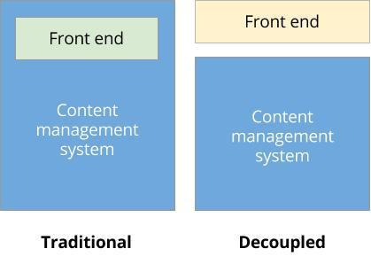

# Hosting Implications and Considerations

## Content

At this point, whether we've decided to use a third-party pre-rendering service or we've written our own isomorphic JavaScript application to serve as the front-end of our website, our hosting requirements have definitely gotten more complex. Let's take a look at the continuum of decoupled site architectures and start to come up with a list of things to keep in mind when considering their hosting requirements.

## Goal

Understand the hosting requirements for a decoupled application.

## Prerequisites

- [Decoupling Explained](https://drupalize.me/tutorial/decoupling-explained)

## Decoupled architectures

There are three primary ways to build a Drupal site. Monolithic, which is to say "regular" Drupal. In this scenario Drupal is handling the entire request, respond, render lifecycle. A second option is a fully decoupled site. In this case Drupal is responsible for the content storage, management and administrative pages while the front-end(s) are responsible for making API requests and then rendering the data returned from those requests. A third option is to "Progressively Decouple" your site. A progressively decoupled site would still make use of Drupal as the primary rendering engine for the front-end, but is capable of independently requesting individual page components. These three paradigms have been laid out in a blog by Dries Buytaert called [the future of decoupled Drupal](http://buytaert.net/the-future-of-decoupled-drupal).

Image

## Hosting options

The hosting requirements for these three approaches require different considerations and priorities. With either the monolithic or the progressive decoupling approach, you're using a traditional Drupal front-end to serve your site. There will be added complexity within the Drupal theme, and you'll likely need to find a way to make the multiple HTTP requests of a progressively decoupled site more performant (either via caching or something like [Big Pipe](https://engineering.fb.com/2010/06/04/web/bigpipe-pipelining-web-pages-for-high-performance/)). With a fully decoupled site, you have a few more options.

Many JavaScript applications include server-side code written in Node.js used for server-side rendering, or *isomorphic*, applications. If your application is going to be launched, you would need to ensure the hosting provider is capable of running Node.js applications. And, we'd likely want some support around monitoring and deployment of our server code to ensure the site stays online.

If we're looking for a less complex configuration, we can build an entirely client-side single-page application (SPA) (like the one started in the [Use Vite to Start a Decoupled React Application](https://drupalize.me/tutorial/use-vite-start-decoupled-react-application) tutorial). Since that application is *just* HTML and JavaScript, it could be hosted by any web server (like Apache) that's capable of hosting a Drupal site. You could also use something like [GitHub Pages](https://pages.github.com/) to serve the HTML and JavaScript for your SPA.

Another option is we could create a very basic Drupal theme that also returns the page skeleton HTML with the SPA JavaScript as demonstrated in [Connect React to a Drupal Theme or Module](https://drupalize.me/tutorial/connect-react-drupal-theme-or-module).

## Recap

Deciding which approach is right for your project is highly dependent on your particular requirements and the size and skills of the team that will be maintaining the site. Whatever architecture you choose, the most successful projects will be well tested and profiled before launch so that their weaknesses are well understood and can be mitigated as problems arise.

## Further your understanding

- Make a checklist of all the technology and languages needed by your application. Evaluate your host or other potential web hosting services and explore your options for hosting.

## Additional resources

- [Decoupled CMS: Why “Going Headless” Is Becoming So Popular](https://pantheon.io/decoupled-cms) (patheon.io)
- [The future of decoupled Drupal](https://buytaert.net/the-future-of-decoupled-drupal) (buytaert.net)
- [Headless and decoupled CMS: the essential guide](https://www.contentful.com/r/knowledgebase/what-is-headless-cms/) (contentful.com)
- [Decoupling Drupal and Consuming with Symfony2, JavaScript, or Unicorns](http://lullabot.github.io/copelandia/#/) (lullabot.com)
- [Decoupling Drupal Without Losing Your Head — Part 1](https://www.advomatic.com/insights/decoupling-drupal-without-losing-your-head-part-1) (advomatic.com)
- [Decoupling Drupal: Using Drupal as Part of a Decoupled CMS](http://drupalwatchdog.net/volume-4/issue-2/decoupling-drupal) (drupalwatchdog.net)
- [Decoupled Drupal: When, Why, and How](https://events.drupal.org/losangeles2015/sessions/decoupled-drupal-when-why-and-how) (events.drupal.org)

Was this helpful?

Yes

No

Any additional feedback?

Previous
[Building a Solid API](/tutorial/building-solid-api?p=2960)

Next
[What Are Web Services?](/tutorial/what-are-web-services?p=2960)

Clear History

Ask Drupalize.Me AI

close