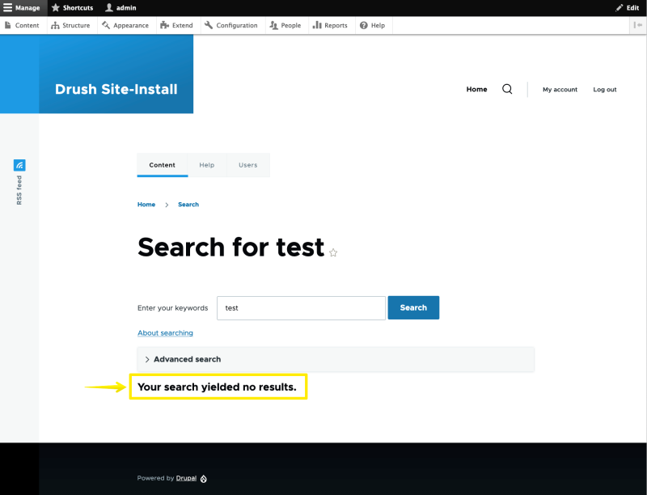

# Implement a Functional Test

## Content

In this tutorial, we'll walk through the basics of how to implement a functional test by extending Drupal's `BrowserTestBase` class. We'll assume you've already determined that you need to write a functional test and that you've [Set up a Functional Test](https://drupalize.me/tutorial/set-functional-test).

In this tutorial, we'll:

- Determine the specifications of the test.
- Walk through the behavior we want to test.
- Document our test in the test class.
- Implement the testing steps.
- Decide how to deal with dependencies (for now). (We'll go into details about handling test dependencies in [Implement Drupal Functional Test Dependencies](https://drupalize.me/tutorial/implement-drupal-functional-test-dependencies).)

## Goal

Implement a `BrowserTestBase` functional test in Drupal to verify that Search form appears on the front page of our site and works at a basic level.

## Prerequisites

- A Drupal codebase with development requirements installed through Composer. See [Install Drupal Development Requirements with Composer](https://drupalize.me/tutorial/install-drupal-development-requirements-composer).
- A local development environment. (We recommend that you [Install Drupal Locally with DDEV](https://drupalize.me/tutorial/install-drupal-locally-ddev).)
- [Organize Test Files](https://drupalize.me/tutorial/organize-test-files)
- [Run Drupal Tests with PHPUnit](https://drupalize.me/tutorial/run-drupal-tests-phpunit)
- [Set up a Functional Test](https://drupalize.me/tutorial/set-functional-test)

## A design phase for tests?

Before we get started writing code, we should spend some time thinking about the test we're about to write. Particularly with a functional test, it's good to write down the steps we want the test to perform and then walk through them manually, if possible. That way we can have some reasonable assurance that our test meets our needs.

Going through the process of designing a test before writing any code can help us find problems before we've written ourselves into a corner.

Let's get started thinking about testing.

### Set up a skeleton test

Set up a failing test, make sure the test runner can discover it, and watch as it fails. Then change it to a passing test, re-run, and make sure it passes.

Follow the instructions in our tutorial [Set up a Functional Test](https://drupalize.me/tutorial/set-functional-test) or copy into your custom module the code in *tests/src/Functional/SkeletonTest.php* from the *testing\_example* module in the [Examples for Developers](https://www.drupal.org/project/examples) project. Modify it as needed.

Setting up a skeleton test might seem like too many steps to get started, but it's a good habit to get into. This way we always know that our test is passing or failing for the reasons we think it is.

### Design your test

Every test has a reason for existing, we're going to write down that reason as a design document and then implement the design.

In this tutorial, we're going to write a test to verify that the *Search* form block appears on the front page of our site and functions at a basic level.

Let's define some elements of our test:

- The behavior we're testing is whether we can submit a certain form that appears on the front page of a site.
- We'll be using the *Standard* profile on a fresh Drupal installation that has a Search form block placed by default.

That's what we're testing. Let's write it down. We write things down to ensure that we won't be confused about what exactly we're testing.

It's often easy to write things in the docblock for the test file and/or the test method. Let's do that.

Create a new functional test file in *modules/custom/MYMODULE/tests/src/Functional/FrontPageSearchFormTest.php*, replacing `MYMODULE` with the name of your custom module, for example, *my\_testing\_module*, which is what we're using here.

Let's add comments about our design intentions for the test to our new file. We also updated the class and method names to be descriptive and appropriate to our test design.

*modules/custom/my\_testing\_module/tests/src/Functional/FrontPageSearchFormTest.php*:

```
<?php

namespace Drupal\Tests\my_testing_module\Functional;

use Drupal\Tests\BrowserTestBase;

/**
 * Tests basic functionality of search form on the front page.
 *
 * @group demo
 */
class FrontPageSearchFormTest extends BrowserTestBase {

/**
   * {@inheritdoc}
   */
  protected $defaultTheme = 'stark';

  /**
   * Tests that we can submit the search form and get no results.
   *
   * We'll open the front page, enter 'test' into the search form,
   * check for success, then check for the no-results text.
   */
  public function testSearchFormNoResults() {
  }

}
```

### Manually walk through each test step

Let's write down each step we think we need, and then manually verify each step.

1. Visit the front page.
2. Enter `test` into the search form and submit.
3. Check that the form submitted successfully.
4. Check for no-results text.

When we open our site's `/` path, we can see the search form, submit a test search, and see the words, "Your search yielded no results".

Image


Image



We have some steps. And we have a good idea that--at least in principle--our test class could perform the same steps that we just did. The value of a manual test becomes even more apparent as the tests increase in complexity.

Like we did in our previous step, let's write down the steps in comments, so we can keep track of what we're doing. This also serves to leave a trail of documentation for the developer who has to debug our test in the future.

We'll document these steps by adding inline comments inside our test method:

```
  public function testSearchFormNoResults() {
    // 1. Visit the front page.
    // 2. Enter `test` into the search form and submit.
    // 3. Check that the form submitted to a reachable page.
    // 4. Check for no-results text.
  }
```

### Convert the steps to executable code

It's time to write code for our test. Let's start by learning how to implement the 4 steps we've noted.

#### Visit the front page

Our first step is to visit the `/` path. `BrowserTestBase` gives us the `drupalGet()` method.

The `drupalGet()` method will perform an HTTP request to whatever URL we specify. In this case, it's `/`. Update your test like this:

```
    // Step 1: Visit '/' path.
    $this->drupalGet('');
```

When you pass an empty string, `drupalGet()` will go to the home page of the site. If you pass `/`, you'll get an exception. This is because Drupal expects that if the string contains a leading slash, it will include a path after the slash.

#### Submit the search form

The second step in our test submit the search form with the input, `test`.

`BrowserTestBase` (the class we're extending) uses a handy trait, `UiHelperTrait` which provides UI helper methods, such as `submitForm`. Because the trait is used in `BrowserTestBase`, we have access to its methods.

The first parameter for `submitForm()` is an associative array of input names and their values. If we inspect the search input field, we can see its `name` is `keys`. Our search term is `test`, so we'll enter that as the associated value for `keys`. We can set up a variable, `$inputs`, to store this array, and make our method call a little easier to read.

```
    // Step 2. Enter `test` into the search form and submit.
    $inputs = ['keys' => 'test'];
    $this->submitForm($inputs, 'Search');
```

#### Check that the form submitted to a reachable page

Our next step is to verify that the form submitted successfully to a reachable page. We can check for an HTTP 200 status code, which means that the test didn't run into any access errors, for example. (If we had an access error, we'd get a 403 status code in the HTTP response.)

Since we're checking the status of a page after a form submission, we need to keep track of a session. `BrowserTestBase::assertSession()` will return an object of type `Drupal\Tests\WebAssert`. You use this object to make assertions about session-related topics, such as what content is in the page you're viewing. (If you are familiar with the [Mink](http://mink.behat.org/) framework, you might recognize `WebAssert` as a subclass of `Behat\Mink\WebAssert`.)

`WebAssert` has a method called `statusCodeEquals()`. That sounds like exactly what we need for our test.

You can call `assertSession()` and keep a local variable to the session, or you can just stack method calls. In this example, we'll do the latter.

```
    // Step 3: Check that the form submitted to a reachable page.
    $this->assertSession()->statusCodeEquals(200);
```

#### Check for no-results text

Our last step is to check for our no-results text, which is, `Your search yielded no results`. We discovered what this text was in our manual test.

`WebAssert` has another method, `pageTextContains()`, which we'll use for this step.

```
$this->assertSession()->pageTextContains('Your search yielded no results');
```

There are many more types of assertions available on [`WebAssert`](https://api.drupal.org/api/drupal/core%21tests%21Drupal%21Tests%21WebAssert.php/class/WebAssert), and also on [`BrowserTestBase`](https://api.drupal.org/api/drupal/core%21tests%21Drupal%21Tests%21BrowserTestBase.php/class/BrowserTestBase). We'll just cover these 2 for now.

#### Our test class so far

Here's our test class with the changes we just made:

```
<?php

namespace Drupal\Tests\my_testing_module\Functional;

use Drupal\Tests\BrowserTestBase;

/**
 * Tests basic functionality of search form on the front page.
 *
 * @group demo
 */
class FrontPageSearchFormTest extends BrowserTestBase {
  /**
   * {@inheritdoc}
   */
  protected $defaultTheme = 'stark';

  /**
   * Tests that we can submit the search form and get no results.
   *
   * We'll open the front page, enter 'test' into the search form,
   * check for success, then check for the no-results text.
   */
  public function testSearchFormNoResults() {
    // Step 1: Visit '/' path.
    $this->drupalGet('');
    // Step 2. Enter `test` into the search form and submit.
    $inputs = ['keys' => 'test'];
    $this->submitForm($inputs, 'Search');
    // Step 3: Check that the form submitted to a reachable page.
    $this->assertSession()->statusCodeEquals(200);
    // 4. Check for no-results text.
    $this->assertSession()->pageTextContains('Your search yielded no results');
  }
}
```

### Run the test with phpunit

We have a test, so let's run it and see what happens. Spoiler alert: it will fail (just so you're not surprised).

We're going to use the phpunit tool to run this test.

There are a few caveats about how to run a functional test under phpunit, so check out this tutorial: [Run Drupal Tests with PHPUnit](https://drupalize.me/tutorial/run-drupal-tests-phpunit)

Here's the command line we'll use:

```
SIMPLETEST_BASE_URL=http://localhost ./vendor/bin/phpunit -c web/core/ --testsuite functional --group demo --filter FrontPageSearchFormTest
```

What is `SIMPLETEST_BASE_URL`? It's an environment variable that the tests use to perform their HTTP requests. So that should be the base URL to your local site. In this case, we set it to `http://localhost` because our local development site uses DDEV. You can also set this value in [your own *phpunit.xml* file](https://drupalize.me/tutorial/create-phpunit-config-file-your-project).

We use the `--group` and `--filter` options, so we only run *our* test while also making sure the test is discoverable. An alternate way to [run the test](https://drupalize.me/tutorial/run-drupal-tests-phpunit) is to refer to the test by path.

As expected, this test fails. Let's look at the output:

```
PHPUnit 9.6.15 by Sebastian Bergmann and contributors.

Testing 
E                                                                   1 / 1 (100%)

Time: 00:01.557, Memory: 40.00 MB

There was 1 error:

1) Drupal\Tests\my_testing_module\Functional\FrontPageSearchFormTest::testSearchFormNoResults
Behat\Mink\Exception\ElementNotFoundException: Button with id|name|label|value "Search" not found.

/var/www/html/web/core/tests/Drupal/Tests/WebAssert.php:144
/var/www/html/web/core/tests/Drupal/Tests/UiHelperTrait.php:78
/var/www/html/web/modules/custom/my_testing_module/tests/src/Functional/FrontPageSearchFormTest.php:29
/var/www/html/vendor/phpunit/phpunit/src/Framework/TestResult.php:728

ERRORS!
Tests: 1, Assertions: 2, Errors: 1.
```

Why did it fail? It says `Button with id|name|label|value "Search" not found.` That's not proper grammar, but it's informative. Failure messages in PHPUnit tell you the assertion that failed, not why the assertion didn't pass.

In this case, it means that our search form button wasn't found, and phpunit couldn't run the test search.

Why did this failure happen? Let's find out.

### Debug the test

When we manually performed the test, visiting the page and then submitting the search, everything seemed fine. But now the automated test finds a different result. What happened?

Let's run the test again, this time with the HTML output printer supplied by Drupal core:

```
BROWSERTEST_OUTPUT_DIRECTORY=/tmp SIMPLETEST_BASE_URL=http://localhost ./vendor/bin/phpunit -c web/core/ --testsuite functional --group demo --filter FrontPageSearchFormTest --printer="\Drupal\Tests\Listeners\HtmlOutputPrinter"
```

We use PHPUnit's `--printer` option to specify an output printer. Drupal core provides us with an output printer which writes functional test HTML out to files. We specify Drupal's HTML output printer with this addition:

```
--printer="\Drupal\Tests\Listeners\HtmlOutputPrinter"
```

In order for the HTML output printer to work, it needs a place to put all its files temporarily. For that we use `BROWSERTEST_OUTPUT_DIRECTORY`. In this case, we're setting it to */tmp*, but the files will ultimately end up in *web/sites/simpletest/browser\_output*.

If you want to go in-depth on this, you can learn about it in the [Run Drupal Tests with PHPUnit](https://drupalize.me/tutorial/run-drupal-tests-phpunit) tutorial.

Now, what does the test run look like when we use the HTML output printer?

```
PHPUnit 9.6.15 by Sebastian Bergmann and contributors.

Testing 
E                                                                   1 / 1 (100%)

Time: 00:01.455, Memory: 40.00 MB

There was 1 error:

1) Drupal\Tests\my_testing_module\Functional\FrontPageSearchFormTest::testSearchFormNoResults
Behat\Mink\Exception\ElementNotFoundException: Button with id|name|label|value "Search" not found.

/var/www/html/web/core/tests/Drupal/Tests/WebAssert.php:144
/var/www/html/web/core/tests/Drupal/Tests/UiHelperTrait.php:78
/var/www/html/web/modules/custom/my_testing_module/tests/src/Functional/FrontPageSearchFormTest.php:29
/var/www/html/vendor/phpunit/phpunit/src/Framework/TestResult.php:728

ERRORS!
Tests: 1, Assertions: 2, Errors: 1.

HTML output was generated
http://localhost/sites/simpletest/browser_output/Drupal_Tests_my_testing_module_Functional_FrontPageSearchFormTest-1-53488878.html
```

Notice the "HTML output was generated" section at the bottom. This is provided by `HtmlOutputPrinter`. Those are URLs to the HTML generated by each request, in order. In our case there's only one request (from `drupalGet()`), so there's only one URL.

You can copy and paste the URL into a browser location bar and see the output from the request. Depending on your localhost setup, you may need to replace `http://localhost` with a site-specific value, for example, `https://example.ddev.site/`. When you do that, you'll see something like this:

Image


As you can see, this shows a login form on the front page, not the generic front page we expected. Furthermore, there's no search form. Why is that? Let's figure out which dependencies are missing.

### Think about your test's dependencies

We have designed our test. We want to check for the presence of a search form on the page. We have begun to implement our test, and now we've run into some problems. So let's talk about test dependencies and why we have them.

#### The testing profile

By default, `BrowserTestBase` uses an installation profile called *Testing*. This profile is fine for most testing needs. It doesn't have a lot of dependencies. It does not enable many modules and delivers fairly neutral output without theming. This allows for quicker tests which are more isolated from the effects of specific profiles, modules, or themes.

Even though we installed Drupal with the Standard installation profile, the functional test runner is using the Testing profile, which doesn't install the Search module unless we tell it to in our test.

#### The Standard profile

In our manual test, we used the Standard profile. This profile enables lots of modules and uses Olivero as the default theme.

#### Our dependencies

Through the failing test of the last step, we've learned that our test depends on some modules and maybe a profile. We need the Search form block, which means we need both Search and Block modules. We're searching content, so we'll need the Node module as well. (That's how the `search/node` path to our search results gets generated, and where our search form goes when it's submitted.) How can we tell `BrowserTestBase` to give us these dependencies?

We have 2 different options for how to reconcile these different sets of dependencies:

- Tell `BrowserTestBase` to enable the Standard profile and this would reproduce what we saw in the manual test. This would implicitly give us the Node, Block, and Search modules, and it would place the search form block.
- Let `BrowserTestBase` continue to use the Testing profile and then explicitly enable any modules and blocks that we need within the test.

Which of these 2 options should we choose? This depends entirely on why we're writing the test.

We can enable the Standard profile. However, this would also mean that our test explicitly depends on the Standard profile, which we have no control over. It's possible that in the future the Standard profile would change in such a way to cause our test to fail.

These are the kinds of issues you should be thinking about while you write a test. The goal of the test isn't just to prove that something works, but also to fail in a way that's informative and aids maintenance.

The strategy we end up using to set up our dependencies--or *fixture*--depends entirely on what we are testing.

With that in mind, we're going to move forward on this tutorial by enabling the Standard profile. We're using the Standard profile here in an effort to keep this tutorial short, but it's probably not the best decision to make in practice. In general, it's probably a better practice if your tests limit the number of dependencies required to as few as possible.

We'll cover the techniques necessary to enable the different modules and the details of how we placed the Tools block in the next tutorial, [Implement Drupal Functional Test Dependencies](https://drupalize.me/tutorial/implement-drupal-functional-test-dependencies). Anyone writing functional tests for Drupal should learn those techniques as well.

### Specify a profile in a functional test

We can override `BrowserTestBase::$profile` with our own profile name and then the test will install that profile instead of the default *testing* one. It looks like this in code:

```
  /**
   * {@inheritdoc}
   */
  protected $profile = 'standard';
```

When we run the test again and look at its HTML output, we'll see something like this:

Image


Now that's more like what we saw during manual testing.

Here's our complete test:

```
<?php

namespace Drupal\Tests\my_testing_module\Functional;

use Drupal\Tests\BrowserTestBase;

/**
 * Tests basic functionality of search form on the front page.
 *
 * @group demo
 */
class FrontPageSearchFormTest extends BrowserTestBase {
  /**
   * {@inheritdoc}
   */
  protected $defaultTheme = 'stark';

  /**
   * {@inheritdoc}
   */
  protected $profile = 'standard';

  /**
   * Tests that we can submit the search form and get no results.
   *
   * We'll open the front page, enter 'test' into the search form,
   * check for success, then check for the no-results text.
   */
  public function testSearchFormNoResults() {
    // Step 1: Visit '/' path.
    $this->drupalGet('');
    // Step 2. Enter `test` into the search form and submit.
    $inputs = ['keys' => 'test'];
    $this->submitForm($inputs, 'Search');
    // Step 3: Check that the form submitted to a reachable page.
    $this->assertSession()->statusCodeEquals(200);
    // 4. Check for no-results text.
    $this->assertSession()->pageTextContains('Your search yielded no results');
  }
}
```

When we run the test we see a passing result:

```
BROWSERTEST_OUTPUT_DIRECTORY=/tmp SIMPLETEST_BASE_URL=http://localhost ./vendor/bin/phpunit -c web/core/ --testsuite functional --group demo --filter FrontPageSearchFormTest --printer="\Drupal\Tests\Listeners\HtmlOutputPrinter"
PHPUnit 9.6.15 by Sebastian Bergmann and contributors.

Testing 
.                                                                   1 / 1 (100%)

Time: 00:08.780, Memory: 40.00 MB

OK (1 test, 4 assertions)

HTML output was generated
http://localhost/sites/simpletest/browser_output/Drupal_Tests_my_testing_module_Functional_FrontPageSearchFormTest-2-99442756.html
http://localhost/sites/simpletest/browser_output/Drupal_Tests_my_testing_module_Functional_FrontPageSearchFormTest-3-99442756.html
```

Hey! It passed! Congratulations!

You'll see that changing the profile made it easy for us to get a passing test. But what about when we want to specify all the dependencies explicitly?

That's something we'll cover in the [Implement Drupal Functional Test Dependencies](https://drupalize.me/tutorial/implement-drupal-functional-test-dependencies) tutorial.

## Recap

In this tutorial, we:

- Learned the basics of designing a test.
- Wrote down our steps so that we could keep track of them.
- Manually went through the steps in order to establish a baseline.
- Encountered a few issues along the way such as user permissions and some dependencies.
- Made a passing test.

## Further your understanding

- What other types of assertions are available to [`WebAssert`](https://api.drupal.org/api/drupal/core%21tests%21Drupal%21Tests%21WebAssert.php/class/WebAssert) and [`BrowserTestBase`](https://api.drupal.org/api/drupal/core%21tests%21Drupal%21Tests%21BrowserTestBase.php/class/BrowserTestBase)?

## Additional resources

- [`BrowserTestBase` API documentation](https://api.drupal.org/api/drupal/core%21tests%21Drupal%21Tests%21BrowserTestBase.php/class/BrowserTestBase) (api.drupal.org)
- [PHPUnit Browser test tutorial](https://www.drupal.org/docs/8/phpunit/phpunit-browser-test-tutorial) (Drupal.org)
- [Debug any of Drupal's PHPUnit tests in PhpStorm with a DDEV Environment](https://drupalize.me/blog/debug-any-drupals-phpunit-tests-phpstorm-ddev-environment) (Drupalize.Me)

Was this helpful?

Yes

No

Any additional feedback?

Next
[Implement Drupal Functional Test Dependencies](/tutorial/implement-drupal-functional-test-dependencies?p=3264)

Clear History

Ask Drupalize.Me AI

close