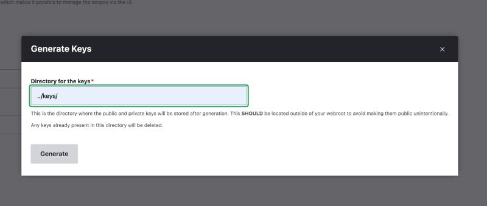
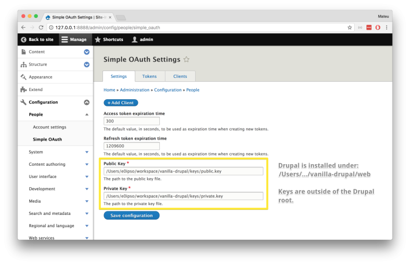
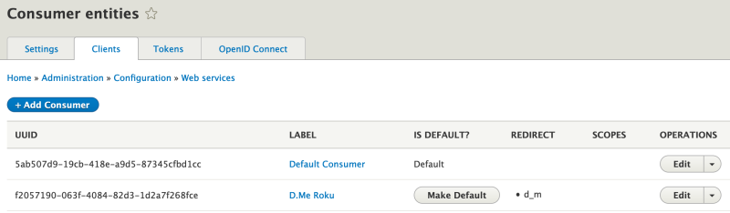

# Install and Configure Simple OAuth

## Content

The [Simple OAuth](https://drupal.org/project/simple_oauth) module can be used to configure Drupal as an OAuth 2 authentication provider. Doing so will allow third-party applications to authenticate users using any of the OAuth flows, and validate their roles and permissions.

If you're creating applications that access Drupal's data and need to act like a logged-in user you'll want to use OAuth for authentication. There are 2 steps to accomplishing this: first, you'll need to set up Drupal to act as an authentication provider (this tutorial). Second, you'll need to make the appropriate HTTP requests to obtain an access token, which is covered in the next tutorial, [Make an Authenticated Request Using OAuth 2](https://drupalize.me/tutorial/make-authenticated-request-using-oauth-2).

In this tutorial, we will:

- Learn how to install the Simple OAuth Drupal module and its dependencies
- Configure the Simple OAuth module so we can generate tokens that can authenticate users in Drupal
- Demonstrate what the responses generated by the Simple OAuth module look like

By the end of this tutorial, you should know how to install and configure the Simple OAuth module.

## Goal

Install and configure the Simple OAuth module as an OAuth 2 authentication provider.

## Prerequisites

- [Install Drupal Locally with DDEV](https://drupalize.me/tutorial/install-drupal-locally-ddev)
- [User Guide: 3.5. Using Composer to Download and Update Files](https://drupalize.me/tutorial/user-guide/install-composer?p=3074)
- [User Guide 4.3. Installing a Module](https://drupalize.me/tutorial/user-guide/config-install?p=3069)

## Video tutorial

Sprout Video

## Install and configure Simple OAuth

In this tutorial, we'll walk through the steps required to get Drupal set up to act as an OAuth authentication provider. In the next tutorial, [Make an Authenticated Request Using OAuth 2](https://drupalize.me/tutorial/make-authenticated-request-using-oauth-2), we'll walk through how to make authenticated requests to the Drupal API using OAuth.

There are a lot of steps, and it helps to have some context for what we're configuring. Here are a few important terms:

### Access token

A short-lived credential issued after successful authentication that allows the client to call APIs on behalf of a user or application. Access tokens usually expire quickly (e.g., minutes to hours) for security reasons.

### Refresh token

A long-lived credential that can be used to obtain a new access token without requiring the user to log in again. Refresh tokens are usually stored securely by the client and are especially useful for keeping a user logged in across days, weeks, or months.

### Grant type

The method an application uses to obtain an access token. Different grant types support different use cases; for example, *Authorization Code* when a user logs in with GitHub, *Refresh Token* to stay logged in, or *Client Credentials* when a server talks directly to an API. [Learn more about grant types](https://oauth.net/2/grant-types/).

## Scope

The set of permissions an access token grants. For example, a token might allow read-only access to your calendar or full access to your email. Scopes let users and admins control what level of access an app should have. *Scope* is closely related to *roles* in Drupal.

### `client_id`

A unique identifier used to identify a specific application. Think of it like a username for the app itself - it's public, often included in API calls, and paired with a secret (when required) to prove the app's identity. In Drupal, this is provided by the *Consumers* module.

### Install Simple OAuth

The [Simple OAuth](https://drupal.org/project/simple_oauth) module relies on a [generic PHP library](http://oauth2.thephpleague.com/) to do the heavy lifting of the OAuth 2 implementation. This library, written by Alex Bible, has over two million downloads and is used across many different PHP frameworks. In fact, this library is not Drupal-specific. The Drupal module contains the glue code to integrate with it.

In order to install the module and the library at the same time, we will need to download the module using Composer.

```
composer require drupal/simple_oauth
```

This will download the Drupal modules, Simple OAuth and Consumers, as well as their dependencies.

### Enable Simple Oauth and dependencies

On your site, log in and use the administrative menu to navigate to *Extend* (*admin/modules*). Find the **Simple OAuth & OpenID Connect** module, select the checkbox next to it, scroll down and select the *Install* button. Confirm that you want to also enable the required modules on the confirmation screen that shows up next. Once you have enabled all required modules, you may proceed with configuring the module.

If you've updated the module, be sure to run the database update script at */update.php* to ensure that you have all necessary database tables created. (Check your site's *Database Updates* status at */admin/reports/status*.)

### Create keys (automatic)

The [OAuth 2.0 Server library](https://oauth2.thephpleague.com/) needs a pair of public and private keys in order to operate. These *keys* take the form of 2 files that we'll need to save on our server. (**Do not put these in version control.**) Save them in a place that Drupal can read them, but the outside world cannot.

If Drupal has write access to the server environment, it can generate the keys for you. Navigate to *Configuration* > *People* > *Simple OAuth* (*/admin/config/people/simple\_oauth*). Then locate and press the *Generate keys* button.

In the resulting pop-up enter the path to where you would like Drupal to put the new key files. **For security reasons, this should be outside your web root directory.**

Example:

Image



Press the *Generate* button to proceed. On success, Drupal will create the public and private key files in the appropriate location and fill in the OAuth configuration form. Make sure to press *Save configuration* to save the changes.

### Create keys (manual)

Alternatively, you can generate the keys manually.

To generate the private key, run this command on the terminal:

```
openssl genrsa -out private.key 2048
```

This works in Linux-like and macOS operating systems. For Windows support, look into [OpenSSL for Windows](https://wiki.openssl.org/index.php/Binaries).

To extract the public key from the private key, we will need to execute:

```
openssl rsa -in private.key -pubout -out public.key
```

The contents of the private key must be kept secret. That is why it's recommended to keep both keys outside the *docroot* directory containing the Drupal installation. If necessary, create a directory called *keys* outside the *docroot*, for example in the project directory one level above the publicly-accessible *docroot* directory. Move the generated keys into the *keys* directory.

Example:

```
drupal_root/
├── README.md
├── composer.json
├── composer.lock
├── config
├── keys
│   ├── private.key
│   └── public.key
├── vendor
└── web (docroot)
```

**Note**: These *keys* are not the same as the API keys you might provide a developer who wants to make authenticated requests against your API. Those keys, or client secrets, are set up in a later step.

### Provide the keys to Drupal

Note that if you used the automatic key generation feature, this should be done already.

In the *Manage* administration menu, navigate to *Configuration* > *People* > *Simple OAuth* (*/admin/config/people/simple\_oauth*), and fill out the form there.

Image



Keep the rest of the defaults (unless you have a reason to do otherwise) and select *Save configuration*.

### Understanding permissions in OAuth

Before we dive into creating roles, scopes, and consumers, let's see an example of how they work together.

This screenshot is from GitHub's OAuth authorization screen when CircleCI requests access.

Image


In this example, CircleCI is the *Consumer*.

*Scope* refers to the specific permissions that the application (CircleCI) is asking for when accessing the GitHub account.

In this case:

- Repositories: Access to both public and private repositories.
- Personal user data: Read-only access to your email addresses.

In Drupal, we can define new scopes and map them to either a Drupal role (group of permissions) or a specific permission.

Why this matters:

- Scopes define what the access token can do once you authorize the app.
- When you click "Authorize CircleCI", GitHub will issue an access token to CircleCI that is restricted to only those scopes.
- CircleCI can't suddenly read your DMs, delete your org, or change billing info — because the scope limits what the token can be used for.

Let's look at how to set this up in Drupal.

### Create a new role

It is considered good practice to create and configure a new role for each consumer that will access Drupal content using OAuth 2 authentication. This simplifies the OAuth 2 scope management.

Scopes are how OAuth 2 limits what a user can do with a token (within the limits of what the Drupal permissions allow). They are a good way to ensure the users in our imaginary Roku application can *only* do what they *need* to do. By creating a subset of permissions for each consumer, we are increasing the security of our application.

Let's go to */admin/people/roles* and create a new role called *D.Me Roku*.

A more modular, but complex, alternative is to create a role for each API feature. That way, we could compose the client app scopes by selecting all the roles for all the features that the consumer supports. In the next step, we will understand how to choose the roles.

### Add a consumer

One requirement of the OAuth specification is that all consumers that require authentication must be registered as *clients*. That means we need to inform Drupal of all consumers that will send authenticated requests. This is how we get/set the `client_id` required for OAuth requests.

To add a consumer, navigate to *Configuration* > *Web services* > *Consumers* (*/admin/config/services/consumer*) and press the *Add Consumer* button. Fill in the resulting form, paying close attention to:

- *Label* is required, this will be the public-facing name of the consumer. Usually, this should be something like the name of the application that will be making API requests using this *key* and *secret* combination.
- *Client ID* must be unique. We recommend keeping it simple, like a machine name, lowercase, alphanumeric, and underscores instead of spaces.
- *Client secret* this is the *secret* or *password* that any application making API requests as this consumer will need to use in the `client_secret` portion of the request. This value will not be saved, so remember what you enter because you'll need it later when you make OAuth requests.
- *Grant types* determines what grant type(s) will be allowed when using this consumer.
- *Is confidential?*: If checked, you'll need to include a `client_secret` with your OAuth token-related requests. For most JavaScript front-ends, you can leave this unchecked.

**Note:** Older versions of the Simple OAuth + Consumers integration defined *scopes* on this form. In versions 6.x and later of the module, scopes are defined independently of the consumer.

Image


Depending on the grant type(s), you'll see additional configuration options, including settings for making tokens expire and using `@pkce`.

One of the most substantial benefits of using token authentication is that we can make tokens expire. The time-to-live (TTL) for all tokens generated by Simple OAuth is configured on a per-consumer basis.

Access token expiration time
:   Sets the TTL on the token used for authentication. It is recommended to set this value to less than 1 day. If our token keeps changing, it's less likely that a valid token can be captured and used for malicious actions. The default value is 5 minutes.

Refresh token expiration time (available if the \_Authorization Code\_ grant type is selected)
:   Our consumer application may grab a token, make several authenticated requests, and then go dormant for several hours. When that happens, the access token will be invalid, but the refresh token will still be usable. In that case, we can use the refresh token to get a new set of access and refresh tokens. Unlike the access token, this token is not sent constantly to the server to authenticate requests. In fact, we can only use it once. After it's used, a new refresh token for that user will be generated, and the old refresh token will be invalid. This is why it's okay to have a much longer expiration time for refresh tokens. The default value is 14 days.

When using the *authorization code* grant type, you'll need to determine if you should enable @PKCE. PKCE (pronounced "pixie") stands for Proof Key for Code Exchange.

It's an extension of the OAuth 2.0 Authorization Code flow that makes it more secure, especially for public clients (such as mobile apps, SPAs, or desktop apps) that can't safely store a client secret. PKCE removes the need for a client\_secret in public clients, and it prevents authorization code interception attacks.

Normally, in the authorization code grant flow:

1. The app asks the authorization server for an authorization code.
2. It exchanges that code for an access token.

The problem is that if someone intercepts that authorization code, they could steal your token.

With PKCE, we add two extra steps:

- Before starting the flow, the client generates a random string called a code verifier.
- It hashes that string to make a code challenge and sends the challenge along with the authorization request.
- When redeeming the code for an access token, the client must send the original code verifier.
- The server checks that the verifier matches the challenge.

This way, if someone steals the code but doesn't know the verifier, they can't use it.

After completing the form, press the *Save* button to save your new Consumer entity.

Image



This new *consumer* entity will be used to generate an authentication token from the application associated with the consumer, e.g., Roku or SPA. The Roku app will need to send both the client\_id (or uuid) and the consumer entity's *client secret*. We'll need to send other parameters as well, but that will depend on the grant type that we use. We'll learn more about that in another tutorial, [Get a Token for OAuth 2 Requests](https://drupalize.me/tutorial/get-token-oauth-2-requests).

## The consumer/backend separation

This configuration is necessary to comply with the OAuth 2 specification. Even public APIs, like Facebook, will need a UI for developers to register their applications in the backend server.

Image


However, this is not ideal, as it goes against the previous recommendation that our Drupal backend be agnostic to the applications that interact with it. This problem is mitigated because it only affects authentication, and there is no special business logic or presentation associated with these client entities. The API will interact the same way with all consumers, but an access token from one consumer will not be usable in another. This is, again, for security reasons, and it is a good trade-off.

## Recap

In this tutorial, we learned how to install and set up the Simple OAuth module in Drupal. This module will allow us to generate access tokens that, in turn, will be used to authenticate requests from a registered consumer. We also learned that each client application must be registered with Drupal and assigned a password.

## Further your understanding

- Do the users in your consumer need access to all the things they can access in Drupal? Are the users interacting with the consumer only going to perform a limited set of actions?
- How would you split your consumer's permissions into clearly separated features?

## Additional resources

- [Installation and minimal setup](https://www.youtube.com/watch?v=SI60hF4n8U8&index=2&list=PLZOQ_ZMpYrZtqy5-o7KoDhM3n6M0duBjX) (YouTube.com)
- [Scopes in OAuth 2 and roles in Drupal](https://www.youtube.com/watch?v=-xRBJvmg0qQ&list=PLZOQ_ZMpYrZtqy5-o7KoDhM3n6M0duBjX&index=4) (YouTube.com)
- [This post will help you decide the TTL for your tokens](https://www.oauth.com/oauth2-servers/access-tokens/access-token-lifetime/) (oauth.com)

Was this helpful?

Yes

No

Any additional feedback?

Previous
[API Authentication and Authorization](/tutorial/api-authentication-and-authorization?p=3279)

Next
[Get a Token for OAuth 2 Requests](/tutorial/get-token-oauth-2-requests?p=3279)

Clear History

Ask Drupalize.Me AI

close