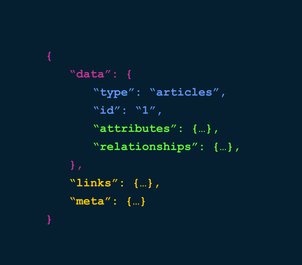

# JSON:API Resource Requestsfree

## Content

Being able to retrieve resources from an API is a fundamental first step.

In this tutorial we will learn how to:

- Issue an HTTP request to extract information about a node from the JSON:API server
- Examine the response from the server

By the end of this tutorial you should know how to use an HTTP Get request to return a resource from the JSON:API server, and know what the default response for the resource will contain.

## Goal

Request a node from the JSON:API server using an HTTP Get request.

## Prerequisites

- [Modern Web Services with JSON:API and GraphQL](https://drupalize.me/tutorial/modern-web-services-jsonapi-and-graphql)
- [Install JSON:API Module](https://drupalize.me/tutorial/install-jsonapi-module)

Sprout Video

## GET your node

JSON:API is a specification that follows the REST principles. The benefit of building a RESTful web service is that you can leverage established patterns that are well known and *battle tested*. One pattern tells us that once you know the URL for your resource, you can access any item in that resource by appending the ID in the URL.

### Construct a resource URL

According to the information provided by the entry point at */jsonapi* one of the resources available to us is:

```
https://example.org/jsonapi/node/article
```

In order to get a specific article we will need to append the resource ID to the end of that url:

```
https://example.org/jsonapi/node/article/{resourceId}
```

### Extract the UUID for the node

The JSON:API module in Drupal uses the UUID field in the entity as the resource ID. There are different ways you can get the UUID from a particular article — one of those being JSON:API — but for now we will use the Devel tab that's added by the [Devel module](https://www.drupal.org/project/devel) in the node page.

Image


### Request the resource

Once we have the UUID we are ready to make the HTTP request to fetch the information about the article.

```
http https://example.org/jsonapi/node/article/d99f021b-c3c8-41f0-bd8d-c8d02c22e2a1
```

That will return something like:

```
{
    "data": {
       "type": "node--article",
       "id": "d99f021b-c3c8-41f0-bd8d-c8d02c22e2a1",
       "attributes": {
            "body": {
                "format": "plain_text",
                "summary": "Abdo autem …"
            },
            "changed": 1493584841,
            …
            "status": true,
            "title": "Abico Importunus",
            "uuid": "d99f021b-c3c8-41f0-bd8d-c8d02c22e2a1"
        },
        "links": {
            "self": "http://d8dev.local/jsonapi/node/article/d99f021b-c3c8-41f0-bd8d-c8d02c22e2a1"
        },
        "relationships": {
            …
            "field_image": {
                "data": {
                    "id": "e8eb2b4f-2d94-4c3e-8cc3-9dca66e7b295",
                    "type": "file--file"
                },
                "links": {
                    "related": "http://d8dev.local/jsonapi/node/article/d99f021b-c3c8-41f0-bd8d-c8d02c22e2a1/field_image",
                    "self": "http://d8dev.local/jsonapi/node/article/d99f021b-c3c8-41f0-bd8d-c8d02c22e2a1/relationships/field_image"
                }
            }
        }
    }
}
```

(We've abbreviated this response for readability.)

Drupal will respond to that request with a JSON object that contains information about the attributes and relationships of that particular article.

## The JSON:API format

Image



The responses from the [JSON:API module](https://www.drupal.org/project/jsonapi) will always follow the structure defined in the [official specification](http://jsonapi.org/format/). One of the advantages of this specification is that it's very intuitive and easy to read. You can see that there are four different sections in the JSON:API responses:

- **[Resource data information](http://jsonapi.org/format/#document-resource-objects)**: Identifies a resource entity using the resource type an the resource ID.
- **Resource content**: Contains the actual data of the resource, [attributes](http://jsonapi.org/format/#document-resource-object-attributes) and [relationships](http://jsonapi.org/format/#document-resource-object-relationships).
- **Metadata**: Provides additional information about a resource or a respose that is not considered content, but enables meaningful interactions in the consumers.
- **Glue structure**: Allows to connect the different pieces together. It does not provide any information, but makes parsing the response easier for the consumer libraries.

Image


## Recap

In this tutorial, we made our first request to retrieve actual content from the Drupal backend. For that we had to find the resource URL for the article content type, and the UUID field of the article node we wanted to fetch.

## Further your understanding

- [Learn more about the JSON:API specification](http://jsonapi.org/) to fully understand the structure of the data.
- [Get an overview of the REST principles](https://www.servage.net/blog/2013/04/08/rest-principles-explained/).

Was this helpful?

Yes

No

Any additional feedback?

Previous
[Install JSON:API Module](/tutorial/install-jsonapi-module?p=3277)

Next
[JSON:API Relationships](/tutorial/jsonapi-relationships?p=3277)

Clear History

Ask Drupalize.Me AI

close