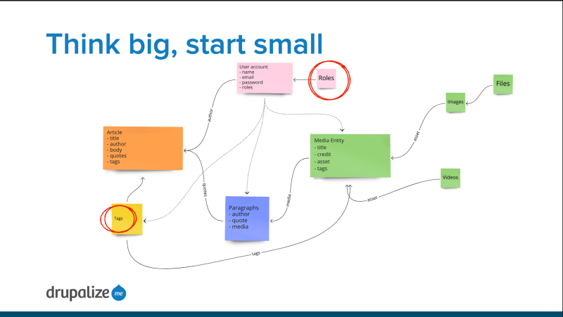

# Upgrade to a New Version of Drupal with a Drupal-to-Drupal Migration

## Content

Because current versions of Drupal are so much different from older versions like Drupal 7 upgrading to the latest version requires creating a new site using the latest version of Drupal and then migrating your old site's content and configuration into it.

There is no *one right way* to tackle a Drupal-to-Drupal migration. Instead, it's like walking down a path and coming to a fork in the trail and then choosing a direction over and over and over. Since every site is different, every path to a finished migration will be different, too. I know nobody wants to hear it, but every migration is its own unique adventure. Every successful migration will require its own custom code, weird shell scripts, and detailed lists of the exact order of things. But that doesn't mean there's no plan to follow.

A successful migration charts a course through the maze, while leveraging existing tools and experience to help find the shortest route and the right path at each fork--with minimal backtracking due to wrong choices.

In this tutorial we'll:

- Look at what makes a Drupal-to-Drupal migration (a major version upgrade) so tricky, and how to think about performing one
- Define 3 high-level approaches to performing a Drupal-to-Drupal migration
- Get a better idea of what the migration work entails, so you go into it with a proper mental model.

By the end of this tutorial you should be able to explain the different approaches to performing a Drupal-to-Drupal migration in broad strokes, and have a better picture of the work that will be involved.

## Goal

Introduce the work required to perform a Drupal-to-Drupal migration, and the different approaches to completing one.

## Prerequisites

- [Introduction to Migrations with Drupal](https://drupalize.me/tutorial/introduction-migrations-drupal)

## So what am I really getting into?

We have a tendency to think of software upgrades as a sort of drop-in replacement for the current version.

Upgrading from Drupal 7 to Drupal 8/9/10 is more like building a new house and moving all your existing stuff into it than making upgrades to your existing house. You might like your current house well enough, and not want to move, but it’s going to be demolished, so you’ll have to. You might be able to speed up the process of building your new house by copying the plans from your current one and using that as a starting point. You might even be able to salvage some existing structure. But at the end of the day you’re going to have a new house, in a new location. And once it’s done you’re going to have to move all of your personal belongings into it.

That’s our job. Build the new house. Then move everything into it.

A completed Drupal-to-Drupal migration will look a lot like this:

- An existing Drupal 7 site.
- A Composer managed Drupal 10 (or higher) installation, with contributed and custom modules, configured with the appropriate settings to provide the desired features of the site. A close, but not exact, replica of the current Drupal 7 site.
- A custom Drupal 10 module(s) that contains the PHP code and YAML configuration required to migrate existing content and configuration from the Drupal 7 site to the Drupal 10 site.

You’re probably thinking, “Yikes, but Joe, I already have a Drupal site, I just want to start using the new version. Do I really need to build a whole new site?”. Yes, you do. But, the Migrate ecosystem also contains a bunch of tools to help with the building process.

This might be easier to think about if we focus on just as single feature in isolation. Imagine your site has a feature that allows user to mark an article as completed by pressing a button. You could do this in Drupal using the Flag module. Create a flag configured with the label “Completed” and set to be per-user, and attach it to all article nodes. Then create a View that lists all the article nodes flagged as completed by the current user. This configuration is unique to your site, and is stored in the database. But once set up, it doesn’t change.

As visitors to your site use this feature, it generates data that is an artifact of usage. Every time someone completes an article a record is created to track that. When new articles are added it opens up the possibility for records tracking the completion of those new articles, too. There’s sort of infinite possible records with more being added all the time.

There’s a version of the Flag module for Drupal 7, and a version of the module for Drupal 10. They offer the same features, though the underlying mechanics are quite different. When you build a new Drupal 10 site you can create the same *completed articles* feature from your Drupal 7 site. To make this easier, Drupal core contains some helpers for migrating a module's configuration, and the Flag module provides implementations of those helpers that are specific to the Flag module. So if the Flag module is installed on your Drupal 10 site it can extract the *completed* flag from the Drupal 7 site, and recreate it in Drupal 10--saving you a bunch of point-and-click configuration work.

So you might think, “Great, I’ll just install the Drupal 10 versions of all my modules, and migrate their configuration, and I’ll be good to go.” Unfortunately there are a bunch of caveats:

- Not every module has a Drupal 10 version. Sometimes the feature set is provided by a different module in Drupal 10. The Field Collections module is an example of this. There’s no Drupal 8+ version, and likely never will be. Instead, the community has coalesced around Paragraphs to provide this feature. Also, sometimes the Drupal 7 module never was updated and there's no alternative either.
- Not every contributed module provides the necessary code to translate the module’s Drupal 7 configuration to Drupal 10 configuration. So even if the module can be installed, you’ll still have to set it up again. Views and Webform are examples of this. The configuration for these modules is infinitely variable, and the effort require to write code that’s generic enough to work for every scenario can be overwhelming. So instead we either get a handful of utilities that cover the most generic parts intended to help us write the logic required to migrate our use-case-specific configuration, or just nothing.
- You might have reason to change the configuration instead of recreate it verbatim. Perhaps you want to change a field name, consolidate data from 2 fields into 1, or merge 2 different free-tagging vocabularies into a unified set of tags. These changes are, by definition, project-specific making it impossible to provide an out-of-the-box solution.

So yeah, it's going to require a lot of research and planning, some development, and probably some copy-and-paste work, too. But it's totally possible. We've done it. Lots of other people have done it, too. And we'll do our best to share everything we can to help make the Drupal upgrade and migration process more approachable.

## 3 approaches to migration projects

Keep in mind the goal: a complete Drupal 10 site, with the same content and feature set as the original Drupal 7 site. Theoretically, you should be able to build this entirely from scratch without the Drupal 7 version ever having existed. Create all your content types, fields, and views. Place all your blocks, write all those blog posts, upload all those PDFs, etc. But, the Drupal 7 version does already exist, and we can save ourselves a lot of time by migrating as much of the existing site as possible.

Here are 3 approaches to Drupal migration projects:

1. A monolithic migration in which you install all the required modules in a Drupal 10 *destination* site, point it at your Drupal 7 *source* site, and migrate all the configuration and content in one go.
2. Manually build and configure the Drupal 10 site, then migrate the content from the Drupal 7 site into the new shell. No need to migrate configuration from Drupal 7 because the site is already built.
3. A hybrid approach where you *migrate configuration from Drupal 7 once* to get a jump start on your Drupal 10 site, and then adopt (more one what that means later) and work with just the *content migrations*, modifying them to get everything working as expected.

You might even end up with some combination of approaches. Remember, there is no wrong way as long as it works.

Let's break these approaches down a bit more, and talk about what you can expect.

### Monolithic migrations

The core Drupal-to-Drupal migration system supports a monolithic approach. Where, if you've got all the right modules installed on the destination site, you can execute a migration either via the UI or Drush, and all of your source site's configuration and content will be moved over in one go. If it doesn't work correctly, or there are errors, you can roll back the whole destination site, tweak your installed modules, and try again. Repeat a couple of times, and, "Ta-da!", you're done. This is the closest to the operating system upgrade model as you're going to get.

In practice, we've never seen it work this way with anything other than the most basic of Drupal sites. Even then it rarely works without issue. There are just too many variables to *hard-code* a solution. Everyone's site (both source and destination) and goals are unique. Rather than try to solve for every possible use case, Drupal core provides a migration path for the most common configurations (which is what it's using in a monolithic migration). Then, it allows the migration developer to extend and alter the migration for the remaining bits.

While we don't anticipate that running a monolithic migration will *just work*, we do recommend trying it out early in the process and seeing what happens. It'll probably fail, but it'll also help give you a sense of where the problem points in your migration are going to be. And where you're going to need to focus your work in order to be successful. Make some notes for yourself about what does *just work* and what is utterly broken.

Behind the scenes, what happens in a monolithic migration is the Drupal 10 site connects to the Drupal 7 site, inspects it, and based on what it finds, develops and executes a migration plan. This plan will include migrating any configuration (content types and fields, system settings, blocks, etc.) and content (users, nodes, taxonomy, etc.) that it can make sense of (hint: it can't make sense of Views). Whatever combination of modules you have already installed on the Drupal 10 site will also be able to affect the migration plan. Anything from the Drupal 7 site that the migration can't figure out what to do with (e.g. it's from module that doesn't exist in Drupal 10) it'll warn you about and then ignore.

Learn how to run the monolithic migration in either [Drupal-to-Drupal Migration with the UI](https://drupalize.me/tutorial/drupal-drupal-migration-ui), or [Drupal-to-Drupal Migration with Drush](https://drupalize.me/tutorial/drupal-drupal-migration-drush).

If you run the monolithic migration, and it is mostly successful, you might be able to fix any remaining issues with an implementation of `hook_migrate_prepare_row`. Especially if your issues are related to things like mapping from one field type to another, or dealing with fields that don't have a migration path of their own. Learn more in [Use hook\_migrate\_prepare\_row()](https://drupalize.me/tutorial/use-hookmigratepreparerow).

### Build the Drupal 10 site and migrate content into it

Another approach would be to build your Drupal 10 site from scratch, but without the content. Then [write a custom migration](https://drupalize.me/tutorial/write-custom-migration) that moves the content from your Drupal 7 site into the new Drupal 10 shell-site. If you've worked with migrations before, are comfortable authoring a migration YAML file, and your site has only a few content types with a few fields each, this approach might be the quickest.

This looks a lot like what you would do if you were migrating from a non-Drupal source like WordPress, SiteCore or a collection of random CSV files. You build the skeleton site, and all the functionality of the site that comes from the configuration of content types, Flags, Views, Webform, etc. Then you pull in content from the old site in order to populate content in the new site.

You can still leverage a lot of the code for extracting data from Drupal 7 and transforming it to fit into Drupal 10 that is used by the monolithic migration approach. For example, you can use the various Drupal-specific source plugins to make reading entity and field data from Drupal 7 easier.

### Scaffold your custom migration using Migrate Plus and Migrate Upgrade

Remember above when we said that in a monolithic migration Drupal 10 inspects the Drupal 7 source site, generates a bunch of migrations on the fly based on what it finds, and then executes them? Instead of generating them once and throwing them away this hybrid approach uses those generated migrations. This can give you a jump-start on your Drupal 10 site build by migrating over most of the content types, fields and other configuration from your Drupal 7 site, while still giving you the flexibility to click around and make changes in Drupal 10. You can alter the scaffolded YAML files that you'll need to migrate the content from Drupal 7 into the new Drupal 10 site in a way that meets your specific needs.

If you've ever used a code generator like `drush generate` you can think of this approach as being similar. What you'll get is a bunch of useful boilerplate that's specific to your site. But, you'll still need to manually edit or add to the scaffolded files to get it all working.

If you've run the monolithic migration mentioned earlier as a test, you should already have a pretty good idea what this approach is going to give you as a starting point.

The gist of this approach is to use the contributed Migrate Plus, and Migrate Upgrade modules to:

- Migrate the configuration from Drupal 7 **once** with the intent of using it as a way to jump start your site build. Not everything will migrate, and you'll probably change some things afterwards, but it can potentially save you a lot of clicks.
- Save the content-related migrations generated by Drupal as YAML files into a custom module where you can adopt them and customize them to iron out any remaining issues.

**Caveat:** If you've got **a lot of** sites to migrate, and especially if they're all running on the same base installation of Drupal, it might be worth your time to author custom code that ties into the processes that Migrate Drupal uses to inspect the existing source sites and generate a migration so that it can properly generate a migration that'll work for your sites. Thus, making the monolithic approach feasible for each individual site.

In our experience, this code--because it has to be more generic and usually can't just hard-code a solution--is harder to write. We've found
it's more efficient to hard-code the solution. Here's a good question to ask yourself: am I going to run this code **once**, on 1 site, and once the migration to the latest version of Drupal is complete, delete the code because I don't need it anymore? Or do I need to use this **over and over on many sites**?

## A migration is bunch of individual migrations

**What is a complete migration?** A *complete migration* is made up of multiple, interdependent, individual migrations, each of which is responsible for a small subset of the total data.

If you think about a Drupal 7 site, you might have a couple of different content types. A couple of vocabularies for organizing content. User accounts. Roles, and so on. You’ll need to develop an individual migration path for each bucket of data you want to migrate. And then run them all, probably in a pretty specific order, to perform the complete migration.

Most migration projects will require creating dozens of individual migrations.

The following image shows the individual migrations that make up the Drupalize.Me Drupal 7 to Drupal 9 migration path and their relationships with one another:

Image

An individual migration is responsible for one unit of data. If you want to migrate article nodes, you'll need a migration for roles, a migration for user accounts, and a migration for article nodes--at a minimum.

## Think big, start small

When it comes time to start working on migrating content: think big, but start small.

Your goal may be to have all your article nodes migrated over to Drupal 10, so it's tempting to start with migrating nodes. But, this will quickly unravel a network of dependencies. You can't populate the author field of a node with a user ID if you haven't migrated users yet. And you have to migrate roles before you can migrate users. These reference chains are everywhere in Drupal's data structure and often go a few levels deep. Figure out what the smallest, innermost chunks of data are, and start there.

It can help to draw diagrams of the relationships between buckets of data.

Example:

Image

When you start developing migrations, start with the innermost smallest buckets, and work outwards.

1. Configuration
2. Users and roles
3. Files and images
4. Taxonomy terms, paragraphs, media entities
5. Nodes
6. Nodes with references to other nodes

This approach also helps in that the smallest chunks of content also tend to be the easiest to migrate, so you can gain some early wins and valuable experience.

Whether you migrate configuration, and how much, will depend on the approach you take to building the Drupal destination site. The rest of the list assumes that things like content types are already configured on the destination site.

## Next steps

Now that you've got some idea of what you're getting into here are some suggestions on what to do next:

- [Drupal-to-Drupal Migration Planning: Code Inventory](https://drupalize.me/tutorial/drupal-drupal-migration-planning-code-inventory)
- [Drupal-to-Drupal Migration Planning: Contet Inventory](https://drupalize.me/tutorial/drupal-drupal-migration-planning-content-inventory)
- Follow along with [Drupal-to-Drupal Migration with Drush](https://drupalize.me/tutorial/drupal-drupal-migration-drush) and try the monolithic migration approach
- Then learn how to use the scaffolding approach with Migrate Plus and Migrate Upgrade in [Create Migrations from Core Templates](https://drupalize.me/tutorial/create-migrations-core-templates)

## Recap

Migrating from Drupal 7 to a current version of Drupal, like Drupal 10, is tricky. Every site is unique, and therefore every migration is going to be unique, and have its own unique challenges. There are different ways you can accomplish the task, each with its own pros and cons. Knowing what the different approaches are, and how to think about approaching a migration project, can go a long way towards helping you be successful.

## Further your understanding

- What are the 3 different approaches this tutorial covers for performing a Drupal-to-Drupal migration?
- In what circumstances would you choose an approach over another?
- What makes a Drupal-to-Drupal migration more involved than a typical software version update?

## Additional resources

- [Drupal-to-Drupal Migration with Drush](https://drupalize.me/tutorial/drupal-drupal-migration-drush) (Drupalize.Me)
- [Create Migrations from Core Templates](https://drupalize.me/tutorial/create-migrations-core-templates) (Drupalize.Me)

Was this helpful?

Yes

No

Any additional feedback?

Previous
[Prepare for a Drupal-to-Drupal Migration](/tutorial/prepare-drupal-drupal-migration?p=3116)

Next
[Drupal-to-Drupal Migration Planning: Code Inventory](/tutorial/drupal-drupal-migration-planning-code-inventory?p=3116)

Clear History

Ask Drupalize.Me AI

close